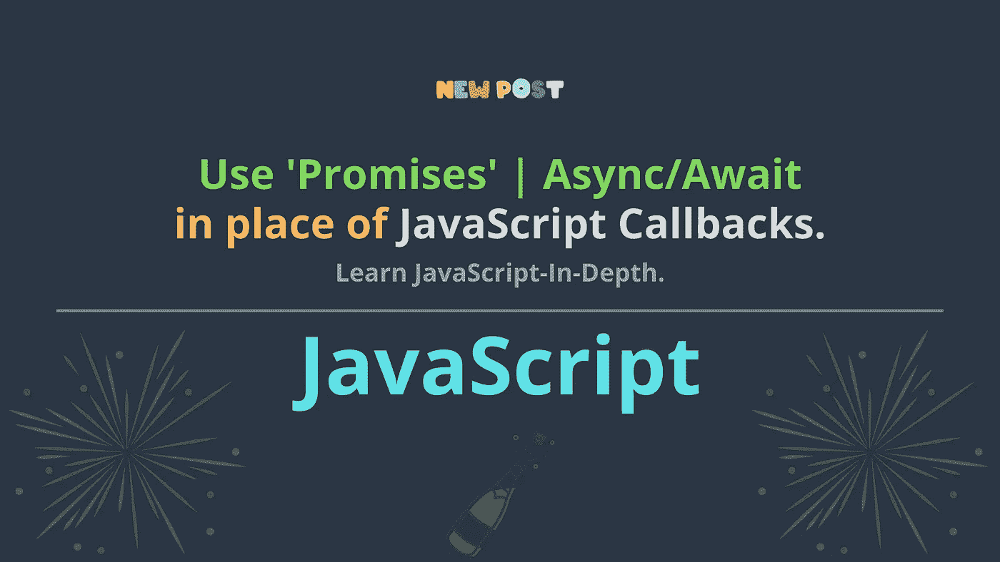
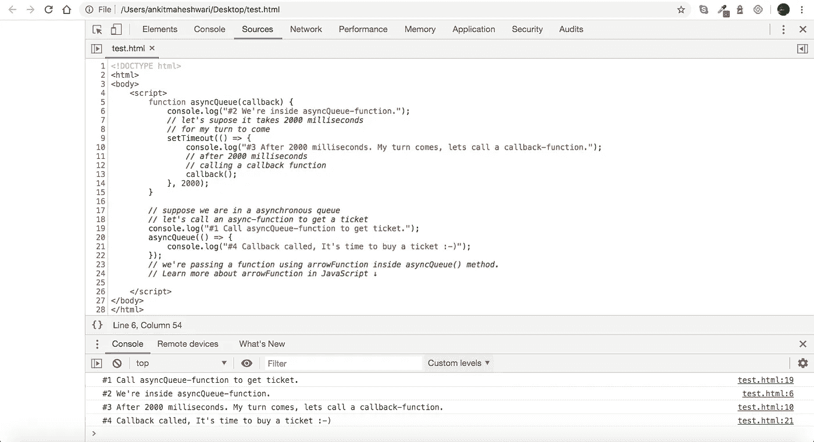
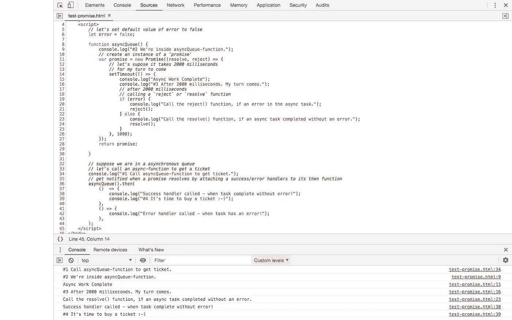
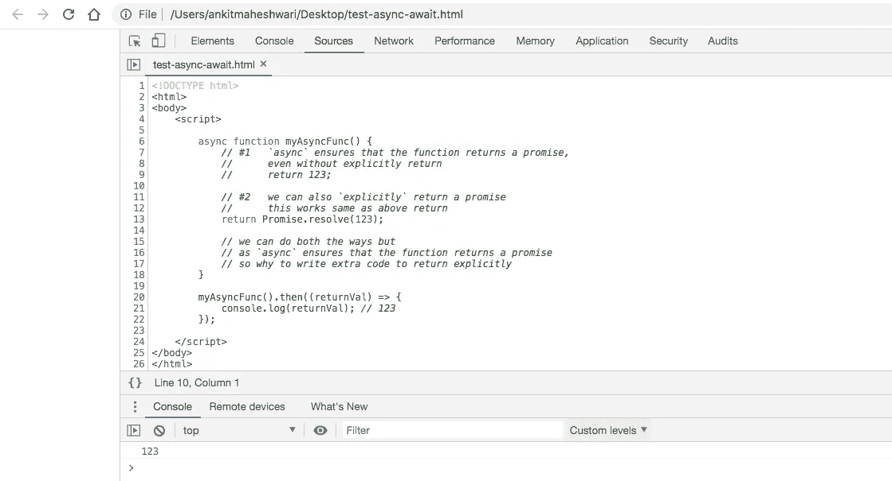
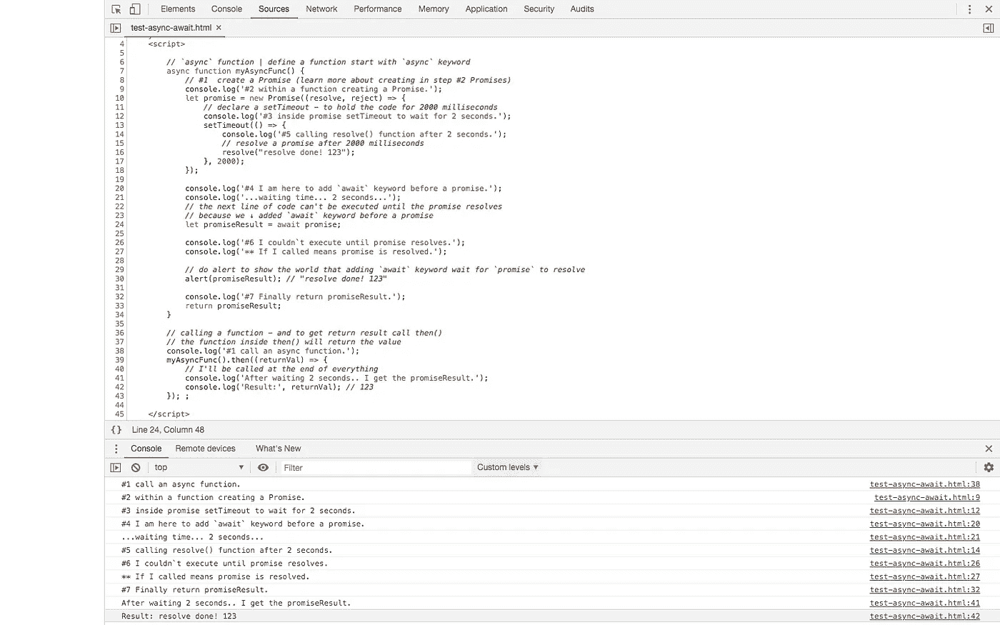

# 使用' Promises' | Async/Await |代替 JavaScript 回调。

> 原文：<https://javascript.plainenglish.io/use-promises-async-await-in-place-of-javascript-callbacks-5460ee7aa260?source=collection_archive---------0----------------------->

[](https://medium.com/codechintan/everything-you-need-to-know-about-angular-framework-typescript-10049b858ae0) [## 关于 Angular framework/TypeScript 你需要知道的一切。

### 完整的角度系列-什么是角度/类型脚本？|为什么我们需要有棱角？|使用 Angular 的好处？|…

medium.com](https://medium.com/codechintan/everything-you-need-to-know-about-angular-framework-typescript-10049b858ae0) 

我们应该使用**承诺**，它允许我们访问异步**方法**并将值**返回给同步方法**。而 Async/Await 是 promises 的扩展。

# 我们来这里是为了..

*   了解什么是`**同步**和`**异步**`。
*   用一个例子来理解`**回调**`。
*   用一个例子来理解`**承诺**`。
*   理解`**Async**/**wait**`——用一个例子。
*   *本文涵盖了上述主题的基础知识。到最后你会很容易理解这个概念，并且能够实现它。

# 同步的

当我们同步执行任务*时，JE 会等待任务完成，然后继续下一行代码。
(JE: JavaScript 引擎。)*

# *异步的*

*当我们异步执行任务*时，JE 会在任务完成前将程序移到下一行代码。**

> **想想'**同步'**编程就像排队/站队。编程就像拿一个代币去买一张票，你可以去做其他的事情，当轮到你的时候会有人通知你。**

**在本文中，我们的重点是异步编程。**

# **第一次回访**

**“异步”做事的一种方式是使用回调。我们将一个函数作为参数传递给一个异步函数，传递的函数被称为“回调”,它将在任务完成时调用**

**意味着我们不想等待任务完成。允许执行下一行代码，并在任务完成时调用回调函数。
—该‘任务’可以是从‘数据库’或任何东西中获取数据。**

*****例-1 ↓****

**[Learn more about arrowFunction in JavaScript](https://medium.com/@AnkitMaheshwariIn/arrow-functions-in-typescript-part-6-2-of-series-what-angular-is-%EF%B8%8F-what-typescript-is-d4584d87d01b) [👆](https://medium.com/@AnkitMaheshwariIn/arrow-functions-in-typescript-part-6-2-of-series-what-angular-is-%EF%B8%8F-what-typescript-is-d4584d87d01b)**

***结果-1 ↓**

****

**Open above HTML file in a Chrome Browser | Then do inspect and Open console.**

# **#2 承诺**

**JavaScript 在 ES6 中建立了一种叫做“承诺”的机制。承诺是未来价值的占位符。它的功能与回调相同，但语法清晰，更容易处理错误。”**

*** **创建承诺↓**
首先我们通过调用`Promise`类上的`new`关键字来创建一个“承诺”的实例，参见下面的代码:**

```
**var promise = new **Promise**((resolve, reject) => {

});**
```

**让我们通过破解密码来理解:**

****new Promise(pass-inner-function-here)**
↑我们将一个内部函数传递给' Promise '类。
**(resolve，reject) = > { }**
↑它是一个内部函数，这个内部箭头函数有两个参数“resolve”和“reject”。**

**除了`resolve`和`reject`之外，我们还可以称这些参数为任何东西，它们只是一个参数的名字。
但实际上这些论证是作为一个论证发挥作用的。不用麻烦我们会深入了解的↓**

**现在，进入内部函数:
在内部函数中，我们执行一个异步处理，然后当我们准备好了，我们调用`resolve()`。**

*** **解约↓****

**我们可以通过将一个*成功/错误*处理程序附加到它的`then`函数上，在一个承诺`resolves`时得到通知，参见下面的代码:
(这只是一瞥↓我们将通过例子理解代码)**

**Look example below **↓ to understand more clearly****

*****例-2 ↓****

**Look below ↓ an output of the code**

***结果-2 ↓**

****

**Click over this image👆 and look 👁 at the ‘console’ tab**

## **#3 Async/Await
Async/Await 是“promises”的扩展。**

**在任何函数前添加“async”一词意味着该函数将总是返回一个承诺。**

**“await”只在“async”函数中起作用，而“await”一直等到承诺解析并准备返回结果。**

**(我们将在#3.1 和#3.2 中逐一理解“异步和等待”。)**

****#3.1** **声明“异步”函数**
异步函数可以简单地通过在函数前添加`async`关键字来声明，参见下面的代码:**

```
****async** function myAsyncFunc() {
  return 123;
}**
```

**现在，需要通过函数调用调用`.then()`来解决这个问题，参见下面的代码:**

*****例-3.1 ↓****

**Look below ↓ an output of the code**

***结果-3.1 ↓**

****

**Click over this image👆 and look 👁 at the ‘console’ tab**

****#3.2** **使用` Await`**
另一个关键字`await`，只在`async`函数内部起作用。Await 函数用于等待承诺的解析，它一直等到承诺返回结果。它的工作是只等待异步块。
“将‘await’与‘async’函数一起使用就像创建同步函数一样。因为`await`保持代码执行并等待一个‘承诺’来解决——然后只允许你的下一行代码执行”，*参见下面的代码:***

*****例-3.2 ↓****

**Copy and Paste this code in an HTML file and Open in browser to see the Magic :-)**

***结果-3.2 ↓**

****

**Click over this image👆 and look 👁 at the ‘console’ tab**

# **接下来，学习使用异步管道来管理可观察的订阅并防止内存泄漏。**

**点击这里↓阅读**

**[](https://www.codewithchintan.com/angular-async-pipe/) [## Angular:使用异步管道来管理可观察的订阅并防止内存泄漏。

### Async-Pipe 是一个 Angular 内置工具，用于管理可观察订阅。我们可以轻松简化的功能…

www.codewithchintan.com](https://www.codewithchintan.com/angular-async-pipe/)** 

# **搞定了。🤩理解“承诺|异步/等待”的概念就这么简单。**

**再见👋👋**

> **欢迎在评论框中发表评论…如果我错过了什么，或者什么是不正确的，或者什么对你不起作用:)
> 继续关注更多文章。**
> 
> **更多文章敬请关注:
> [https://medium.com/@AnkitMaheshwariIn](https://medium.com/@AnkitMaheshwariIn)**

**如果你不介意给它一些掌声👏 👏既然有帮助，我会非常感谢:)帮助别人找到这篇文章，所以它可以帮助他们！**

**永远鼓掌…**

****

***原载于 2020 年 1 月 8 日*[](https://www.codewithchintan.com/javascript-callbacks-promises-async-await/)**。****

# **了解更多信息**

**[](https://www.codewithchintan.com/crud-in-firebase-with-firestore/) [## 如何用 Firestore 在 Firebase 中进行 CRUD 与查询操作？(角形/离子形/网状)

### 额外收获:你将学会创建角度模型、服务和组件]。CRUD -创建、读取、更新、删除操作在…

www.codewithchintan.com](https://www.codewithchintan.com/crud-in-firebase-with-firestore/) [](https://www.codewithchintan.com/javascript-callbacks-promises-async-await/) [## 使用' Promises' | Async/Await |代替 JavaScript 回调。

### 我们应该使用允许我们访问异步方法并将值返回给同步方法的承诺。还有…

www.codewithchintan.com](https://www.codewithchintan.com/javascript-callbacks-promises-async-await/) [](https://www.codewithchintan.com/two-way-data-binding-in-angular/) [## Angular 中双向数据绑定的背后是什么？

### 数据绑定允许组件和 DOM (HTML 模板)之间的通信。数据绑定有四种形式…

www.codewithchintan.com](https://www.codewithchintan.com/two-way-data-binding-in-angular/) [](https://www.codewithchintan.com/angular-async-pipe/) [## Angular:使用异步管道来管理可观察的订阅并防止内存泄漏。

### Async-Pipe 是一个 Angular 内置工具，用于管理可观察订阅。我们可以轻松简化的功能…

www.codewithchintan.com](https://www.codewithchintan.com/angular-async-pipe/) [](https://www.codewithchintan.com/angular-route-guards/) [## 使用角形护线板保护角形页面。允许/拒绝/重定向。

### 路由保护是 Angular 路由器的一个重要功能，它允许或拒绝用户访问路由页面…

www.codewithchintan.com](https://www.codewithchintan.com/angular-route-guards/) [](https://www.codewithchintan.com/angular-routing/) [## 角度组件的布线|角度布线。

### 路由意味着从一个页面移动到另一个页面。角度使用户能够从一个视图导航到下一个视图…

www.codewithchintan.com](https://www.codewithchintan.com/angular-routing/) 

# 了解更多信息**