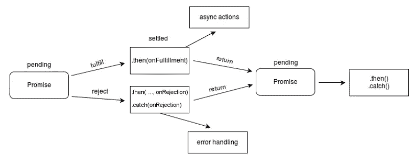
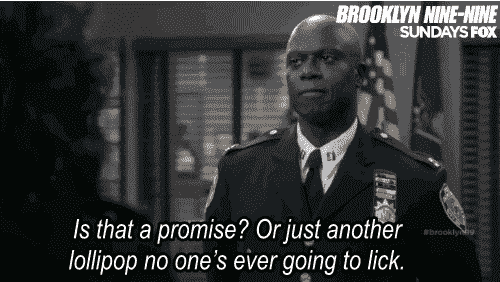

# 如何用 Promise 连接 JavaScript 中的多个请求

> 原文：<https://javascript.plainenglish.io/use-promises-to-consolidate-responses-from-multiple-requests-a0742ab5399a?source=collection_archive---------4----------------------->


Photo by [Ryan Franco](https://unsplash.com/@ryanmfranco?utm_source=unsplash&utm_medium=referral&utm_content=creditCopyText) on [Unsplash](https://unsplash.com/s/photos/pinky-promise?utm_source=unsplash&utm_medium=referral&utm_content=creditCopyText)

我回答了一个关于堆栈溢出的[问题](https://stackoverflow.com/questions/61802839/javascript-how-to-pass-data-from-two-api-ajax-calls-to-one-function/61802951#61802951)，这个问题涉及到一个用户试图发出两个请求，并将两个请求的响应传递给一个函数。我假设该函数将用于根据命名约定填充 Highchart 实例，但是目前用户只是试图记录来自响应的数据。

下面是初始代码。

```
function getStData() {
  $.ajax({
    type: "GET",
    url: stUrl,
    async: true,
    success: function (stData) {
      drawHighCharts(stData)
    },
    error: function (e) {
      // handle exception
      console.log("Error occured while reading resource file: ", e);
    }
  });
}

function getOdData() {
  $.ajax({
    type: "GET",
    url: odUrl,
    async: true,
    success: function (odData) {
      drawHighCharts(odData)
    },
    error: function (e) {
      // handle exception
      console.log("Error occured while reading resource file: ", e);
    }
  });
}

function drawHighCharts(stData, odData) {
    console.log(stData, "st")
    console.log(odData, "od")
}
```

用户遇到的问题是他们能够记录`stData`，但是他们不能记录`odData`。如果您查看 ajax 请求中的成功函数，您就会发现问题所在。

```
//From getStData
success: function (stData) {
   drawHighCharts(stData)
}//From getOdData
success: function(odData){
   drawHighCharts(odData)
}
```

为什么`odData`是`drawHighCharts`中的`undefined`是有道理的，因为`odData`参数是**而不是**被`getStData`或`getOdData`传递给函数。在这两种情况下，`drawHighCharts`函数只能引用传递的第一个参数，因为没有传递第二个参数**。**

第二次`drawHighCharts`被调用**实际上是**被记录`odData`，但是由于第一个参数被调用`stData`，对于用户来说`stData`似乎被记录了两次。为了解决这个问题，我们需要能够将两个请求的两个响应都传递给`drawHighCharts`。

但是怎么做呢？有了[的承诺](https://developer.mozilla.org/en-US/docs/Web/JavaScript/Reference/Global_Objects/Promise)就这样了！

> `Promise`对象表示异步操作的最终完成(或失败)及其结果值— MDN 网络文档

`Promise`的工作原理是让异步方法(发出两个 ajax 请求)作为一个`Promise`对象返回值，以便在将来的某个时候提供这些值。下图解构了`Promise`在发出请求时的工作方式。



Image from [MDN Web Docs](https://developer.mozilla.org/en-US/docs/Web/JavaScript/Reference/Global_Objects/Promise)

为什么这很有帮助？在这种情况下，我们需要发出**两个**请求，等待它们都完成，然后将**两个响应**传递给代码中其他地方的另一个函数(在这种情况下是`drawHighCharts`)。因为我们不能保证两个请求的数据同时可用，所以我们可以使用承诺来存储数据，直到两个请求都完成。这可以通过使用`Promise.all`来完成。

## Promise.all()

这个函数将把两个请求包装在它们自己的`Promise`中，然后等待所有的`Promises`都被解决，然后继续执行`then`回调函数。对于这个回调函数我们可以通过，你猜对了，`drawHighCharts`。



下面是修改后的`getStData`和`getOdData`的`success`功能。因为我们将它们包装在`Promises`中，所以我们不需要`success`函数单独触发`drawHighCharts`。相反，我们可以让他们返回他们的响应数据。

```
//getStDatasuccess: (stData) => stData//getOdDatasuccess: (odData) => odData
```

既然我们的`success`函数已经被修改，让我们继续我们的`Promise.all`函数。

```
Promise.all([
  getStData(),
  getOdData(),
]).then(([stData, odData]) => drawHighCharts(stData, odData))
```

通过在`Promise.all`中包装我们的请求函数，我们都可以在前进之前等待两个响应，我们可以捕获这些响应并立即将它们传递给我们的`then`回调。通过将两个响应传递给我们的`drawHighCharts`，用户现在可以记录两个参数的值。

[*在这里将你的免费媒体会员升级为付费会员*](https://matt-croak.medium.com/membership) *，每月只需 5 美元，你就可以获得数千位作家的无限量无广告故事。这是一个附属链接，你的会员资格的一部分帮助我为我创造的内容获得奖励。谢谢大家！*

# 参考

[](https://stackoverflow.com/questions/61802839/javascript-how-to-pass-data-from-two-api-ajax-calls-to-one-function/61802951#61802951) [## JavaScript——如何将数据从两个 API ajax 调用传递给一个函数

### 我正在尝试对第三方 API 端点进行两次单独的 ajax 调用，并在一个高图表上显示其数据…

stackoverflow.com](https://stackoverflow.com/questions/61802839/javascript-how-to-pass-data-from-two-api-ajax-calls-to-one-function/61802951#61802951) [](https://developer.mozilla.org/en-US/docs/Web/JavaScript/Reference/Global_Objects/Promise) [## 承诺

### Promise 对象表示异步操作的最终完成(或失败),及其结果…

developer.mozilla.org](https://developer.mozilla.org/en-US/docs/Web/JavaScript/Reference/Global_Objects/Promise) 

# 用简单英语写的便条

你知道我们有四份出版物和一个 YouTube 频道吗？你可以在我们的主页 [**plainenglish.io**](https://plainenglish.io/) 找到所有这些内容——关注我们的出版物并 [**订阅我们的 YouTube 频道**](https://www.youtube.com/channel/UCtipWUghju290NWcn8jhyAw) **来表达你的爱吧！**