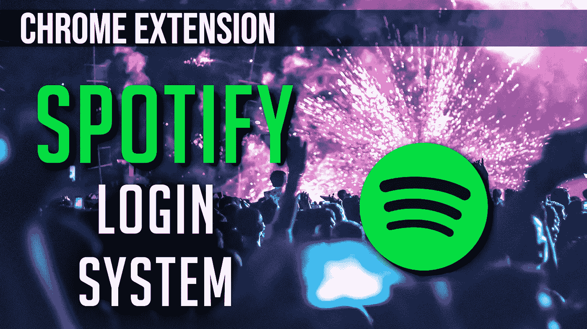

# 使用 Spotify 登录您的 Chrome 扩展

> 原文：<https://javascript.plainenglish.io/use-spotify-to-login-to-your-chrome-extension-d60e21271c24?source=collection_archive---------6----------------------->

允许您的用户使用他们的 Spotify 凭据登录您的 Chrome 扩展



本教程使用了一个简单的谷歌 Chrome 扩展设置。如果你想知道如何进行设置，请点击这里查看我的文章:

[](https://medium.com/@an_object_is_a/how-does-a-chrome-extension-work-web-development-6e85bd2bccc1) [## Chrome 扩展是如何工作的？(网络开发)

### Chrome 扩展有 5 个部分:

medium.com](https://medium.com/@an_object_is_a/how-does-a-chrome-extension-work-web-development-6e85bd2bccc1) 

# 我们开始吧

在我们接触一行代码之前，我们需要设置我们的开发工作区，以便我们能够使用 **Spotify 的 OAuth2 端点**。

导航至 https://developer.spotify.com/dashboard/的'[**'**'](https://developer.spotify.com/dashboard/')并登录。

点击**创建一个应用**。

填写'**名称**和'**描述**，同意条款，点击'**创建**。

转到'**编辑设置**'。

添加一个“**重定向 URIs** ”条目。将以“**https://<chrome ext id>. chromiumapp . org/**的形式。

确保保存您的更改。

要查找您的 chrome 扩展 id，请在浏览器中导航至“ **chrome://extensions** ”，确保您的 Chrome 扩展已加载。它会在那里。

保持 **Spotify 开发者**控制台窗口打开，稍后我们将需要那个
**客户端 ID** 。

# 在开始实际的 Chrome 扩展工作之前，让我们先做一些网络开发工作

我们将创建两个页面。一个'**签到**页和一个'**签退**页。没什么特别的。

```
// popup.html<!DOCTYPE html>
<html lang="en"><head>
    <meta charset="UTF-8">
    <meta name="viewport" content="width=device-width, initial-scale=1.0">
    <title>Document</title>
    <style>
        body {
            width: 300px;
            height: auto;
        } div {
            position: relative;
            left: 50%;
            transform: translateX(-50%);
            width: 50%;
            height: 25%;
            padding: 5px;
            font-size: 2.5em;
            background-color: red;
            border-radius: 5px;
            text-align: center;
            color: white;
            font-family: monospace;
            font-weight: bold;
            margin-bottom: 15px;
            cursor: pointer;
            transition-duration: 0.3s;
        }div:hover {
            background-color: black;
            transform: translateX(-50%) scale(1.3);
        }
    </style>
</head><body>
    <h1>Sign-In With Your Spotify Account to Use This Extension</h1>
    <div id='sign-in'>Sign In</div>
    <script src="./popup-script.js"></script>
</body></html>
```

.

```
// popup-signed-in.html<!DOCTYPE html>
<html lang="en"><head>
    <meta charset="UTF-8">
    <meta name="viewport" content="width=device-width, initial-scale=1.0">
    <title>Document</title>
    <style>
        body {
            width: 300px;
            height: auto;
        }div {
            position: relative;
            left: 50%;
            transform: translateX(-50%);
            width: 50%;
            height: 25%;
            padding: 5px;
            font-size: 2.5em;
            background-color: red;
            border-radius: 5px;
            text-align: center;
            color: white;
            font-family: monospace;
            font-weight: bold;
            margin-bottom: 15px;
            cursor: pointer;
            transition-duration: 0.3s;
        }div:hover {
            background-color: black;
            transform: translateX(-50%) scale(1.3);
        }
    </style>
</head><body>
    <h1>Successfully Signed-In</h1>
    <div id='sign-out'>Sign Out</div>
    <script src="./popup-signed-in-script.js"></script>
</body></html>
```

请注意，我们在每个 HTML 页面上都附加了脚本…

```
// popup-script.jsdocument.querySelector('#sign-in').addEventListener('click', function () {

});
```

.

```
// popup-signed-in-script.jsdocument.querySelector('#sign-out').addEventListener('click', function () {

});
```

# 现在我们已经讨论了 Web 开发部分，让我们看看我们的“manifest.json”。

```
// manifest.json{
    "name": "Spotify OAuth2 test",
    "description": "Testing Spotify's Oauth2 authentication.",
    "version": "0.1.0",
    "manifest_version": 2,
    "icons": {
        "16": "./obj-16x16.png",
        "32": "./obj-32x32.png",
        "48": "./obj-48x48.png",
        "128": "./obj-128x128.png"
    },
    "background": {
        "scripts": [
            "./background.js"
        ]
    },
    "options_page": "./options.html",
    "browser_action": {
        "default_popup": "popup.html"
    },
    "permissions": [
        "identity"
    ]
}
```

***注:*** *1。******默认 _ 弹出*******属性的【浏览器 _ 动作】*** *设置为* ***标志进入*** *页面。
2。我们需要'* ***身份*** *'权限才能使用 Chrome 的'****launchWebAuthFlow()****'方法。****

# *让我们编写我们的 Chrome 扩展*

*我们将从编写应用程序的基本框架逻辑流开始。*

*在' **popup-script.js** '中，当用户点击按钮时，我们会向'**后台**脚本发送消息，要求“**登录**”。如果我们从'**背景**'中得到一个“**成功**”，我们将把页面改为“**注销**”页面。*

```
*document.querySelector('#sign-in').addEventListener('click', function () {
    chrome.runtime.sendMessage({ message: 'login' }, function (response) {
        if (response.message === 'success') window.close();
    });
});*
```

*这就是' **popup-script.js** '的全部内容。您可以关闭文件。'**popup-sign-out-script . js**'几乎完全相同。*

*在'**popup-sign-out-script . js**'中，当用户点击按钮时，我们会向'**后台**'脚本发送消息，要求“**注销**”。如果我们从'**背景**中得到一个“**成功**”，我们将把页面更改为页面中的
“**标志。***

```
*document.querySelector('#sign-out').addEventListener('click', function () {
    chrome.runtime.sendMessage({ message: 'logout' }, function (response) {
        if (response.message === 'success') window.close();
    });
});*
```

*这个文件完成了。你可以关闭它。*

*转到' **background.js** '脚本，我们创建一个条件树来捕获这些消息。*

*转到' **background.js** '脚本，我们创建一个条件树来捕获这些消息。
我们需要 **5 个常量**和 1 个**变量**。
当我们这么做的时候，一个跟踪用户登录状态的变量。*

***注:**
1。 **CLIENT_ID** —告诉 **Spotify** 我们被允许使用他们的 OAuth2 端点
2。 **RESPONSE_TYPE** —向 **Spotify** 询问特定类别的信息
3。**重定向 _URI** —给我们令牌后把用户重定向到哪里
4。**范围** —向 **Spotify** 询问具体数据
5。 **SHOW_DIALOG** —向用户提示 **Spotify 的**登录页面*

***第二个注意事项:**
我们创建了一个函数将所有这些信息汇集在一起。
我们有最后一个变量， **STATE** ，在函数中创建。
' **STATE** '只是一个生成的字符串，帮助个性化发送的请求。这是出于安全考虑。*

# *让我们一起努力*

*当我们的' **background.js** '脚本得到消息“登录”时，我们将调用'**chrome . identity . launchwebauthflow()**'函数。*

*这需要两个参数。*

***第一个**是一个对象，具有我们构造的 OAuth2 端点和为 true 的' **interactive** '标志(这允许用户看到 **Spotify** 凭证提示)。*

***第二个**是一个回调函数，它给我们一个来自**Spotify**服务器的**重定向 url** 。我们可以使用交付给我们的一个“**令牌**来访问登录了
的用户的 **Spotify** 数据。*我们不会在本视频中这样做；我们只是简单地使用这个端点来"* ***认证*** *用户，而不是"* ***授权*** *用户。**

***注意:**
除了检查 chrome.runtime 错误，我们还要检查我们发送的'**状态**是否等于我们返回的'**状态**。
我们还检查用户是否正确登录。如果他们没有，a
c**all back？error=access_denied** 字符串将在“ **redirect_url** 中找到。
我们还每 60 分钟从系统中"**转储**"令牌。*

*我们完成了。
当用户点击按钮中的**标志时，他们将会看到 **Spotify** 的登录系统。
如果他们成功登录，将显示我们的**注销**页面。***

*如果你想要更深入的指导，可以看看我在 YouTube 上的完整视频教程，**一个物体就是一个**。*

*一定要关注我们的 [**Instagram**](https://www.instagram.com/an_object_is_a/) 和 [**Twitter**](https://twitter.com/anobjectisa1) 及时了解我们最新的 **Web 开发教程**。*

## *带有 Chrome 扩展的 Spotify 登录系统| OAuth2*