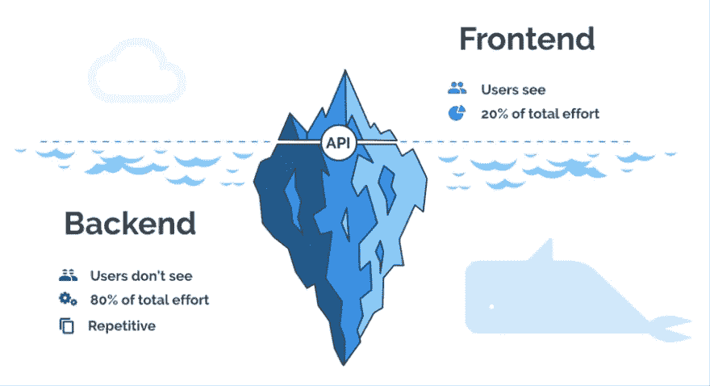

# 将 SQL 查询构建器 Knex.js 与 Node.js 和 Express.js 一起使用

> 原文：<https://javascript.plainenglish.io/use-sql-query-builder-knex-js-with-node-js-and-express-js-4373e8d3ed33?source=collection_archive---------1----------------------->



我第一次了解 [**Knex.js**](http://knexjs.org/) 是在一次技术面试中，这是我第一次使用除了 **ORM Sequelize.js** 之外的另一种抽象来与数据库交互，这是我在 [**格蕾丝·赫柏项目**](https://www.gracehopper.com/) 学习期间学到的。 ***Knex.js*** *是一个用于 JavaScript 的* ***SQL 查询生成器*** *，* ***一个位于*** ***数据库驱动程序*** *之上的抽象，用于关系数据库，包括 PostgreSQL、MySQL、SQLite2 和 Oracle。它支持事务、连接池、流式查询、全面的测试套件以及在浏览器中运行的能力。Knex 可以在两个节点中使用。Js 和浏览器，只受 WebSQL 的约束。*

我很好奇，花了一些时间玩它。这很有趣，所以我决定写一篇关于它的文章作为参考，如果有人想自己尝试一下的话。

## **步骤 1。安装 Knex.js 和迁移 CLI**

Knex 最好的特性之一是它强大的迁移支持。

全局安装 Knex.js **以获得迁移 CLI。迁移 CLI 与 knex 安装捆绑在一起，由 [node_liftoff](https://github.com/tkellen/node-liftoff) 模块驱动。**

运行`$ npm install knex -g`命令。这将安装软件包和 CLI。

## **第二步。数据库配置**

运行`$ knex init`创建一个 **knexfile.js** 。该文件将预先填充一些默认的数据库配置。Knex 迁移工具使用 **knexfile.js** 在指定目录中创建迁移文件，因此您将需要该文件来运行迁移命令。

打开 **knexfile.js** ，输入您的数据库匹配不同开发阶段的配置。它有三个默认阶段，**开发、试运行和生产**。

```
const pkg = require('./package.json')
const path = require('path')
const databaseName = pkg.name + (process.env.NODE_ENV === 'test' ? '-test' : '')module.exports = {
  development: {
    client: 'pg',
    connection: `postgres://localhost:5432/${databaseName}`,
    **migrations**: {
      directory: path.join(__dirname, './server/db/models/migrations'),
    }
  },
 production :{
    client: 'pg',
    connection: process.env.DATABASE_URL,
    pool: {min: 2, max: 10},
    **migrations**: {
      directory: path.join(__dirname, './server/db/models/migrations'),
    }
  }
}
```

确保指定迁移目录的路径。这是迁移文件将存在的地方。

## **第三步。使用迁移 CLI 进行迁移**

接下来，运行`$ knex migrate:make migration_name`命令。

现在查看您之前指定的迁移目录，您应该会看到创建了一个新文件，文件名开头有一系列数字，类似于`20201202222750_user.js`。它们表示文件创建的年份、日期和时间，以及迁移名称。因为**顺序关系到**，所以一个好的经验法则是，您的**第一次**迁移应该是不依赖于其他表或数据的表，因为迁移是按时间顺序运行的，并且这个时间戳保持了该顺序。

## **第四步。定义表格**

在迁移文件中，有两个函数，`exports.up`函数和`exports.down`函数。在`exports.up`函数中，我们指定对数据库的更改，比如使用`knex.schema.createTable()`创建一个表，在`exports.down`函数中，我们可以回滚或撤销`exports.up`所做的更改，比如使用`knex.schema.dropTable()`删除表。您还可以在这里插入、删除列等。请看下面我为我的项目创建的`user`表:

```
exports.up = function (knex) {
  return knex.schema.createTable('user', function (table) {
    table.increments('id').primary()
    table.string('firstName').notNullable()
    table.string('lastName').notNullable()
    table.string('email').notNullable()
    table.string('password')
    table.string('googleId')
    table.timestamps(true, true)
  })
}exports.down = function (knex) {
  return knex.schema.dropTable('user')
}
```

## **第五步。使用迁移 CLI 更新数据库**

运行`$ knex migrate:latest`命令更新数据库。检查您的数据库，您应该看到一个新创建的`user`表。

类似地，要回滚到最后一批迁移:运行`$ knex migrate:rollback`命令，它应该删除您刚刚创建的表并回滚到之前的状态。

## **第六步。应用程序配置和会话存储**

通过要求来自 **knexfile** 的配置，创建一个`db.js`文件和一个数据库实例。每当我们需要与数据库交互时，我们将在整个应用程序中使用这个文件。

```
const environment = process.env.NODE_ENV || 'development';   
const configuration = require('../knexfile')[environment];   
const db = require('knex')(configuration);module.exports = db
```

让我们建立我们的主应用程序文件`app.js`。这里，我们将使用另一个节点模块`connect-session-knex`和用户会话的快速会话。运行`$ npm install connect-session-knex`，将包导入为`KnexStore`，用`KnexStore`的实例初始化一个会话存储，参数应该将数据库实例作为其`knex`属性。基本设置如下所示，但可以随意添加更多中间件和功能:

```
const express = require('express')
const session = require('express-session')
const KnexStore = require('connect-session-knex')(session)
const db = require('./db')
if (process.env.NODE_ENV !== 'production') require('dotenv').config()
const PORT = process.env.PORT || 8080
const sessionStore = new KnexStore({knex: db})
const app = express()
module.exports = appif (process.env.NODE_ENV === 'test') {
  after('close the session store', () => sessionStore.stopExpiringSessions())
}app.use(
  session({
    secret: process.env.SESSION_SECRET || 'my best friend is Marley',
    store: sessionStore,
    resave: false,
    saveUninitialized: false,
  })
)app.listen(PORT, () => console.log(`Mixing it up on port ${PORT}`))
```

## **第七步。创建一些 API 路径**

现在让我们用快速路由器写一些 API 路由。Knex.js 查询语法类似于原始 SQL，但我们实际上是在编写 JavaScript。这里有一个有用的[小抄](https://devhints.io/knex#select-1)。我们将在这里分配`req.session.user`并使用`bcrypt`加密用户密码(抱歉，不在本文范围内，但[这篇中型文章](https://medium.com/@jengopockets/encrypting-seeded-passwords-with-node-js-knex-and-bcrypt-e2efe56f745e)是一个很好的参考。)

如下图所示，我们创建了两条`post`路线、`/signup`和`/login`。主要区别是对于`/signup`，数据库中还不存在用户，所以我们需要使用`.insert()`在数据库中创建用户。Knex 的`.insert()`不会自动返回新创建的记录，我们需要包含`.returning()`或传递一个返回数组参数来取回插入的数据，这给我们一个数组带来了不便。从那里，你可以传播它，或者在我们的例子中，我们析构它，因为我们需要分配`req.session.user`给用户。

在`/login`路线中，注意我们使用`.first('*')`而不是`.select('*')`从`user`表中查询数据库。`.select('*')`用记录的**数组**解析，而`.first('*')`用查询的**第一个**记录解析，这给了我们一个**对象**。

```
const router = require('express').Router()
const db = require('../db')
const bcrypt = require('bcrypt')module.exports = routerrouter.post('/signup', async (req, res, next) => {
  try {
    const {email, password} = req.body
    const hash = await bcrypt.hashSync(password, 10)
    const **[user]** = await db('user').insert({email, hash}).returning('*')
    **req.session.user = user**
    res.json(user)
  } catch (err) {
    if (err) {
      res.status(401).send('User already exists')
    } else {
      next(err)
    }
  }
})router.post('/login', async (req, res, next) => {
  try {
    const {email, password} = req.body
    const user = await db('user').first('*').where({email})
    if (!user) {
      console.log('No such user found:', req.body.email)
      res.status(401).send('Wrong username and/or password')
    } else {
      const validPass = await bcrypt.compare(password, user.hash)
      if (validPass) {
        **req.session.user = user**
        res.json(user)
      } else {
        console.log('Incorrect password for user:', email)
        res.status(401).send('Wrong username and/or password')
      }
    }
  } catch (err) {
    next(err)
  }
})
```

差不多就是这样。现在，您可以在后台使用 **Knex.js、Node.js** 和 **Express.js** 在我们刚刚创建的样板文件的基础上构建您的应用程序。

总的来说，raw SQL 的使用仍然更广泛，可移植性也更高。Knex 这样的查询捆绑器允许动态查询，但它仍然是基于语言/项目/平台的。我认为，在尝试使用**抽象**或 **ORM** 如 **Knex.js** 或 **Sequelize.js** 之前，首先知道如何使用**数据库驱动程序**如`pg`库和原始 SQL 与数据库进行交互是很重要的。不仅学习曲线会变得更加直观，因为这些抽象通常具有大量现成的特性，而且如果招聘公司使用不同的工具与他们的关系数据库进行交互，您也可以总是依赖原始的 SQL。