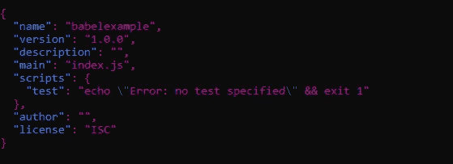
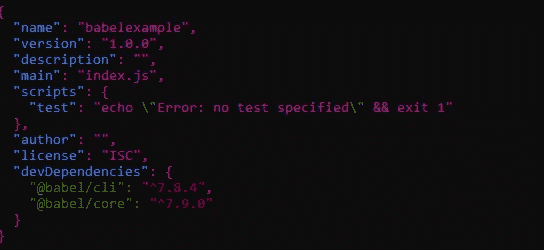
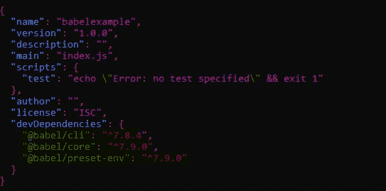
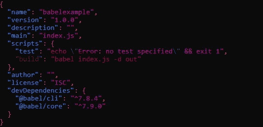

# 如何在任何浏览器中使用最新的 JavaScript 特性

> 原文：<https://javascript.plainenglish.io/use-the-latest-javascript-features-in-any-browser-f047f5c426a8?source=collection_archive---------5----------------------->

## 实用介绍，从聚合填充到传输填充


Photo of Lukas in Pexels showing a keyboard and two closed fists

JavaScript 是一种发展非常迅速的语言，有时我们想使用它的最新功能，但是如果我们的浏览器或环境不直接允许，我们将不得不转换它，以便它可以做到这一点。

Transpiling 是将一种语言编写的源代码转换成另一种具有可比抽象级别的语言。因此，在 JavaScript 的情况下，transpiler 采用旧浏览器不理解的语法，并将它们转换成它们理解的语法。

## 聚合填充与传输填充

这两种方法的目的是一样的:我们可以编写代码，使用我们的目标环境中没有实现的新特性，然后应用上述过程之一。

聚合填充是代码或工作区的一部分，其中对现代功能进行了编码，以便在旧版本的浏览器上运行。

Transpiling 是两个词的组合:转换和编译。有时，较新的语法不能用 polyfills 复制，这里是我们使用 transpiler 的地方。

假设我们使用的是不支持 ES6 规范中引入的 Number.isNaN 特性的旧浏览器。要使用此功能，我们需要为该方法创建一个 polyfill，但我们只希望在浏览器上还没有 polyfill 时构建它。

为此，我们将创建一个模拟 isNaN 功能行为的函数，并将其添加到 Number prototype 属性中。

```
//Simulates the isNaN feature
if (!Number.isNan) {//not already available.
    Number.prototype.isNaN = function isNaN(n) {
        return n !== n;
    };
}let myNumber = 100;
console.log(myNumber.isNaN(100));
```

现在，我们将为一个新发明的特性转换代码，在这个特性中，我们将假设大多数浏览器不能执行它，在这种情况下，我们不能创建一个 polyfill 来模拟这个行为。我们希望在 internet explorer 11 上运行以下代码，因此我们将使用 transpiler 对其进行转换:

```
class mySuperClass {
  constructor(name) {
    this.name = name;
  }hello() {
    return "Hello:" +this.name;
  }
}const mySuperClassInstance = new mySuperClass("Rick");
console.log(mySuperClassInstance.hello()); 
//Hello Rick
```

结果代码已经用 [**巴别塔在线传输器**](https://babeljs.io/en/repl)**传输，现在，我们可以在 internet explorer 11:**

```
"use strict";function _instanceof(left, right) { if (right != null && typeof Symbol !== "undefined" && right[Symbol.hasInstance]) { return !!right[Symbol.hasInstance](left); } else { return left instanceof right; } }function _classCallCheck(instance, Constructor) { if (!_instanceof(instance, Constructor)) { throw new TypeError("Cannot call a class as a function"); } }function _defineProperties(target, props) { for (var i = 0; i < props.length; i++) { var descriptor = props[i]; descriptor.enumerable = descriptor.enumerable || false; descriptor.configurable = true; if ("value" in descriptor) descriptor.writable = true; Object.defineProperty(target, descriptor.key, descriptor); } }function _createClass(Constructor, protoProps, staticProps) { if (protoProps) _defineProperties(Constructor.prototype, protoProps); if (staticProps) _defineProperties(Constructor, staticProps); return Constructor; }var mySuperClass = /*#__PURE__*/function () {
  function mySuperClass(name) {
    _classCallCheck(this, mySuperClass);this.name = name;
  }_createClass(mySuperClass, [{
    key: "hello",
    value: function hello() {
      return "Hello:" + this.name;
    }
  }]);return mySuperClass;
}();var mySuperClassInstance = new mySuperClass("Rick");
console.log(mySuperClassInstance.hello()); //Hello Rick
```

**JavaScript 最常见的 transpilers 之一是 Babel。Babel 是一个帮助在不同版本的 JavaScript 之间进行编译的工具，可以通过节点包管理器(npm)安装。**

**Babel 已经成为将 ECMAScript 应用程序编译成 ECMAScript 版本的标准，该版本可以在不支持 ECMAScript 应用程序的浏览器中运行。Babel 可以编译 ECMAScript 的其他版本，如 React JSX。**

**在接下来的步骤中，我们将看到如何使用 Babel 在安装了旧 Nodejs 的 Linux 机器上转换和执行前面的“mySuperMethod”类。在 Windows 10 或 macOS 等其他操作系统中，在接下来的步骤中，我们将看到如何使用 Babel 在安装了旧 Nodejs 的 Linux 机器中转换和执行之前的“mySuperMethod”类。在 Windows 10 或 macOS 等其他操作系统中，要遵循的步骤类似。**

**注意:*你需要在你的机器上安装* [*Node.js*](https://nodejs.org/en/) *。pm 是作为 Node.js 安装程序中的一个特性添加的***

1.  **打开命令行，创建一个名为 babelExample 的目录:**

```
/mkdir babelExample
/cd babelExample
```

**2.创建一个 [npm](https://www.npmjs.com/) 项目，并保留默认值。以下命令将创建一个名为 package.json 的文件:**

```
[npm init](https://docs.npmjs.com/cli/init)
```

****

**package.json file image after executing the npm init command**

**这里“index.js”(可以是另一个)是我们应用程序的入口点。在这里，我们将放入 javascript 代码，因此创建一个 index.js 文件并放入以下代码:**

```
class mySuperClass {
  constructor(name) {
    this.name = name;
  }hello() {
    return "Hello:" +this.name;
  }
}const mySuperClassInstance = new mySuperClass("Rick");
console.log(mySuperClassInstance.hello()); 
//Hello Rick
```

**3.虽然我们可以在全球范围内安装 Babel CLI，但最好是在本地逐个项目地安装。下一个命令将添加 node_modules 目录，并修改 package.json 文件以添加 Babel 的依赖项:**

```
npm install -save-dev @babel/core @babel/cli
```

****

**package.json image with babel dependencies**

**4.将. babelrc 配置文件添加到项目根文件夹中，并启用 es 2015+转换插件。**

**注意:*在 Babel 中，每个变压器都是一个插件，我们可以单独安装。每个预设都是相关插件的集合。使用一个* ***预置的*** *，我们就不用独立安装更新几十个插件了。***

**为所有 ES6 功能安装预设(包含一组插件):**

```
npm install @babel/preset-env --save-dev
```

****

**package.json image with babel preset-env dependency**

**编辑您的。babelrc 文件，并添加以下配置，这将为 ES6 启用转换。**

**。babelrc 文件:**

```
{
  "presets": ["@babel/preset-env"]
}
```

**5.使用**

**注意:*如果你使用的是 Windows 10 PowerShell，对你的文件进行编码时要小心，因为运行 Babel 时可能会出现解析错误。建议文件的编码为 UTF-8。***

*   **in: index.js**
*   **out:out 文件夹(Babel 将在这里留下传输的文件)**

**直接在控制台中执行下一个命令:**

```
./node_modules/.bin/babel index.js -d out
```

**npm 脚本将下面一行添加到 package.json 文件中:**

```
"build": "babel index.js -d out"
```

****

**Image of package.json after adding the build script**

**执行以下命令:**

```
npm run build
```

**在这两种情况下，您都可以在/out 文件夹中获得已传输的文件，以便在不支持 ES6 类语法的浏览器中工作:**

```
"use strict";function _classCallCheck(instance, Constructor) { if (!(instance instanceof Constructor)) { throw new TypeError("Cannot call a class as a function"); } }function _defineProperties(target, props) { for (var i = 0; i < props.length; i++) { var descriptor = props[i]; descriptor.enumerable = descriptor.enumerable || false; descriptor.configurable = true; if ("value" in descriptor) descriptor.writable = true; Object.defineProperty(target, descriptor.key, descriptor); } }function _createClass(Constructor, protoProps, staticProps) { if (protoProps) _defineProperties(Constructor.prototype, protoProps); if (staticProps) _defineProperties(Constructor, staticProps); return Constructor; }var mySuperClass = /*#__PURE__*/function () {
  function mySuperClass(name) {
    _classCallCheck(this, mySuperClass);this.name = name;
  }_createClass(mySuperClass, [{
    key: "hello",
    value: function hello() {
      return "Hello:" + this.name;
    }
  }]);return mySuperClass;
}();var mySuperClassInstance = new mySuperClass("Rick");console.log(mySuperClassInstance.hello());
```

****结论****

**JavaScript 语言在不断变化，多亏了这些工具，我们可以编写具有新语法和新功能的代码，这些新功能尚未被所有浏览器版本实现。**

**我希望你喜欢这篇文章。谢谢你阅读我。**