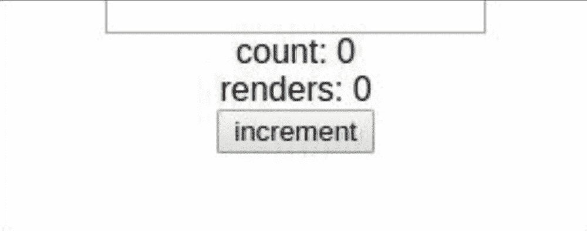
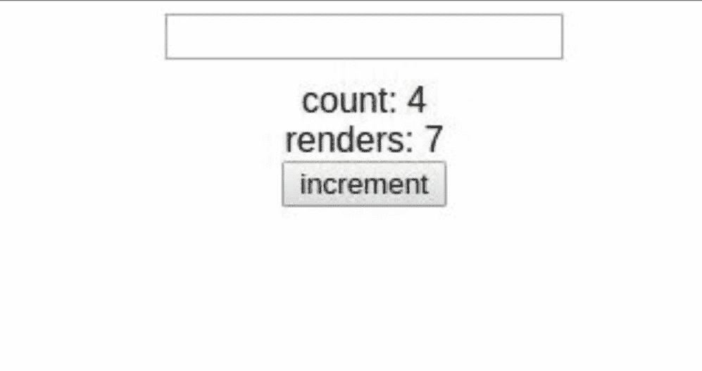

# 利用 React 中的 useMemo 获得更好的性能

> 原文：<https://javascript.plainenglish.io/use-the-memo-with-react-for-better-performance-ce3d40538480?source=collection_archive---------7----------------------->

在本文中，我们将看看 memo 函数和 React，以及我们如何使用它来优化渲染，这将在大型应用程序中非常有帮助，因为减少了子组件的数量和不必要的渲染。


Photo by [chuttersnap](https://unsplash.com/@chuttersnap?utm_source=unsplash&utm_medium=referral&utm_content=creditCopyText) on [Unsplash](/s/photos/speed?utm_source=unsplash&utm_medium=referral&utm_content=creditCopyText)

为了演示它是如何工作的，我们将把它应用到一个带有计数器的表单组件中，作为一个常见的场景。

## 1.跟踪渲染的数量

首先，我们有`App.js`:

App.js without memo

注意我们有一个子组件`Count.js`和输入字段，一个文本值的状态。

`Count.js`有两份工作；递增`count`变量，并计算它渲染了多少次:

Count.js without memo

```
onClick={() => { setCount(c => c +1) }}
```

我们每点击一次按钮，上面的行计数就增加 1，下面的行通过创建一个默认为`0`的引用来跟踪组件更新或渲染的次数，并在每次调用函数`count`时增加计数:

```
const rendrs = React.useRef(0);
...
<div>renders: {renders.current++}</div>
...
```

让我们来看看它的实际应用:



Every time a character has pressed an update happens.

我们注意到，即使修改上层组件`App.js`中的输入字段也会强制调用`Count`函数(它是一个子组件),这会导致不必要的渲染(假设内部组件的工作只是改变状态中的`count`变量)。

## 2.使用备忘录功能

正如我们已经看到的，每次一个角色被按下，详尽的更新就发生了。现在，我们将看看 memo 函数，并了解如何使用它。

首先，让我们将`Count`包装在`React.memo`中:

Count.js with memo

我们在这里所做的就是将`Count`箭头函数包装在`React.memo`中:

```
React.memo( {/*functon*/} );
```

现在的情况是，只有当`state`改变或接收到新的`prop`时，组件才会更新。

下面的演示向我们展示了这个强大而简单的技巧:


Pressing characters will not update the component.

## 3.在将道具传递给子组件的情况下

**3.1.A 功能属性**

如果我们需要传递一个属性，比如说我们例子中的函数`Count`，让它成为一个函数。

将功能作为道具添加到子组件:

pass a function as a prop

从`Count`功能组件调用`prop`功能:

Calling onEven()

让我们看看会发生什么:



The same issue happens again

这里的问题是每次`App.js`被更新时，一个新的函数被创建并作为`prop`传递给函数`Count`，要修复它，需要使用一个`useCallBack`函数:

```
...
const onEven = React.useCallback(() => setText(""), [setText]);
...
<Count onEven={onEven}/>
...
```

神奇的是，只有当`setText`改变时，函数`Even`才会改变。

**3.2 一个物体道具**

现在让我们给子组件添加一个对象`prop`:

```
...
const data = { isEven: true };
...
<Count onEven={onEven} data={data}/>
...
```

我保证我们还会有同样的问题！原因是数据的参考正在发生变化。

为了解决这个问题，我们在`App..js`中使用了另一个`Hook`:

```
...
const data = React.useMemo( () => ({ isEven: false,}),[] );
...
```

这是可行的，因为`React.useMemo`不会创建另一个对象，除非依赖关系发生了变化(在我们的例子中是静态的),所以它只会创建一次。

或者使用组件`Count`中`React.memo`的第二个参数:

```
...
}, (prevProps, nextProps) => {
  if(prevProps.data.isEven !== nextProps.data.isEven)
    return false;
  return true;
   }
);
```

在这种情况下，只有当`props`的值改变时，组件才重新渲染。

## 我希望你喜欢这个快速教程

下一次将使用一个免费的可视化库来介绍许多类型的图表，以及更多关于 React 性能的内容。如果你喜欢我介绍这个话题的方式，你可以看看我以前关于 Highcharts 的文章:

[](https://medium.com/javascript-in-plain-english/quick-integration-of-highcharts-with-react-9f796a396093) [## 如何在 React with Highcharts 上创建数据可视化

### Highcharts 是一个用 JavaScript 编写的图表和数据可视化库

medium.com](https://medium.com/javascript-in-plain-english/quick-integration-of-highcharts-with-react-9f796a396093) 

[LinkedIn 个人资料](https://www.linkedin.com/in/hafid-menasria-9327b1a6/)

保重！