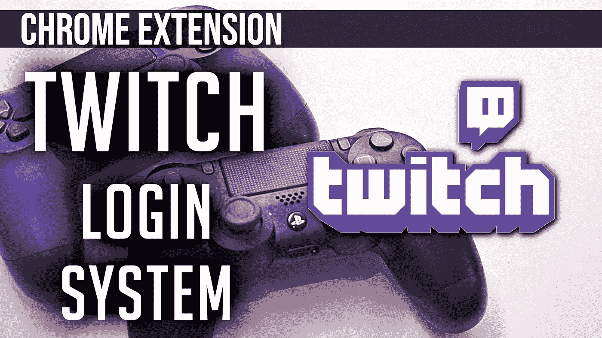

# 使用 Twitch 登录您的 Chrome 扩展

> 原文：<https://javascript.plainenglish.io/use-twitch-to-login-to-your-chrome-extension-4477dd6ec0d6?source=collection_archive---------7----------------------->

允许你的用户使用他们的 Twitch 凭证登录你的 Chrome 扩展

本教程使用了一个锅炉板谷歌浏览器扩展设置。**如果你想知道如何进行设置，请点击这里查看我的文章:**

[](https://anobjectisa.medium.com/how-does-a-chrome-extension-work-web-development-6e85bd2bccc1) [## Chrome 扩展是如何工作的？(网络开发)

### Chrome 扩展有 5 个部分:

anobjectisa.medium.com](https://anobjectisa.medium.com/how-does-a-chrome-extension-work-web-development-6e85bd2bccc1) 

# 我们开始吧。

在我们接触一行代码之前，我们需要设置我们的开发工作区，以便我们能够使用 **Twitch 的 OpenID 端点**。

导航至 https://dev.twitch.tv/console 的'[**'**'](https://dev.twitch.tv/console')并登录。

点击**应用**，然后**注册您的应用**。

填写'**名称**，选择一个'**类别**。

添加一个“ **OAuth 重定向 URL**”。会以
"**https://<chrome ext id>. chromiumapp . org/**的形式。

要找到你的 chrome 扩展 id，在你的浏览器中导航到“ **chrome://extensions** ”，确保你的 Chrome 扩展已经加载。它会在那里。
完成后，点击“**创建**”。

点击“**管理**”，保留“**客户 ID** ”，我们以后会用到。

## 在开始实际的 Chrome 扩展工作之前，让我们做一些 web 开发工作。

我们将创建两个页面。一个'**签到**页和一个'**签退**页。没什么特别的。

现在我们已经讨论了 Web 开发部分，让我们看看我们的“manifest.json”。

```
// manifest.json{
    "name": "Twitch OpenID Connect Authentication Test",
    "description": "Testing a Twitch login system.",
    "version": "0.1.0",
    "manifest_version": 2,
    "icons": {
        "16": "./obj-16x16.png",
        "32": "./obj-32x32.png",
        "48": "./obj-48x48.png",
        "128": "./obj-128x128.png"
    },
    "background": {
        "scripts": [
            "./background.js",
            "./jsrsasign-all-min.js"
        ]
    },
    "options_page": "./options.html",
    "browser_action": {
        "default_popup": "popup.html"
    },
    "permissions": [
        "identity"
    ]
}
```

**注:** 1。****browser _ action**的 **default_popup** 属性设置为页面中的
**标志。
2。为了使用 Chrome 的' **launchWebAuthFlow()** '方法，我们需要' **identity** '权限。****

# **让我们做一些实际的 Chrome 扩展编程**

**我们将从编写应用程序的基本框架逻辑流开始。**

**在' **popup-script.js** 中，当用户点击按钮时，我们会向'**后台**脚本发送一条消息，要求“**登录**”。**

**如果我们从'**背景**'中得到一个“**成功**”，我们将把页面更改为“**签出**”页面。**

**在' **popup-script.js** '中，当用户点击按钮时，我们会向'**后台**'脚本发送消息给“**登录**”。**

**如果我们从'**背景**中得到一个“**成功**，我们将把页面改为“**签出**页面。**

**在' **popup-sign-out-script.js** 中，当用户点击按钮时，我们会向'**后台**脚本发送一条消息，要求“**注销**”。**

**如果我们从'**背景**中得到一个"**成功**"，我们将把页面更改为页面中的"**标志。****

# **让我们一起努力。**

**转到' **background.js** '脚本，我们创建一个条件树来捕获这些消息。**

**我们需要 6 个常量和 1 个变量。当我们这样做时，一个变量跟踪用户的登录状态。**

****注:**
1。 **CLIENT_ID** —告诉 **Twitch** 我们被允许使用他们的 **OpenID** 端点
2。 **RESPONSE_TYPE** —向 **Twitch** 询问特定类别的信息
3。 **REDIRECT_URI** —给我们令牌后把用户重定向到哪里
4。**范围** —向**抽动**请求 **OpenID** 权限
5。**声明** —告诉 **Twitch** 我们想要
6 用户的哪些信息。**陈述** —帮助个性化我们的 **OpenID** 请求**

****注意:**
我们创建了一个函数将所有这些信息汇集在一起。我们在函数中创建了最后一个变量， **nonce** 。nonce 只是一个每当我们需要使用 Twitch OpenID 端点时随机生成的字符串。每次都需要不同。这就是它不是常数的原因。**

**当我们的' **background.js** '脚本得到消息要“**登录**”时，我们将调用'**chrome . identity . launchwebauthflow()**'函数。这需要两个参数。**

**第一个对象为我们构造的 **OpenID** 端点和“ **interactive** ”标志提供 true(这允许用户看到 Twitch 凭证提示)。**

**第二个是回调函数，它从 Twitch 的服务器给我们一个'**重定向 uri** '。我们可以使用交付给我们的一个“**令牌**”来访问登录用户的 Twitch 数据。**

**在本教程中，我们不会这样做；我们只是使用这个端点来"**认证**用户，而不是"**授权**我们。**

****注意:**
除了检查“ **chrome.runtime** ”错误，我们还检查用户是否正确登录。**

**如果没有，将在“ **redirect_url** ”中找到“ **error=access_denied** ”字符串。**

**为了安全起见，我们检查我们收到的' **id_token** '的' **iss** 和' **aud** '是否与我们应用程序的' **Twitch** 端点和'**客户端 ID** '匹配。我们还每 60 分钟检查一次令牌是否有效。如果没有，我们“**转储**它。**

## **我们完了。**

**当用户点击按钮中的**符号时，他们将会看到**抽动**的登录系统。如果他们成功登录，他们将看到我们的“**注销**”页面。****

**如果你想要更深入的指导，可以看看我在 YouTube 上的完整视频教程，**一个物体就是一个**。**

**一定要在 [**Instagram**](https://www.instagram.com/an_object_is_a/) 和 [**Twitter**](https://twitter.com/anobjectisa1) 上关注我们，及时了解我们最新的 **Web 开发教程**。**

## **带有 Chrome 扩展的 Twitch 登录系统| OpenID Connect**