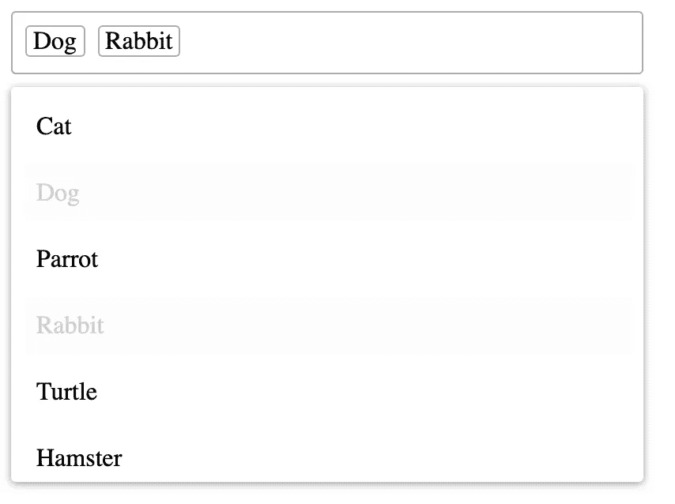

# 在角形中使用您自己的元件

> 原文：<https://javascript.plainenglish.io/use-your-own-components-in-angular-forms-962b46025b87?source=collection_archive---------1----------------------->


Photo by [davisco](https://unsplash.com/@codytdavis?utm_source=unsplash&utm_medium=referral&utm_content=creditCopyText) on [Unsplash](https://unsplash.com/s/photos/colors?utm_source=unsplash&utm_medium=referral&utm_content=creditCopyText)

棱角很适合造型。它对更改做出反应，跟踪表单的状态并验证用户输入。当创建一个反应式表单时，你可以在组件中创建表单控件，并在模板中添加一些指令，比如`formGroup`和`formControlName`，Angular 将从那里获取它。在模板驱动的表单中，组件中的一个简单属性和一个`ngModel`就足够了。也就是说，如果你只使用经典的 HTML 表单元素，比如文本输入、复选框和简单的下拉菜单。如果您需要在表单中添加一些更复杂的字段，那就有点棘手了。

# 控制值访问器

通过上面提到的指令，你可以告诉 Angular 哪个表单控件对应于哪个 HTML 元素。表单控件是跟踪表单域的值并验证它们的对象。当使用反应式表单时，可以在组件中创建它们。在模板驱动表单中，它们由 Angular 为绑定到`ngModel`的每个属性隐式创建。

没有什么是神奇的。要做到这一点，必须在 DOM 和表单控件之间架起一座桥梁。这个东西必须监听 DOM 事件，比如点击和输入，并相应地更改表单控件的值，并且必须在表单控件的值以编程方式更改时通知 DOM。这就是`ControlValueAccessor`的作用。

传统表单元素的访问器在 Angular 表单包中提供。你可以在下面看到复选框的代码。假设您已经导入了表单模块，这就是将这些元素绑定到表单控件的原因。

Source: [Angular Source Code](https://github.com/angular/angular/blob/master/packages/forms/src/directives/checkbox_value_accessor.ts)

像 inputs 和 selects 这样的经典表单域涵盖了大多数用例，但是有时您必须创建自己的表单元素。正如您可能已经体验过的，试图在您自己的组件上使用`ngModel`或`formControlName`会导致错误，类似于:

```
ERROR Error: No value accessor for form control with name: ‘my-component’
```

或者，如果组件的标记上没有 name 属性:

```
ERROR Error: No value accessor for form control with unspecified name attribute
```

为了修正这个错误，你必须给你的组件一个自己的`ControlValueAccessor`。

# 创建访问者

让我们创建一个组件作为例子:多选组件。它可能看起来像这样:

(如果你想单独编码，或者你正在寻找一个简单的多选，你可以在 GitHub 的项目[中找到完整的代码，包括我没有放在这里的样式)。](https://github.com/Dornhoth/control-value-accessor.git)

您给出一组可能的条目作为输入，并在某个条目被选中(或取消选中)时得到一个输出。如果您只是简单地使用带有输入和输出的组件，这是可行的。



但是如果你试图给它添加一个`ngModel`指令，你会得到我们之前看到的错误。我们需要创建一个访问器。通过实现`ControlValueAccessor`接口，使组件本身成为访问器是标准的。如果您让组件实现它，您将看到组件需要实现以下四个方法:

*   `writeValue`
*   `registerOnChange`
*   `registerOnTouch`
*   `setDisabledState`

`registerOnChange`注册一个回调函数，当 DOM 中的值改变时，这个函数将被调用。当选择或取消选择一个项目时，将调用此回调。我们需要创建一个`onChange`函数，如果调用了`registerOnChange`，它将被设置为回调函数。该`onChange`功能被初始化为不执行任何操作的功能。

类似地，`registerOnTouched`注册一个回调函数，当控件被触摸或模糊时应该调用这个函数。

`writeValue`非常简单。它将接收一个条目数组作为输入，并应该为其设置`items`属性。它还应该调用`onChange`回调函数。

最后`setDisabledState`顾名思义应该设置`disabled`状态。您有责任实现`disabled`状态，并确保如果元素被禁用，用户不能写入任何值。

当您的字段被禁用时，您还应该调整用户界面。这需要在模板和样式上做更多的改变，你可以在 GitHub 上查看[项目](https://github.com/Dornhoth/control-value-accessor.git)。

# 提供值访问器

我们现在需要告诉 Angular 我们的组件是一个`ControlAccessValue`。您可能认为实现了接口就足够了，但是当您的 TypeScript 代码转换为 JavaScript 时，接口就消失了。这就是为什么我们需要提供它作为一个`NG_VALUE_ACCESSOR`。因为我们在实际定义组件之前提供了组件，所以我们需要使用`forwardRef`。关于`forwardRef`的更多信息，你可以查看[这篇文章](https://medium.com/javascript-in-plain-english/angular-what-is-forwardref-and-how-does-it-work-54f567e37636)。

我们的组件最终看起来像这样:

我们现在可以在角度形式中使用组件，例如通过添加一个`ngModel`指令:

```
<app-multiselect
  [items]=”possiblePets”
  [(ngModel)]=”pets”
></app-multiselect>
```

您还可以以反应形式使用该组件。Angular 现在会像对待其他表单元素一样对待您的组件，为您验证它，并根据表单控件的状态设置适当的类。

## **一封用简单英语写的信**

你知道我们有四份出版物和一个 YouTube 频道吗？你可以在我们的主页 [**plainenglish.io**](https://plainenglish.io/) 找到所有这些内容——关注我们的出版物并 [**订阅我们的 YouTube 频道**](https://www.youtube.com/channel/UCtipWUghju290NWcn8jhyAw) **来表达你的爱吧！**