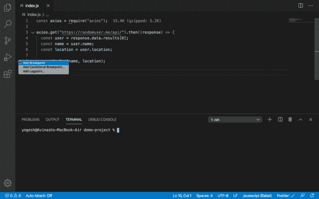
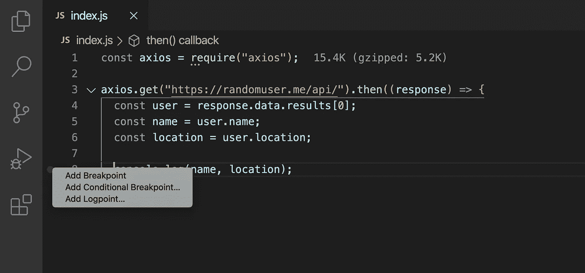
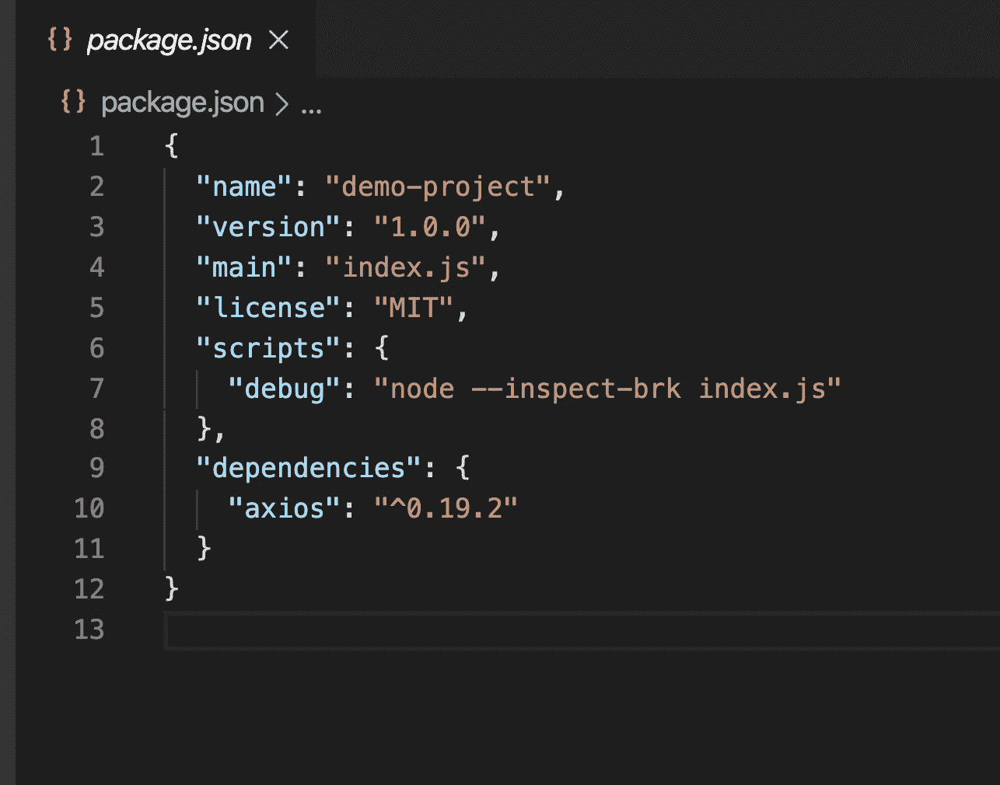
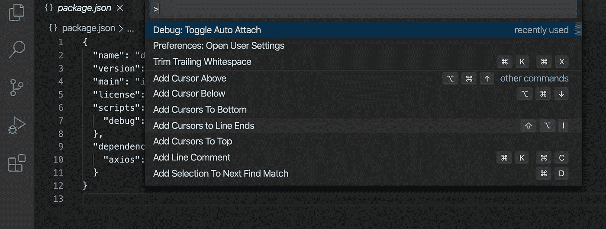
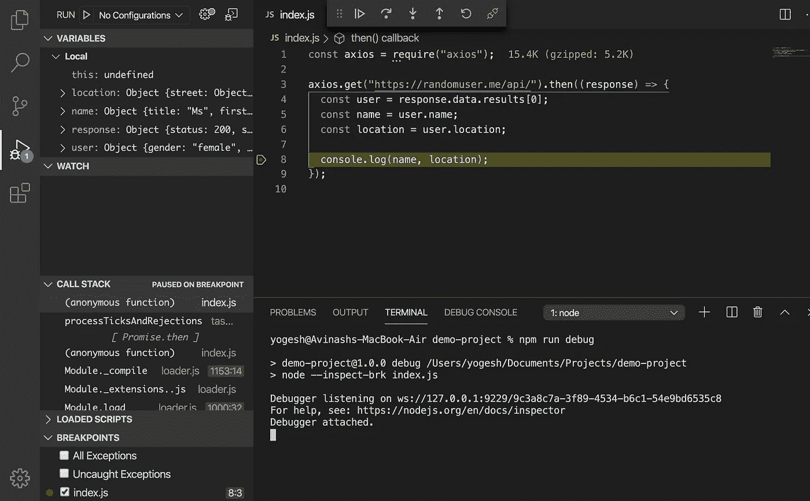

# 改善您在 Visual Studio 代码中的调试体验

> 原文：<https://javascript.plainenglish.io/useful-feature-added-in-visual-studio-code-that-you-might-not-be-aware-of-284c237daf3?source=collection_archive---------10----------------------->

## 有了这个您可能没有意识到的有用特性



以前，如果我们想调试`Nodejs`应用程序，我们必须创建`launch.json`文件来指定调试配置。

为了让调试更容易，VS Code 增加了一个新功能，可以轻松调试`Nodejs`应用。

现在启用了这个特性，VS Code 会自动检测您的`Nodejs`代码并开始调试会话，因此您不需要在`launch.json`中指定您的环境和其他配置

**在 VS 代码中开始调试**

1.  通过右键单击代码中任何行号前的区域，在代码中的任何一行添加断点，并选择`Add Breakpoint`选项



Adding breakpoint

2.如果你有一个`package.json`文件，然后在里面添加`debug`脚本

```
"scripts": {
 "debug": "node --inspect-brk index.js"
}
```



package.json

3.按`Control + Shift + P`或`Command + Shift + P (Mac)`打开命令面板，输入`attach`，然后选择`Debug: Toggle Auto Attach`选项



Toggle Auto Attach option

4.完成后，从`terminal -> New Terminal` 菜单打开 VS 代码中的终端。(`Control + Backtick`快捷方式)

5.在打开的终端中，执行以下命令

```
npm run debugORyarn run debug
```

6.如果没有`package.json`，可以直接跑

```
node --inspect-brk index.js
```

从终点站。这里，`index.js`是您想要调试的文件的名称。

7.一旦执行，您将看到调试器启动，您可以开始观察变量及其值

8.厉害！享受



Debugging session

所以使用`Toggle Auto Attach`选项，VS 代码使得调试`Nodejs`应用程序变得非常容易。

今天到此为止。我希望你学到了新东西。

不要忘记订阅我的每周简讯，里面有惊人的技巧、诀窍和文章，直接在你的收件箱 [**这里。**](https://yogeshchavan.dev/)