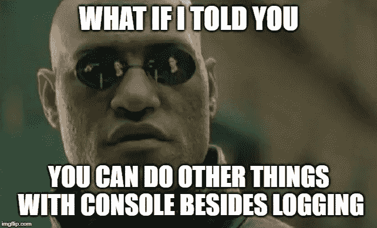

# JavaScript 控制台中有用的隐藏特性

> 原文：<https://javascript.plainenglish.io/useful-hidden-features-in-javascript-console-c8dd55fd976a?source=collection_archive---------7----------------------->

## 您可能不知道的最有用的调试工具的个人列表


很多人在接触一门新的编程语言时，首先学习的就是如何构建一个**【Hello World】**app。

如果你正在学习普通的 JavaScript，*而不使用 HTML* ，你可以通过浏览器的控制台打印消息和其他类型的信息

```
console.log("Hello, World!");
```

当 JavaScript 没有按照我们认为的方式运行时，最常见的事情之一是在应用程序的不同点添加日志语句，这样你就可以了解实际发生了什么。

如果你只知道`console`可以记录东西，你可能会非常成功，但是:



如果我告诉你除了登录之外，控制台还可以做其他事情，那会怎么样？

*是的，没错。*

> `console`对象有比`log`更多的方法，可以帮助您将 JavaScript 调试技能提升到一个新的水平。

虽然每个浏览器都有自己独特的功能，但所有浏览器都有一些通用的方法。

我想我会在这里分享我最喜欢的一个，但是更完整的列表，请查看 [MDN](https://developer.mozilla.org/en-US/docs/Web/API/console)

# 。断言()

关于`console.log`的事情是，有条件地记录某事的唯一方法是将它放在`if-block`语句中。

这就是`console.assert`帮助我们的地方。

> `console.assert`如果传入的第一项为 false，则只记录，否则不记录任何内容。

下面是它的用法示例:

```
console.assert(user.name === > "John", user); 
//Assertion failed: {name:"John Doe", age:15}
```

如您所见，我选择仅在用户名为“John”时记录用户对象，否则不记录任何内容。

这是另一个例子:

就像`console.log` **一样，你可以传递尽可能多的参数**给它，它会记录所有的参数。

唯一的区别是传递的第一项不会被记录，它只会被评估为真或假。

# 。表格()

当您有字符串、整数或其他原语时，使用`console.log`非常有用。

当您试图记录的是一个对象或一个数组，甚至是一个对象数组时，它开始变得不那么有用了。

幸运的是，有`console.table`来拯救。

> 它不是简单地记录数据，而是将数据放在一个表格中，这样通常更容易阅读。

例如，如果您有一组用户数据，您可以这样记录它:

```
console.table(userList);
```

它的输出看起来像这样:


如您所见，它甚至会根据给定的数据推断出列名。

如果需要，**您还可以将列名作为可选的第二个参数**传入。

# 。时间()，。timeLog()和。时间结束()

当你开始有垃圾和缓慢的性能时，最重要的事情之一就是确定你的性能瓶颈在哪里。

一个有用的工具是用三种方法控制:

`console.time`

`console.timeLog`

`console.timeEnd`

这三个功能允许您

*   用`console.time`启动定时器
*   使用`console.timeLog`在我们代码中的任意点记录它的当前值
*   使用`console.timeEnd.`停止定时器并记录其最终状态

> 你有没有想过一个 1.000.000 的迭代 for 循环会持续多久？

您可以用下面的代码来回答这个问题

如果你运行这个代码多次，你会看到你收到不同的结果，基于你的电脑性能。

> 在`console.time`和`console.timeEnd`之间，您可以使用`console.timeLog`打印经过的时间

> 我们如何跟踪他们？

`console.time` **以一个字符串作为“标签”来启动一个定时器**。

在`console.timeLog`和`console.timeEnd`上使用相同的标签，以确保使用相同的计时器。

# 。count()和。countReset()

有时你所需要的只是保存一个计数器变量，仅仅用`console.log`来做这件事就需要跟踪一个全局变量的计数，这不是一个理想的解决方案。

幸运的是，我们有`console.count`为我们做这件事。

> 每次你调用`console.count`它会给出运行总数

```
let user = "";

function greet() {
  console.count();
  return "hi " + user;
}

user = "bob";
greet();
user = "alice";
greet();
greet();
console.count();"default: 1"
"default: 2"
"default: 3"
"default: 4"
```

页面刷新或通过调用`console.countReset.`将重置计数

您还可以跟踪多个不同的计数，**只需将一个字符串作为标签**传入即可，非常类似于`console.time`函数。

要重置单个标签，只需将相同的字符串传递给`console.countReset`函数。

```
let user = "";

function greet() {
  console.count();
  return "hi " + user;
}

user = "bob";
greet();
user = "alice";
greet();
greet();
console.count();
console.countReset();"default: 1"
"default: 2"
"default: 3"
"default: 4"
"default: 0"
```

这将仅重置提供的标签，**其他标签将继续，直到它们被手动重置或页面被刷新**。

这只是控制台对象上可用功能的一部分，**但是我发现它们对我的日常工作最有用**。

当然，查看 MDN 以了解更多信息，也许您会发现其他一些对您更有用的信息。

感谢阅读！