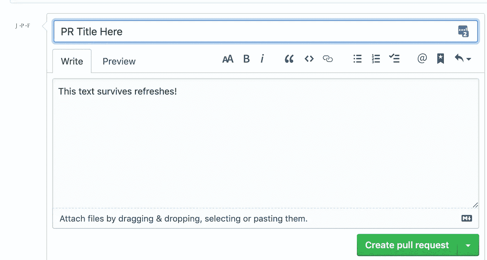

# useLocalStorage() React 挂钩

> 原文：<https://javascript.plainenglish.io/uselocalstorage-react-hook-2532e922d5b1?source=collection_archive---------0----------------------->

## 再也不会丢失表单提交

Now that’s what I call local storage! Photo by [Aneta Foubíková](https://unsplash.com/@anetek?utm_source=unsplash&utm_medium=referral&utm_content=creditCopyText) on [Unsplash](https://unsplash.com/s/photos/pocket?utm_source=unsplash&utm_medium=referral&utm_content=creditCopyText)

# 故事时间:Moodle 测验

几年前，我使用了一个叫做 Moodle 的开源 LMS(类似于 Blackboard 或 Canvas，如果你听说过的话)。在当时，它不是最漂亮的，但它足够好，学校也不能抱怨价格。我真的只有一个抱怨。

当在 Moodle 中进行测试/测验时，它会弹出一个提示，告诉你还剩多少时间。不是最流畅的用户体验(UX)，但在当时可以理解。*然而*，如果你正在输入一个回复，文本区会突然被取消选择。这意味着你接下来的击键被解释为快捷键。

当时，在 Chrome 上按 backspace 会返回一页。

这意味着每 30 分钟，提醒窗口会试图欺骗你返回一页。如果它成功了，那么当你重新进入测试**时，你所有提交的答案**——值得工作的时间**——都将消失**。

我曾经连续发生过三次。眼泪。不难想象，对更小的孩子来说，变成“我讨厌数学”、“我讨厌网上学习”、“我讨厌电脑”，然后是“我讨厌学校”。

说“糟糕的 UX”是一种保守的说法。

# 正确的 UX: GitHub 公关描述

下次您打开一个拉取请求时，请在点击绿色的“创建拉取请求”按钮之前尝试刷新页面。刷新和快速刷新后，您的提交再次出现。我也在公关评论中看到过这种情况。你可能都没注意到。

A screenshot doesn’t do this feature justice. Seriously, try it next time you open a PR.

这就像“记住我”复选框，但总是启用，而不仅仅是用户名。

该功能仅对用户花费大量时间的**输入字段有意义**，包括长文本提交、冗长的调查/表格、经常被遗忘的字段(如用户名)或短暂的偏好。在敏感领域使用这个 UX 之前，我会三思而行:这是“记住我”记住你的用户名而不是密码的原因。

# 履行

我们可以通过在客户端的 localStorage 中存储正在进行的值来实现这个 UX。当文本改变时，我们可以将文本发送到 localStorage。在页面加载时，我们可以使用 localStorage 来填充当前值。

## 反应钩

事不宜迟，用 TypeScript typings ( [及其 JavaScript 源](https://usehooks.com/useLocalStorage/))挂钩:

Original source: [https://usehooks.com/useLocalStorage/](https://usehooks.com/useLocalStorage/)

受控表单是用一个`useState`钩子构建的，遵循模式`const [currentFieldValue, setCurrentFieldValue] = useState(*initialValue*);`，然后显示`currentFieldValue`并在输入改变时调用`setCurrentFieldValue`。这就是我们想要插入 localStorage-sync 特性的地方，所以模仿`useState`接口和语义会使把它放入您的组件变得容易。

## 命名密钥

这个键是一个字符串，如果需要的话，应该包含将它与其他组件分开所需的标识符。

例如，考虑上面的 GitHub pull 请求用例。您可能希望 PR 描述的键包含源 repo 和分支以及目标 repo 和分支的唯一标识符，这样不同的 pull 请求就不会得到相同的描述。

如果数据是全局的，那么键可以只是一个静态字符串。

# 数据持久性可能很棘手

数据持久性可能会导致许多棘手的问题。

如果您更改了持久化数据的结构(由于 UI 软件更新)，您可能会由于意外的结构而导致代码中断。在数据持久化的后端世界中，我们使用“迁移”脚本将所有数据转换成正确的结构。

幸运的是，如果您对非关键数据使用这个钩子，您也许能够“忘记”旧的持久性。更改 localStorage 键模板的一部分，这样您的代码就不会出现旧的内容。类似于`pull-request-description-cache-${sourceRepo}-${sourceBranch}-${targetRepo}-${targetBranch}-v1`的东西，但是当你违约时，它会增加到 v2。(在某个地方放一个快速脚本，通过迭代`Object.keys(localStorage)`来清理 v1 键)

# 何时清理本地存储

数据的清理经常被忽视，但在构建成品时却是至关重要的。

## 长格式

上面的 Moodle 例子很复杂。如果两个用户在同一个浏览器中参加同一个测试(一个接一个)，您不希望第二个用户看到第一个用户的选择。

考虑清除相关的 localStorage 键一次:

*   表单已成功提交
*   当提交被显式中止时(取消按钮与意外导航)
*   当用户注销或登录时

## 高度机密信息

localStorage 中的数据在 XSS 攻击中是可检索的，因此如果您在 localStorage 中有个人身份信息或其他敏感数据，请考虑不时将其清除。为任何 TTL 类型的计算存储时间戳。(使用`Date.now()`获得一个 JSON 可序列化的纪元编号)

出于安全原因，不要依赖本地存储中的数据。任何人都可以编辑本地存储。即使您对其进行了加密，您的用户也可以看到前端的任何内容，包括加密密钥。(除非你在后端加密它，那么也许可以，但是要意识到用户可以清空他们的本地存储或者切换到不同的设备)。

## 短暂的偏好

列表中的主题或排序顺序等偏好是很好的存储方式(“人体工程学”是我想到的一个词)，但是如果你打算长期保存这些东西，就不要依赖本地存储。用户清空缓存、切换浏览器或在不同设备上登录时，你的应用程序应该没问题——所有这些情况下本地存储都不会持久。

# **简明英语团队的一份说明**

你知道我们有四份出版物和一个 YouTube 频道吗？你可以在我们的主页 [**plainenglish.io**](https://plainenglish.io/) 上找到所有这些——关注我们的出版物并 [**订阅我们的 YouTube 频道**](https://www.youtube.com/channel/UCtipWUghju290NWcn8jhyAw) **来表达你的爱吧！**

# 资源

*   [使用位置存储()要点](https://gist.github.com/jamesfulford/a7f1fcead386e76bfd9d36136e0da6da)
*   [useLocalStorage 钩子的原始来源](https://usehooks.com/useLocalStorage/)(没有 TS 类型，也没有关于用例以及正确使用的建议——这使得这篇文章是原创的)