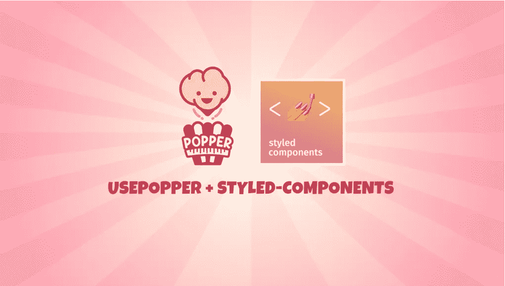

# 将 Popper 与样式化组件一起用于 React-React Popper 2.×

> 原文：<https://javascript.plainenglish.io/usepopper-with-styled-components-for-react-react-popper-2-568284d029bf?source=collection_archive---------0----------------------->

## React Popper 的`**usePopper**`挂钩— Popper.js



我最近升级了我们组件库中的 popper。

管理 popper 的放置、翻转和溢出防止所涉及的复杂性使得从头编写自己的实现令人生畏(尤其是耗时)。

在解释为什么你应该使用它们方面，Popper.js 比我做得更好。

## 反作用弹出器 2.×使用弹出器挂钩

关于实现`usePopper`钩子的文档相对有限。(我花了很长时间才得到一个可用的版本😅)

`usePopper`挂钩有三个参数:

*   对切换元素的引用，例如按钮
*   对 popper 元素的引用
*   配置对象

并返回两个变量:

*   `styles`
*   `attributes`

```
const { styles, attributes } = usePopper(
  buttonRef.current,
  popperRef.current,
  {
    modifiers: [
      {
        name: "arrow",
        options: {
          element: arrowRef
        }
      },
      {
        name: "offset",
        options: {
          offset: [0, 10]
        }
      }
    ]
  }
);
```

## 处理按钮和弹出器 ref-useRef()

当创建对我们的按钮和弹出器的引用时，我们可以`useRef`创建一个引用对象并将其分配给我们的按钮。我们的波普也一样:

```
const buttonRef = useRef(null);
const popperRef = useRef(null);...<Button ref={buttonRef} ......
<PopperContainer ref={popperRef} ...
```

然后，当我们将引用传递给`usePopper`时，我们简单地使用`.current`属性。

简单。

## 通过 useState()对我们的箭头使用回调引用

在为我们的箭头创建引用时，我们需要[使用回调引用](https://github.com/popperjs/react-popper/issues/354#issuecomment-613937717)，而不是引用对象。

啊？引用对象？

通过选择`useState`，我们可以[创建一个回调引用](https://reactjs.org/docs/refs-and-the-dom.html#callback-refs)，而不是`useRef`创建的引用对象。

我们将`setArrowRef`函数传递给箭头 div 上的`ref`:

```
*// the ref for the arrow must be a callback ref* const [arrowRef, setArrowRef] = useState(null);...<div ref={setArrowRef} />
```

然后，当我们将 ref 变量传递给`usePopper`钩子时，我们只需使用`arrowRef`。

## 配置对象—修饰符

我们将一个配置对象传递给我们的`usePopper`钩子，并为我们的特定用例指定修饰符。

我们将指定一个箭头元素，popper.js 为我们处理定位，以及一个匹配我们的箭头大小的偏移量。

```
modifiers: [
      {
        name: "arrow",
        options: {
          element: arrowRef
        }
      },
      {
        name: "offset",
        options: {
          offset: [0, 10]
        }
      }
    ]
```

配置对象可用修改器的完整列表可以在[非反应弹出器文档](https://popper.js.org/docs/v2/modifiers/)中找到。

## 应用 usePopper 样式和属性

出于本文的目的，我们将使用一个基本的样式化组件弹出器:

```
const PopperContainer = styled.div`
  box-shadow: 0 0 5px rgba(0, 0, 0, 0.3);
  border-radius: 5px;
  background-color: white;
  padding: 20px;
  text-align: center;
`
```

然后，在我们的组件内部，我们将添加`PopperContainer`并应用引用、样式和属性:

```
<PopperContainer
  ref={popperRef}
  style={styles.popper}
  {...attributes.popper}
>
  <div ref={setArrowRef} style={styles.arrow} className="arrow" />
  <p>I'm a popper</p>
</PopperContainer>
```

## 设计我们的箭头以匹配弹出器的位置

我们已经将`styles.arrow`传递给我们的 arrow div，它处理整体定位，我们仍然需要手动添加一些样式来使它工作。

在我们的`PopperContainer`样式组件内部，我们的目标是`.arrow`类名:

```
const PopperContainer = styled.div` ....arrow {
    position: absolute;
    width: 10px;
    height: 10px;

    &:after {
      content: " ";
      position: absolute;
      top: -25px; // we account for the PopperContainer padding
      left: 0;
      transform: rotate(45deg);
      width: 10px;
      height: 10px;
      background-color: white;
      box-shadow: -1px -1px 1px rgba(0, 0, 0, 0.1);
    }
  }
`
```

目前，我们的箭头被设计成位于 popper div 的顶部，看起来不错。

直到我们滚动页面😅：

因为我们已经将 popper 属性添加到了我们的`PopperContainer`中，所以我们可以在我们的样式化组件中访问`data-popper-placement`:

```
const PopperContainer = styled.div`... .arrow {
    ...
  } &[data-popper-placement^='top'] > .arrow {
    bottom: -30px; :after {
      box-shadow: 1px 1px 1px rgba(0, 0, 0, 0.1);
    }
  }
`
```

这里，我们将箭头调整为当其位置翻转方向时显示在弹出器的底部。

如果我们想为不同的方向设计箭头样式，那么我们可以简单地以同样的方式访问`data-popper-placement`属性的底部、左侧和右侧。

## 最后的结果

**资源:**

*   CodeSandbox 上的源代码
*   对 popper.js 上的 Popper 文档[做出反应](https://popper.js.org/react-popper/v2/)
*   popper.js 上的自定义修改器文档
*   React 文档上的 useRef

感谢阅读！

麦显杰

[](https://medium.com/javascript-in-plain-english/youre-missing-a-trick-with-your-styled-components-in-react-e3dfcd586f75) [## 您错过了 React 中样式化组件的一个技巧

### 为组件添加显示名称以帮助识别它们

medium.com](https://medium.com/javascript-in-plain-english/youre-missing-a-trick-with-your-styled-components-in-react-e3dfcd586f75) [](https://medium.com/javascript-in-plain-english/are-your-react-components-style-extendible-17148ba98c00) [## 你的 React 组件风格可扩展吗？

### 用 React 和 styled-components 创建样式可扩展组件

medium.com](https://medium.com/javascript-in-plain-english/are-your-react-components-style-extendible-17148ba98c00) 

*   [https://codesandbox.io/s/blue-worker-w9rtu](https://codesandbox.io/s/blue-worker-w9rtu)

[](https://github.com/popperjs/react-popper/issues/354) [## 安装问题#354 popperjs/react-popper 的位置不正确

### 此时您不能执行该操作。您已使用另一个标签页或窗口登录。您已在另一个选项卡中注销，或者…

github.com](https://github.com/popperjs/react-popper/issues/354) 

## **简明英语团队的笔记**

你知道我们有四份出版物和一个 YouTube 频道吗？你可以在我们的主页 [**plainenglish.io**](https://plainenglish.io/) 找到所有这些内容——关注我们的出版物并 [**订阅我们的 YouTube 频道**](https://www.youtube.com/channel/UCtipWUghju290NWcn8jhyAw) **来表达你的爱吧！**