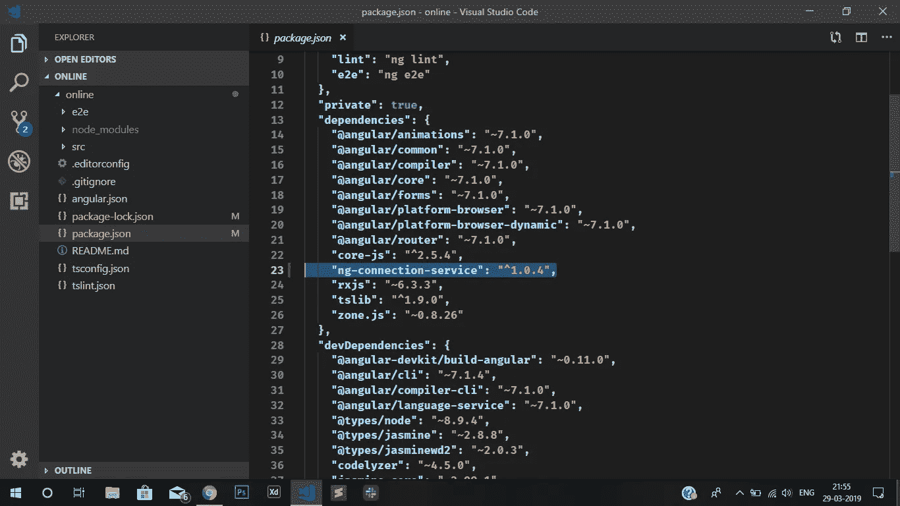
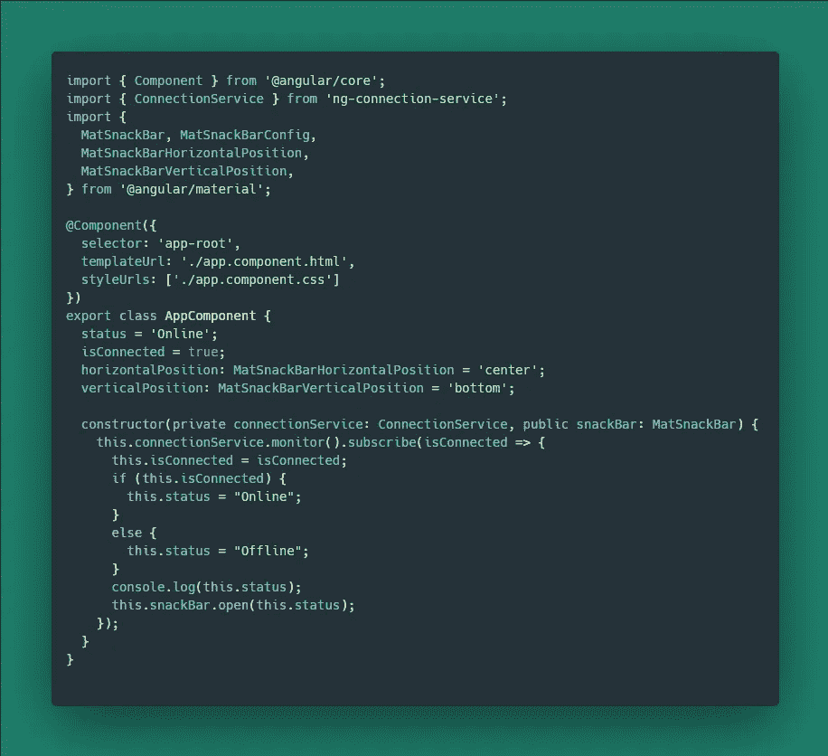
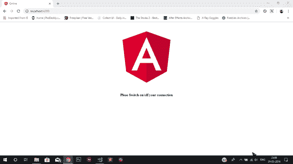

# 创建一个 Snackbar，在 Angular 中一分钟内检查一个用户是在线还是离线！

> 原文：<https://javascript.plainenglish.io/user-online-offline-snackbar-in-angular-in-a-minute-ca5e92e32123?source=collection_archive---------1----------------------->

## 一个小而简单的角度应用程序，使用角度材料检查用户是否连接到互联网

## 首先你必须安装一个名为 ng-connection-service 的软件包。让我们看看如何做到这一点。

使用 CLI 创建新的角度应用程序

`*ng new Online*`

使用以下命令从 CLI 在应用程序中安装 ng-connection-service 包:

`*npm install ng-connection-service — save*`

一旦你完成了这个过程，请检查你的*包. json* 是否被添加

您应该会看到类似下面的内容，

package.json

现在，是时候使用 CLI 将角度材质安装到项目中了

> npm 安装-保存@ angular/material @ angular/CDK @ angular/animations

现在，导入到 *app.component.ts* 中，如下图:

> 从“@angular/material”导入{MatSnackBar，MatSnackBarConfig，MatSnackBarHorizontalPosition，MatSnackBarVerticalPosition }；

最后，让我们将服务注入到组件中。如果你熟悉服务，你会知道要注入一个服务，我们去组件类的构造器，注入它如下:

> 构造函数(私有 connection service:connection service，公共 snack bar:MatSnackBar){
> })；

现在是写检查互联网连接的逻辑的时候了。参见下面的代码:

app.component.ts

最终结果看起来像:

final output

在这里，你可以看到每当我关闭我的无线连接 Snackbar 弹出在底部，并显示离线状态。