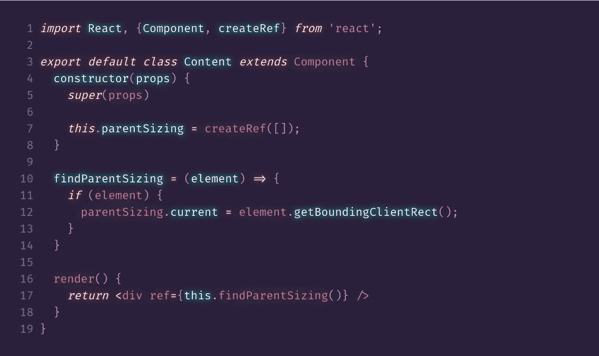
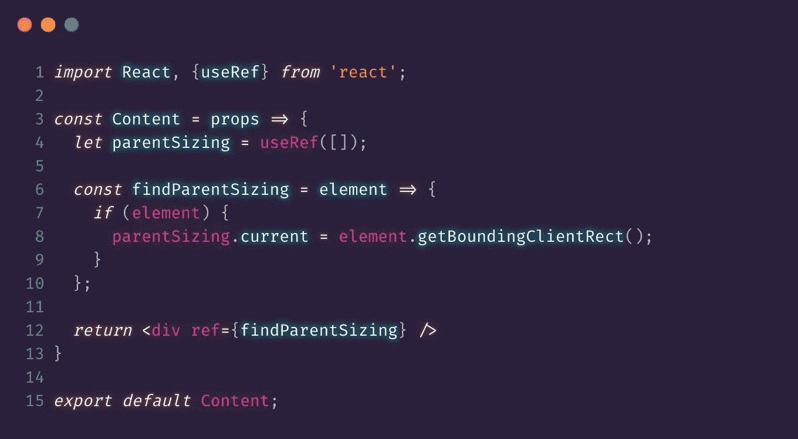

# useRef()挂钩可能不常见，但非常有用

> 原文：<https://javascript.plainenglish.io/useref-hook-can-be-uncommon-but-very-useful-5fbbcf5e23e2?source=collection_archive---------12----------------------->

React 16.8 于 2019 年 2 月发布。随之而来的是钩子的引入。钩子现在使我们有可能在一个功能组件中控制状态和其他特性。仅仅因为我们想要一点独立的状态，就必须将我们的功能组件转换成类组件的日子已经一去不复返了。

你可能会对自己说:是的，是的，我知道所有关于钩子的事，你去哪里了？这篇博文迟到了。请不要走开，因为这次我们将要谈论一个对你来说可能有点不常见的钩子。我们将要谈论的是钩子。我们将讨论它是如何工作的，以及一些常见的用例。在整篇文章前留下来，我保证我会把一切都包起来。所以让我们开始吧。

当你听到 React 钩子的时候，你可能马上会想到`useState`和`useEffect`这两个非常常见的钩子，显然是用来控制状态的。但是当我说`useRef`时，你会想到什么？您可能会想到 React 类创建引用的能力。让我们看一个例子。

我给你一点时间看看

我把这个班放在这里作为参考。在钩子出现之前，类的方式是创建引用的方式。我不是说你不应该再使用类或任何东西。

不管怎样，现在我们来看第二段代码。这个例子很简单。最初，我们所做的是创建一个`parentSizing`变量，它被赋予一个空数组的`useRef`值。然后在我们的渲染中，我们的 ref 调用了`findParentSizing`函数，该函数将`parentSizing`变量重新分配给特定项目的测量值。这只是使用`useRef`挂钩的一个例子。

请记住，refs 提供了一种方法来访问在我们的 render 方法中创建的 DOM 节点。这里有一个快速说明，当使用这个钩子时。记住`useRef`在分配变量值时使用了一个`current`属性。

当使用我们的`parentSizing`变量时，为了实际访问该值，我们必须包含`current`属性。因此，要访问我们的值，应该是`parentSizing.current`。这是一件非常简单但容易忘记的事情。如果你和我一样，你会忘记几次，你会一直想知道为什么你总是得到一个空的变量值。别担心你不会是第一个。

React 给了我们`useRef`三个好的用法:

*   管理焦点、文本选择或媒体播放。
*   触发命令式动画。
*   与第三方 DOM 库集成。

避免对任何可以声明完成的事情使用 refs。知道了这个建议，我们在使用`useRef`时需要小心。作为开发人员，我们有能力随时使用任何代码。仅仅因为一些工作，但并不意味着我们应该如何使用这个工具。

所以现在是总结这篇文章的时候了。请在下面给我留言，告诉我你的想法。或者你对另一篇文章有什么想法。好吧，我想我要离开这里了，像往常一样，我给你留了一张 gif。