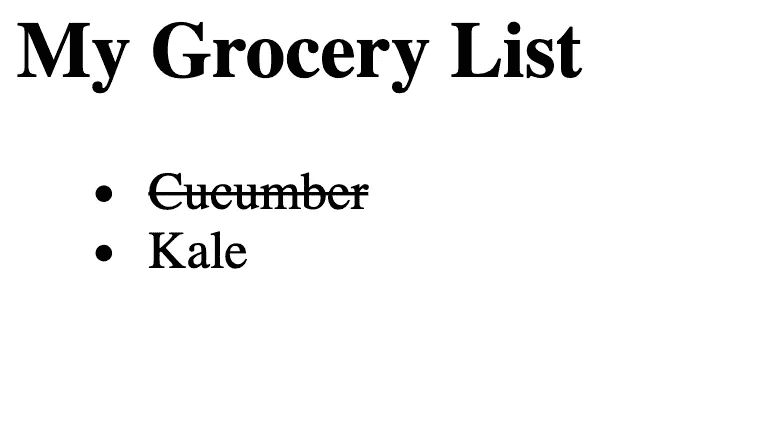

# 使用购物清单理解 React 中的道具和状态

> 原文：<https://javascript.plainenglish.io/using-a-grocery-list-to-understand-props-and-state-in-react-f86eefbcc132?source=collection_archive---------4----------------------->

## 解释动态 React 组件的可变和不可变属性之间的区别

React 是一个基于组件构建的前端 JavaScript 库。这些组件代表了用户界面的独立“单元”,可以非常容易地重用。与静态 HTML 元素不同，React 组件可以被定义为内置动态行为。问题是，这是如何实现的？

作为一个例子，让我们试着在 React 中制作一个简单的购物清单。我们希望在 HTML 网页上呈现两种食品的列表——黄瓜和甘蓝。当你点击该商品时，会有一条删除线穿过，告诉你该商品已被购买。下次单击该项目可以删除该行。



An example of the simple grocery list we wish to create using React.

这是 JSX 购物清单用户界面的整个结构:

```
<GroceryList *items*={["Cucumber", "Kale"]} />
```

简单吧？这就是 React 的强大之处——我们可以模块化用 HTML 编写的复杂用户界面，直到整个应用程序被浓缩成几个(或者在这种情况下，一个)通用组件。

上面 GroceryList 组件中的属性 *items* 是一个名为 *props* 的对象的一部分，该对象保存了 JSX 组件的所有属性。在这种情况下，道具看起来就像{ items: ["Cucumber "，" Kale"] }。

Props 在 GroceryList 组件的定义中是可访问的，如 *this.props* (因为 props 是 GroceryList 实例的属性):

```
import React *from* "react";
import ReactDOM *from* "react-dom";class GroceryList extends React.Component {
  render() {
    return (
      <ul>
        {this.props.items.map((item, index) => (
          <GroceryListItem item={item} key={index} />
        ))}
      </ul>
    );
  }
}
```

GroceryList 在 HTML 中呈现为一个无序列表，每个列表元素由一个 GroceryListItem 提供。请注意，数组中的 JSX 元素是从。map()只是按顺序呈现。

每个 GroceryListItem 代表 this.props.items 中的一个项目，就是数组["Cucumber "，" Kale"]。每个 GroceryListItem 的 props 对象有两个属性(“Item”和“key”)。

现在，我们只需要定义 GroceryListItem 组件，并赋予它动态删除线行为:

```
class GroceryListItem extends React.Component {
  constructor(props) {
    super(props);
    this.state = {
      bought: false
    };
  } handleClick() {
    this.setState({
      bought: !this.state.bought
    });
  } render() {
    let style = {
      textDecoration: this.state.bought ? "line-through" : "none",
    };
    return (
      <li style={style} onClick={this.handleClick.bind(this)}>
        {this.props.item}
      </li>
    );
  }
}
```

喔，等一下！构造函数中的 *this.state* 是什么意思？

状态是另一个对象，它是 React 组件的内部属性。在上面的代码中，this.state 包含属性*buyed*，它指示我们是否已经购买了那个特定的 GroceryListItem。如 render()方法所示，如果商品已经购买，我们调整样式，以便 textDecoration 属性设置为 line-through。

我们购买/取消购买项目的方式是通过 onclick 事件处理程序。当我们单击与 GroceryListItem 相对应的 HTML li 元素时，state . buyed 更改为与其当前值相反的值。之后，render()方法重新呈现页面，因为 this.setState()已被调用。

但接下来就有问题了:难道不能直接把买来的属性加到道具里吗？换句话说，难道我们不能写下面的代码，然后编辑这个. props . buyed 吗？

```
<GroceryListItem item={item} key={index} bought=false />
```

答案是否定的，因为 React 库中的一个通用规则:**道具是只读的**。React 的理念是 props，或者从父组件传递到子组件的数据应该是不可变的。改变一个道具可能会有有害的副作用，因为它可能会被 UI 层次结构中更高层的组件所依赖和改变。

使用这个例子，假设 buy 确实是 this.props 的一个属性，我们使用 onclick 事件处理程序修改了它。但是，如果我们向 GroceryList 添加一个方法，导致整个 GroceryList 被重新呈现，那么每个 GroceryListItem 的 buy 属性将变回 false——即使我们没有通过重新单击每个 GroceryListItem 来显式取消购买它们。

另一方面，状态是完全封装的。除了在其中定义它的组件之外，其他组件无法访问它，因此动态编辑它是安全的。因此，有状态的 GroceryListItem 防止删除线被 GroceryList 移除，因为 GroceryList 将无法访问 GroceryListItem 的状态。