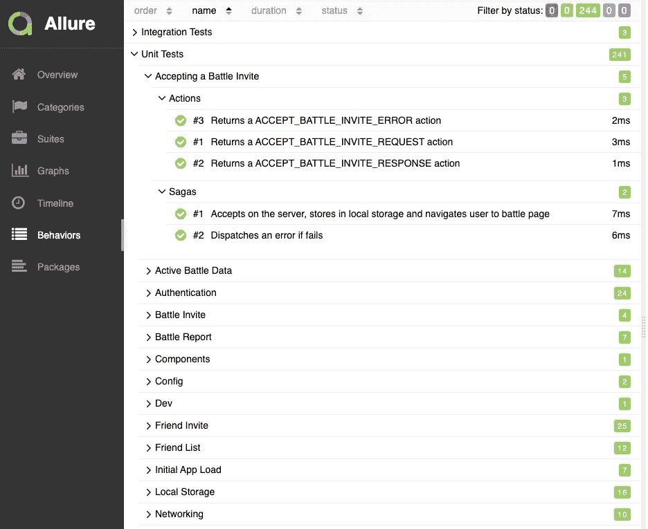

# 使用 Allure 和 Jest 改进测试报告

> 原文：<https://javascript.plainenglish.io/using-allure-and-jest-to-improve-test-reporting-d43a8e01ab0f?source=collection_archive---------1----------------------->



An example of Allure

我最近开始着手一个新的 React Native 项目，并决定建立标准来确保高水平的质量融入到开发过程中。

这一过程意味着存在高水平的单元测试和集成测试，随着代码库的增长，由于测试套件增长或变得支离破碎以使代码更干净，这可能变得难以保持。

我过去用过 Allure，但除了它允许一些更花哨的饼状图之外，我从未真正看到它的价值，如果使用了 Gherkin，那么你会将特征文件添加到“行为”标签中。

我也遇到过让 Allure 与 Jest 一起工作的问题，因为有许多选项(`jest-allure`、`jest-allure-reporter`、`allure-jest-circus`等等)，并且没有任何关于 npm 的文档真正有助于理解如何用 React Native 进行设置。

最终，我在`jest-allure` Github 上找到了更好的文档，它解释了如何通过 Jest 的`setupFilesAfterEnv`配置选项设置`jest-allure`，这让我能够从 Allure 获得全部价值。

# 设置 jest-allure

为了使用`jest-allure`，你需要首先[通过 npm](https://www.npmjs.com/package/jest-allure) 安装包。

安装好软件包后，创建一个`jest.config.js`文件(或添加到现有文件中)并将`jest-allure/dist/setup`作为一个条目添加到`setupFilesAfterEnv`键下。

An example of the Jest Config

现在，当您运行 Jest 测试时，您应该会看到一个`allure-results`目录被创建。

## 逮到你了

如果你在运行`jest-circus`的 Jest 版本上，你需要安装`jest-jasmine2`并在你的`jest.config.js`文件中设置`testRunner: 'jest=jasmine2'`。

如果您在使用 TypeScript 时遇到未定义`reporter`的问题，请添加下面的`global`声明，将`Reporter`类型添加到全局对象中:

```
import { Reporter } from 'jest-allure'
declare global {
  let reporter: Reporter
}
```

# 生成报告

虽然您已经成功运行 Jest 测试，并且能够创建 Allure 使用的数据，但是您还没有脱离险境，您仍然需要运行 Allure 来查看报告。

您可以通过 NPM 上的 `[allure-commandline](https://www.npmjs.com/package/allure-commandline)` [包](https://www.npmjs.com/package/allure-commandline)[下载 Allure CLI，然后允许您从终端运行`allure`。](https://www.npmjs.com/package/allure-commandline)

您要使用的主要命令有:

*   `allure generate` —这将生成报告，以便您可以在浏览器中打开它
*   `allure serve` —这会生成报告并为您启动一个 web 服务器

然而 CLI 并不监视文件的变化，所以你需要在每次运行测试时运行这些命令，除非你创建一个文件监视器来重新运行`allure generate`命令和一个单独的 web 服务器进程(类似于`Python -m http.server`)。

# 加强报告

An example of using the Allure reporter object in a Jest test

基本的 Allure 报告只提供了你的测试结果的饼状图，如果你使用过小黄瓜，你会在行为标签中看到你的特征。

如果您使用 [Allure annotation API](https://docs.qameta.io/allure/#_features_2) 注释您的测试，您将从 Allure 获得主要价值。

`jest-allure`将一个`reporter`对象添加到测试运行程序可用的全局变量中，它具有以下属性:

*   **严重性** —设置被测试代码的严重性
*   **Epic** —设置与测试相关的 Epic(在行为选项卡中使用)
*   **特性** —设置与测试相关的特性(用于行为选项卡)
*   **故事** —设置与测试相关的故事(在行为选项卡中使用)
*   **开始步骤**——用于指示执行测试场景时采取的步骤
*   **结束步骤** —用于表示该步骤的结束
*   **添加参数**—从外观上看与`startStep`相同
*   **添加环境** —通过`addParameter`将环境信息添加到报告中
*   **添加附件** —向测试运行添加附件
*   **添加标签** —向测试运行添加标签
*   **addParameter** —将传递给被测代码的参数添加到测试运行中

Allure 支持更多的注释，但是由于`Severity`、`Epic`、`Feature`和`Story`都调用`addLabel`，你可以为这些注释添加自己的标签。

你可以在 Allure 网站上找到 Allure 支持的所有功能的分类。

# 使用报告

一旦您在报告上做好了注释，并且生成了报告，最后一步就是与团队分享它。

有许多与各种 CI 工具的集成，例如 Jenkins，它允许将`allure-results`文件与后续测试运行中生成的其他文件聚合在一起，但是如果您只是有一种将这些文件上传到文件服务器的方法，则不需要这些集成。

一旦你有了这些文件，你就可以通过一个独立的 Allure 服务或者只是通过下载文件并在本地运行`allure generate`来生成报告。

但是，我建议，如果您打算采用这种方法，那么使用 Allure 注释向报告添加元数据是值得的，例如:

*   测试运行的环境(CI、本地等)
*   运行 ID(如果在 CI 中运行，以便您可以追溯到特定的运行)
*   如果您正在运行系统测试，那么记录运行的服务器是一个好主意
*   如果您在所有分支上运行测试，那么添加哪个分支是值得的，这样您就可以只在一个特定的分支上进行过滤
*   如果您使用问题跟踪器或用户案例，那么值得添加这些资源的链接，以便您在解释结果时可以轻松访问其他信息

虽然所有这些报告功能都很棒，但最重要的是要考虑它将为团队提供什么价值。

值得与团队成员交谈，看看他们是否有任何报告需求(例如发现不可靠的测试、报告回归等)，并确保在添加所有只有您想添加的功能之前满足这些需求。

您还可以利用问题跟踪器的 API 将 Allure 报告信息添加到带有报告链接的页面中(带有一些过滤)，这样用户就可以点击测试这些实体中的信息，这样您就有了某种形式的基本双向可追溯性。