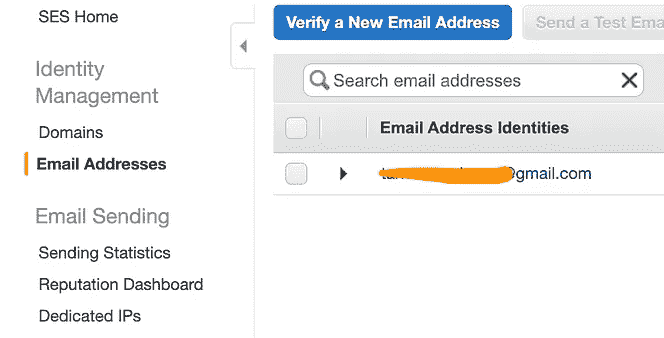
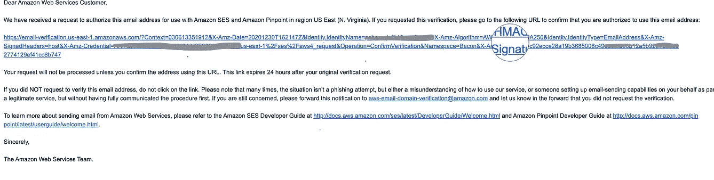
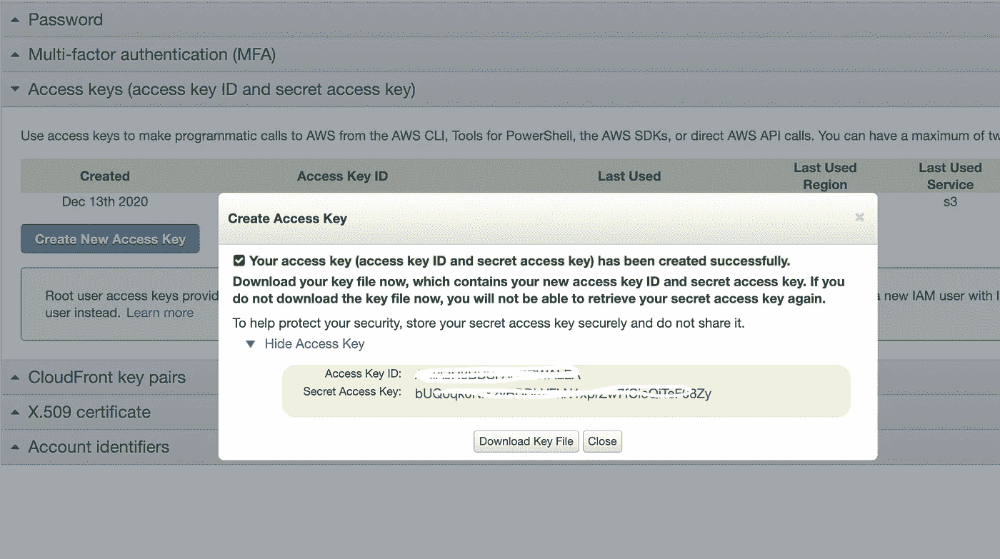
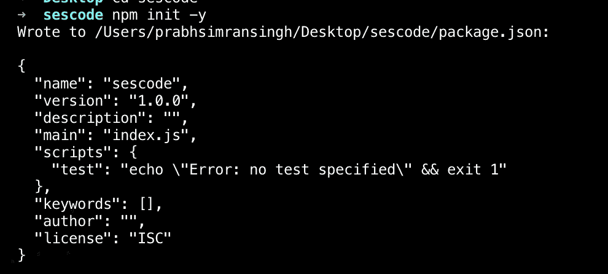
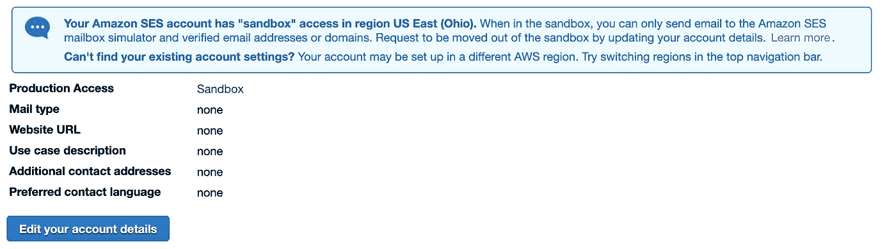
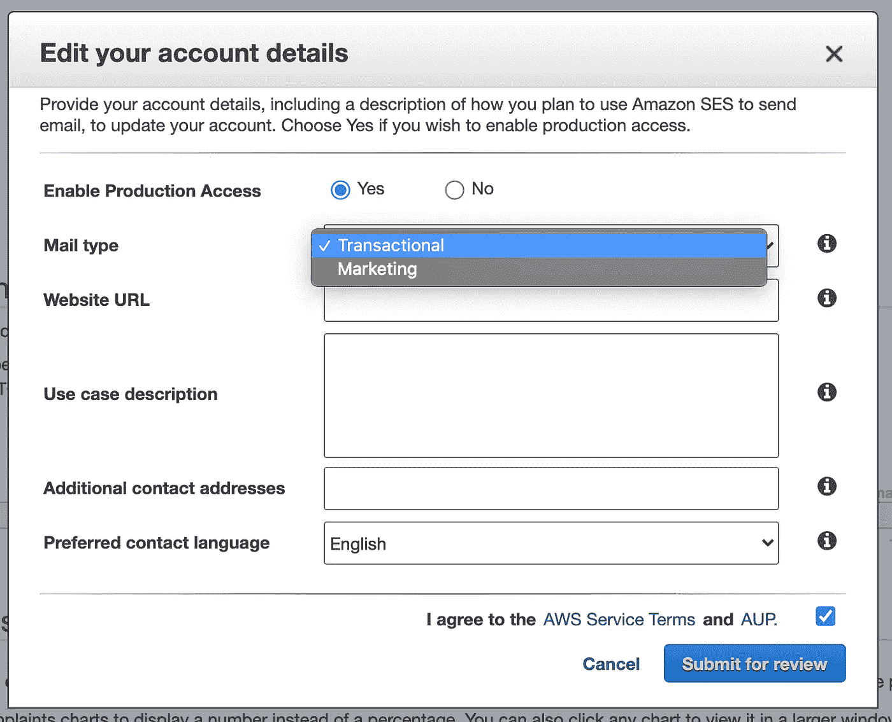
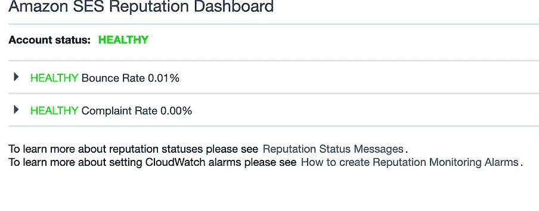
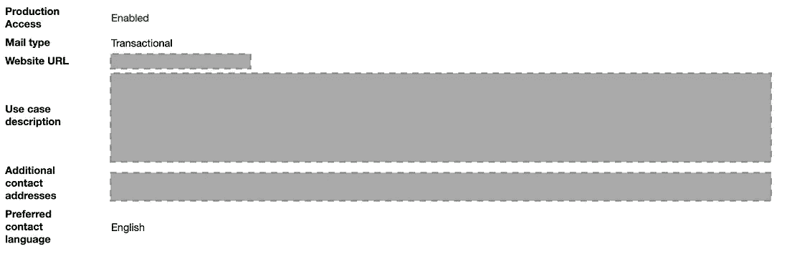

# 通过 Node.js 使用 Amazon SES

> 原文：<https://javascript.plainenglish.io/using-amazon-ses-with-node-js-to-send-those-otp-emails-1d2dc8da6c30?source=collection_archive---------7----------------------->


AWS-SES banner (URL: [https://aws.amazon.com/ses/](https://aws.amazon.com/ses/)) (for the folks too lazy to read, the git URL is at the end of the post!)

## 亚马逊 SES 是什么？

顾名思义，它是用来收发电子邮件的。我们将在本文中讨论发送它的一部分。

曾经有一段时间，我们花费了大量的时间和资源来设置我们的 SMTP 服务器，以便向新注册我们网站的用户发送一封祝贺邮件。AWS 的 SES 让这一切变得简单(相对而言)。

# **好处**

1.  节省了资源，没有开发人员在设置 SMTP 服务器上浪费时间，该服务器仅在用户忘记其帐户的密码时使用。
2.  没有数百行代码来调用您的 SMTP 服务器。
3.  *快速简单！*

# 步伐

1.  设置 SES/验证电子邮件
2.  设置凭据
3.  设置您的电子邮件应用程序。
4.  走出沙盒。
5.  使用自己的域名*(可选)*

# 设置 SES/验证您的电子邮件

1.  在您的 AWS 帐户上设置 SES。

**i.** 登录您在[aws.amazon.com](https://aws.amazon.com)的 AWS 账户，如果您还没有，请创建一个。

**二。**在您首选的 AWS 地区(通常是离您或您的用户群最近的地区)搜索简单的电子邮件服务


SES

→三。在 SES 主页上，单击左侧边栏中的“**电子邮件地址”**选项。

添加您要用于发送电子邮件的电子邮件，您将收到来自`no-reply-aws@amazon.com`的电子邮件。要验证该电子邮件，请点击邮件中的 URL 进行验证。(您经过验证的电子邮件地址将被用作您使用 AWS-SES 发送的电子邮件的“发件人”地址)。



Verify An Email Address

# 设置凭据

为了允许 AWS-SDK 代表您发送电子邮件，我们需要创建凭据。

**一、**在 AWS 控制台右上角，打开账户菜单，点击`‘My Security Credentials’`。在打开的页面上，转到`Access keys (access key ID and secret access key)`，点击“创建新的访问密钥”。



**二。**下载密钥文件或保存访问密钥 ID 和密码。

**三。我们需要在我们的机器中设置这些凭证，以供 AWS-SDK 使用。**

*   在您的用户主目录中，创建一个名为`.aws`的文件夹
*   创建一个名为`credentials`的文件
*   将访问密钥和密码粘贴到文件中。(我们在上一步中创建的那个):

`[default]
aws_access_key_id=AKISQJEUHDSBQNDKO
aws_secret_access_key=456789ijhVFGTYHji987yTGFR%TY&^YTGHJH`

您的新凭证文件将如下所示👆

放心吧！这些都是假证件，✌️

`[default]`:是凭证对的标签。我们可以在同一个文件中保存多个凭证，并使用标签来区分。如果您的代码中没有指定任何内容，AWS-SDK 将使用带有`default`标记的凭证。

# 设置您的电子邮件应用程序

1.  用文件夹中的`npm init -y`或`npm init`初始化 Node.js 应用程序，并输入所有需要的细节。



2.创建我们在 package.json 中提到的名为`index.js`的主文件，这个文件是在`npm init`的帮助下创建的。

3.安装代表我们调用电子邮件服务的 AWS-SDK。在命令行中写入`yarn add aws-sdk`或`npm install aws-sdk --save`。

4.在 index.js (main)文件中导入`aws-sdk`。

`const AWS = require(‘aws-sdk’);`

5.为您的 AWS- SES 服务设置区域。(比如我在 N. Virginia 地区验证邮箱)→ (us-east-1)。

`AWS.config.update({ region: ‘us-east-1’ });`

6.设置 AWS-SDK 要使用的凭据。

`var credentials = new AWS.SharedIniFileCredentials({profile: ‘work-account’}); AWS.config.credentials = credentials;`

在我们的例子中，我们使用默认标签的凭证。因此，我们跳过上述步骤。

7.在 params 对象中设置你的消息，发件人地址，收件人地址，主题等，看起来应该像这样👇

```
let params = {Destination: {/* required */ToAddresses: [email,/* more items */]},Message: {/* required */Body: {/* required */Html: {Charset: "UTF-8",Data: `<h3>Hi ${name}!</h3><br/><p>Your OTP for Something Something Service Hub is:<em> ${otp}</em></p><br/><p>Regards,<br/>Something Something Service Hub Team</p>`},Text: {Charset: "UTF-8",Data: `Hi  ${name}!Your Login OTP is ${otp}`}},Subject: {Charset: 'UTF-8',Data: `${otp} is the  OTP for Something Something Service Hub!`}},Source: fromEmail,/* required */ReplyToAddresses: [fromEmail,/* more items */],};
```

我们可以在正文中编写 HTML 或文本，HTML 在两者中具有更高的优先级。

8.使用 AWS 调用 SES 服务。SES 打包并传递参数。

`var sendPromise = new AWS.SES({apiVersion: ‘2010–12–01’}).sendEmail(params).promise();`

9.捕捉回应。

```
sendPromise.then(function (data) {console.log(data.MessageId);}).catch(function (err) {console.error(err, err.stack);});
```

# **问题！！**

耶！我知道我之前没说。虽然我们已经正确地做了每件事，但是有一个问题我们没有谈论。SES 仅允许您向经过验证的电子邮件帐户发送电子邮件。意味着什么？嗯…我验证了我们的电子邮件，我们可以向那个地址发送尽可能多的电子邮件，但不能发送到其他地方。

# 解决方案？？

SES 为我们分配了一个沙盒电子邮件帐户服务，该服务只将电子邮件发送到我们验证过的电子邮件地址。但是为什么呢？我只需要一个电子邮件服务来生成一个登录动态口令并发送它。

> **权力越大责任越大——来自** [**漫威漫画**](https://medium.com/u/1a99b354e672?source=post_page-----1d2dc8da6c30--------------------------------) **的某人。**



SES — sandbox

为什么会这样？嗯……你所需要做的就是记住你的 Gmail 邮箱中的未读邮件数量，因为你收到的垃圾邮件越来越多。AWS 不希望人们将其用作垃圾邮件生成器。那么，应该怎么做呢？

# 走出沙盒。

1.  在 SES 控制台中，转到左侧菜单上的“发送统计数据”。

2.你会看到你有一个沙盒账户，上面的`info-box`也提到了这一点。点击*编辑您的账户详情*。

3.填写所需的详细信息、您的用例等。



4.一旦您填写了所有的细节，提交您的申请进行审查，等待几个小时的团队响应和批准您的请求，您就可以开始了。

5.但是等等！不急！我们知道我们得到了批准，但这并不意味着我们可以用它来发送任何类型的电子邮件。SES 有一个名为“*声誉仪表板*”的仪表板，可以跟踪所有与你的电子邮件发送和投诉相关的统计数据。一定要小心，避免产生任何垃圾邮件。



Reputation Dashboard and Production access.

6.现在，您可以向您的应用程序用户发送电子邮件。

# 问题？

另一个问题！谁会相信一封来自某个随机且非常常见的域名 Gmail 的 OTP 电子邮件呢？雅虎邮箱？等等？

# 使用自己的域名*(可选)*

1.  使用亚马逊 S3 从[亚马逊注册表](https://docs.aws.amazon.com/Route53/latest/DeveloperGuide/domain-register.html)购买域名。
2.  现在返回 AWS-SES，从左侧菜单中点击'*域*'。
3.  单击“验证新域”，按照步骤操作。
4.  完成了。

现在你可以在你的应用程序中写任何带有`@yourdomain.com`的电子邮件地址。

你可以在 github.com/psharneja[查看代码库。](https://github.com/psharneja/aws-ses-gist)

注意:[使用 AWS-SDK 并不是使用 SES 服务](https://aws.amazon.com/ses/getting-started/)的唯一方式。SES 支持 [SMTP](https://docs.aws.amazon.com/ses/latest/DeveloperGuide/send-email-smtp.html) 选项以及 [REST](https://docs.aws.amazon.com/ses/latest/DeveloperGuide/using-ses-api-examples.html) 。

我们使用共享凭证进行身份验证。AWS 给了我们很多其他的选择。你可以在 [docs.aws](https://docs.aws.amazon.com/ses/latest/DeveloperGuide/send-email-concepts-credentials.html) 查看。

您可以将[抄送&密件抄送地址添加到您的电子邮件](https://docs.aws.amazon.com/AWSJavaScriptSDK/latest/AWS/SES.html#sendEmail-property)中。也可以用回调代替承诺。

下次吧！再见！