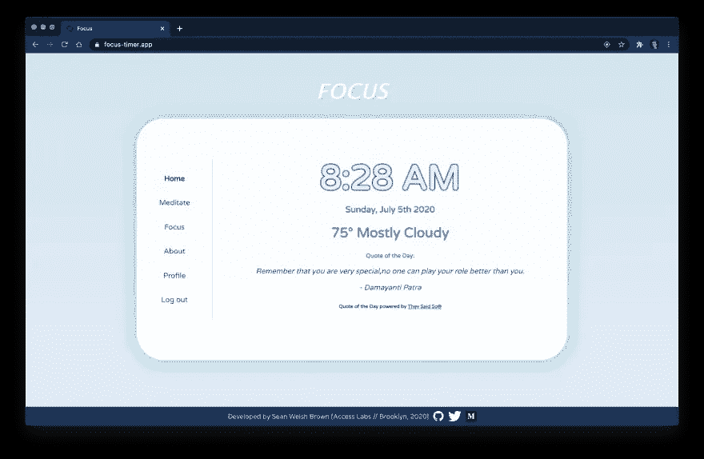

# 使用 JavaScript 中的到期日期创建自毁数据

> 原文：<https://javascript.plainenglish.io/using-an-expiry-date-in-javascript-to-create-self-destructing-data-e7e93b050b73?source=collection_archive---------7----------------------->

## 创建有保存期限的信息。


假设您已经创建了一个 web 应用程序，除了它的其余功能之外，它还向用户呈现了一条信息，您希望这条信息只在页面上保留一段时间。这可能是任何范围的事情，从临时笔记中的个人信息，到每天午夜到期的“每日报价”，到从速率受限的外部 API 提取的数据。

作为一名开发人员，你可以有多种方式来完成这项工作，但一个简单而有趣的方式是给这条信息设定一个*截止日期*，在此日期之后，它将自我销毁，回到它原来的数字世界。

这个技巧将探索 JavaScript 语言中一些不同的内置功能，并证明是一个通用的工具，可以在以后的应用程序中修改或激发其他想法。

对于本教程，我将使用我用 [React](https://reactjs.org/) 构建的一个应用程序的上下文，该应用程序为用户提供一个冥想计时器、一个焦点/番茄闹钟计时器，以及一个主页和登录页面，其中显示了日期和时间、当地天气以及一段鼓舞人心的每日名言。



*Hosted at* [*https://focus-timer.app/*](https://focus-timer.app/)

在这个主页中，我知道我想从外部 API 自动获取报价——但是我遇到了一个问题，为了保留带宽，API 受到了速率限制。在我的应用程序被暂时限制之前，我每小时只能打一定数量的电话，报价从页面上完全消失了(取而代之的是难看的控制台错误！)

我知道我可以通过每天只在服务器端获取一次报价来尝试防止这种情况，但是我想我会利用这个机会尝试在客户端保留获取，并尝试在逐个访问者的基础上给数据一个截止日期，因为我知道这可能会在未来的应用程序中对我有利。

在这次讨论中，我们将使用现代 web 开发的两个标准化功能。

第一个是包含站点 DOM 文档的窗口的一个方面:

```
Window.localStorage
```

第二个是 JavaScript 语言的内置对象:

```
Date()
```

[**localStorage**](https://developer.mozilla.org/en-US/docs/Web/API/Window/localStorage) 是一个属性，它使您能够访问文档中的[存储](https://developer.mozilla.org/en-US/docs/Web/API/Storage)对象，该对象在浏览器会话之间保持不变。可以通过 JavaScript 代码或直接通过浏览器控制台来访问它。

[**Date()**](https://developer.mozilla.org/en-US/docs/Web/JavaScript/Reference/Global_Objects/Date) 是一个对象，表示创建时的单个时间点，以 UTC 1970 年 1 月 1 日以来的毫秒数为单位。这个 Date()对象有许多操作它的内置函数，其中一个我们将在我们的例子中使用。

我将要展示的要点版本如下:

*   当加载主页时，我们检查用户的 localStorage，看看那里是否已经有一个被提取的报价。
*   如果*没有*报价，那么我们从 API 获取一个新报价，将该报价保存到 localStorage，并运行一个函数来保存到期日期/时间，以备我们需要替换该报价时使用。
*   如果*是*报价，那么我们将当前日期/时间与到期日期/时间进行比较(在这种情况下，到期日期是报价保存到本地存储的当天午夜)。
*   如果当前日期/时间在到期日期/时间的之前*，那么我们将从 localStorage 中提取报价并将其呈现在页面上。*
*   如果当前日期/时间是在到期日期/时间的之后的*，那么我们清除本地存储并返回到步骤 1，从 API 获取一个新的报价。*

现在让我们看看代码中的实际情况！

首先，我创建了两个助手函数，它们被抽象出来以保持代码整洁和[干燥](https://en.wikipedia.org/wiki/Don%27t_repeat_yourself)。

第一个是标记为 *secondsToMidnight()* 的函数，它接受一个 **Date()** 对象作为 *n* ，并使用该对象的内置函数 *getHours()* 、 *getMinutes()* 和 *getSeconds()* 来查找与 **Date()** 对象相同的当天午夜之前的秒数。这可能看起来有点混乱，但本质上这是一个可以修改的步骤，以找到您想要设置为数据到期日期的未来任意时间量。

```
const secondsToMidnight = (n) => {
    return (
      ((24 - n.getHours() - 1) * 60 * 60) + ((60 - n.getMinutes() - 1) * 60) + (60 - n.getSeconds())
    )
  }
```

第二个辅助函数标记为*assignQuoteToLocalStorage()*，它做 4 件事:

*   利用对 API(*getQuoteOfTheDay()*)的获取来获取报价。
*   在变量 *currentTime* 下创建一个 **Date()** 对象，并对其执行 3 项操作以创建到期日期/时间:

1.  使用内置函数 *getTime()* 获取以毫秒为单位的当前时间(以距离 1970 年 1 月 1 日为单位测量当前时间)。
2.  将 *currentTime* date 对象传递到 *secondsToMidnight()* 中，然后将其乘以 1000 以获得午夜前的毫秒数。
3.  将这两个数字相加，以获得以毫秒为单位的未来日期/时间，该日期/时间正好等于同一天的午夜。

*   将 quote 和 expiry 作为对象中的键/值对设置到 localStorage。
*   在 React 中将报价设置为要在页面上呈现的状态( *setQuoteOfTheDay()* )。

```
const assignQuoteToLocalStorage = () => {
  getQuoteOfTheDay()
  .then( quote => {

    const currentTime = new Date()
    const expiry = currentTime.getTime() + (secondsToMidnight(currentTime) * 1000)

    localStorage.quote = JSON.stringify(quote)
    localStorage.expiry = expiry

    setQuoteOfTheDay(quote)

  })
}
```

现在，我们利用上述两个助手方法在组件挂载中执行以下操作(每次加载页面时都会发生):

```
if (!!localStorage.quote) {

  let quoteExpiry = parseInt(localStorage.getItem("expiry"))
  let now = new Date()

  if (now.getTime() > quoteExpiry) {

    localStorage.removeItem("quote")
    localStorage.removeItem("expiry")

    assignQuoteToLocalStorage()

  } else {

    let quote = JSON.parse(localStorage.getItem("quote"))
    setQuoteOfTheDay(quote)

  }

} else {

  assignQuoteToLocalStorage()

}
```

在我们的第一个 *if* 语句中，我们检查 localStorage 中是否有引用。如果有，那么我们从 localStorage 中取出到期日期，创建一个新的 current **Date()** 对象，并比较两者。

我们使用嵌套的 *if* 语句来检查当前时间是否在到期时间之后。如果是这样，我们从本地存储中删除报价和到期时间，并调用我们的助手函数(*assignQuoteToLocalStorage()*)来获取新的报价并为其创建新的到期时间。如果当前时间仍在到期之前，我们从 localStorage 中提取报价，并将其设置为我们的状态，以便在页面上呈现。

如果我们的第一个 *if* 语句返回 false，并且在 localStorage 中没有找到报价，那么我们调用*assignQuoteToLocalStorage()*并获取一个新报价，然后将它和到期日期分配给 LocalStorage。

我们完事了。虽然这些都是在我的应用程序的特定上下文中完成的，但同样的原则在任何地方都适用。

您可以对 JavaScript **Date()** 对象及其相关函数使用类似的技巧，以您喜欢的任何格式将到期时间保存到本地存储或您的数据库，以创建自毁的数据片段。

感谢阅读！如果你有任何问题或建议，请在评论中告诉我。

# 简单英语的 JavaScript

喜欢这篇文章吗？如果有，通过 [**订阅获取更多类似内容解码，我们的 YouTube 频道**](https://www.youtube.com/channel/UCtipWUghju290NWcn8jhyAw) **！**