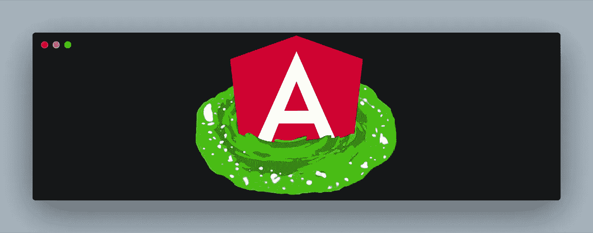

# 使用角 CDK 门户网站创建一个模式

> 原文：<https://javascript.plainenglish.io/using-angular-cdk-portal-to-create-a-modal-fde843428d83?source=collection_archive---------3----------------------->



几个月前，我突然想到一件事。我可以有一个单一的、通用的、全局的模态，并且只向它的主体注入一个内容，而不是有几乎一百个模态组件吗？

我知道这是可能的，我玩动态加载组件已经有一段时间了，并认为这应该可以做到。我只是不知道这种方法是否可扩展。

就在那时，我发现了[有角度的 CDK](https://material.angular.io/cdk/categories) ，更准确地说，是入口的概念。根据安格尔 CDK 公司的[文件](https://material.angular.io/cdk/portal/overview):

> 一个`Portal`是一个 UI，它可以被动态地呈现到页面上的一个空位上。
> 
> “UI 块”可以是一个`Component`或一个`TemplateRef`,“开放插槽”是一个`PortalOutlet`。

这里的想法是在`app.component`级别有一个单一的模态组件，使用一个定制的服务控制和注入模板给它。

## 由 [ngx-bootstrap](https://valor-software.com/ngx-bootstrap/#/modals#directive-child) 供电的模态组件

generic-modal.component.html

这是一个基本的模态设置。这里重要的部分是:

```
<ng-container *cdkPortalOutlet></ng-container>
```

其中`cdkPortalOutlet`是一个创建一个槽的指令，我们将在这个槽中动态地附加模板。

我们还可以将其位置设置为`CENTER`或`RIGHT`。最后一件事是，我已经禁用背景点击和 ESC 键关闭模式，我会得到它在一分钟内。

## 模态定制服务

我们的定制服务将保存模态的状态，并将与 RxJs `BehaviorSubject`一起工作。我们首先声明几件事:

*   一个私人的`BehaviorSubject`来掌控国家
*   一个`get state`方法，这样模态组件可以监听变化
*   方法来打开和关闭，这意味着组件将使用模态。

```
private state$ = new BehaviorSubject<ModalState>(undefined);get state(): Observable<ModalState> {
  return this.state$.asObservable();
}open(position: ModalPosition) {
  this.state$.next({open: true, position});
}

close() {
  this.state$.next({open: false, position: undefined});
}
```

`ModalState`和`ModalPosition`声明如下:

```
export interface ModalState {
  open: boolean;
  position: ModalPosition;
}

export enum ModalPosition {
  *CENTER* = 'CENTER',
  *RIGHT* = 'RIGHT',
}
```

现在是入口部分。我们还将为模板门户提供一个`BehaviorSubject`,为通用模态组件提供一个 getter，为每个“持有”模态的组件提供一个 setter。

```
private portal$ = new BehaviorSubject<TemplatePortal>(undefined);get portal(): Observable<TemplatePortal> {
  return this.portal$.asObservable();
}setModalPortal(portal: TemplatePortal) {
  this.portal$.next(portal);
}
```

`TemplatePortal`是 Angular CDK 声明的一个类。此类的一个实例可以附加到门户网站。

出于两个原因，我决定将设置门户部分与开放部分分开:

*   这样父组件就可以控制触发模式打开的事件，但是如果需要的话，拥有模板的子组件负责它的所有逻辑部分，包括设置`TemplatePortal`。
*   所以我们可以在我们的`ngOnInit`上设置一个`TemplatePortal`，只在事件发生时打开它。模板已经准备好了，就等着展示了。

到目前为止，我们的自定义模态服务如下所示:

[generic-modal.service.ts](https://gist.github.com/JGhignatti/6aa0cbe68ce982d6a62a56d5a3a19493#file-generic-modal-service-ts)

## 监听我们的定制服务更改并连接门户

现在回到模态组件，这次是 TypeScript 文件。首先，我们可以参考 ngx-bootstrap 的`ModalDirective`和 Angular 的`CDKPortalOutlet`。

```
@ViewChild('modal', {static: false}) modal: ModalDirective;
@ViewChild(CdkPortalOutlet, {static: false}) portalOutlet: PortalOutlet;
```

现在，在我们的组件的`ngOnInit`上，我们可以订阅我们的定制服务的`Observables`。

[generic-modal.component.ts](https://gist.github.com/JGhignatti/9e79a0ef75d0978ab91acdfd389e94ed#file-generic-modal-component-ts)

Angular CDK 的门户工作起来就像打电话一样简单`attach`，只要记住`detach`如果你已经连接了一个。

## 让我们使用它！

想象一个 Home 组件，带有一个打开居中模态的按钮。该组件声明了一个`ng-template`，用于设置门户。

[home.component.ts](https://gist.github.com/JGhignatti/a3dbc24775f39ac5812da536d9c26cd6#file-home-component-ts)

在这里，我们再次看到它是多么容易使用角 CDK 的门户。要创建一个`TemplatePortal`，你只需要模板本身的`TemplateRef`和一个`ViewContainerRef`。

## 奇特的结尾

这是一个已经工作的通用全局模型，它公开了一个`PortalOutlet`并接受一个`TemplatePortal`，但是，等等，我们如何关闭它呢？

还记得我禁用背景点击和 ESC 键吗？这样你就需要有一个按钮或者其他什么东西来调用我们的模态服务的`close()`，对吗？

嗯，你可以保持背景和 ESC 启用，监听`ModalDirective`的`onHide`或`onHidden`事件来调用`close`，这样我们的状态就会保持最新，但这不是一个好方法。相反，我们可以听背景点击和按下 ESC 键来模仿这种行为，但方法要恰当。返回模式组件类型脚本文件

```
@HostListener('mousedown', ['$event'])
onClick(event: any) {
  if (event.target.classList.contains('modal')) {
    this.genericModalService.close();
  }
}

@HostListener('keydown', ['$event'])
onEsc(event: any) {
  if (event.key === 'Escape') {
    this.genericModalService.close();
  }
}
```

## 瞧吧

我们的应用程序中有一个单一的模式，我们有一个定制的服务来控制它，我们可以在应用程序的任何地方向它呈现模板。如果你想的话，你可以今天就到此为止，但是我想提出另一个方案。

# 同一页面上的多个模态场景

想象你现在有一个二级页面，有两个按钮，每个按钮打开一个不同的模态，意味着不同的模板。

```
@Component({
  selector: 'app-secondary',
  template: `
    <app-secondary-first-modal></app-secondary-first-modal>
    <app-secondary-second-modal></app-secondary-second-modal>

    <div>
        <p>secondary works!</p>
        <button class="btn btn-primary" (click)="onFirstClick()">Secondary First Modal</button>
        <button class="btn btn-primary" (click)="onSecondClick()">Secondary Second Modal</button>
    </div>
  `,
  styleUrls: ['./secondary.component.scss']
})
export class SecondaryComponent { ... }
```

`SecondaryFirstModal`的`ngOnInit`会设置一个`TemplatePortal`，而`SecondarySecondModal`的`ngOnInit`会设置一个不同的。最后初始化的子节点会设置其内容，但第一个子节点不会。我们该如何应对？

您可以让父组件引用其子组件的`TemplateRef`，但是正如我所说的，我希望模态组件能够独立存在，而不是链接到它的父组件。所以我这里的方法是不同的:输入我们所有的模态！

## 在同一页面上处理多个模态

我们可以让自定义服务的`open`方法接受第二个参数`modalType`，并为其创建一个`BehaviorSubject`，就像这样。

```
private type$ = new BehaviorSubject<ModalType>(undefined);get type(): Observable<ModalType> {
  return this.type$.asObservable();
}open(position: ModalPosition, type?: ModalType) {
  this.type$.next(type);
  this.state$.next({open: true, position});
}
```

现在回到我们的`secondary-first-modal.component.ts`

[secondary-first-modal.component.ts](https://gist.github.com/JGhignatti/74115d894d509d0b21a6a306247b5468#file-secondary-first-modal-component-ts)

该组件订阅了`genericModalService.type`变更，当其父组件调用`open`并传递该组件的特定`modalType`时，它将接收该信息并将其自己的模板设置到门户出口。

这种方法强调了我们将开放操作与设置门户操作分开的第一个原因。如果需要，子模态也可以对事件做出反应，并且是独立的。

你可以在 [Stackblitz](https://stackblitz.com/github/JGhignatti/angular-cdk-modal) 上查看现场工作演示，或者从我的 [GitHub](https://github.com/JGhignatti/angular-cdk-modal) 上获取。

[](https://stackblitz.com/github/JGhignatti/angular-cdk-modal) [## AngularCDKGenericModal

stackblitz.com](https://stackblitz.com/github/JGhignatti/angular-cdk-modal) 

你可以在我的推特上联系我。