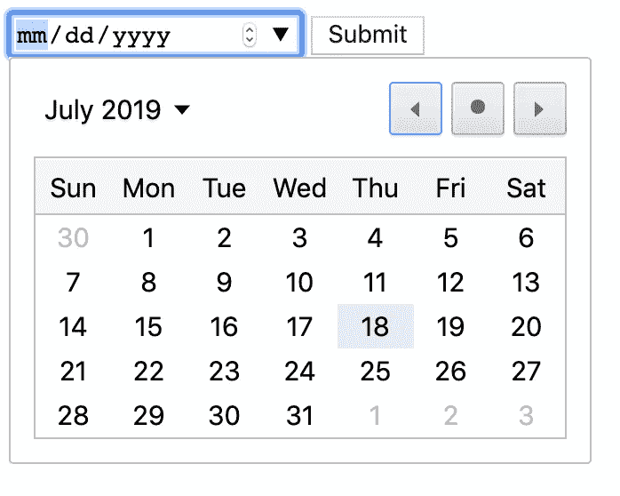
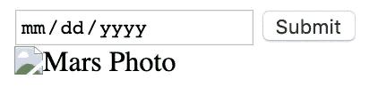
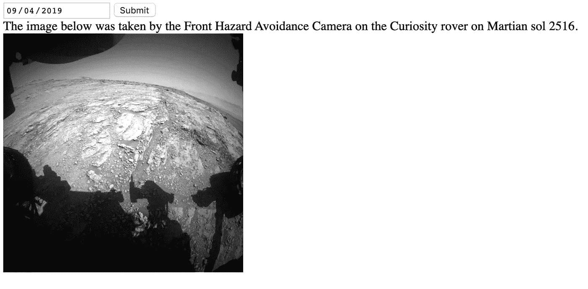
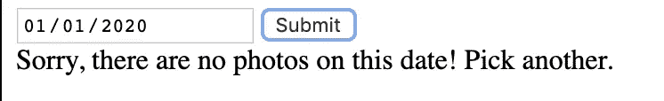

# 使用 Axios 从 NASA API 获取数据&使用 JS 动态显示数据

> 原文：<https://javascript.plainenglish.io/using-axios-fetch-from-nasa-api-using-js-to-dynamically-display-data-ef896aa45da4?source=collection_archive---------2----------------------->


你知道美国宇航局有一个公众可访问的[API 的图像和数据宝库吗？](https://api.nasa.gov/)访问非常简单——他们有一个有限使用的演示密钥，或者您可以注册一个帐户并获得自己的 API 密钥。在这篇博客中，我将使用 demo 键进行示例。

这是关于如何使用 [axios](https://www.npmjs.com/package/axios) 从 API 获取数据的指南——我将使用火星探测器的照片，处理错误，然后操纵 DOM 来显示结果。

**步骤 1 — HTML 表单&访问元素**

我想让用户选择一个日期，然后使用该日期显示好奇号火星车的照片。在每个元素上，包含一个惟一的 ID(或者多个元素的类名)。

```
<div>
  <input id="date" type="date">
  <button id="button" href="">Submit</button>
</div>
```

看起来像这样:



现在，让我们设置使用 JavaScript 来使用`document.getElementById()`访问这些元素中的每一个，并将它们存储为一个变量。

```
var datePicker = document.getElementById("date");
var button = document.getElementById("button");
```

作为额外的一步，我将添加`datePicker.min = "2012-08-06"`,这样就没有选择 2012 年 8 月 6 日之前的日期的选项，那时好奇号首次登陆火星。

**步骤 2 —使用 Axios 执行 GET 请求**

首先要做的是使用 NPM 或 yarn 安装 axios，然后将行`var axios = require('axios');`添加到将要编写代码的 JS 文件或组件的顶部。

我从 API 文档中得知，通过执行一个请求来达到端点:'[https://API . NASA . gov/mars-photos/API/v1/rovers/curiosity/photos？earth _ DATE = DATE&API _ KEY = DEMO _ KEY](https://api.nasa.gov/mars-photos/api/v1/rovers/curiosity/photos?earth_date=DATE&api_key=DEMO_KEY)’，但是更改了日期部分以匹配用户输入。

因此，让我们为日期创建变量，然后将日期作为模板文字插入 URL。

```
var date = datePicker.value;
var url = `https://api.nasa.gov/mars-photos/api/v1/rovers/curiosity/photos?earth_date=${date}&api_key=DEMO_KEY`;
```

记住使用反勾号，而不是引号或单引号！

我们希望 GET 请求在用户点击按钮时被触发，所以让我们将所有内容封装在一个监听该事件的函数中。

```
button.addEventListener("click", function() {});
```

下面所有的代码(和上面的变量)都在这个函数中。使用`console.log`查看响应和变量设置是很有帮助的。在继续之前，测试所有东西，确保所有东西都连接正确。

```
button.addEventListener("click", function() {
    var date = datePicker.value;
    console.log(date)
    var url = `https://api.nasa.gov/mars-photos/api/v1/rovers/curiosity/photos?earth_date=${date}&api_key=DEMO_KEY`;
    console.log(url)
});
```

使用此通用格式来处理 axios。

```
axios.get(url)
    .then(function(response) {
        // handle success
    })
    .catch(function(error) {
        // handle error
    }));
```

首先，让我们看看返回的数据。

```
function(response) {
    console.log(response.status);
        console.log(response.data);
  }
```

在控制台中查看一下，并决定您想要使用响应的哪些部分。直接在浏览器中输入 URL 也有助于查看 JSON。

我想展示其中一张照片，火星车名称，拍摄照片的相机，以及相应的火星溶胶。

```
function(response){
    var image = response.data.photos[0].img_src;
        console.log(image) var sol = response.data.photos[0].sol;
        console.log(sol) var cameraName = response.data.photos[0].camera.full_name; 
        console.log(cameraName) var roverName= response.data.photos[0].rover.name;
    console.log(roverName); var text = `The image below was taken by the ${cameraName} on the ${roverName} rover on Martian sol ${sol}.`;
  };
```

**第三步——处理错误**

如果用户选择了一个越界的日期，该怎么办？或者如果没有某一天的照片呢？就目前的情况而言，用户不会看到任何变化，但不会得到任何关于原因的警告。

首先，让我们将响应函数设置为仅在有响应时前进:

```
axios.get(url)
        .then(function(response) {
            if (response)
           // response code
        });
```

如果没有响应，添加逻辑:

```
axios.get(url)
        .then(function(response) {
            if (response)
                // response code
        }).catch(error)
    //error code
        console.log(error)
};
```

**第 4 步——向 DOM 显示结果**

让我们添加一些标记来显示结果。

```
<div id="results"></div>
```

对于`img`，添加你喜欢的任何属性，但是记住添加`style="display: none"`，这样就不会出现损坏的图像。



现在让我们使用 IDs 来访问元素。在 JS 文件中，在响应函数内添加:

```
document.getElementById("results").innerHTML = text;
// sets the innerHTML of the div to the text results.
document.getElementById("image").src = image;
// adds the image URL to the src attribute
document.getElementById("image").style.display = "block";
// displays the image element
```

最终结果如下所示:



最后，在误差函数中添加:

```
var error = "Sorry, there are no photos on this date! Pick another.";
document.getElementById("results").innerHTML = error;
```



请参见并在此测试完整代码，您可能需要更改 API 密钥——演示密钥每天只允许 30 个请求。