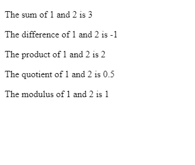

# 在 JavaScript 中使用回调和闭包

> 原文：<https://javascript.plainenglish.io/using-callbacks-and-closures-in-javascript-2261030cbbf5?source=collection_archive---------0----------------------->


Photo by [Caspar Camille Rubin](https://unsplash.com/@casparrubin?utm_source=medium&utm_medium=referral) on [Unsplash](https://unsplash.com?utm_source=medium&utm_medium=referral)

JavaScript 中经常使用回调和闭包。回调是作为参数传递给另一个函数的函数。闭包是嵌套在其他函数中的函数，通常用于避免与 JavaScript 程序的其他部分发生范围冲突。

# 复试

JavaScript 中的函数是对象。像任何其他对象一样，您可以将它们作为参数传入。因此，在 JavaScript 中，我们可以将函数作为另一个函数的参数传入。这被称为回调函数。函数也可以作为另一个函数的结果返回。回调函数可以用于同步代码和异步代码。

将一个函数作为另一个函数的参数传入不同于调用一个函数。当我们调用一个函数时，我们在函数的末尾加上圆括号，里面可能有参数。被调用的函数会立即运行。当函数作为参数传入时，它们不会被立即调用。当您传递回调函数的函数调用它时，它们就会被调用。例如，如果我们有:

```
element.addEventListener('click', handleClick);
```

`handleClick`不立即调用。当用户触发一个点击事件时调用它。

我们可以通过添加一个接受函数的参数来编写自己的函数，该函数接受回调函数作为参数。例如，我们可以写:

```
const calculate = (x, y, callbackFn)=>{
  return callbackFn(x, y);
})
```

其中`callbackFn`是在`calculate`函数内部运行的函数参数。如果我们想用`calculate`函数来计算一些东西，那么我们写:

```
const result = calculate(1, 2, (x, y)=>{
  return x + y;
});
```

自从我们在传入的回调函数中添加了 2 个数`x`和`y`后，`result`将是上面的 3。我们还可以将命名函数作为回调函数传入:

```
const add = (x, y) => x + y;
const result = calculate(1, 2, add);
```

我们会得到同样的结果。同样，如果我们的函数接受回调函数，我们可以接受任何其他函数作为参数:

```
const add = (x, y) => x + y;
const subtract = (x, y) => x - y;
const multiply = (x, y) => x * y;
const divide = (x, y) => x / y;
const sum = calculate(1, 2, add); // 3
const difference = calculate(1, 2, subtract); // -1
const product = calculate(1, 2, multiply); // 2
const quotient = calculate(1, 2, divide); // 0.5
```

正如我们所看到的，回调函数使我们的代码更加灵活，因为我们可以将任何我们想要的函数作为回调函数传入。此外，命名函数更容易阅读，因为我们将回调函数与参数分开。它们也可以很容易地在其他地方重用。

但是，我们没有检查`callbackFn`参数实际上是一个函数。如果有人传入不是函数的东西，这将是一个问题。为了检查它实际上是一个函数，我们使用了`typeof`操作符，如下所示:

```
const calculate = (x, y, callbackFn)=>{
  if (typeof callbackFn === 'function'){
    return callbackFn(x, y);
  }
  return 0;
})
```

为了在我们的 web 页面中使用回调函数，我们在`index.html`中放置了以下内容:

```
<html>
  <head>
    <title>Calcuate</title>
    <link href="styles.css" rel="stylesheet" type="text/css" />
  </head>
  <body>
    <p>
      The sum of 1 and 2 is <span id='sum'></span>
    </p> <p>
      The difference of 1 and 2 is <span id='difference'></span>
    </p> <p>
      The product of 1 and 2 is <span id='product'></span>
    </p> <p>
     The quotient of 1 and 2 is <span id='quotient'></span>
    </p> <p>
      The modulus of 1 and 2 is <span id='modulus'></span>
    </p>
    <script src="script.js"></script>
  </body>
</html>
```

然后在`script.js`中我们放入:

```
const calculate = (x, y, callbackFn) => {
  return callbackFn(x, y);
};const add = (x, y) => {
  return x + y;
}const subtract = (x, y) => {
  return x - y;
}const multiply = (x, y) => {
  return x * y;
}const divide = (x, y) => {
  return x / y;
}const mod = (x, y) => {
  return x % y;
}window.onload = ()=>{
  const sum = calculate(1, 2, add);
  const difference = calculate(1, 2, subtract);
  const product = calculate(1, 2, multiply);
  const quotient = calculate(1, 2, divide);
  const modulus = calculate(1, 2, mod);
  document.getElementById('sum').innerHTML = sum;
  document.getElementById('difference').innerHTML = difference;
  document.getElementById('product').innerHTML = product;
  document.getElementById('quotient').innerHTML = quotient;
  document.getElementById('modulus').innerHTML = modulus;
}
```

我们应该得到:



# 关闭

闭包是由另一个函数使用的局部变量或函数，并且对该函数的引用返回给该函数。也就是说，我们在外部函数中返回一个函数，该函数引用外部函数的局部变量。如果我们将函数嵌套在另一个函数中并作为引用返回，这是可能的。在内部函数中，我们可以使用外部函数的变量。由于局部变量的作用域，内部函数可以访问外部函数的变量。当我们在外部函数中返回内部函数时，对外部函数的局部变量的引用仍然在内部函数中被引用。

例如，我们可以编写以下代码从外部函数返回一个函数:

```
const hello = (name)=>{
  const greeting = `Hello ${name}`;
  const greet = () => alert(greeting);
  return greet;
}
const helloJane = hello('Jane');
helloJane();
```

`helloJane`是由`hello`返回的函数。注意，我们仍然在`helloJane`函数中引用了`greeting`变量。我们得到一个警告框，里面写着“你好，简”。局部变量`greeting`仍然是可访问的，因为我们将它传递给了`greet`函数。因为`greet`函数有`greeting`函数传入。然而，`name`参数不再能被外界访问，因为当我们返回它时，我们没有把它传递给`greet`函数。正如我们所看到的，闭包允许我们在代码中拥有私有数据，同时保持对外部公共数据的访问。

我们可以扩展上面的例子，使函数显示任何问候。在`index.html`中:

```
<html>
  <head>
    <title>Calcuate</title>
    <link href="styles.css" rel="stylesheet" type="text/css" />
  </head>
  <body>
    <p id='hello'></p>
    <p id='welcome'></p>
    <p id='how-are-you'></p>
    <p id='goodbye'></p>
    <script src="script.js"></script>
  </body>
</html>
```

在`script.js`中，我们写道:

```
const createGreetingFn = (message)=>{
  const greeting = message;
  const greet = () => greeting;
  return greet;
}window.onload = ()=>{
  const hello = createGreetingFn('Hello');
  const welcome = createGreetingFn('Welcome');
  const howAreYou = createGreetingFn('How are you?');  
  const goodBye = createGreetingFn('Goodbye');
  document.getElementById('hello').innerHTML = hello();
  document.getElementById('welcome').innerHTML = welcome();
  document.getElementById('how-are-you').innerHTML = howAreYou();
  document.getElementById('goodbye').innerHTML = goodBye();
}
```

正如我们所看到的，我们可以从做不同事情的同一个函数中创建多个函数。创建新函数的函数称为函数工厂。我们创造了不同于一个函数的函数。这是使我们的 JavaScript 更灵活并让我们重用代码的另一种方式。在`window.onload`函数中，我们调用了由我们调用的`createGreetingFn`创建的函数，它返回结果，然后将结果分配给元素的`innerHTML`属性。

最后，我们得到:

