# 使用 Chart.js 以一种很酷的方式显示民意测验数据

> 原文：<https://javascript.plainenglish.io/using-chart-js-to-display-poll-data-in-a-cool-way-56eda587c53b?source=collection_archive---------5----------------------->

投票时间到了。准备好去看一百万张显示各种团体投票结果的图表吧——有多少左撇子大提琴手投票给绿党，有多少财政自由主义吸血鬼想要阻止全球变暖，有多少水獭公开认为躺着吃东西是最好的。

我使用 Chart.js 构建了一个条形图，显示三个计数器之间的投票结果。在这篇博客中，我将向你展示我是如何做到的。

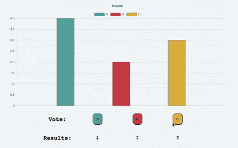

> [*跳转到 GitHub*](https://github.com/cooljasonmelton/poll-machine)

# 辅导的

## 目录

*   初级垃圾
*   HTML 和 CSS
*   投票按钮和结果文本的 JavaScript
*   应用 Chart.js
*   结论

## 初级垃圾

首先，我为我的 HTML、CSS 和 JavaScript 设置了一个文件。然后，我用 npm 安装了 Chart.js:

```
npm install chart.js --save
```

我最终得到了这样一个文件结构(减去`poll-machine-demo.gif`):

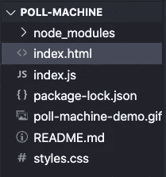

## HTML 和 CSS

我在`index.html`中为这个项目设置了骨骼。

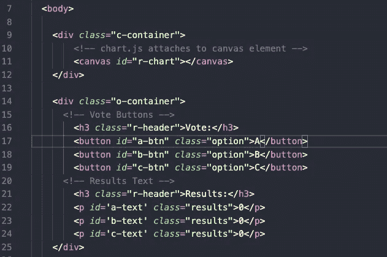

当然，我连接了我的样式表、JavaScript 文件和 Chart.js 节点模块。

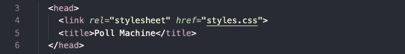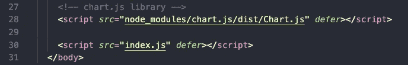

我添加了 CSS 来使按钮和文本正确显示。我添加了一些颜色，空白，填充，并把所有的东西放在一个网格里。我不打算详细说明，但是你可以在这里找到 CSS。

## 投票按钮和结果文本的 JavaScript

计数器按钮的 HTML 和 CSS 看起来不错，我开始研究它们的功能。

首先，我根据类名抓取了所有的按钮和文本节点。

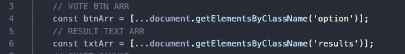

> *使用* `*.getElementsByClassName()*` *返回一个* `*HTMLCollection*` *类型。这些类似于一个数组，但是为了使用类似* `*map()*` *的数组方法，我必须使用 spread 运算符(* `*...*` *)将* `*HTMLCollection*` *复制到一个新的数组中。*

我为每个按钮设置了初始投票数:

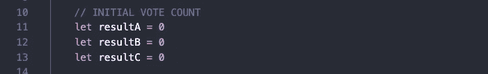

用数组中的按钮，我可以映射它们，并给它们每个一个事件监听器。无论何时，点击一个按钮，它将运行`updateVote()`

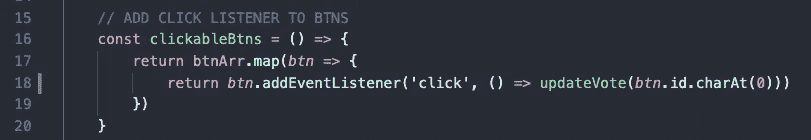

做所有的工作。它的参数是按钮 id 的第一个字符(`charAt(0)`)。这将是`'a'`、`'b'`或`'c'`。它将正确的结果变量加 1。

接下来，我映射我的结果文本。这些是我存储在`txtArr`中的段落元素数组。我映射这个数组来显示每个元素的正确结果。

最后，我更新了图表。我将在下一节讨论这个问题。

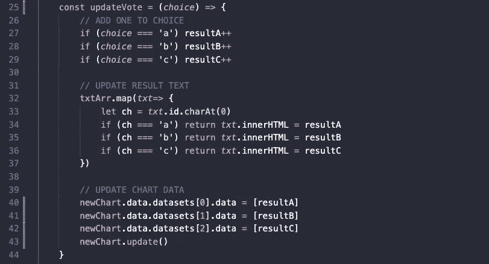

## 应用 Chart.js

Chart.js 必须应用于一个`canvas`元素。我从 HTML 中抓取画布元素。

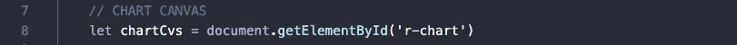

接下来，我通过调用`new Chart`来制作图表。

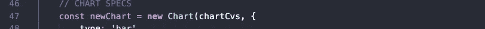

`new Chart`使用画布元素`chartCvs`作为第一个参数。对于第二个参数，它采用一个包含所有图表规范的对象:

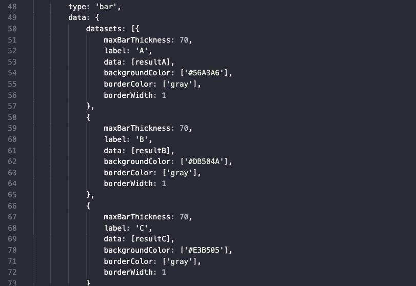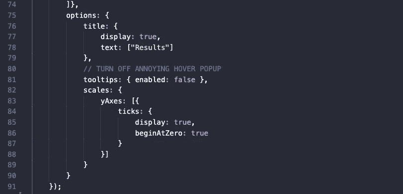

对象的三个主键是`type`、`data`和`options`。

`type`控制图形的类型。Chart.js 给出了很多很好的选项。为此，我使用了一个简单的条形图，提供了值`'bar’`。

根据您制作的图形类型，添加的`data`会有所不同。对于每个条形，我给出了条形的颜色和样式的信息，以及与每个字母 A、B 或 c 相关的数据和标签。

最后，对于选项，我创建了一个标题，关闭了工具提示(一个我不喜欢的悬停框)，并为 y 轴上的刻度添加了标签和记号。

## 结论

Chart.js 的图形显示得非常好，细节清晰，过渡平滑。让一切正常运转对我来说需要一点学习过程。出于这个原因，我对这个项目进行了大量的硬编码。如果让我重做，我会对这些内容进行大量抽象，并探索 Chart.js 提供的更多内容。您可以对图表应用更多的自定义。

如果您有任何反馈，请给我发消息。我喜欢任何改进我的博客，当然，还有“民意测验机器”的建议或想法。请评论或随时给我发电子邮件`jason.melton2@gmail.com`。

最好的，杰森