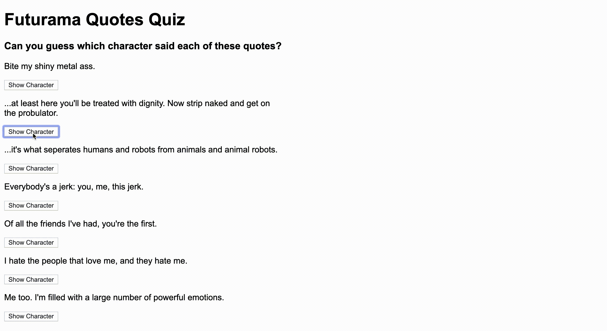
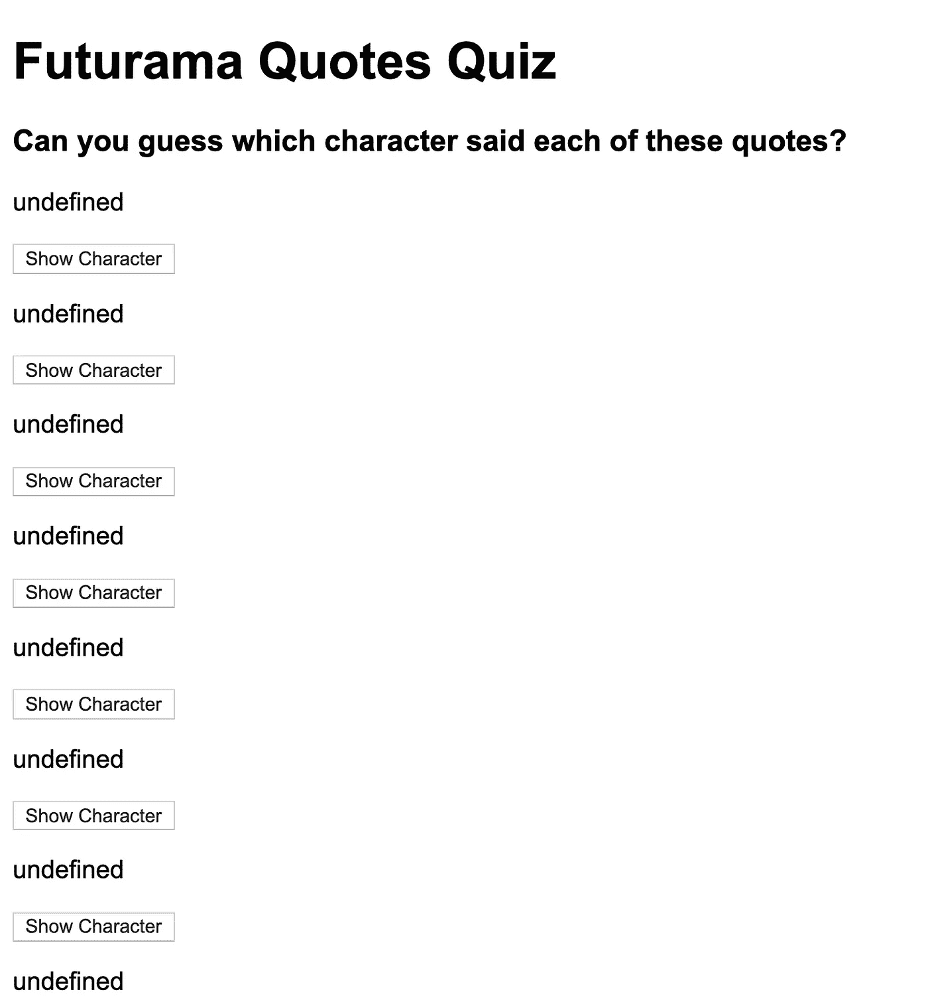
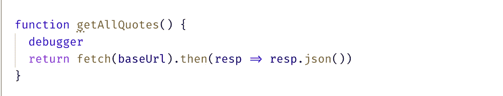
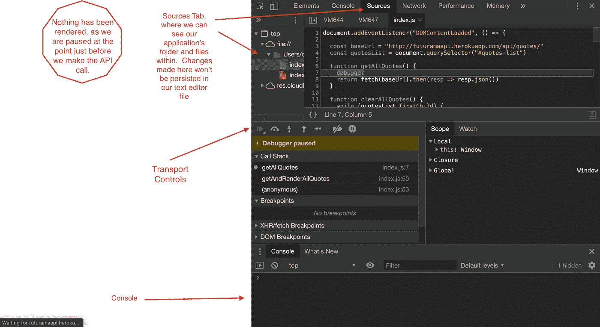
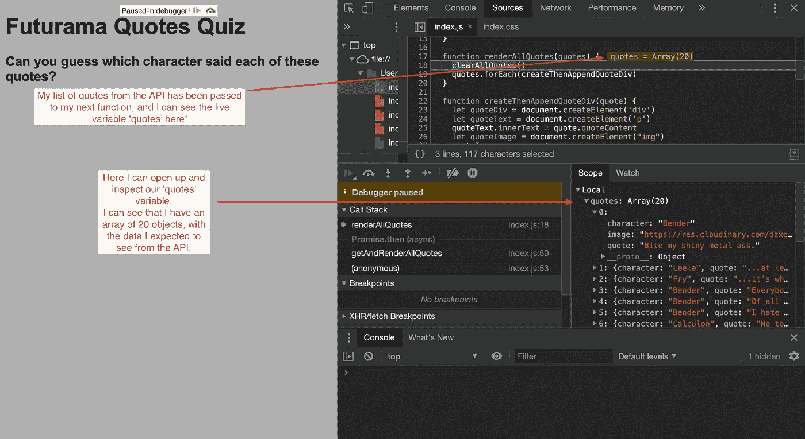
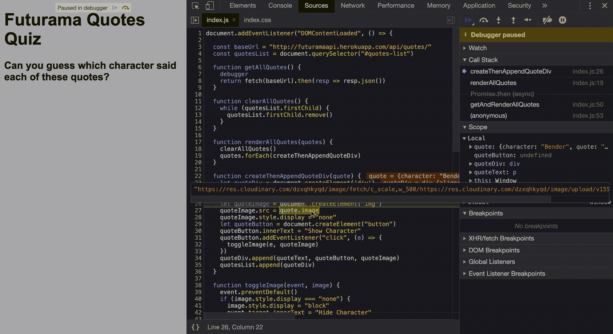
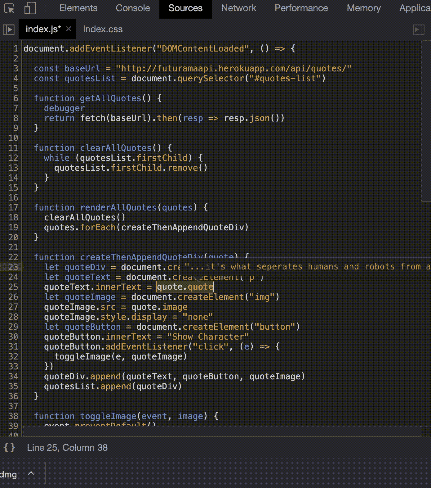
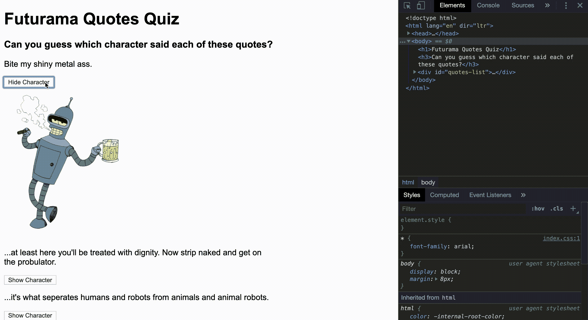

# 在 Javascript 中使用调试器

> 原文：<https://javascript.plainenglish.io/using-debugger-in-javascript-e5947aa528ca?source=collection_archive---------8----------------------->

## 放慢时间，找出那些虫子藏在哪里。

A monster chewing a computer keyboard.

使用 debugger 关键字和 Chrome 的 dev tools 面板，我们可以按照自己的步调一步一步地检查代码，查看每一个角落，寻找那些讨厌的 bug。

让我们看一个有一些 bug 的项目，并试着识别它们。

这里我有一个 Futurama 报价测验，使用的是 Futurama API。一句引语呈现在页面上，我们应该猜猜这句引语是哪个角色说的。我们有一个按钮，我们可以按下，这将显示字符，所以我们可以检查我们的答案！



但是目前已经坏了！



这是使用 debugger 关键字的绝佳机会！通过查看页面上所有未定义的内容，我担心 API 调用可能会以某种方式出错，所以我将从在调用 API 的函数中添加 debugger 关键字开始。



现在我将刷新浏览器页面，并打开 Chrome 开发工具。在这里，我可以访问控制台、HTML 元素和 sources 选项卡。还有很多开发工具，我不会在这里介绍，但我们将主要使用控制台和源代码选项卡。如果我单击 sources 选项卡，我可以看到我的项目文件夹，包括我的。js 文档，现在，我可以看到我放置 debugger 关键字的那一行。



通过导航到传输控件，我可以恢复、进入下一个函数、后退一个函数、逐行执行、激活/停用断点或暂停异常。

对于这个例子，我将单步执行函数调用 getAllQuotes()，看看会发生什么…在几个步骤之后，调试器跳到我的下一个函数调用:renderAllQuotes()。

```
function getAndRenderAllQuotes() {
    getAllQuotes()          <----- calls the API
    .then(renderAllQuotes)  <----- renders the quotes to the page
    .catch(error =>   alert(error.message))
  }
```

这告诉我，API 获取请求似乎没有问题。如果我查看范围，我可以看到来自 Futurama API 的响应:一个由 20 个 quote 对象组成的数组:所以 API 调用是正常的！



我可以继续单步执行我的代码，查看范围窗格寻找线索。当我逐步执行 createThenAppendQuoteDiv 函数时，我注意到创建了每个元素，然后附加了引号中的一个属性。例如，在第 27 行创建了图像元素，当 src 附加到第 28 行时，我可以看到图像元素中反映的信息。如果我以这种方式检查每个元素，我会注意到第 25 行的 quoteText 元素没有我期望的内容。上面写着“未定义”。这可能是我们问题的根源！



仔细一看，我看到 quoteText.innerText 被设置为 quote 对象的键“quoteContent”的值…不幸的是，如果我检查 quote 对象的键，我可以看到“quote”，但看不到“quoteContent”。我将“quoteContent”改为“quote ”,我注意到调试器显示的不是 undefined，而是引用文本的值！



现在，我将在我的文本编辑器中对第 25 行进行修改，从我的文件中删除 debugger 关键字并再次刷新。希望这个测验能成功！



是啊！测验又开始了！我现在可以从我的文件中删除调试器关键字了。

希望这突出了一种方式，我们可以使用 debugger 关键字来真正减慢我们的代码，并减慢我们自己来查看每个元素，看看问题在哪里。

如果你觉得这篇文章有帮助，请鼓掌，并在评论区添加任何问题:)