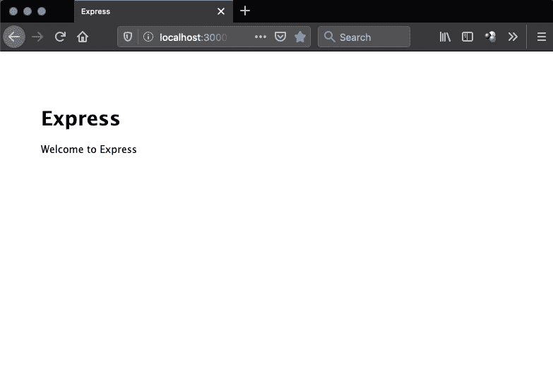

# 将 ES6 用于运行在 Express 上的 Node.js 应用程序，使用 Babel

> 原文：<https://javascript.plainenglish.io/using-es6-for-your-backend-nodejs-application-running-on-express-using-babel-5503bded9842?source=collection_archive---------0----------------------->

我们都喜欢 **ES6** 语法，我们一直在 react 和其他框架上构建的前端应用程序中使用它。
如果我们的**后端** **nodejs** 应用程序能够使用 ES6 语法就好了。
非常**容易**到**设置**和漂亮**直截了当**。我们将使用使用 **express-generator** 创建的现有项目，然后添加 **babel 编译器**以使用 es6 语法。

什么是[巴别塔](https://babeljs.io/)？是一个**编译器**将我们的 es6 代码**编译成 nodejs 可理解的代码**。想了解更多关于巴别塔的信息，请去 https://babeljs.io/

对于那些直接想看代码的人，去这里[https://github.com/tushartuteja/es6-sample-babel-nodejs](https://github.com/tushartuteja/es6-sample-babel-nodejs)

我们将做以下事情。

1.  我们将使用 express-generator 创建一个后端应用程序。
2.  添加 babel 依赖项和。 *babelrc* 文件。
3.  修改 *package.json* 看看是否一切正常。
4.  将一个文件改为 es6 语法。

# 第 1 部分:**创建**一个示例应用程序

我们将使用以下命令。截图跟随。

```
express sampleApp
cd sampleApp
npm install
npm start
```


Generating a sample app using express generator


Running npm install and npm start



A sample application running default route ‘/’

# 第 2 部分:添加巴别塔。

我们将添加 babel 作为开发依赖，我们需要添加三个包到我们的项目。

```
npm install --save-dev babel-cli babel-preset-env rimraf
```

我们添加了以下包

1.  使用 babel 的命令行工具。
2.  要使用的预置。babel 编译我们代码的一套规则。
3.  rimraf:一个清理我们的 dist 文件夹的包。

现在需要创建一个新文件*。babelrc，它包含以下*

```
{"presets": ["env"]}
```

# 第 3 部分:修改 package.json

添加了构建脚本和启动脚本


**启动脚本**现在**首先构建**项目，然后运行相同的命令(bin/www)但是在 **dist** 文件夹之外，dist 基本上是**发行版**的简称。将被分发(部署)的代码。

**构建**脚本**首先清除**dist 文件夹(任何陈旧文件),然后**使用 babel** 编译整个代码。

现在让我们检查一下这个项目是否仍然有效。


Running npm start after adding babel to the project.


Still works, we didn’t break anything.

# 第 4 部分:修改现有文件(index.js)

该文件如下所示，在 app.js 中是必需的，附加了这两个文件。

现在让我们修改 index.js 文件。

Modified file using ES6 syntax.

有 use import 语句和 export default router 语句，其余代码相同。这是我们这里的 es6 语法。

在 app.js 中，我们做了以下更改:

```
import index from './routes/index';app.use('/', index);
```

之前的这些行是:

```
var indexRouter = require('./routes/index');app.use('/', indexRouter);
```

让我们检查一下我们的 es6 语法现在是否有效。


**瞧，成功了！**