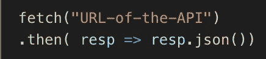

# 在 JavaScript 中使用 Fetch

> 原文：<https://javascript.plainenglish.io/using-fetch-in-javascript-c22f0c426753?source=collection_archive---------1----------------------->

## 学习 JavaScript 中的 Fetch 可能有点难，但是当你继续学习用 JavaScript 编码时，它绝对是至关重要的。

# Fetch 就像给数据库写一封信——您只需要通知数据库您想要接收什么信息。

在这篇文章的剩余部分，我将假设一个 API 的数据库。

Obligatory Mean Girls Gif

Fetch 可用于与 API(应用程序编程接口)联系和交互，通常用于检索数据(至少在您开始使用它们时)。一旦您开始创建自己的 API，您将能够添加、编辑或删除 API。然而，大多数可以免费使用的 API 都不允许操纵(你希望有人操纵你的数据吗？！).

为了理解 fetch，您需要理解 fetch 为我们提供的 4 种类型的请求:

1.  “GET”请求用于告诉 API“嘿，我想从您这里获得一些信息！”
2.  “POST”请求告诉 API“我有一段数据想附加给你”
3.  “修补/上传”请求告诉 API“我需要编辑一些关于数据的信息”
4.  “删除”请求确切地告诉 API 它听起来像什么——我们想要删除一段数据。

Fetch 是一个接受两个参数的 Javascript 函数。第一个参数是一个字符串化的 URL，第二个参数是一个可选参数，它将包含关于您的请求的信息。如果您只想从 API 中检索数据，那么您不需要使用第二个参数，因为 Javascript 会自动期待一个“GET”请求。

A fetch request to get data from an API

**承诺！！**

成功的获取请求总是会返回一个承诺。太棒了，因为我们喜欢承诺！但是，fetch 发的第一个承诺真的真的很丑。因此，我们几乎总是需要将它解析成我们的 Javascript 可以阅读的东西。在学习使用 fetch 请求时，您可以可靠地假设，您将总是用一个. then 语句跟踪 fetch 请求，特别是。然后声明如下。

这只是将第一个返回的承诺解析成 JSON，我们现在可以使用它了。然而，当我们呼唤。json()对一个承诺的响应，猜猜我们得到了什么？？又一个承诺！但是现在我们实际上可以使用下一个承诺。

所以现在，如果我们 console.log 来自承诺的数据，我们就能够查看从 API 返回给我们的内容。

**完整示例**

对于这个例子，我快速构建了一个 Rails API，并通过我的本地服务器来显示信息。

Above is API data on a local server that I can append to

A “GET” fetch request from the API URL. Then console logging the data

The console logged data that was fetched from the API

**用 Fetch 添加到 API**

如果我们使用“POST”请求，我们就能够向 API 添加数据。为了发布到 API，我们现在需要在原始获取请求中包含第二个参数，它将是一个对象。该对象将包含重要信息。下面，您可以看到我的 configObj 有三个键值对。第一个是我们发送到后端的请求类型，在本例中是 post。第二个键-值对是我们的头，它告诉应用程序我们正在发送什么类型的数据内容，以及我们将接受什么类型的数据作为回报。第三对 KV 是我们的身体，它是从数据中提取的。请注意，在上面的 API 图像中，“name”、“image”和“likes”是我们的 API 的非主键。

创建 configObj 后，我们可以将其作为 fetch 请求中的第二个参数添加进来。在 fetch 请求返回数据后，我们将接受带有 then 响应的承诺，并将信息解析到 JSON。后来。json()将返回另一个我们现在可以使用的承诺。

**用 fetch 编辑 API**

您可以通过发送“补丁”或“上传”请求来编辑 API，这本质上是一回事。如果你有兴趣了解更多关于 PUT 和 PATCH 之间的区别，我会鼓励你阅读 Segun Ola 的这篇博文—[https://medium . com/backticks-tildes/restful-API-design-PUT-vs-PATCH-4a 061 aa 3 ed0 b](https://medium.com/backticks-tildes/restful-api-design-put-vs-patch-4a061aa3ed0b)。我将使用 PATCH，因为我想对数据库做一些小的更改。如果我想做重大的改变，那么我会使用 PUT。

下面，您可以看到使用 fetch with PATCH 的示例。请注意，虽然语法与我上面展示的帖子不同，但这仍然完全有效(但非常难看！)代码。这一次，我没有将数据抽象到不同的变量中，而是将数据直接插入到获取请求中。

关于补丁请求，有几件事非常重要。首先，URL 不会是静态的——这意味着，因为我们想要编辑单个玩具，所以我们需要指定要编辑哪个玩具。你可以看到我已经将 toyId 插入到我的 URL 中。如果我想指定我想编辑我的第一个玩具的喜欢数，我会指定 toyId = 1，newLikes =我希望我的玩具拥有的喜欢数。你可以在上面的 API 里看到，伍迪是第一个玩具，有 5 个赞。我现在已经编辑了 Woody 的赞数等于 100。

**用 fetch 删除一个项目**

删除一个条目比写一个帖子或补丁更容易。您仍然需要将第二个参数传递到 fetch 请求中，但是因为您正在删除一个项目，所以您不期望从 API 获得任何信息。所以你的第二个参数可以简单地是:{ method:“DELETE”}。但是，您仍然需要告诉服务器您想要删除哪个玩具。

起初，获取可能令人困惑和沮丧，但是请记住，一旦掌握了窍门，获取和操作数据是一件非常有趣的事情！如果你想成为一名前端开发人员，你需要擅长从后端获取数据。

Obligatory Mean Girls Gif