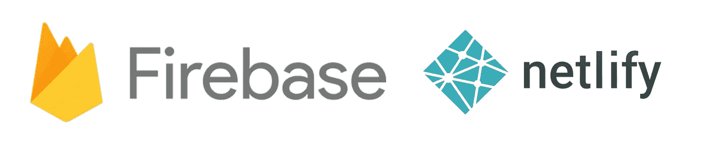

# 使用 Firebase Admin SDK 和 Netlify Lambda 函数

> 原文：<https://javascript.plainenglish.io/using-firebase-admin-sdk-with-netlify-lambda-functions-403bcea3f6e1?source=collection_archive---------10----------------------->



我最近一直在学习用 Nuxt 和 Firebase 开发应用程序。这些都是非常简单的应用程序，处理用户认证和创建/读取数据。然而，我最近遇到了这样一种情况，我需要向第三方服务发出请求，并将其写回数据库。你可以在 Firebase 函数中这样做，但是这需要你注册一个付费的计划——我还没准备好。

进入 Netlify Lambda Functions，在免费计划中你会得到大量的资源，它允许你向第三方发送请求。本文旨在介绍一个非常基本的网络功能设置，以及如何与 Firebase 通信。

以下文章涵盖了以下内容:

1.  [设置结构](https://jackwhiting.co.uk/posts/using-firebase-admin-sdk-with-netlify-lambda-functions/#structure)
2.  [集成 Firebase Admin SDK](https://jackwhiting.co.uk/posts/using-firebase-admin-sdk-with-netlify-lambda-functions/#firebase)
3.  [配置您的网络部署](https://jackwhiting.co.uk/posts/using-firebase-admin-sdk-with-netlify-lambda-functions/#netlify)
4.  [部署到网络生活](https://jackwhiting.co.uk/posts/using-firebase-admin-sdk-with-netlify-lambda-functions/#deploy)

# 项目结构

我们将为这个演示使用一个非常简单的项目结构，它没有前端，只用于部署功能。这些文件可以很容易地转移到您的工作目录，设置将保持不变。

该结构看起来有点像下面这样:

首先，在本地机器上创建一个新目录。在目录中，我们需要创建几个文件夹。

首先，functions 文件夹是存放你想在 Netlify 上运行的任何函数的地方。

接下来，让我们为该函数创建一个目录，该目录应该被命名为您希望从其访问端点 URL 的任何名称。对于这个演示，我们将把这个测试命名为**测试**。我们还需要两个文件，一个与文件夹同名的 JavaScript 文件(这将是 Netlify 试图访问的内容)和一个 package.json 来包含我们所有的需求。

像这样创建文件夹和文件:

```
mkdir functions/test cd functions/test touch package.json touch test.js
```

使用以下内容更新 package.json:

这是您尝试和运行任何功能(您将使用 npm 包)所需的基本框架。如果不打算使用任何 npm 包，可以不添加 package.json。

# 使用 Firebase 管理

现在是有趣的部分，让函数与 Firebase Admin SDK 通信。下面的例子将以一个非常基本的文档创建为特色，来展示一切是如何工作的，在你的实际函数中，你可能会做得更好。

在我们的`functions/test`中添加 Firebase Admin SDK，就像这样:

```
yarn add firebase-admin
```

这会将以下内容添加到您的`package.json`

然后我们可以在我们的`test.js`文件中调用它，方法是在文档的顶部声明它

## Firebase 管理员身份验证

要真正连接到 Firebase，我们需要对帐户进行身份验证，这需要从 Firebase 生成一个身份验证文件。这个文件应该保持**私有**并且永远不要上传到公共的 Git 仓库。

要生成身份验证文件，请按照下列步骤操作:

1.  在 https://console.firebase.google.com[登录谷歌控制台](https://console.firebase.google.com)
2.  单击要使用 Admin SDK 的项目，或者创建一个新项目。
3.  转到项目设置。
4.  点击**服务账户**标签。
5.  点击 **Firebase Admin SDK** 。
6.  在该选项卡上，您将看到“Admin SDK 配置片段”。勾选 **node.js** 选项，点击**生成新私钥**
7.  应该会弹出一个模态，再次点击**“生成密钥”**，将会下载一个 JSON 文件。
8.  将 JSON 文件移动到项目结构的`functions/test`文件夹中，并将其重命名为`serviceAccountKey.json`。
9.  更新你的`.gitignore`，如果你有的话，确保这个文件不会被跟踪。

## 写我们的剧本

为了将所有的东西放在一起，并将 Firebase Admin SDK 与我们的脚本集成，我们还需要设置一些东西。

首先，我们需要配置脚本来用我们的 firebase 凭证验证 Admin SDK。为此，用以下内容更新我们的`test.js`文件:

用你的应用程序的实际 URL 更新`<YOUR-APP-URL>`。如果你不知道这一点，可以在 Firebase 控制台中看到。

接下来，我们将编写一个小脚本，向 Firestore 数据库添加一条新记录，并在完成后返回一条消息。为了确保数据在响应返回之前得到处理，我们将利用`async/await`。请参见下面的示例:

不要忘记用您想要添加记录的集合的名称来更新`COLLECTION`占位符。如果您纯粹是测试，您可以在这里使用`test`。完整的代码看起来有点像这样:

# 网络配置

为了确保将它部署到 Netlify 时一切正常，我们需要进行一些配置，并在我们的主站点目录中安装一个依赖项。在根文件夹中，如果你没有一个`package.json`，用下面的命令创建一个。如果你已经有了一个`package.json`，你可以忽略这一步

Netlify 要求你为我们创建的每个函数运行`npm install`或`yarn install`，这是因为我们设置了文件来保存每个文件夹中的内容。为此，我们可以在我们的`package.json`中创建一个简单的脚本，并告诉 Netlify 在部署时使用它。使用以下内容更新 package.json:

注意，这将`cd`到我们创建的`functions/test`文件夹中，然后运行`yarn install`来下载我们所有的依赖项(在这种情况下只是 Firebase Admin SDK)。

## 网络配置

为了告诉 Netlify 运行这个命令，我们需要创建或更新一个`netlify.toml`文件。使用以下内容在根目录中创建一个新文件:

在文件中添加以下内容。

这将告诉 Netlify,`functions`文件夹包含我们已经设置的所有函数(在这种情况下只有**测试**),并且我们希望在初始部署时运行`yarn functions`命令，这将下载所有资产。

如果您的存储库中已经有代码，比如 react 应用程序，您可能需要同时查看[和](https://www.npmjs.com/package/concurrently)，这将允许您运行多个命令。

## 节点环境

Firebase Admin SDK 需要节点 v10 才能工作。默认情况下，Netlify Lambda 在节点 v8 上运行，因此我们需要添加一个环境文件，告诉 Netlify 在 Lambda 实例上使用 v10。要设置变量，您需要执行以下操作:

1.  登录[网络控制台](https://app.netlify.com/)。点击进入(或创建)您想要的站点。
2.  点击进入**设置**选项卡。
3.  点击侧边栏中的**构建&部署**。
4.  点击**构建&部署**选项卡下的**环境**。
5.  点击**编辑变量。**
6.  添加值为`nodejs10.x`的以下键`AWS_LAMBDA_JS_RUNTIME`
7.  救援

# 部署您的代码

提交所有内容并将代码推送到您首选的提供商。如果您将 Netlify 设置为 auto-deploy，那么所有的事情都将被处理，并且您的函数将在部署后创建。你可以通过进入**网络控制台**中的**功能**选项卡来查看这些。

如果您单击 Netlify 控制台中的`test.js`功能，它将为您提供一个端点 URL，您可以在浏览器中访问该 URL 来测试一切是否正常，以及您的 Firebase DB 是否得到更新。

*原载于*[](https://jackwhiting.co.uk/posts/using-firebase-admin-sdk-with-netlify-lambda-functions/)**。**