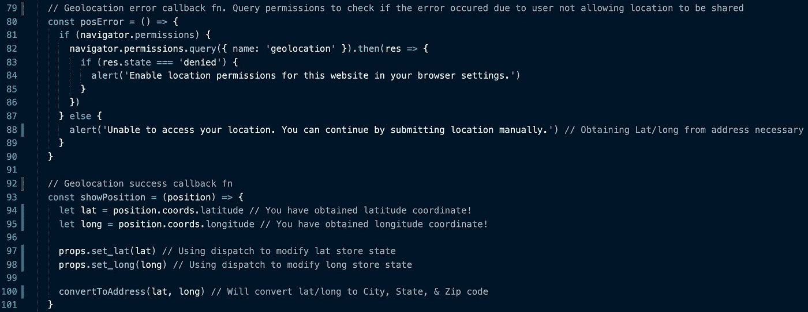
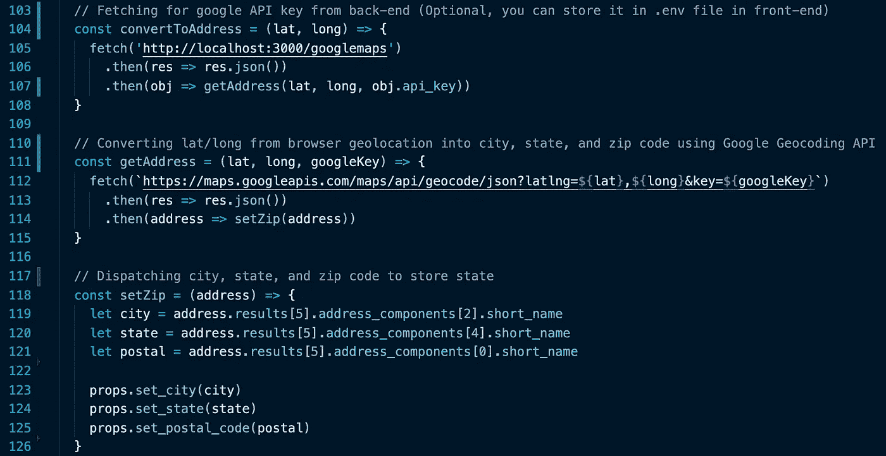
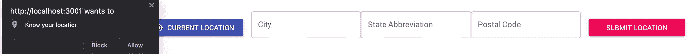
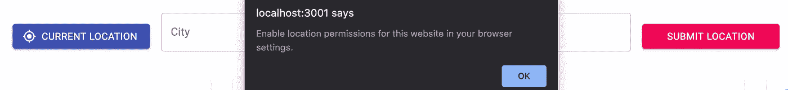
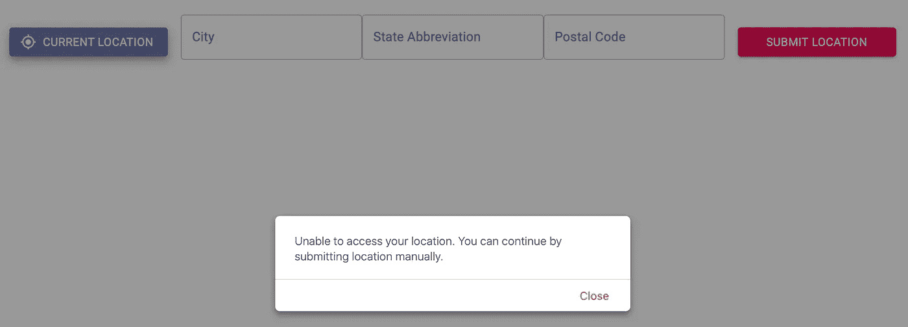
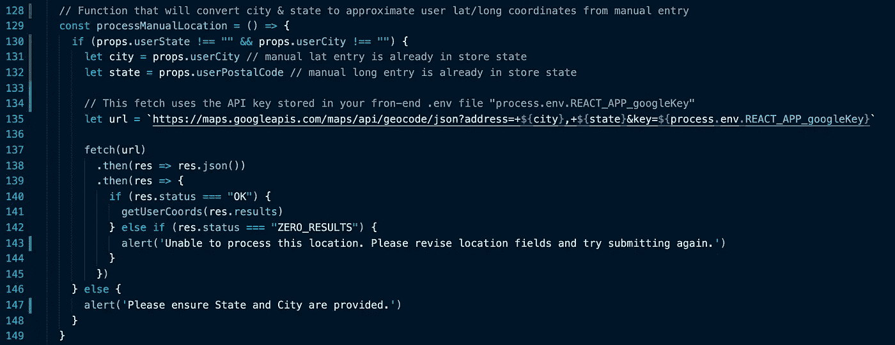
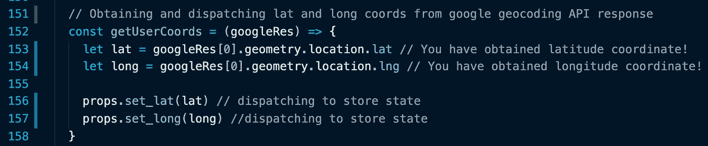
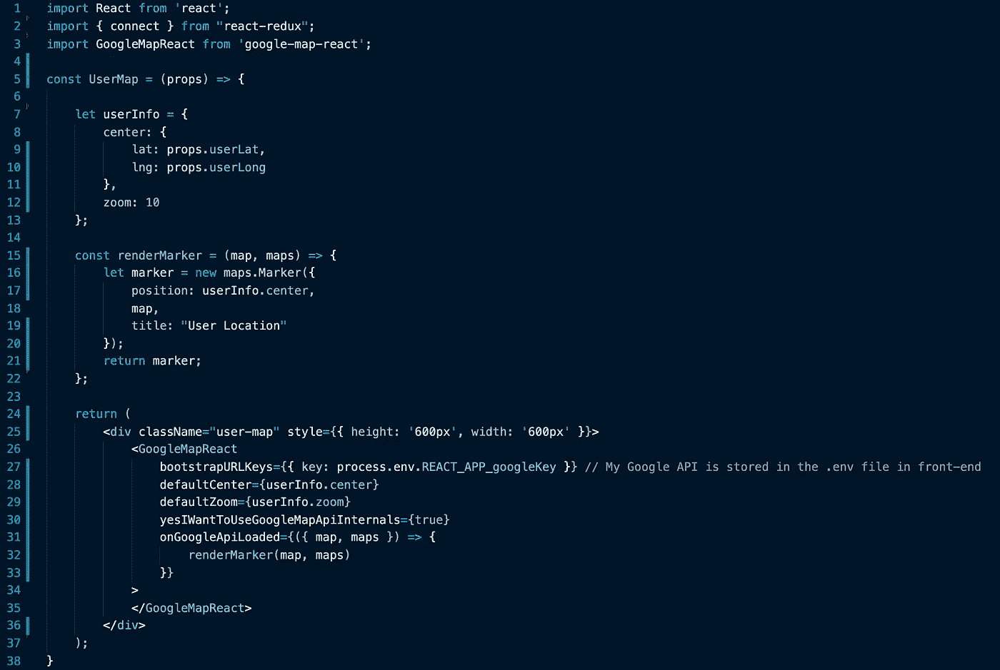
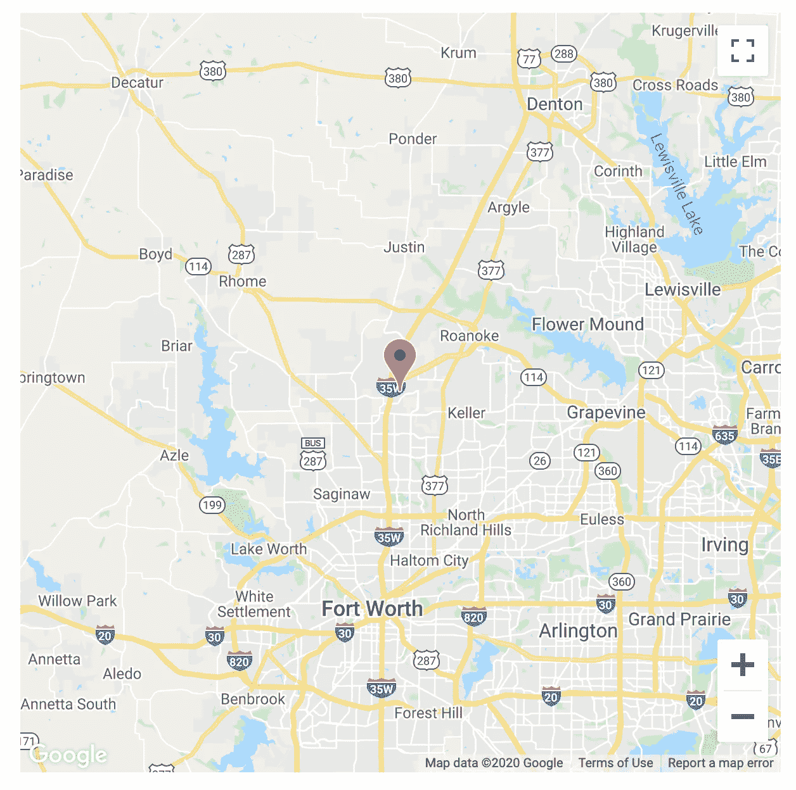

# React-Redux 中使用地理定位在 Google Maps 上定位用户

> 原文：<https://javascript.plainenglish.io/using-geolocation-to-a-locate-a-user-on-google-maps-in-react-redux-4dc33a34bf2e?source=collection_archive---------3----------------------->

这个博客将教你如何获得用户的大概坐标，并在 GoogleMapReact 地图上标记出来。

## 步骤概述:

*   获取一个 [Google API 密钥](https://developers.google.com/maps/documentation/javascript/get-api-key)。
*   **获取用户的坐标。**这篇博客将向你展示实现这一目标的两种不同方式。 ***选项 1 是使用内置的***[***Google Chrome 地理定位***](https://developer.mozilla.org/en-US/docs/Web/API/Geolocation/getCurrentPosition) 和 ***选项 2 是利用*** [***Google 的地理编码 API***](https://developers.google.com/maps/documentation/geocoding/overview?hl=en_US) (针对可能不支持第一种方法的浏览器或选择不通过浏览器处理其位置的用户。)
*   将[地理编码 AP](https://developers.google.com/maps/documentation/geocoding/overview?hl=en_US) I 添加到项目的 API 列表中。这个 API 将允许您通过将一个地址或城市&状态(最低限度)转换成近似的纬度&经度坐标来获得用户坐标。
*   安装[‘谷歌地图反应’](https://github.com/google-map-react/google-map-react)
*   使用用户的位置标记渲染地图。

本教程将有代码片段和复制粘贴友好的代码位于最后。🔥


Current Location button will handle browser geolocation (Option 1). Submit Location will handle manual submission (Option 2).

## **选项 1。使用 Google Chrome 地理定位方法:**

您需要知道的第一件事是，位置只能在用户事件后由浏览器收集。这意味着您需要在用户允许浏览器这样做之后触发这个函数。对于这个例子，我们将在一个简单的表单上点击一个按钮。

“当前位置”按钮有以下事件监听器

```
onClick={() => getPosition()}
```

第一个功能是事件链如下:


此函数使用 navigator . geolocation . getcurrentposition 来处理您的位置。它接受一个成功回调函数、一个错误回调函数和一个选项参数(我选择不使用它)。下面是成功和错误回调。



函数 convertToAddress 是可选的，它已包含在下面。该函数将使用 google API 键将您的经纬度坐标转换为城市、州和邮政编码。它使用 Google API 密钥和 [Google 地理编码 API](https://developers.google.com/maps/documentation/geocoding/overview?hl=en_US) 。对于这个例子，我已经从后端获取了 API 键。



Browser geolocation combined with Google’s Geocoding API were used to populate the 3 fields above.


State containing Lat & Long coordinates, City, State, and ZipCode/PostalCode.

此时，你应该可以通过谷歌浏览器访问经纬度坐标。



User elects to “Block” location sharing.



Browser cannot process a location that has not been shared.



Browser does not support geolocation processing.

如果由于用户选择不与浏览器共享他们的位置或者浏览器不支持地理定位处理而导致您无法访问纬度和经度坐标，该怎么办？选项 2。

## 选项 2。使用谷歌的地理编码 API:

我们将使用用户在下面的表单中输入的城市和州，将它们转换成表单提交上的经度和纬度坐标。


User has entered a location (Postal Code is not necessary)

“提交位置”按钮有以下事件监听器

```
onClick={() => processManualLocation()}
```

第一个功能是事件链如下:



该函数使用城市和州的手动条目以及存储在。前端的 env 文件。您可以在获取 url 中包含完整的街道地址，Google 地理编码响应的位置会更准确。对于这个特定的用例，城市和州就足够了。如果 google 地理编码 API 响应状态为“OK”，此函数将调用链中的下一个函数:



在链中的最后一个函数运行之后，您应该可以访问用户的大概纬度和经度坐标。


State containing Lat & Long coordinates, City, State, and ZipCode/PostalCode.

现在我们有了用户坐标，让我们在 React-Redux 应用程序中将它们映射到 Google Maps 上。我选择了使用“谷歌地图反应”。

## **使用用户标记创建“谷歌地图反应”地图:**

在您安装了[‘Google-map-react’](https://github.com/google-map-react/google-map-react)并获得用户坐标后，您将需要编写以下代码(或类似代码):



我没有评论这部分代码，因为理解它所需的知识是基本的 React-Redux。

地图应该是这样的:



Google Maps with a User Marker in my React-Redux app.

我希望你喜欢这个教程。如果有任何问题，请告诉我！

## **复制粘贴友好的代码和注释:**

**从 Google Chrome 地理位置获取纬度/经度、城市、州和邮政编码:**

```
// If browser supports navigator.geolocation, generate Lat/Long else let user know there is an errorconst getPosition = () => {if (navigator.geolocation) {navigator.geolocation.getCurrentPosition(showPosition, posError); // Passing in a success callback and an error callback fn} else {alert("Sorry, Geolocation is not supported by this browser."); // Alert is browser does not support geolocation}}// Geolocation error callback fn. Query permissions to check if the error occured due to user not allowing location to be sharedconst posError = () => {if (navigator.permissions) {navigator.permissions.query({ name: 'geolocation' }).then(res => {if (res.state === 'denied') {alert('Enable location permissions for this website in your browser settings.')}})} else {alert('Unable to access your location. You can continue by submitting location manually.') // Obtaining Lat/long from address necessary}}// Geolocation success callback fnconst showPosition = (position) => {let lat = position.coords.latitude // You have obtained latitude coordinate!let long = position.coords.longitude // You have obtained longitude coordinate!props.set_lat(lat) // Using dispatch to modify lat store stateprops.set_long(long) // Using dispatch to modify long store stateconvertToAddress(lat, long) // Will convert lat/long to City, State, & Zip code}// Fetching for google API key from back-end (Optional, you can store it in .env file in front-end)const convertToAddress = (lat, long) => {fetch('http://localhost:3000/googlemaps').then(res => res.json()).then(obj => getAddress(lat, long, obj.api_key))}// Converting lat/long from browser geolocation into city, state, and zip code using Google Geocoding APIconst getAddress = (lat, long, googleKey) => {fetch(`https://maps.googleapis.com/maps/api/geocode/json?latlng=${lat},${long}&key=${googleKey}`).then(res => res.json()).then(address => setZip(address))}// Dispatching city, state, and zip code to store stateconst setZip = (address) => {let city = address.results[5].address_components[2].short_namelet state = address.results[5].address_components[4].short_namelet postal = address.results[5].address_components[0].short_nameprops.set_city(city)props.set_state(state)props.set_postal_code(postal)}
```

**将城市和州手动条目转换为纬度/经度:**

```
// Function that will convert city & state to approximate user lat/long coordinates from manual entryconst processManualLocation = () => {if (props.userState !== "" && props.userCity !== "") {let city = props.userCity // manual lat entry is already in store statelet state = props.userPostalCode // manual long entry is already in store state// This fetch uses the API key stored in your fron-end .env file "process.env.REACT_APP_googleKey"let url = `https://maps.googleapis.com/maps/api/geocode/json?address=+${city},+${state}&key=${process.env.REACT_APP_googleKey}`fetch(url).then(res => res.json()).then(res => {if (res.status === "OK") {getUserCoords(res.results)} else if (res.status === "ZERO_RESULTS") {alert('Unable to process this location. Please revise location fields and try submitting again.')}})} else {alert('Please ensure State and City are provided.')}}// Obtaining and dispatching lat and long coords from google geocoding API responseconst getUserCoords = (googleRes) => {let lat = googleRes[0].geometry.location.lat // You have obtained latitude coordinate!let long = googleRes[0].geometry.location.lng // You have obtained longitude coordinate!props.set_lat(lat) // dispatching to store stateprops.set_long(long) //dispatching to store state}
```

**完整的“谷歌地图反应”代码:**

```
import React from 'react';import { connect } from "react-redux";import GoogleMapReact from 'google-map-react';const UserMap = (props) => {let userInfo = {center: {lat: props.userLat,lng: props.userLong},zoom: 10};const renderMarker = (map, maps) => {let marker = new maps.Marker({position: userInfo.center,map,title: "User Location"});return marker;};return (<div className="user-map" style={{ height: '600px', width: '600px' }}><GoogleMapReactbootstrapURLKeys={{ key: process.env.REACT_APP_googleKey }} // My Google API is stored in the .env file in front-enddefaultCenter={userInfo.center}defaultZoom={userInfo.zoom}yesIWantToUseGoogleMapApiInternals={true}onGoogleApiLoaded={({ map, maps }) => {renderMarker(map, maps)}}></GoogleMapReact></div>);}const mapStateToProps = (state) => {return {userLat: state.userState.userLat,userLong: state.userState.userLong,}}export default connect(mapStateToProps)(UserMap);
```