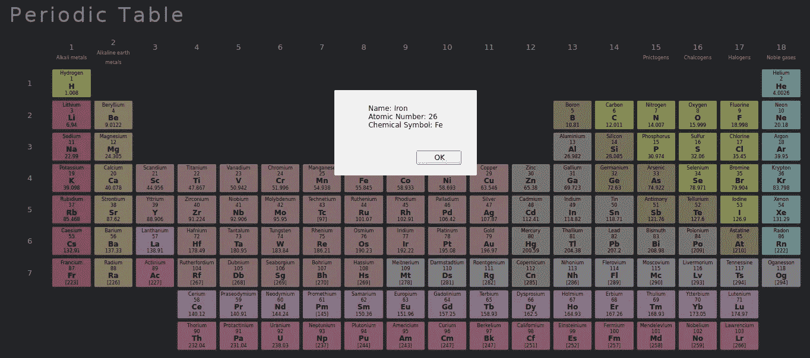

# 通过 JavaScript 使用 HTML5 数据属性

> 原文：<https://javascript.plainenglish.io/using-html5-data-attributes-with-javascript-f353696b9d0e?source=collection_archive---------5----------------------->


Image: [Pixabay](https://pixabay.com/photos/earth-internet-globalisation-2254769/)

HTML5 让我们能够向元素添加任意的信息片段(称为数据属性),以便在后台用于任何目的，这里我将演示如何在 JavaScript 中使用它们。

我在我的[交互周期表](https://medium.com/javascript-in-plain-english/interactive-periodic-table-in-javascript-d7cf7177883a)中很好地利用了数据属性。关于这个主题有大量的信息，但通常是简单的或人为的例子，所以在这里我将介绍一个周期表的简化版本的实际应用。

您可以将自定义数据属性添加到元素中，方法是将它硬编码到 HTML 中，在名称前加上前缀`data-`，例如:

`<div id=”div1" data-manufacturer=”nikon” data-model=”d6">Nikon D6</div>`

在 JavaScript 中，您可以使用元素的`dataset`属性来读写元素的数据属性，该属性属于`DOMStringMap`类型，基本上是键/值对的集合。关键字是用于属性的名称，但是没有`data-`前缀，所以对于上面的例子，我们将使用`manufacturer`和`model`，如下所示。

```
const element = document.getElementById(“div1”);console.log(element.dataset.manufacturer); // nikon
console.log(element.dataset.model); // d6element.dataset.manufacturer = “canon”;
element.dataset.model = “EOS 90D”;
```

使用`querySelector`也很容易找到具有特定数据属性值的元素，例如:

`const element = document.querySelector(“[data-manufacturer=’nikon’][data-model=’d6']”);`

下面是这个例子中使用的简化周期表的截图。



如果你点击一个元素，一个警告会显示该元素的名称、原子序数和化学符号。您可能已经猜到了我们如何知道显示哪个元素的细节:使用它的数据属性。

*   在这篇文章中，我将不得不经常使用“元素”这个词。这很烦人，但是我会试着指出我指的是 HTML 元素还是一种原子，除非很明显。

## 该项目

这个项目由一个 HTML 文件、一个 JavaScript 文件和几个子文件组成，所有这些文件都在 [Github 库](https://github.com/CodeDrome/using-html5-data-attributes-with-javascript)中。

我不会展示所有的源代码，只展示与数据属性相关的部分。我在这个项目中使用过几次，但为了避免重复，我将只展示我们执行以下任务的地方:

*   在相应的(HTML)元素上设置(化学)元素的`data-atomicnumber`
*   通过(化学)元素的原子序数查找(HTML)元素来设置背景色
*   从点击的(HTML)元素中检索`data-atomicnumber`以显示(化学)元素的细节

为了填充该表，我们迭代一个元素列表，将每个元素添加到具有相应的`data-atomicnumber` 属性的表中。

`currentcell.setAttribute(‘data-atomicnumber’, element.atomicnumber);`

这里我用了`setAttribute`而不是`dataset.atomicnumber`,只是为了说明另一种选择。

填充完表格后，我们需要设置颜色来表示元素的类别。我们再次迭代数据，找到对应于每个元素的单元格，如下所示:

`const currentcell = document.querySelector(`[data-atomicnumber=’${element.atomicnumber}’]`);`

如上面尼康 D6 的例子所示，如果有必要，你可以使用多个选择器。在这个项目中，我们知道数据是静态的，所以我们总是会找到一个单元格，但如果不是这样，请记住检查 null 的返回值`querySelector`。此外，如果有多个匹配元素，您可能需要使用`querySelectorAll`。

最后，当一个元素被点击时，我们需要选择`data-atomicnumber`属性值。

`const element = this._periodictable.GetElement(target.dataset.atomicnumber);`

这里实际发生的是，我们调用代表所有化学元素的类的实例的`GetElement`方法，选择目标的`dataset.atomicnumber`(即被点击的 HTML 元素)作为方法参数。

因此，正如你所看到的，使用数据属性极大地简化了当我们需要对 HTML 元素做一些事情(比如设置它的颜色)时查找它的过程，也简化了当用户与它交互(比如点击它)时识别它的过程。

当我开始研究元素周期表的时候，很快我就明白了数据属性才是我要走的路。毫无疑问，还有其他方法来完成同样的事情，但我不知道是什么，因为我从来没有想过这件事！