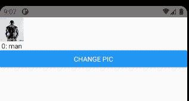
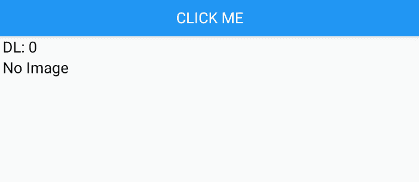

# 在 React Native 中使用图像

> 原文：<https://javascript.plainenglish.io/using-images-in-react-native-668e3a835858?source=collection_archive---------1----------------------->


Photo by [Alexander Andrews](https://unsplash.com/@alex_andrews?utm_source=medium&utm_medium=referral) on [Unsplash](https://unsplash.com?utm_source=medium&utm_medium=referral)

几个小时前，我正在编写一段 React 本机代码，这段代码需要从文件系统中导出动态图像。当然，我从 React 原生图像文档开始:[https://reactnative.dev/docs/image](https://reactnative.dev/docs/image)

React Native 有一些很棒的文档，所以读完这篇文章后，我觉得这应该是小菜一碟。

具体来说，我想做的是创建一个包含数据的 JSON 文件，并在该数据中创建一个包含图像信息的图像列表。我不知道有多少图像，或者有多少提前的数据。

在仔细阅读了 React 原生文档后，我意识到有几种方法可以包含图像，所有这些方法都非常简单明了。但是没有一个能让我不做额外的工作就直接从本地文件系统上的 JSON 中读取图像。

首先，是古老而经典的“要求”:

```
<Image style={{height: 50, width: 50}} source={require('./assets/images/photo1.jpg')} />
```

根据 React 本地文档，这有几个作用:

1.  这使用了 CommonJS 函数‘require ’, Metro 查找该函数以了解何时将照片放入我们的包中。它设置 Metro bundler(也称为打包程序或 Metro 服务器),根据“require”关键字的存在将文件 photo1.jpg 包含到包中。
2.  Metro 将资产(jpg 文件)转换成可以由组件显示的对象。
3.  Require 本身返回一个对象，该对象用作图像的源。
4.  这种情况下的对象是一个整数，Metro 在映像加载时将它解析到一个位置。

好吧，这个很简单。

虽然它不是很有活力。

这很好，因为每次使用新图像的代码更新都会自动将图像构建到捆绑器中，并传输到设备上。您不必担心文件系统路径或 uri 或任何类似的东西。更新代码中的图像，嘣，您就更新了包中的图像。

这将是很好的，如果我们有一个文件列表，像一个闪屏和其他一些资产，我们想显示。我们肯定不想下载它们，用户应该能够在安装后使用应用程序，没有额外的麻烦。

我们可以这样做，让它更有活力一点:

```
const DATA = [
{
   text: “man”,
   image: require(‘./assets/images/photo1.jpg’)
},
{
   text: “woman”,
   image: require(‘./assets/images/photo2.jpg’)
}
]
```

这将信息存储在一个数组中。请注意,“require”不是文本字符串。它仍然是一个将返回对象的已执行代码行——因此这个 JS 对象的 image 属性是另一个 JS 对象。

不相信我？记录图像属性的输出:

```
[Info] 12–24 06:02:42.359 27376 27440 I ReactNativeJS: 1[Info] 12–24 06:02:45.256 27376 27440 I ReactNativeJS: 2
```

这是对资产的引用，可以用来代替数据[0]。图像属性——可以直接设置`<Image source={1} />`。

现在，回到我们的应用程序，我们添加了以下代码:

这里发生了什么？

1.  第 1–10 行，我们创建了一个数据数组来保存我们的图像和文本。
2.  第 13 行—我们使用了反应状态机制来存储当前 imageVar 的状态。这将返回一个包含两个变量的数组—第一个变量是 imageVar，即当前图像。我们用 useState(0)函数初始化这个变量，将状态设置为 0。这是一个称为钩子的特殊函数，它允许您钩入 React 特性，向它添加状态。其次，它返回 setImageVar，这是一个用于访问状态和更改值的函数。这相当于一个 setattr。
3.  然后，在第 19 行，我们设置了一个 Image 组件，并将初始源指定为 DATA[imageVar].image 中的对象。image 属性是由“require”语句返回的对象——在本例中，是资产索引的一个 int。
4.  第 20 行对文本做了同样的事情。
5.  第 21 行设置了一个按钮组件—这个按钮使用前面返回的 setImageVar 函数来调整值。(显式地，如果 imageVar 与我们的数组大小相同，我们重置为 0，否则我们添加 1)

这里的神奇之处在于 React Native 仅重新呈现为提高性能而更改的组件。在这种情况下，React 状态的使用仅在状态已更改的组件(此处为图像和文本按钮)上触发重新呈现。把它想象成一个巨大的回调，说“我正在注册使用这个状态。当它发生变化时，我需要得到通知。”

同样，你仍然需要指定你加载到这个数组中的每一个图像，并在某个地方包含这个数组。没有任何东西会被自动拾取，因为它在某个目录中，但是不需要担心构建步骤，您在代码中需要的任何图像都会自动包含在您的包中。如果您需要更改图像，只需更改您的需求代码列表，新的图像将由图像组件拾取，而无需跟踪 10 个不同的位置。这对代码维护来说非常好。



好的，我们已经设法通过一个数组动态地加载图片，但是…我们必须指出一个问题。

仔细检查我们的数组，我们可以看到“image”属性仍然是一个对象——也就是说，Babel 仍然可以将这个“require”调用转换成一个 JavaScript 对象，确保图像被加载到静态资产中。

这与 JSON 文件的区别在于，JSON 文件需要对其数据进行转义。

```
const DATA = ‘{ “image1”: { “text”: “man”, “image”: “./assets/images/photo1.jpg” }, “image2”: { “text”:”woman”, “image”:”./assets/images/photo2.jpg” }}’;
```

这是一种混乱的说法…我们有一组名称\值对。

```
“image1”: { “text”: “man”, “photo”: “assets/images/photo2.jpg”}
```

请注意，我们已经删除了需求。requires 对我们没有帮助——JSON 是名称\值对，所以对于 Metro 打包程序来说，它看起来只是一个字符串。这意味着我们的文件不在系统中—它不再被打包。

我们需要想办法把那个文件放到系统里。

同时，让我们继续解析 JSON:

```
let parsedData = JSON.parse(DATA);
```

搞定了。现在我们可以简单地这样做:

```
console.log(parsedData.image1.text);
```

得到这样的回应:

```
[Info] 12-24 09:31:11.988 21250 22480 I ReactNativeJS: man
```

维奥拉。

将我们的图像组件更改为:

```
<Image style={{height: 50, width: 50}} source={parsedData[imageVar].image}/>
```

导致此错误:

```
[Info] 12-24 09:35:19.832 21250 22480 E ReactNativeJS: TypeError: undefined is not an object (evaluating 'parsedData[imageVar].image')
```

这是因为 source 属性应该是一个对象，相反，我们直接从 JSON 解析中传递一个字符串。(记住，源对象最终是一个指向资源索引的整数。)

要使用字符串，我们需要使用一种叫做 URI 的东西，或者“统一资源标识符”。你实际上一直都在使用这个——在你的网络浏览器中，这是你去“http://”时使用的。它告诉浏览器这是一个“http”类型。您可以尝试使用“file://”作为本地文件。

React Native 支持同样的东西。

首先，我们需要了解静态资源保存在哪里。要做到这一点，我们需要了解应用程序的基本文件系统。

让我们从古老的 react-native-fs 开始，这是访问 react-native 文件系统的正确方法:

```
npm ERR! Could not resolve dependency:
npm ERR! peer react-native@"^0.59.5" from react-native-fs@2.16.6
npm ERR! node_modules/react-native-fs
npm ERR!   react-native-fs@"*" from the root project
```

不对不对。嗯，看起来我们不能在 react 的最新版本中使用 react-native-fs 了。或者它需要更新。从问题页面，很难知道。

无论如何，我们将暂时转移到世博图书馆，稍后我们会看到原因，但现在让我们先把这个问题放一放:

为此，我们将转向 Expo 文件系统模块。除此之外，要在 React-Native 项目中安装它，您需要使用 unibrow 模块…我指的是 unimodules。[https://docs . Expo . io/versions/latest/SDK/file system/# supported-uri-schemes-1](https://docs.expo.io/versions/latest/sdk/filesystem/#supported-uri-schemes-1)

这看起来很吓人，但是很简单。一旦你这样做了，你的项目可能就不工作了。

我必须加载 Android studio，在那里重新链接项目，然后重启打包程序和我的 Android 模拟器，这与添加新包时发生的情况非常一致。

文件系统模块让我们可以访问一个调用— readDirectoryAsync()。

让我们用它来看看我们的文件系统中发生了什么:

这个简单的按钮可以嵌入到代码中的某个地方，并将返回如下输出:

```
[Info] 12–28 05:44:41.645 7127 10775 I ReactNativeJS: Reading :file:///data/user/0/com.uritest/files/[Info] 12–28 05:44:41.650 7127 10775 I ReactNativeJS: File: sonar12–28 05:44:41.650 7127 10775 I ReactNativeJS: File: ReactNativeDevBundle.js
```

哼。不是我们所期望的。

我本以为会有更多的资产——我的意思是，我们的代码中有下面一行:

```
const foo = require(‘./assets/images/photo1.jpg’);
```

好吧，好吧——让我们再深入挖掘一下。React Native 从哪里获得资产？

React 本机映像库包含以下调用:Image.resolveAssetSource()。

这个调用允许我们看到 bundler 中任何静态资产(在这个例子中是图像)背后的 URI。

让我们试一试:

```
const foo = require(‘./assets/images/photo1.jpg’);const fooURI = Image.resolveAssetSource(foo).uri;console.log(“FooURI: “ + fooURI);
```

打印输出:

```
[Info] 12–28 05:54:20.289 7127 10775 I ReactNativeJS: FooURI: [http://10.0.2.2:8081/assets/assets/images/photo1.jpg?platform=android&hash=25052dcebf6333bef4fa5c380130eccd](http://10.0.2.2:8081/assets/assets/images/photo1.jpg?platform=android&hash=25052dcebf6333bef4fa5c380130eccd)
```

这很有道理。这是一个模拟器，而不是一个已发布的应用程序，可以随时部署。在部署中，这将解析到本地资源，但在开发中，我们希望能够快速改变事情。所以一切都在本地 web 服务器上解决，这解释了为什么本地文件系统是空白的。

也就是说，让我们在本地下载资源，这样我们就可以使用 URI 加载它。

上面的代码做了几件事:

1.  使用 Image.resolveAssetSource()调用来获取该特定资产的 URI。
2.  将文件下载到本地资源—下载调用采用 URI 和本地文件 URI。
3.  使用 downloadAsync 函数传入的{uri} return 参数打印文件下载到的位置。这应该和我们传进去的 URI 吻合。
4.  读取目录，看看我们是否得到了文件。

```
[Info] 12–28 06:24:46.329 7127 10775 I ReactNativeJS: Using :file:///data/user/0/com.uritest/files/[Info] 12–28 06:24:46.355 7127 10775 I ReactNativeJS: Finished downloading to file:///data/user/0/com.uritest/files/photo1.jpg[Info] 12–28 06:24:46.358 7127 10775 I ReactNativeJS: File: sonar12–28 06:24:46.358 7127 10775 I ReactNativeJS: File: ReactNativeDevBundle.js12–28 06:24:46.358 7127 10775 I ReactNativeJS: File: photo1.jpg
```

正如我们所见，它成功了！

在我们函数末尾读取的目录显示‘photo 1 . jpg’在这里显然是可用的。

*注意—指定的本地文件 URI 必须已经创建了所有目录，也就是说，如果您指定 DocDir+"/dir1/dir2/a.jpg "，则" dir1/dir2 "必须已经存在。*

接下来，让我们加载图片。

为此，我们将使用以下代码:

让我们在这里抽出一些亮点。

忽略第 3-6 行:他们在本地获得 URI。我们可以很容易地从任何地方下载任何 URI。事实上，当使用 http 时，我们可以直接从 URI 加载图像。在这一步中，我只是将此作为在设备上获取文件的一种简单方法。

首先，当我们没有下载图像时，我们不想呈现图像组件。为此，我们:

1.  在第 8 行，设置一个新的状态钩子，让我们能够知道我们是否已经下载了图像。我们将其初始化为 0(假)。
2.  在第 12 行，我们有 d image——一个根据状态有条件地分配给某个占位符文本或实际图像的对象。
3.  在第 52 行，我们包含了为 dlImage 设置组件引用的 JavaScript 它将基于 imageDownloaded 的状态进行呈现。这允许我们有条件地渲染图像。
4.  在第 30 行，下载完图像后，我们将 imageDownloaded 的状态设置为 1。
5.  当用户点击按钮时，这将重新呈现应用程序组件(使用这个特定的状态变量注册)，这一次，我们刚刚下载的图像被包括在内。



Pretty Cool, eh? It’s all dynamic and stuff!

做完这一切后，我们有能力在本地下载文件，并使用 URI 加载图像(或其他资产)。

第 10 行将图像 URI 设置为本地文件。

第 13 行加载这个本地文件。神奇的是“file://”，这是本地文件系统的 URI 指示器。然后，在这之后，我们需要提供一个存在的路径，应用程序可以访问。

这是一个很大的进步，但是让我们不要失去我们最初的目标——我们希望能够直接从我们的 JSON 文件中获取图像文件并加载它们，而不是使用由需求指定的资源位置。

在我们继续之前，让我们先做一个简单的实验，看看在生产的包中有什么或者没有什么。这将有助于我们了解正在发生的事情，这对以后是很好的知识。

在 React 本机根目录、资产和捆绑包之上创建 2 个目录。

然后，从 React 本机根目录运行以下命令，将您的目录替换为 d:\gitrepos\assets 和 d:\gitrepos\bundle。这是最终将被打包用于部署构建的内容。

```
PS D:\gitrepos\uritest> npx react-native bundle — assets-dest d:\gitrepos\assets — entry-file d:\gitrepos\uritest\index.js — bundle-output d:\gitrepos\bundle\out.bundle — verbose
 Welcome to React Native!
 Learn once, write anywhereinfo Writing bundle output to:, d:\gitrepos\bundle\out.bundle
info Done writing bundle output
info Copying 8 asset files
info Done copying assets
```

如果您没有在您的项目中添加“require”调用，我们将在 d:\gitrepos\assets 目录下看不到 assets\images 目录。(或者您赋予 assets-dest 选项的任何目录。

确保您已经在电话中添加了设置要求:

```
const foo = require('./assets/images/photo1.jpg');
```

突然，那里出现了一个./assets/images/photo1.jpg 文件！

虽然不是唯一的验证方法，但这肯定是一种方法！(例如，我们可以打开 android 包，转到 localhost:8081 位置。我只是觉得这更容易。)

此时此刻，我们已经完成了以下工作:

*   展示了我们可以从文件系统本地加载图像。
*   显示了我们不能加载包中没有的图像。
*   显示了“require”命令在 JSON 中不起作用。
*   显示“require”命令返回一个对象。

这给我们留下了一个基本问题:我们如何将我们的资产转移到设备上，以便我们可以使用它们——同时在 JSON 文件中指定它们，这并不解释 JSON 的要求——以便它们存在于本地，用户可以立即使用我们的应用程序？

有多种方法可以解决这个问题，所以让我们来看看每一种方法，以及它们的一些优缺点。

我们*可以*将它们指定为 Android 和 iOS 中的资产，使用 Gradle 文件来传输它们。这将把它们视为特定于操作系统的资产，它们必须符合每个平台的规则，包括大小、命名和特征。

它可以使用 Gradle 构建脚本自动完成——这很好。Ie —从这个目录中取出它们，并将它们移动到这些特定的位置。这仍然使我们能够为我们的图像提供单一的真实来源——但命名会随着时间的推移而改变，因此将资产反向映射回其来源会更加困难。

如果可能的话，我想让捆扎机正确地拾取它们——似乎没有必要做任何特殊处理。这利用了让打包程序做它应该做的事情的能力。

出于我的目的，我将使用我的 assets/images 目录中的所有文件，因此应该可以对目录中的所有内容使用 requires。

让我们尝试动态使用“require ”:

```
for (var key in parsedData) {
   console.log(parsedData[key].text);
   imgObjects.push(require(parsedData[key].image));
}
```

这应该是很明显的，但这是你由此得到的错误:

```
[Thu Dec 24 2020 10:44:55.200]  ERROR    TypeError: undefined is not an object (evaluating 'parsedData[imageVar].image')
```

Require 是编译时函数，而不是运行时函数。也就是说，它不知道任何关于程序流或执行的事情，它只是寻找需要加载的模块。(也就是说，代码是在打包程序运行之后运行的，并且代码和资产已经在 Android 设备上了。)

那不行，我们需要设备上的资产。

解决这个问题的另一种方法是设置一个单独的 index.js 文件，并通过使用字典将“require”映射到一个键，然后我们就可以这样使用图像了。index.js 文件是用于为 React Native 定义模块的 JavaScript 代码。这允许您指定模块的导入和导出以及其他默认设置。

然而，这意味着图像需要在两个不同的位置列出，一个在 JSON 中，一个在 index.js 中。

不理想。这并不理想，因为我们必须维护两个独立的清单——一个在 JSON 中，一个在 JavaScript 源文件中。这也意味着我们需要有一种方法来将一个位置列表转换成‘require’对象或索引 id。

我不喜欢在两个不同的位置管理相同的数据，这总是会导致一整天都在试图找出为什么图像不在一个地方或另一个地方。一个有经验的开发人员的口头禅是，代码和资源不应该重复，也就是说，一个开发人员已经花了数周的时间试图找出一个特定的错误。

当然，注意，如果有足够的构建魔力，index.js 可以从 JSON 动态构建。或者 JSON 可以直接从头部生成。或者两者都可以从图像目录本身生成。

事实上，永远记住— **有了足够的建造魔法，几乎任何事情都可以被克服。这更多的是一个建造魔法是否是正确的事情的问题。**

作为一个好处，这给我们留下了一个简单的 require 格式的所有图像，很容易与 React-native 一起使用。它还为我们提供了一个很好的文本字符串，可以在我们的源格式中使用。

```
{
   img1: require('foo.jpg');
}
<Image source=img1 />
```

如果您在应用程序构建时有一组静态图像，并且您只希望在构建新应用程序时更改它们，这将非常有用。

接下来，我们转向 require . context——这个功能允许我们在使用 require 时指定一个 glob。本质上，这允许我们指定一个目录，并要求目录结构中的某一类型的所有文件。一个 glob 是一个通配符或其他贪婪的说明符，很像你在命令行中使用的。(即—要求*。js)

不利的一面是:

*   目前它似乎对巴别塔不起作用——但是将来会改变的。
*   你不知道你映射了什么资产。没有好的数组或组件字典。因此，您可以映射它们，但是如果没有间接性，使用它们会变得更加困难。这就产生了代码清洁问题。这对于模块来说很好，但是对于资产来说就不那么好了，因为资产需要在以后加载时被引用，而模块可以通过名字来使用。

否则，这与“require”完全相同——静态的，在应用程序构建时。

您可能已经猜到了，但是正如我们在上面看到的，我们可以下载一个文件，并将该文件用作图像。

绕过这一限制的一种方法是下载整个图像包\档案。这可以很容易地从 CDN 或其他机制提供。(当然，您需要对您的归档文件进行版本控制，以便您可以检查最新的更新。)

这个包中可以有一个 JSON 描述文件，描述每个图像，或者提供其他元数据，包括文件位置。

下载完成后，包将被解压缩，然后像上面一样使用——使用“file://”URI 指示器加载映像。

如果需要的话，这具有动态的优点。这些图片可以即时更新，而不必重新发布应用程序并让用户更新。

它有一个缺点，即在用户进行额外的步骤来下载图像之前，图像是不可用的。对于使用受限或慢速连接的用户来说，这可能是一个重大的不利因素——我总是希望我的应用程序在我第一次安装时就准备好了。

最后，我们可以指定一个资产包，在构建期间构建或者作为一个单独的步骤构建，包含我们的资产和 JSON。如果我们可以将这个包转移到应用程序中，它将允许我们解包这个包，并从 JSON 本机使用资产。

实现这一目标的方法之一是使用新的世博会“资产”模块。这将把您的归档文件指定为一项资产，然后您可以在本地解压缩该归档文件。所有文件都可以在你的应用程序启动时获得，不需要下载。您的应用程序可以提供可选的“检查更新”功能来获取新资产。

这将下载资产与静态资产更新方法结合起来。

当然，这就结束了这篇相当长的文章，它本来应该是很短的。:)

出于我的目的，我将使用资产捆绑方法，这将允许我将每个逻辑单元放在它自己的捆绑包中，必要时解包。

或许有必要再写一篇文章，探讨捆绑资产的最佳方法。

**链接**

代码:

*   [https://gist . github . com/Allan graves/CB 480125764d 469 b 968 b9d 989 e2d 7188](https://gist.github.com/AllanGraves/cb480125764d469b968b9d989e2d7188)
*   [https://gist . github . com/Allan graves/b 720 BC 9a 479553 a3 f 349 EC 94d 7704278](https://gist.github.com/AllanGraves/b720bc9a479553a3f349ec94d7704278)
*   [https://gist . github . com/Allan graves/193 a11 bfe 88 d5b 53 eafa 11 b 7213 cf 55d](https://gist.github.com/AllanGraves/193a11bfe88d5b53eafa11b7213cf55d)
*   所有代码，分 3 个分支:[https://dev . azure . com/Allan graves/Public % 20 react % 20 native % 20 Code/_ git/ReactNativeDynamicImageLoading](https://dev.azure.com/allangraves/Public%20React%20Native%20Code/_git/ReactNativeDynamicImageLoading)

地铁:

*   [https://stack overflow . com/questions/51116811/what-is metro-bundler-in-react-native](https://stackoverflow.com/questions/51116811/what-is-metro-bundler-in-react-native)
*   [https://facebook.github.io/metro/docs/concepts/](https://facebook.github.io/metro/docs/concepts/)
*   根目录外的文件:[https://github.com/facebook/metro/issues/7](https://github.com/facebook/metro/issues/7)

JavaScript:

*   要求 vs 导入:[https://stack overflow . com/questions/31354559/using-node-js-require-vs-es6-Import-export](https://stackoverflow.com/questions/31354559/using-node-js-require-vs-es6-import-export)
*   获取 URI:[https://dev . to/fdefreitas/how-to-obtain-a-uri-for-a-image-asset-in-react-native-with-Expo-7bm](https://dev.to/fdefreitas/how-to-obtain-a-uri-for-an-image-asset-in-react-native-with-expo-7bm)
*   https://github.com/wilsonlewis/require-context#readme
*   使用 index.js 文件和图片:[https://stack overflow . com/questions/43050468/react-native-image-uri-donts-work](https://stackoverflow.com/questions/43050468/react-native-image-uri-doesnt-work)
*   三元运算符:[https://developer . Mozilla . org/en-US/docs/Web/JavaScript/Reference/Operators/Conditional _ Operator](https://developer.mozilla.org/en-US/docs/Web/JavaScript/Reference/Operators/Conditional_Operator)
*   动态包含:[https://stack overflow . com/questions/30854232/react-native-image-require-module-using-dynamic-names](https://stackoverflow.com/questions/30854232/react-native-image-require-module-using-dynamic-names)
*   更多关于 Requires:[https://stack overflow . com/questions/9901082/what-is-this-JavaScript-require #:~:text = The % 20 require()% 20 method % 20 is，use % 20 The % 20 require()% 20 method](https://stackoverflow.com/questions/9901082/what-is-this-javascript-require#:~:text=The%20require()%20method%20is,use%20the%20require()%20method)
*   require . context:ttps://stack overflow . com/questions/54059179/what-is-require-context

图片:

*   使用 React 本地和本地 URI:[https://stack overflow . com/questions/50755784/React-Native-unable-to-use-local-tmp-file-path-for-image-source-IOs](https://stackoverflow.com/questions/50755784/react-native-unable-to-use-local-tmp-file-path-for-image-source-ios)
*   [https://stack overflow . com/questions/52398714/react-native-require image-returns-number](https://stackoverflow.com/questions/52398714/react-native-requireimage-returns-number)

文件系统:

*   [https://docs.expo.io/bare/installing-unimodules/](https://docs.expo.io/bare/installing-unimodules/)
*   [https://docs.expo.io/versions/latest/sdk/filesystem/](https://docs.expo.io/versions/latest/sdk/filesystem/)
*   React 本地文件系统:[https://github.com/itinance/react-native-fs](https://github.com/itinance/react-native-fs)

反应自然:

*   世博资产指南:【https://docs.expo.io/guides/preloading-and-caching-assets/ 
*   管理静态资产:[https://willowtreeapps . com/ideas/react-native-tips-and-tricks-2-0-managing-Static-Assets-with absolute-paths](https://willowtreeapps.com/ideas/react-native-tips-and-tricks-2-0-managing-static-assets-with-absolute-paths)
*   条件渲染:[https://stack overflow . com/questions/51404335/append-a-react-component-in-another-on-button-click](https://stackoverflow.com/questions/51404335/append-a-react-component-in-another-on-button-click)
*   条件渲染:[https://reactjs.org/docs/conditional-rendering.html](https://reactjs.org/docs/conditional-rendering.html)
*   图片:[https://reactnative.dev/docs/image](https://reactnative.dev/docs/image)
*   在各种场景中使用图像:[https://reactnative.dev/docs/images](https://reactnative.dev/docs/images)
*   钩子和状态:[https://reactjs.org/docs/hooks-state.html](https://reactjs.org/docs/hooks-state.html)