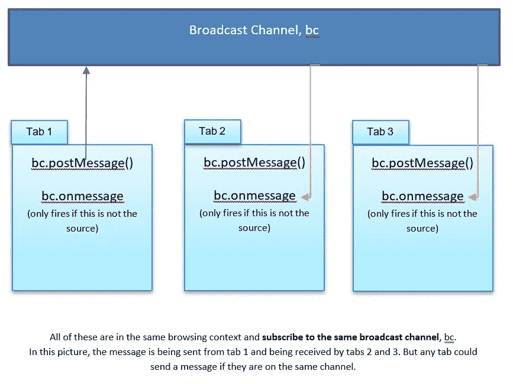

# 使用 JavaScript 和广播频道 API

> 原文：<https://javascript.plainenglish.io/using-javascript-and-the-broadcast-channel-api-a3134739781d?source=collection_archive---------3----------------------->

## 对于选项卡之间的浏览器上下文通信


Photo by [Kadir Celep](https://unsplash.com/@kadircelep?utm_source=unsplash&utm_medium=referral&utm_content=creditCopyText) on [Unsplash](https://unsplash.com/s/photos/broadcast-twoers?utm_source=unsplash&utm_medium=referral&utm_content=creditCopyText)

在 a [上一篇文章](https://medium.com/javascript-in-plain-english/javascript-and-window-postmessage-a60c8f6adea9)中，我们讨论了使用 window.postMessage()的跨源通信。

在这篇文章中，我想让我们再次探索 postMessage()，但是它适用于相同的[浏览上下文](https://developer.mozilla.org/en-US/docs/Glossary/Browsing_context)或相同的来源中的通信。

这是使用[广播频道 API](https://developer.mozilla.org/en-US/docs/Web/API/Broadcast_Channel_API) 和 **channel.postMessage()** 来执行的。

> 它可用于检测同一站点原始环境或浏览上下文中其他选项卡中的用户操作。

> 更具体地说，这允许窗口、标签、iframes、web workers 和服务 worker 之间的通信。发布到给定通道的消息被传递到该通道的所有监听器。

我们将关注窗口/标签。

## 句法

使用广播频道包括三个部分。

*   **创建**广播频道对象。

```
const bc = new window.BroadcastChannel('channel_name');
```

*   使用 **postMessage()** 发布要广播的消息。

```
bc.postMessage('message_data');
```

*与我们的跨源 postMessage 一样，* ***message_data 是使用* [*结构化克隆算法*](https://developer.mozilla.org/en-US/docs/Web/API/Web_Workers_API/Structured_clone_algorithm) *序列化*** *，因此正在广播的数据可能相当复杂。但是它不允许发送函数。*

*   使用 **onmessage** 事件处理程序接收消息。

```
bc.onmessage =(message)=> { do_something; }
```

实际消息在**消息数据**中。

> 所有选择对消息进行操作的窗口必须订阅相同的频道。

***注意*** *这一条消息不会广播给自己。因此，如果在启动该通道上的 postMessage()的页面上有 onmessage 事件侦听器，则 onmessage 事件不会触发。但是，如果 postMessage()是从另一个页面启动的，它将被触发。*



broadcast flow

## 我们的场景

> 对于我们的演示，我们的场景将是用户打开了我们的应用程序的一个或多个实例，每个实例出现在不同的选项卡上。

1.  我们将创建一个网页(我们的应用程序),然后在浏览器中复制它(尽可能多次。)
2.  当点击“开始操作”按钮时，一条消息将显示在当前页面(通过函数 setMsg())上，以及具有该频道的 **onmessage** 处理程序的每个页面(选项卡)上。

*注意:将使用一个随机数来生成两条消息中的一条。*

创建以下页面。然后我们会*测试它*，然后*分解它*。

**Index.html**

```
<!DOCTYPE html>
<html>
<head>
    <title>My Great Application</title>
 <meta charset="utf-8" />
    <script>
        // Set up broadcast channel
        **const bc=new window.BroadcastChannel('sample_channel');**

        function doAction(){
            // Action that will be done on current and other pages
            // The message will be broadcast to all tabs
            // it will also be displayed on the current
            // page using a setMsg function since the
            // source of the postMessage does not receieve
            // the message.// Random action: answer or call
            let ran=Math.floor(Math.random() * 2);

            let msg={};if (Number(ran)===0){
                msg={action: 'answer',
                phone: '555-1212'
                }
            }else{
                msg={action: 'call',
                phone: '444-2233'
                }
            }

            // broadcast message to others tabs
            **bc.postMessage(msg);**

            // show message on this page since 
            // it will not be received from 
            // page that initiated postMessage
            setMsg(msg);
        }

        // Handler for accepting messages that are broadcast
        **bc.onmessage=(message)=>{

            let txt = document.querySelector('#txtmsg');
            if (message.data.action==='answer'){
               txt.value=`Answer ${message.data.phone}`;
            }else{
                txt.value=`Call ${message.data.phone}`;
            }

        }**// function to handle messages for page that
        // initiated postMessage
        function setMsg(msg){
            let txt = document.querySelector('#txtmsg');
            if (msg.action==='answer'){
               txt.value=`Answer ${msg.phone}`;
            }else{
                txt.value=`Call ${msg.phone}`;
            }
        }

        </script>
</head>
<body>
    <form>
        <fieldset>
            <input type='button' id='btnstart' value='Start Action' onclick='doAction();' />
           Message: <input type='text' id='txtmsg' /> 
        </fieldset>
    </form>
</body>
</html>
```

## 测试它

用下列方法测试。

1.  打开 Index.html，点击“开始行动”。您应该会看到两条随机消息中的一条。关闭选项卡。
2.  打开 Index.html，复制标签。单击任一页面上的“开始行动”。消息应该出现在两个页面上。您可以从任何一个选项卡上，根据需要多次单击“开始操作”,以验证消息是否已广播。完成后关闭选项卡。
3.  打开 Index.html，根据需要多次复制该选项卡。点击任意页面上的“开始行动”。该消息应该出现在所有页面上。根据需要重复。

## 它是如何工作的

1.  广播频道 bc 建立在每个页面上(在我们的例子中是一个页面。该页面将被复制。)

```
// Set up broadcast channel
const bc=new window.BroadcastChannel('sample_channel');
```

***这需要在每一个要广播或接收消息的页面上*** *。*

2.要接收消息的每个页面也应该有 **bc** 。**on message**handler(***BC****为广播频道的名称。你会看到 onmessage 处理程序。它的工作是将消息放入文本框。它接收“消息”参数中的广播消息。信息在**消息中。***

```
// Handler for accepting messages that are broadcast
         bc.onmessage=(message)=>{

             let txt = document.querySelector('#txtmsg');
             if (message.data.action==='answer'){
                txt.value=`Answer ${message.data.phone}`;
             }else{
                 txt.value=`Call ${message.data.phone}`;
             }

        }
```

3.在我们的示例中，我们有一个 **doAction()** 函数，由“Start Action”按钮调用，该按钮通过 **postMessage()** 方法向浏览上下文中的所有其他页面进行广播——相同的来源。

由于这个页面的 onmessage 处理程序不会被调用(它是 postMessage 的来源)，我们还有一个函数 setMsg()，它处理消息发起页面的消息。

所有其他页面将依赖于它们附加到广播频道的 onmessage 处理程序。

```
function doAction(){
            // Action that will be done on current and other pages
            // The message will be broadcast to all tabs
            // it will also be displayed on the current
            // page using a setMsg function since the
            // source of the postMessage does not receieve
            // the message.// Random action: answer or call
            let ran=Math.floor(Math.random() * 2);

            let msg={};if (Number(ran)===0){
                msg={action: 'answer',
                phone: '555-1212'
                }
            }else{
                msg={action: 'call',
                phone: '444-2233'
                }
            }

            // broadcast message to others tabs
           ** bc.postMessage(msg);**

            // show message on this page since 
            // it will not be received from 
            // page that initiated postMessage
            **setMsg(msg)**;// For the initiating page
        }
```

## 测试说明:

> 要验证其他选项卡是否由 onmessage 处理程序而不是 setMsg()设置消息，您可能需要注释掉 setMsg()，打开多个选项卡并单击“开始操作”。
> 
> 初始页面没有消息，但所有其他页面都有！

# 结论

现在你知道了。如果希望浏览上下文中的每个页面共享信息，只要每个页面都有广播通道和处理程序，就可以使用 postMessage()广播到每个页面。

**感谢您的阅读和快乐编码！**

在 Medium 上阅读所有你想要的文章，并通过成为 Medium 会员来帮助我继续写作，每月只需 5 美元。

[](https://bobtomlin-70659.medium.com/membership) [## 通过我的推荐链接加入灵媒——重力井(罗伯·汤姆林)

### 作为一个媒体会员，你的会员费的一部分会给你阅读的作家，你可以完全接触到每一个故事…

bobtomlin-70659.medium.com](https://bobtomlin-70659.medium.com/membership) 

你也可以享受。

[](https://medium.com/javascript-in-plain-english/javascript-and-window-postmessage-a60c8f6adea9) [## 使用 JavaScript 和 window.postMessage()

### 安全跨域通信

medium.com](https://medium.com/javascript-in-plain-english/javascript-and-window-postmessage-a60c8f6adea9) [](https://medium.com/javascript-in-plain-english/using-javascript-and-the-broadcast-channel-api-a3134739781d) [## 使用 JavaScript 和广播频道 API

### 对于选项卡之间的浏览器上下文通信

medium.com](https://medium.com/javascript-in-plain-english/using-javascript-and-the-broadcast-channel-api-a3134739781d) [](https://medium.com/javascript-in-plain-english/closing-a-window-with-javascript-beeec56344bb) [## 用 JavaScript 关闭窗口

### 简而言之，什么可行，什么不可行

medium.com](https://medium.com/javascript-in-plain-english/closing-a-window-with-javascript-beeec56344bb)