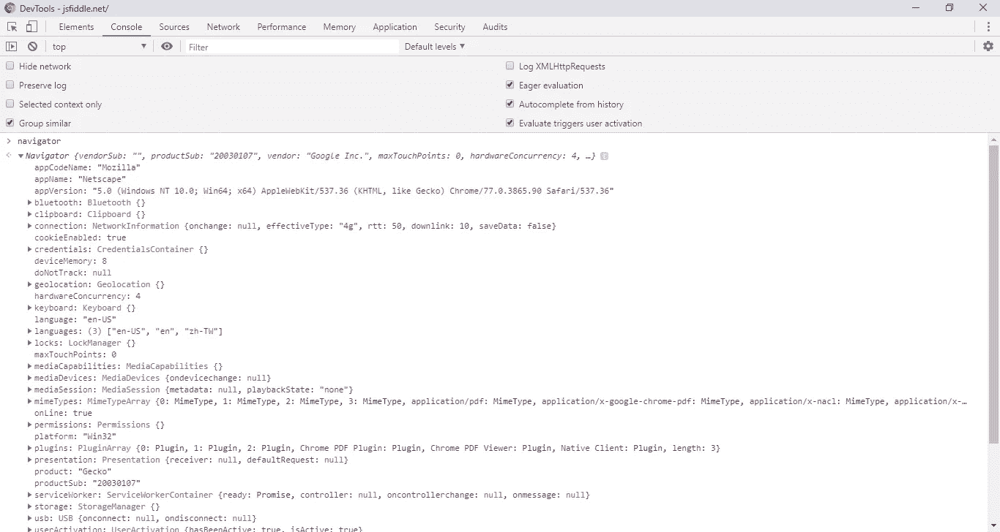
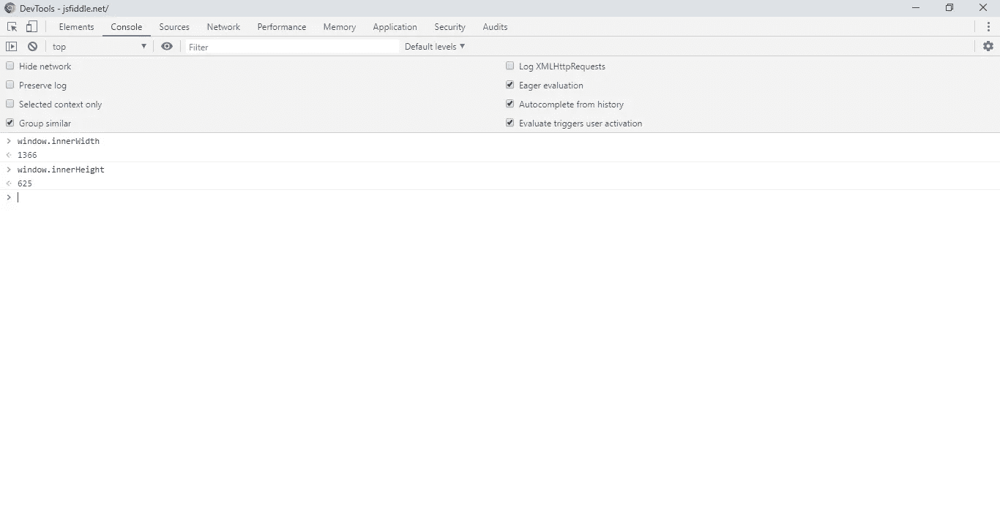

# 使用浏览器内置的 JavaScript 对象

> 原文：<https://javascript.plainenglish.io/using-javascript-objects-built-into-browsers-579a5315cc22?source=collection_archive---------5----------------------->


Photo by [Panos Sakalakis](https://unsplash.com/@meymigrou?utm_source=medium&utm_medium=referral) on [Unsplash](https://unsplash.com?utm_source=medium&utm_medium=referral)

JavaScript 通常在 web 浏览器中用于呈现内容。为了帮助实现这一点，几乎所有的浏览器都内置了对 JavaScript 的支持，其中包括一个标准的对象库，web 应用程序可以使用它来实现常见的功能。浏览器本身有一个用户界面，用户输入一个 URL，然后网站加载并呈现给用户。大多数网站都有 HTML、CSS 和 JavaScript 代码。在编码不良的网站上，加载页面会花费一些时间。HTML 定义网站的各个部分，CSS 控制静态样式和布局，JavaScript 包含控制动态功能的代码。

当用户键入一个 URL 时，网站的 HTML 部分首先与 CSS 一起加载。JavaScript 代码在浏览器中逐行加载。所有加载的代码都必须由浏览器解析和解释，以便在屏幕上正确显示。浏览器将 HTML 代码解析成称为文档对象模型(DOM)的树模型。这是一个完整的网页地图，您可以使用 JavaScript 访问 DOM 的不同部分。然后解析 CSS，这将加载由 CSS 代码定义的样式。最后，运行 JavaScript 代码，根据编写的 JavaScript 代码来操作之前加载的 DOM 元素。样式也可以用 JavaScript 动态应用。如果你想留住那些不耐烦的访问者，快速加载网站是至关重要的。我们可以在后台加载不需要立即加载的代码，以避免代码阻碍页面加载。

# 浏览器对象模型

几乎所有的网络浏览器都支持 JavaScript，并且所有这些浏览器都有一组内置的对象，开发者可以访问这些对象来操作页面。这被称为浏览器对象模型或简称为 BOM，它是开发者可以用来编写他们的 web 应用程序的一系列 API。

## 导航器对象

`navigator`对象是浏览器内置的 JavaScript 对象，它具有浏览器的基本属性、安装浏览器的计算机类型以及一些地理位置数据。几乎所有的现代浏览器都有这个，你可以从中访问以下数据:

*   `appCodeName`，有浏览器的代号
*   `appName,`有浏览器的名字
*   `appVersion`，有浏览器版本
*   `cookieEnabled`，告诉我们浏览器是否启用了 cookies
*   `geolocation`，如果启用了地理定位，则具有物理位置数据
*   `language`，获取浏览器的语言
*   `onLine`，告诉我们浏览器是否在线
*   `platform`，获取浏览器运行的平台。
*   `product`，获取浏览器的引擎名称
*   `userAgent`具有在 HTTP 请求中发送到 web 服务器的用户代理字符串
*   `battery`，告诉我们设备电池的充电状态(如果有的话)
*   `connection`，告诉我们浏览器的连接状态
*   `hardwareConcurrency`，拥有设备的逻辑处理器数量、
*   `keyboard`，告诉我们设备的关键字布局
*   `serviceWorker`，告诉我们有关服务人员的数据，这使 web 应用程序具有离线功能以及渐进式 web 应用程序的安装/卸载功能
*   `storage`，告诉我们运行浏览器的设备的存储容量

上面列出的`navigator`对象的所有属性都是只读的。

如果我们在浏览器控制台中输入`navigator`，我们将获得`navigator`对象的完整属性列表。



The navigator object’s properties

为了检测一个浏览器是否支持某些功能，我们应该检查内置的浏览器对象是否有你想要使用的属性和方法。

## 窗口对象

`window`对象有关于浏览器窗口的数据，这是浏览器中显示网页的地方。浏览器的每个选项卡都有自己的`window`对象实例。

在大多数浏览器中，`window`对象具有以下属性:

*   `closed`，表示窗口是否已经关闭的布尔值
*   `defaultStatus`，获取或设置窗口状态栏中的默认文本
*   窗口的文档对象，让我们操作 DOM。
*   `frameElement`，获取窗口嵌入的元素，如`<iframe>`或`<object>`
*   `frames`，列出当前窗口中的所有帧
*   `history`，拥有当前窗口的浏览器历史
*   `innerHeight`，当前窗口的内部高度，只读属性
*   `innerWidth`，当前窗口的内部宽度，只读属性
*   `length`，窗口中的帧数，只读属性
*   `location`，获取`location`对象，让我们遍历不同的 URL 并操作浏览器历史。
*   `name`，让我们获取或设置窗口的名称
*   `navigator`，有我们上面讨论过的`navigator`对象
*   `opener`，获取创建当前窗口的窗口对象
*   `outerHeight`，窗口的外部高度，包括滚动条和工具栏
*   `pageXOffset` ，获取窗口中水平滚动的像素数
*   `pageYOffset`，获取窗口中垂直滚动的像素数
*   `parent`，对象为当前窗口的父窗口
*   `screen` ，窗口的屏幕对象
*   `screenLeft`，主屏幕左侧到当前窗口左侧的水平距离，以像素为单位
*   `screenTop`，窗口顶部相对于屏幕顶部的垂直距离，以像素为单位
*   `screenX`，相对于屏幕的水平坐标
*   `screenY`，相对于屏幕的垂直坐标
*   `self`，当前窗口
*   `top`，最顶端的浏览器窗口

我们可以用`window`对象做很多事情。一些最常见的包括获取屏幕大小、滚动位置和页面间导航。

注意，如果我们定义了一个全局变量，它会自动将自己附加为`window`对象的一个属性，所以如果我们已经全局定义了`a = 1`，那么`window.a`就是 1。

使用`window.location`对象，我们可以通过设置`window.location.href`导航到一个 URL。因此，如果我们想去中型网站，我们写:

```
window.location.href = 'http://www.medium.com';
```

`window.innerWidth`和`window.innerHeight`为我们提供了当前浏览器窗口的宽度和高度。



我们可以这样写回到上一页:

```
window.history.go(-1)
```

并使用以下命令获取浏览器历史记录的大小:

```
window.history.length;
```

对象也有一个方法列表，我们可以用它来显示警告框，提示用户输入数据，移动和调整窗口大小，以及其他许多事情。`window`对象中的方法列表如下:

*   `alert()`，显示一个带有信息和确定按钮的警告框
*   `atob()`，解码 base-64 编码的字符串
*   `blur()`，使当前窗口失去焦点
*   `clearInterval()`，取消`setInterval()`返回的定时器
*   `clearTimeout()`，取消`setTimeout()`返回的定时器
*   `close()`，关闭创建的窗口实例
*   `confirm()`，显示带有可选消息的对话框，带有确定和取消按钮
*   `createPopup()`，创建一个弹出窗口
*   `focus()`，将当前窗口设为焦点
*   `moveBy()`，将当前窗口移动指定的量
*   `moveTo()`，移动一个窗口到指定位置
*   `open()`，打开一个新窗口
*   `print()`，打印当前窗口的内容
*   `prompt()`，显示对话框提示用户输入
*   `resizeBy()`，按指定的像素数调整窗口大小
*   `resizeTo()`，将窗口大小调整到指定的高度和宽度 I 像素。
*   `scrollBy()`，将文件滚动指定的像素数
*   `scrollTo()`，将文档滚动到一组特定的像素坐标
*   `setInterval()`，以毫秒为单位指定的间隔重复调用函数
*   `setTimeout()`，以毫秒为单位调用函数指定的时间
*   `stop()`，停止当前窗口的加载

出于安全原因，focus、open、move 和 resize 方法只能在由您自己的代码打开的窗口上调用，因为能够打开不是由某人自己的代码生成的窗口将被恶意的程序员利用来对其他用户的计算机做不希望的事情。

例如，要使用`moveBy`方法必须如下使用:

```
const newWindow = window.open('', 'My Window', 'width=250, height=250'); newWindow.document.write("<p>This is my window.</p>");
newWindow.moveBy(250, 250);                                
newWindow.focus();
```

这些是最常见的内置浏览器对象以及与之相关的属性和方法。它们可以用于一些操作，以及类似于`setInterval`和`setTimeout`的功能，用于执行依赖于时间的事情。