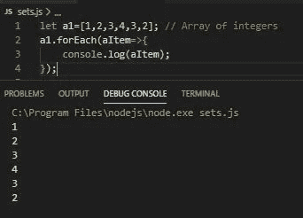
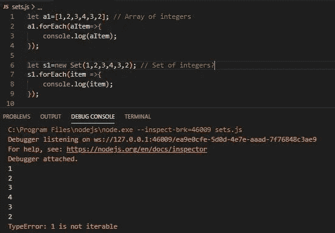
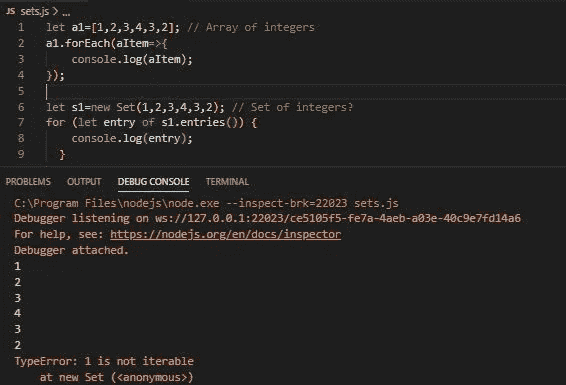
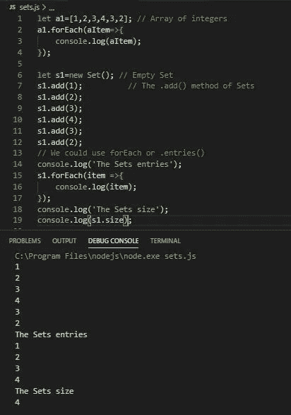
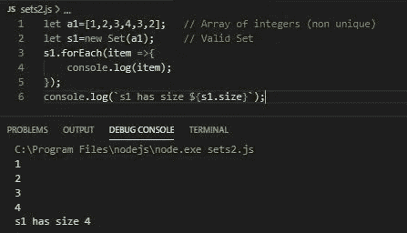
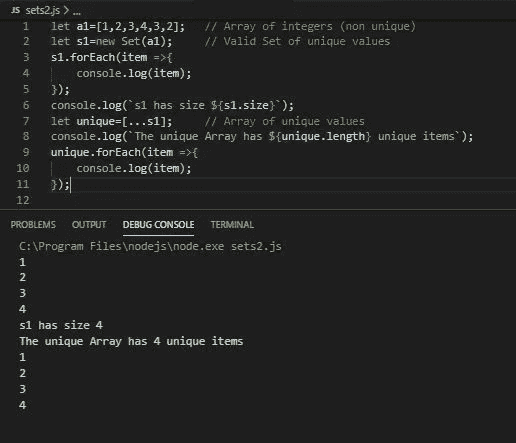
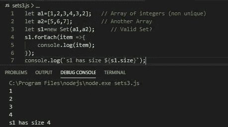
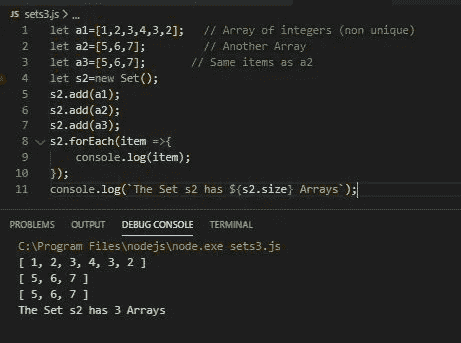

# 使用 JavaScript 集

> 原文：<https://javascript.plainenglish.io/using-javascript-sets-37752330682d?source=collection_archive---------4----------------------->

## 一些有趣的用法、观察和陷阱


Photo by Guillaume Bolduc on [Unsplash](https://unsplash.com)

J avaScript 集合是保存**唯一**值集合的好方法。由于它们存储值，人们可能会认为它们类似于数组，**但它们完全不同。**

> 在这篇文章中，我想让我们了解集合的基本知识，回顾一些用法和一些“陷阱”

JavaScript 集合、属性和方法的完整解释可以在[这里](https://developer.mozilla.org/en-US/docs/Web/JavaScript/Reference/Global_Objects/Set)找到。

**基础知识**

`**Set**`对象允许您存储任何类型的**唯一**值，无论是[原始值](https://developer.mozilla.org/en-US/docs/Glossary/Primitive)还是对象引用。

这里的关键字是唯一的。我们马上会看到，即使我们用非唯一值填充一个集合，它也只返回唯一值。大多数情况下。就等着吧！

语法是，

```
new Set([*iterable*]);
```

如果一个[可迭代对象](https://developer.mozilla.org/en-US/docs/Web/JavaScript/Reference/Statements/for...of)被传递，它的所有元素将被添加到新的`Set`中。如果不指定这个参数，或者它的值是`null`，新的`Set`为空。

可迭代的 T21 的概念在这里也很重要。典型的可迭代对象是**字符串、数组和映射**(还有其他的。)

> 如果你读过我的一些其他文章，你会意识到我经常从问题开始。这是通过“解决问题”让我们有更深的理解。

## 示例 1

注意这可能是**非直觉行为**。这里我们将创建一个整数数组，非常简单。*但随后尝试创建一组相同的整数。*



Arrays of integers

现在让我们试着创建一组相同的整数。请注意调试器消息。



Epic fail

我们可以使用**再试一次。**条目()【方法】集合。

**。entries()** 集合的方法返回一个 iterable 对象。

这也将失败。但是你至少你现在知道有一个. entries()方法。



Same error

问题显然是我们如何定义这个集合。如定义中所述，当创建一个新的集合对象时，**它必须被传递一个 iterable 对象。**

或者

我们可以*创建一个空集*并使用它的**。添加()**方法。

> 我们将首先使用后一种方法，并在集合的有趣应用中使用第一种方法。

我们也将看到一个集合有一个**。尺寸**属性。



Notice unique list of 4 items

> 太美了。不仅如此，作为一个集合，它只包含**独特的**值。

## 使用集合获取唯一值的数组

由于集合在创建时要么是空的，并且具有如上所述添加的项**或者可以传递给可迭代对象**，例如数组(提示，提示)，我们可以用它来获得唯一值的数组。

> 因此，我们将学习另一种方法来得到我们的整数集，但也是对集合的一种巧妙的使用。

## 示例 2

使用集合构建唯一对象的数组。

在这样做的过程中，我们会注意到一些其他可能的、不那么直观的东西。



Notice what the Set contains

## 观察

*   设置**不**包含一个项目，数组。(那是我们将解决的一个不同的问题。)
*   数组被**解构**并将元素放入集合中。
*   我们确实有一套独特的价值观。

**这就引出了一个问题。如果阵列被解构，我们能有一套阵列吗？答案是肯定的！我们以后会探讨这个问题。当我们到达那里时，密切关注它是如何完成的。**

**回到获取我们的唯一值数组**

我们有自己独特的价值观，但它们被锁在一个集合中。我们如何让他们回到阵列中？

我们**不能只说这样的话，**

让 unique =[S1]；

这将创建一个由一个项目组成的数组。一个项目是集合。我们需要“传播”这套价值观。**我们将使用** [**散布**](https://developer.mozilla.org/en-US/docs/Web/JavaScript/Reference/Operators/Spread_syntax) **…运算符。**

> **扩展语法**允许在预期有零个或多个参数(用于函数调用)或元素(用于数组文字)的地方扩展数组表达式或字符串等可选项，或者在预期有零个或多个键值对(用于对象文字)的地方扩展对象表达式。



A Set and the Spread operator at work

## 数组的集合

我们之前提到过，因为数组在作为参数传递给一个新集合时是被解构的，所以创建一个数组集合有点困难。但是，这是可以做到的！

首先注意一些问题。)



It ignored a2

问题很明显，我们没有在构造函数中传递 iterable。嗯，我们算是做了。所以我们得到了一个奇怪的结果，一个包含第一个数组项的集合。*这是一个真正的“陷阱”。它没有抛出异常，只是给出了一个奇怪的结果。*

空集和。加()再次出手相救！


A nice Set of 3 Arrays

最后一个例子。**如果两个数组的值相同，我们会得到什么？**好奇的人想知道！

## 示例 3



Hmmm

也许这就是你所期望的，也许不是。

乍一看，有人可能会认为，由于集合包含唯一的项目，数组 a3 可能不会显示，集合 s2 的大小应该是 2。

但是不行。为什么？更完整的解释请阅读[这个](https://link.medium.com/bdr1puAKS0)但是要点是数组不是原始的，所以我们得到的是对它们在内存中位置的引用，这对于每个数组都是不同的，因此，*它们是唯一的。*

# 结论

布景很酷。但它们可能很棘手。它们让我们非常仔细地思考片场会有什么，以及**如何**将物品放入片场。

我们还看到了一种从非唯一值数组创建唯一值数组的简单方法。

还有其他的属性和方法，那就去探索吧。甚至可以尝试创建一组集合。

顺便说一句。所有集合中的一个集合包含它自身吗？

**感谢您的阅读和快乐编码！**

在 Medium 上阅读所有你想要的文章，并通过成为 Medium 会员来帮助我继续写作，每月只需 5 美元。

[](https://bobtomlin-70659.medium.com/membership) [## 通过我的推荐链接加入灵媒——重力井(罗伯·汤姆林)

### 作为一个媒体会员，你的会员费的一部分会给你阅读的作家，你可以完全接触到每一个故事…

bobtomlin-70659.medium.com](https://bobtomlin-70659.medium.com/membership) 

你也可以享受，

[](https://medium.com/javascript-in-plain-english/javascript-multi-dimensional-arrays-7186e8edd03) [## JavaScript 多维数组

### 真相大白了

medium.com](https://medium.com/javascript-in-plain-english/javascript-multi-dimensional-arrays-7186e8edd03)