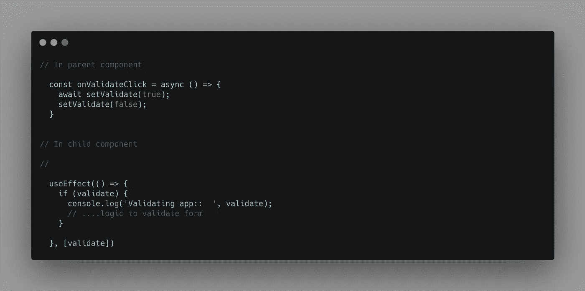
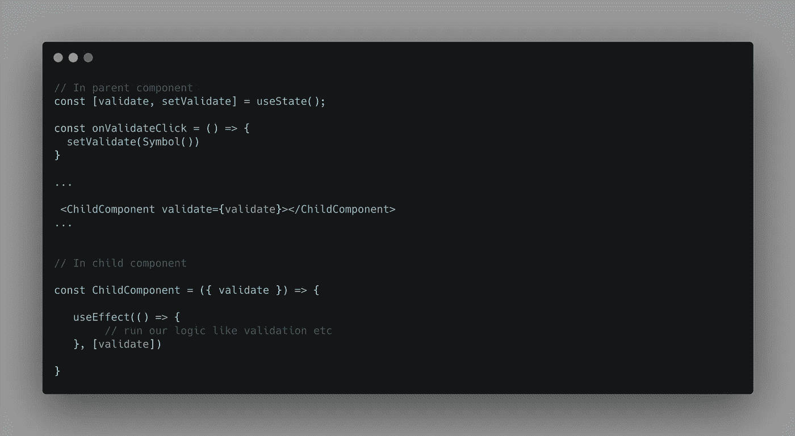

# 在 React 中使用 JavaScript 符号

> 原文：<https://javascript.plainenglish.io/using-javascript-symbols-in-react-js-5b0fcd8b6660?source=collection_archive---------1----------------------->

Photo by [Joshua Aragon](https://unsplash.com/@goshua13?utm_source=unsplash&utm_medium=referral&utm_content=creditCopyText) on [Unsplash](https://unsplash.com/s/photos/reactjs-%2Bjavascript?utm_source=unsplash&utm_medium=referral&utm_content=creditCopyText)

## React 应用程序中 JavaScript 符号的用例

ES6 版本的一个特性是`Symbol`数据结构——但是许多开发人员并不知道它在应用程序代码中的用例。在本文中，我将通过一个场景来讲述我认为`Symbol`可能是最合适的。

最近，我在开发一个功能，其中我们有嵌套的表单组件，需要从父组件重置或验证。最初，我想通过将布尔值作为道具从父组件传递给子组件来实现，方法是将它设置为 true，然后在验证完成后将其重置为 false，以便为下一次迭代做好准备，如果我们想要再次验证/重置表单的话。

所以，一个简单的伪代码看起来像这样:

Triggering change detection to run validation in child component from parent component

在父组件中，我们先将`validate`值设置为`true`，然后将其重置为`false`。在子组件中，我们寻找`validate`值来运行我们的验证逻辑。但是正如你注意到的，我们必须在每次完成验证后重置`validate`标志，以便以后运行验证。

那么，我们为什么要这样做呢？这个问题的答案与变更检测如何运行有关。在 react 中，像许多现代框架一样，变化检测过程运行的方式之一是当组件中的属性值发生变化时。如果该值是一个基本类型，它将比较前一个值和当前值，其中对于对象，它检查引用。

来自 MDN 文档:

*数据类型* ***符号*** *是一种* [*原始数据类型*](https://developer.mozilla.org/en-US/docs/Glossary/Primitive) *。* `*Symbol()*` *函数返回类型为* ***符号*** *的值，具有公开内置对象的几个成员的静态属性，具有公开全局符号注册表的静态方法，类似于内置对象类，但作为构造函数是不完整的，因为它不支持语法“* `*new Symbol()*` *”。*

所以，符号是一种原始类型，但没有两个符号是相等的。这正是我们需要的。

如果我们用符号重写我们的逻辑，将会变成如下所示:

Symbols to trigger validation from parent components

当我们现在想要在子组件中运行验证时，我们需要通过调用`Symbol()`传递一个新的符号。

# **概要:**

符号是唯一的数据类型，没有两个符号是不相等的。这个特性开辟了在 React 应用程序中使用它们的许多可能性之一，通过将它们作为道具传递来运行子组件中的代码。

感谢阅读！关注更多有趣的文章。

喜欢这篇文章吗？如果是这样，通过 [**订阅解码获得更多类似内容，我们的 YouTube 频道**](https://www.youtube.com/channel/UCtipWUghju290NWcn8jhyAw) **！**