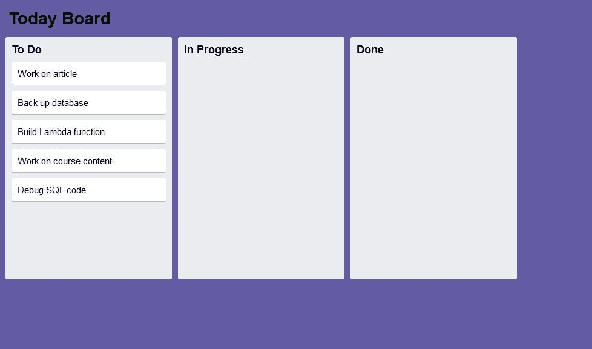
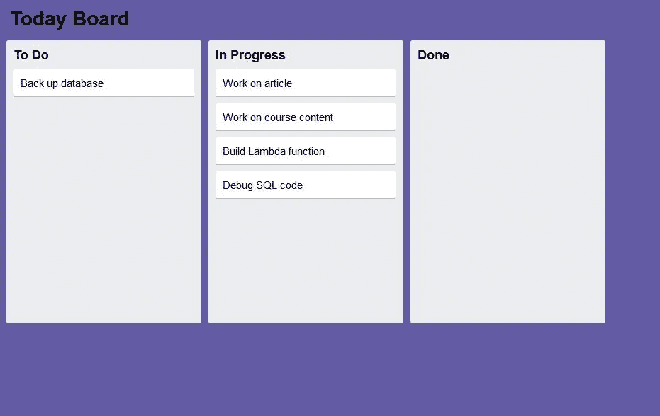
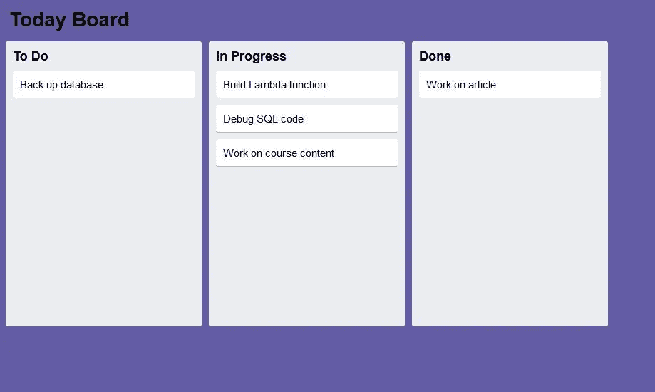

# 使用 JavaScript 创建类似 Trello 的卡片重排和拖放

> 原文：<https://javascript.plainenglish.io/using-javascript-to-create-trello-like-card-re-arrange-and-drag-and-drop-557e60125bb4?source=collection_archive---------1----------------------->

## 拖放提示

## 在一个类似特雷罗的板子上


Photo by [Matthew Guay](https://unsplash.com/@maguay?utm_source=unsplash&utm_medium=referral&utm_content=creditCopyText) on [Unsplash](https://unsplash.com/s/photos/trello-app?utm_source=unsplash&utm_medium=referral&utm_content=creditCopyText)

他这篇文章的灵感来自于 [Joshua Saunders](https://medium.com/u/e24703fb7921?source=post_page-----557e60125bb4--------------------------------) 写的一篇很棒的文章，题为“[用 CSS 网格创建 Trello 的 UI](https://medium.com/better-programming/creating-trellos-ui-with-css-grid-ed1fbfcd9448?source=bookmarks---------47------------------)我**强烈推荐**您阅读他关于全功能 UI 的精彩文章。

> 作为 Trello 的狂热用户，我发现该应用程序 [](https://trello.com/) 的一大优点是它让我能够轻松地在列表之间*拖放，并在列表*中 ***重新排列*** *项。*

在这篇文章中，我想模拟这种列表之间的拖放，以及列表项、卡片的重新排列或交换。

由于您的时间很宝贵，我们将以简单但有启发性的方式来做这件事。虽然简单，但我会给你留下足够的想法来扩展和改进我们在这里做的事情。

*   如果你不熟悉网页上的拖放，你可以在这里查看我的帖子。然而，我将在本文中回顾它的核心。
*   重新安排将是这篇文章的新内容。基本上，重新排列就像以编程方式交换两个变量的值。

## 我们将做什么

想要在提到的两项功能方面像 Trello 一样，我们将创建一个“板”和三个“列表”；Trello 使用的术语和带文字的卡片。因此，我们保持我们的用户界面简化。

> 我们将能够在所有三个列表之间拖放卡片，以及重新排列(交换)给定列表中的卡片

这里有几张截图，或者你可以在我的网站上试试。



Initial Board



Drag and Drop between lists



Re-arrange items in the “In progress” list and move an item to the “done” list

## 我们开始吧

创建三个文件并保存在同一个文件夹中。

*   一个名为**index.html 的网页。**
*   一个名为 **styles.css** 的 CSS 文件。
*   一个名为 **dragdropswap.js.** 的 JavaScript 文件

我们将创建 HTML 和 CSS，测试运行它以确保核心 UI 正常工作，然后在添加 JavaScript 代码之前讨论它。

**HTML—index.html**

```
<!DOCTYPE html>
<html lang="en">
  <title>Trello-Like</title>
<head>
    <meta charset="UTF-8">
    <meta name="viewport" content="width=device-width, initial-scale=1.0">
    <meta http-equiv="X-UA-Compatible" content="ie=edge">

    <link rel="stylesheet" type="text/css" href="styles.css">
</head>
<body>
    <div class="board-layout">

        <div class="left">
          <div class="board-text">Today Board</div>

        </div>

      <div id='boardlists' class="board-lists">
        <div id='list1' class="board-list" ondrop="dropIt(event)" ondragover="allowDrop(event)">
          <div class="list-title">
            To Do
          </div>

            <div  id='card1' class="card" draggable="true" ondragstart="dragStart(event)">
            Work on article
            </div>
            <div  id='card2' class="card" draggable="true" ondragstart="dragStart(event)">
            Back up database
            </div>
            <div id='card3' class="card" draggable="true" ondragstart="dragStart(event)">
            Build Lambda function
            </div>
            <div id='card4' class="card" draggable="true" ondragstart="dragStart(event)">
            Work on course content
            </div>
            <div id='card5' class="card" draggable="true" ondragstart="dragStart(event)">
            Debug SQL code
            </div>

        </div>
        <div  id='list2' class="board-list" ondrop="dropIt(event)" ondragover="allowDrop(event)">
          <div  class="list-title">
          In Progress
          </div>

        </div>
        <div  id='list3' class="board-list"  ondrop="dropIt(event)" ondragover="allowDrop(event)">
          <div  class="list-title">
            Done
            </div>

            </div>
      </div>
    </div><script src='dragdropswap.js'></script></body>
</html>
```

**CSS—styles . CSS**

```
/* This is based on the work of Joshua Saunders */
.board-layout {
    background-color: rgb(100, 92, 165);
    font-family: Arial, Helvetica, sans-serif;
    font-size: 15px;
    display: grid;
    grid-template-rows: max-content auto;
    grid-gap: 10px;
    padding: 10px;
    height:800px;
  }.list-layout {
    display: grid;
    grid-gap: 10px;

  }.board-text {
    font-weight: bold;
    font-size: 28px;
    padding: 5px;
  }.board-lists {
    display: grid;
    grid-auto-columns: 275px;
    grid-auto-flow: column;
    grid-gap: 10px;
    height: 400px;

  }

  .board-list {
    background-color: rgb(235, 236, 240);
    border-radius: 3px;
    display: grid;
    grid-auto-rows: max-content;
    grid-gap: 10px;/* Chrome use a fixed height */height: max-content;
    padding: 10px;
  }

  .list-title {
    font-size: 18px;
    font-weight: bold;
  }.card {
    background-color: white;
    border-radius: 3px;
    box-shadow: 0 1px 0 rgba(9,30,66,.25);
    padding: 10px;
    cursor:pointer;
  }
```

## 试运转

打开 index.html。

它应该如下所示。


Interface without functionality

# 讨论

CSS 只是设计了黑板、列表和卡片的样式。

## HTML

主

只是设置了“板”

接下来是三个“清单”。

**列表**

如果您检查每个列表:列表 1、列表 2 和列表 3，您将看到它们都具有以下属性，

**ondrop="dropIt(事件)" ondragover="allowDrop(事件)"**

*   **ondrop** 属性将包含我们用于在列表之间拖放*的大部分代码，但也包含用于交换列表中项目的*。**
*   **ondragover** 属性将只包含一行代码来覆盖默认行为。默认行为是不允许掉落。覆盖这一点将允许我们拖放。

**卡片**

您会注意到，只有第一个列表，列表 1，有带属性的卡片。
**可拖动="true" ondragstart="dragStart(事件)"**

*   **可拖动**属性允许我们的项目是否可拖动。
*   **ondragstart** 属性允许我们指定被拖动的目标对象。

> 第一个列表中的卡需要这些属性，而其他列表不需要这些属性的原因是，当卡在列表之间拖动时，属性会随之移动，并成为目标列表的一部分。

## 现在是 JavaScript

将以下 JavaScript 添加到**dragdopswap . js**。那我们就讨论一下。

```
function allowDrop(ev) {
    ev.preventDefault();  // default is not to allow drop
  }
  function dragStart(ev) {
    // The 'text/plain' is referring the Data Type (DOMString) 
    // of the Object being dragged.
    // ev.target.id is the id of the Object being dragged
    ev.dataTransfer.setData("text/plain", ev.target.id);
  }
  function dropIt(ev) {
    ev.preventDefault();  // default is not to allow drop
    let sourceId = ev.dataTransfer.getData("text/plain");
    let sourceIdEl=document.getElementById(sourceId);
    let sourceIdParentEl=sourceIdEl.parentElement;
    // ev.target.id here is the id of target Object of the drop
    let targetEl=document.getElementById(ev.target.id)
    let targetParentEl=targetEl.parentElement;

    // Compare List names to see if we are going between lists
    // or within the same list
    if (targetParentEl.id!==sourceIdParentEl.id){// If the source and destination have the same 
        // className (card), then we risk dropping a Card in to a Card
        // That may be a cool feature, but not for us!
        if (targetEl.className === sourceIdEl.className ){
          // Append to parent Object (list), not to a 
          // Card in the list
          // This is in case you drag and drop a Card on top 
          // of a Card in a different list
           targetParentEl.appendChild(sourceIdEl);

        }else{
            // Append to the list
             targetEl.appendChild(sourceIdEl);

        }

    }else{
        // Same list. Swap the text of the two cards
        // Just like swapping the values in two variables

        // Temporary holder of the destination Object
        let holder=targetEl;
        // The text of the destination Object. 
        // We are really just moving the text, not the Card
        let holderText=holder.textContent;
        // Replace the destination Objects text with the sources text
        targetEl.textContent=sourceIdEl.textContent;
        // Replace the sources text with the original destinations
        sourceIdEl.textContent=holderText;
        holderText='';}

  }
```

## 试运转

打开 index.html。

尝试在列表之间和列表内拖放。重新安排。

## JavaScript 在做什么？

**基础**

当拖动开始时， **dragStart** 功能使用 **dataTransfer** Object 的 **setData** 方法捕获拖动的目标，它是 DOMString(数据类型为文本/普通)。)

当我们下降时，完成所有工作的 **dropIt** 功能必须做几件事。

首先，我们必须使用 **dataTransfer** 的 **getData** 方法来获取被拖动的源对象。我们还可以获得投放的目标对象。

**明细**

**拖放**中最重要的部分是首先确定物体是在列表之间还是在列表中的*之间被拖放(重新排列)。)*

**列表间拖放**

这是通过比较源对象和目标对象的 **parentElement.id** 来完成的。

**如果 parentElement.id 不同**，我们还有一个额外的测试要做。如果我们不小心，将一张卡片放在一张卡片(不同的列表)上，它会将文本附加到现有的卡片上。*这可能是很酷的行为，但不是我们想要的。我们想添加到目的地列表中。*

为了确保我们不会把一张卡放到另一张卡上，我们检查了每个对象的类名。

*   如果它们都是 card，那么我们把列表添加到目的地的 parentElement。
*   如果它们不都是 card，那么源类名是 Card，目的类名是 List，所以我们只需将 List 追加到目的对象。

**在列表内拖放(重新排列)**

**如果 parentElement.id 是相同的**，我们实际上只是交换了卡中的文本，而不是卡本身。这个过程就像交换两个变量的值的标准过程。我们需要一个临时的 holder 变量。

# 结论

在这篇文章中，我们访问或重温了拖放，但也增加了重新排列的能力。我们在一个类似特雷罗的环境中这样做，只是因为我觉得特雷罗很酷，而且我真的很喜欢[约书亚·桑德斯](https://medium.com/u/e24703fb7921?source=post_page-----557e60125bb4--------------------------------)的作品。

我们绝对没有考虑到特雷罗的所有可能性和所有特征。以下是您可能想要做的一些事情，以扩展我们已经完成的工作。

*   重新排列列表本身。像特雷罗一样交换名单。
*   从一个列表拖动到另一个列表，并在卡片之间插入*，而不仅仅是追加到列表的末尾。*
*   像 Trello 一样为每张卡创建完整的对象，而不仅仅是文本，以存储其他数据。

还有更多的事情可以做。我将亲自处理这件事。

**感谢您抽出时间阅读并快乐编码！**

在 Medium 上阅读所有你想要的文章，并通过成为 Medium 会员来帮助我继续写作，每月只需 5 美元。

[](https://bobtomlin-70659.medium.com/membership) [## 通过我的推荐链接加入灵媒——重力井(罗伯·汤姆林)

### 作为一个媒体会员，你的会员费的一部分会给你阅读的作家，你可以完全接触到每一个故事…

bobtomlin-70659.medium.com](https://bobtomlin-70659.medium.com/membership)