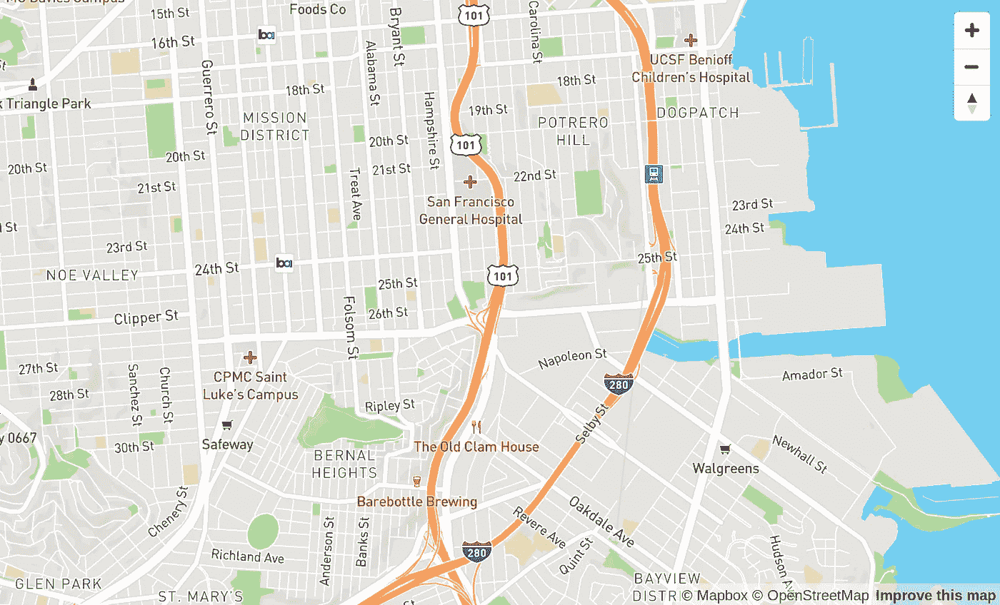
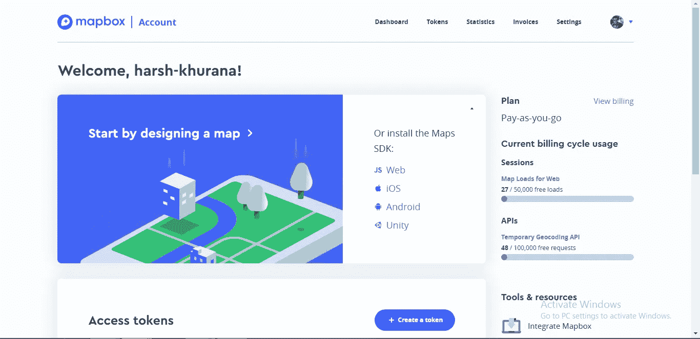
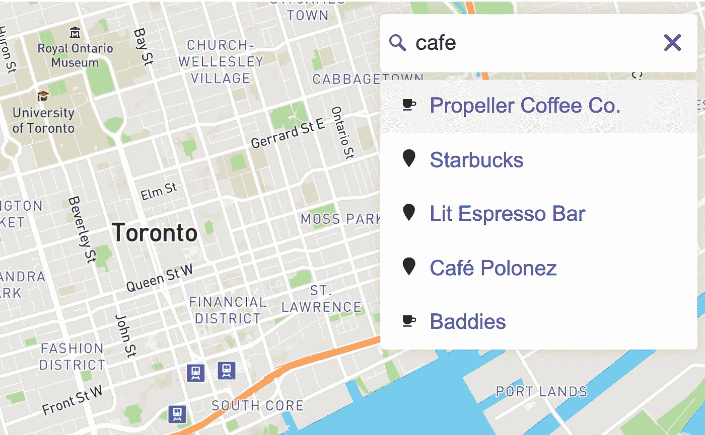

# 使用 Mapbox:最简单的入门指南

> 原文：<https://javascript.plainenglish.io/using-mapbox-the-simplest-guide-to-get-you-started-cae9896bf999?source=collection_archive---------2----------------------->



Map created using Mapbox API

在谷歌地图对其用于网站和应用程序地图服务的 API 改用现收现付定价计划后，许多开发者和其他使用它的平台开始寻找替代服务，提供谷歌的功能，但价格更便宜。于是有了地图盒子来拯救。

Mapbox 是一个平台，通过其 API 以非常合理的价格提供地图服务，最好的部分是，如果你使用他们慷慨的免费层，他们不需要计费信息。因此，那些只是想测试他们的应用程序，或者在他们的应用程序或网站获得巨大成功之前还不准备为服务付费的开发人员，可以避免任何计费问题。

Mapbox 提供了简单的代码，你可以用它来将地图整合到你的网站或应用程序中，但是他们的文档很难浏览。所以，我会帮你省事，用简单易行的方法分解它，帮你解决。

整合地图有两种方式

1.简单但较少控制的方法

2.有点简单的方法

# **简单但较少控制的方式**

因此，在这种情况下，您只需使用 iframe 标记将地图包含在您的应用程序中

```
<iframe src=’https://api.mapbox.com/styles/v1/mapbox/streets-v11.html?title=true&zoomwheel=false&access_token=YOUR_ACCESS_TOKEN#15/37.771/-122.436'></iframe>
```

**注意:只要把这段代码加入到你的应用程序中，你就可以开始工作了，但是你需要一个访问令牌，这将在后面讨论。**

> Mapbox docs:使用这个(iframe)方法返回的 HTML 只返回地图[样式](https://docs.mapbox.com/help/glossary/style/)，不支持弹出窗口或者其他功能交互。

因此，根据 mapbox 文档，您可能无法访问 map 附带的一些功能。有时它也可能打破你的布局，就像我一样。相信我，我很高兴我所要做的就是包含一个 iframe 并设置一些属性，就这样，但后来布局打破了，我开始绕过它，走上了“那种简单的方式”。但是如果 iframe 适合你，那么你就可以开始了，对于那些不适合的，这里是包含地图的第二种方法。

# **种简单的方式**

因此，我们将使用 Mapbox GL JS，这是一个 JavaScript 库，它使用 WebGL 从矢量图块(只是一种存储地图数据的格式，即地理空间矢量数据，如点、线和多边形)和 Mapbox 样式(只是地图的外观，即地图的视觉外观)渲染交互式地图。

不要害怕，你现在不需要学习一个全新的库，请耐心等待…..:)

你所要知道的只是关于地图对象的一些事情，它基本上定义了我们想要包含的地图，它指定了你想要你的地图拥有的所有属性，最基本的是这样的:

```
let map = new mapboxgl.Map({
  container: 'map', // container id
  style: 'mapbox://styles/harsh-khurana/ck970tots6kk91ik5zxo9i1ng', // stylesheet location
  center: [-74.5, 40], // starting position [lng, lat]
  zoom: 9 // starting zoom
 });
```

**注意:您需要在 JS 文件或 html 的脚本标签中声明这一点。**

现在，我将逐一检查这些地图属性-

Container: 它的值是 html 元素或字符串 id，我们将在其中呈现我们的地图。

**样式:**它的值指定了你希望你的地图拥有什么样的样式。有街景、夜景等等。你也可以使用[地图框工作室](https://studio.mapbox.com/)定制你的风格。但是我建议你坚持基本的，因为它们已经很好了。

**中心:**这是地图的初始地理中心点，即加载时显示的地图，其值为经度和纬度格式。

**缩放:**这是地图的初始缩放级别，即加载时显示多少区域，更大的缩放意味着更接近表面。

除了上面提到的这些属性之外，还有很多属性存在，但是好的属性已经默认为真，其他的都是不必要的麻烦。如果你想要[这里](https://docs.mapbox.com/mapbox-gl-js/api/)，请随意查看和使用它们。

# **访问令牌**



现在，您已经通过创建地图对象定义了您的地图，但是要使用整个地图，您需要一个名为访问令牌的东西，这是一个在您注册为用户时由 Mapbox 提供的密钥，这样无论您何时通过 API 访问 Mapbox 服务，他们都可以知道请求来自一个真实的用户。因此，基本上，访问令牌就像一个安全代码，你需要使用地图框服务。你只需在这里注册[就可以免费获得它](https://account.mapbox.com/auth/signin/)，它将为你提供一个公共令牌，或者你也可以在 mapbox 网站的帐户部分创建一个新的令牌。您可以创建带有 URL 限制的另一个令牌(使地图只能从特定的 URL 访问)。只需点击创建令牌，将打开一个窗口，在下面你会看到一个输入框，您可以添加网址(通常是您的网站网址)，这使他们能够向 Mapbox API 发出成功的请求。这些 URL 限制增加了额外的安全层，因此如果有人以某种方式能够获得您的密钥并试图从其他网站发出请求，那么他们的请求将会被拒绝，因为该网站可能不会与您在创建访问令牌时提供的 URL 一起列出。

因此，在你有了你的令牌之后，你只需要进入你的脚本或者你的 JS 文件，并在你的 map 对象上包含以下内容:

```
mapboxgl.accessToken = ‘ACCESS_TOKEN’;
```

现在你已经有了你的地图设置，让我们通过在我们的应用程序中包含地图框库和标签来将它包含在网站上，我们希望我们的地图可以被看到，还需要一些样式来设置地图的宽度和高度。

```
<!DOCTYPE html><html><head>
  <meta charset="utf-8" />
  <title>Display a map</title>
  <meta name="viewport" content="initial-scale=1,maximum- scale=1,user-scalable=no" />// Mapbox API links  
<script src="https://api.mapbox.com/mapbox-gl-js/v1.9.1/mapbox-gl.js"></script>
  <link href="https://api.mapbox.com/mapbox-gl-js/v1.9.1/mapbox-gl.css" rel="stylesheet" /> <style>
    body { margin: 0; padding: 0; }
    #map { position: absolute; top: 0; bottom: 0; width: 100%; }
  </style></head><body>
  <div id="map"></div>
</body>
</html>
```

# 地理编码



如果您已经注意到上面的地图对象，您可能会看到我们为中心属性提供了固定的硬编码值，也就是说，您的地图是静态的，每次加载时都会根据坐标显示相同的位置，除非您每次为不同的位置更改这些中心坐标。所以在地图上显示动态位置不是很好吗？

这就引出了地理编码的概念，地理编码是一个获取地址或地名并将其转换为纬度和经度值的过程。地理编码有两种类型:

**正向地理编码**，将文本转换为地理坐标。

**逆向地理编码**，将地理坐标转化为文字描述。

我们将在我们的应用程序中进行正向地理编码。

实际上有两种方法可以实现这种正向地理编码:

# 1.作为地理编码器输入直接添加

在使用地理编码的过程中，我们将控制权交给用户，用户将在地图窗口中获得一个搜索框，他们可以在其中键入地址并获得地图上呈现的位置。做到这一点非常简单，你所要做的只是将下面的代码添加到你已经存在的应用程序中

```
<script src="https://api.mapbox.com/mapbox-gl-js/plugins/mapbox-gl-geocoder/v4.4.2/mapbox-gl-geocoder.min.js"></script>// Include this code in HTML body
<link rel="stylesheet" href="https://api.mapbox.com/mapbox-gl-js/plugins/mapbox-gl-geocoder/v4.4.2/mapbox-gl-geocoder.css" type="text/css" />// Promise polyfill script required to use Mapbox GL Geocoder in IE // 11<script src="https://cdn.jsdelivr.net/npm/es6-promise@4/dist/es6-promise.min.js"></script><script src="https://cdn.jsdelivr.net/npm/es6-promise@4/dist/es6-promise.auto.min.js"></script>// Include this code in your script tags or JS file below your map // objectmap.addControl(
  new MapboxGeocoder({
   accessToken: mapboxgl.accessToken,
   mapboxgl: mapboxgl
 })
);
```

# 2.使用获取 API

有时，我们希望在地图窗口之外有搜索框，或者我们可能希望使用一些数据库中已经存储的位置来在加载时渲染地图，而不是用户为我们输入，但这是一个漫长的过程，所以让我们在另一节课中保持这一点，以使本指南简单，这样你就不会不知所措。

# **让你的地图更具互动性**

你的地图现在准备好了……差不多了！！让我们通过添加缩放和旋转控件(即帮助您放大和缩小地图的加号和减号，以及帮助您以不同角度移动地图的旋转)和中心标记来增加地图的交互性。

要添加导航控件，只需在声明地图对象后添加

```
// Add zoom and rotation controls to the map.
map.addControl(new mapboxgl.NavigationControl());
```

对于添加标记 do-

```
map.on("load", function () {
  /* Image: An image is loaded and added to the map. */
  map.loadImage("[https://i.imgur.com/MK4NUzI.png](https://i.imgur.com/MK4NUzI.png)", function(error,  image) {
  if (error) throw error;
  map.addImage("custom-marker", image);
  /* Style layer: A style layer ties together the source and image   and specifies how they are displayed on the map. */
  map.addLayer({
   id: "markers",
   type: "symbol",
   /* Source: A data source specifies the geographic coordinate where  the image marker gets placed. */
   source: {
     type: "geojson",
     data: {
     type: 'FeatureCollection',
     features: [
      {
        type: 'Feature',
        properties: {},
        geometry: {
        type: "Point",
        coordinates: [-74.5, 40]
      }
     }
    ]
    }
    },
    layout: {
     "icon-image": "custom-marker",
    }
   });
  });
 });
```

这里，image 是您的标记图像，不要忘记为要放置的标记提供坐标(通常您会将它放置在中心，与地图对象的中心相同)。

# **结论**

这就是你美丽的互动地图现在准备好了…..恭喜你！！！简单对吗？现在你有一个网站，上面有漂亮的地图，人们可以与之互动。

这是我的[演示网站](https://quiet-ravine-15807.herokuapp.com/)，在这里我使用了 mapbox API 来显示特定位置的地图。如果你想看的话，这是它的代码。

## **用简单英语写的 JavaScript 笔记**

我们已经推出了三种新的出版物！请关注我们的新出版物:[**AI in Plain English**](https://medium.com/ai-in-plain-english)[**UX in Plain English**](https://medium.com/ux-in-plain-english)[**Python in Plain English**](https://medium.com/python-in-plain-english)**——谢谢，继续学习！**

**我们也一直有兴趣帮助推广高质量的内容。如果您有一篇文章想要提交给我们的任何出版物，请发送电子邮件至[**submissions @ plain English . io**](mailto:submissions@plainenglish.io)**，并附上您的 Medium 用户名，我们会将您添加为作者。另外，请让我们知道您想加入哪个/哪些出版物。****