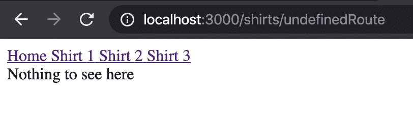

# 在 React 中使用动态路由

> 原文：<https://javascript.plainenglish.io/using-nested-routes-in-react-22f9d3fbcf06?source=collection_archive---------0----------------------->


今天，我们将讨论如何在 React 应用程序中实现动态路由。[这里的](https://github.com/jonathanbrierre/Sample-Shirt-Router)是这个演示的 GitHub repo 的链接。

这是最终应用程序的样子:


**假设:**

-您对 React 中的路由有基本的了解(使用 react-router-dom 包中的 BrowserRouter、Route、Switch 和 NavLink 组件。[点击此处](https://reacttraining.com/react-router/web/guides/quick-start)查找相关文档。)

-你了解状态、道具和组件操作。[点击此处](https://reactjs.org/docs/getting-started.html)查找相关文档。

首先，我将 react-router-dom 中的 BrowserRouter 组件实现到呈现我的应用程序组件的 index.js 文件中。这样做允许我在整个应用程序中设置路由。


在我的应用程序组件中，我手动定义了状态，如下所示:


通常，我会从一个外部/后端 API 获取来填充我的状态，尽管我这样定义状态是为了演示的目的。

因为这个 App 组件是一个类组件，所以我有一个 render 方法来返回我的导航栏组件，以及我的所有 route 组件。


这可能看起来有点多，不过让我们来分解一下。

在我的 NavBar 组件下面，有一个包含我的路由的 Switch 组件。这个开关组件告诉浏览器一次只能呈现一个组件。如果你想更深入地了解 Switch，请点击这里查看这篇博文。

在第 41 行，我们为 Home 组件定义了一个路由。它用“精确”关键字表示。这样做告诉 React 仅在 url 路径与定义的路径完全匹配时才呈现 Home 组件。在第 42 行，我们有允许每件衬衫渲染的动态路径。第 42 行将是我们这篇博文的重点。否则，如果输入的 URL 路由与这里定义的任何路由都不匹配，第 43 行将呈现一个 NotFound 组件。

第 42 行，我们将再次使用单个衬衫组件动态渲染我们的衬衫。

```
<Route path = ‘/shirts/:id’ render = {this.renderShirts} />
```

首先，我们定义这条路线将指向哪条路径。我们通过提供可选参数“shirts”和“:id”来实现这一点，id 是 URL 中使路由动态的部分。请注意，URL 的任何动态部分都必须用冒号表示。否则，它将被视为静态路由。我稍后会对此进行更深入的探讨。

在实现这些动态路径时，渲染属性也是必需的。render prop 接受回调函数，该函数可以接受通常称为 routerProps 的对象的参数。上面那行字也可以这样写:

```
<Route path = ‘/shirts/:id’ render = {routerProps => this.renderShirts(routerProps)} />
```

现在，当我们将这些路由器属性传递给我们的函数时，让我们首先在控制台记录它，看看我们收到了什么。


现在我们已经可以访问这个 routerProps 对象了，我们现在可以看到，当用户转到路由“/shirts/3”时，该路由会保存在 routerProps 中。我们现在可以研究这些 routerProps，并看到我们可以轻松地访问 match 下的 id 参数，然后访问 params 下的 id 参数。


这是可能的，因为我们在 Route 组件中定义了参数 id。如果我们试图设置不带冒号的参数:

```
<Route path = ‘/shirts/id’
```

那么我们的 routerProps 将不能像上面看到的那样检索输入 id。既然我们可以从 URL 中动态检索 id，现在我们可以向 renderShirts 函数添加更多的功能。


现在让我们浏览一下这个函数。

首先，我们通过调用 routerProps.match.params.id 上的 parseInt 从 URL 中检索 id —如果没有 parseInt，我们将检索一个字符串而不是一个整数。一旦我们将 id 作为一个整数检索出来，我们就将它保存到一个名为 shirtId 的变量中。

接下来，我们使用 find higher-order-function 遍历我们的状态，找到 id 等于 shirtId 的衬衫对象，并将其返回到一个新变量中。有关查找功能的更多信息，您可以[点击此处](https://www.w3schools.com/jsref/jsref_find.asp)。

现在，我们可以根据 find 方法是否返回任何内容，动态地将衬衫呈现到页面上。如果我们将一个有效的返回值保存到变量 foundShirt 中，那么我们将使用指向 foundShirt 对象的属性来呈现组件 Shirt。否则，如果 find 方法返回 undefined，那么 foundShirt 将指向 undefined，从而呈现我们的 NotFound 组件。



下面是用于渲染每件衬衫的衬衫组件的图片:


概括地说，我们使用动态路由在页面上动态呈现组件的能力对于我们在路由组件中使用呈现属性是至关重要的。使用这个渲染属性，我们可以访问 routerProps 对象，该对象包含我们在路由路径中设置的参数值。

如果你想查看 GitHub 回购的全部代码，你可以在这里找到它！

# 资源

[](https://github.com/jonathanbrierre/Sample-Shirt-Router) [## jonathanbrierre/样品衬衫路由器

### 这个项目是用 Create React App 引导的。在项目目录中，您可以运行:在…中运行应用程序

github.com](https://github.com/jonathanbrierre/Sample-Shirt-Router) [](https://www.w3schools.com/jsref/jsref_find.asp) [## JavaScript 数组 find()方法

### 组织良好，易于理解的网站建设教程，有很多如何使用 HTML，CSS，JavaScript 的例子…

www.w3schools.com](https://www.w3schools.com/jsref/jsref_find.asp) [](https://dev.to/danhjoo7/using-a-switch-component-in-react-router-d2k) [## 在 React 路由器中使用交换机组件

### 对于刚接触 React 的人来说，React 中的路由可能有点困难。它与路由非常不同…

开发到](https://dev.to/danhjoo7/using-a-switch-component-in-react-router-d2k) [](https://reacttraining.com/react-router/web/guides/quick-start) [## React 路由器:React 的声明式路由

### 学习一次，路线无处不在

reacttraining.com](https://reacttraining.com/react-router/web/guides/quick-start) [](https://reactjs.org/docs/getting-started.html) [## 开始行动-做出反应

### 用于构建用户界面的 JavaScript 库

reactjs.org](https://reactjs.org/docs/getting-started.html)