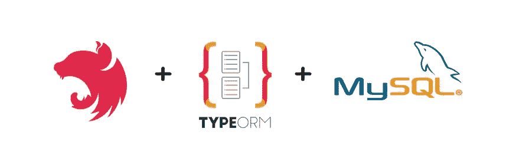
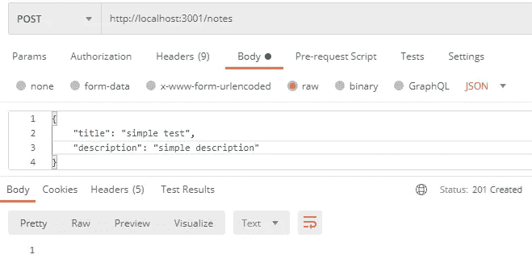
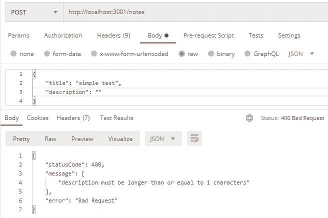

# 用 NestJS，MySQL，TypeORM 构建一个 Notes 应用程序

> 原文：<https://javascript.plainenglish.io/using-nestjs-mysql-typeorm-in-building-simple-notes-app-5cdbee9712e0?source=collection_archive---------0----------------------->



Nest (NestJS)是一个用于构建高效、可伸缩的 Node.js 服务器端应用程序的框架。

Nest 提供了开箱即用的应用程序架构，允许开发人员和团队创建高度可测试、可伸缩、松散耦合且易于维护的应用程序。

您应该考虑在您的项目中使用 NestJS 作为框架的主要原因是因为它非常强大，但使用起来非常友好，文档非常容易理解，提供非常简单的开发和测试，支持 Typescript 和 GraphQL 等。

在我们的项目中，我们将建立一个简单的存储和检索笔记的后端应用程序。

在本文的底部，您将找到示例代码，因此如果您在遵循本文中描述的步骤时遇到问题，您可以查看它。

为了创建新的嵌套应用程序，我们将安装嵌套 CLI 并执行创建新嵌套应用程序的命令:

```
npm i -g @nestjs/cli
nest new nestjs-mysql-typeorm-sample
```

并选择 *npm* 作为包管理器。

在应用程序中，我们将使用 MySQL 数据库，并将使用 TypeORM 库来存储和检索 MySQL 中的数据，因此我们需要调用以下命令来安装这些库:

```
npm install --save @nestjs/typeorm typeorm mysql
```

为了建立到 MySQL 的 TypeORM 连接，我们需要用适当的 MySQL 配置数据创建 *ormconfig.json* (请确保您指定了正确的用户名、密码和数据库名称):

TypeORM 配置数据将从 *ormconfig.json* 文件中加载，因此在主应用程序模块文件( *app.module.ts* 文件)中，我们必须通过调用不带任何选项的“forRoot”来导入“TypeOrmModule ”:

正如我们所见，NestJS 应用程序结构由三个核心文件组成:

*   **app.controller.ts** -单路基本控制器
*   **app.module.ts** -应用程序的根模块
*   **main.ts** -使用核心函数 *NodeFactory* 创建嵌套应用实例的应用的入口文件

因为我们的应用程序将只提供一个特性，即创建、更新、检索 notes 列表，所以我们将创建适当的 notes 模块、服务、提供者和控制器(所有这些都在单独的 notes 文件夹中)。通过这样做，我们清楚地将 notes 功能与应用程序可能具有的其他功能分开，并且我们使代码更干净，可读性更好。

我们将对模型字段进行一些验证，因此当用户试图在数据库中插入新的或编辑现有的 note 对象时，我们需要调用下面的 *npm* 命令，并安装将验证我们的模型对象的“类验证器”库:

```
npm install class-validator
```

我们还将安装“class-transformer”包，允许我们将普通对象转换为类的实例，反之亦然:

```
npm install class-transformer
```

在我们将要创建控制器、服务和其他类之前，让我们创建我们的主数据类， *Note* 实体对象(在‘notes/Note . entity . ts’文件中):

正如我们所看到的，*注意到*实体类包含不同的装饰者。与 TypeORM 相关的装饰器有:“@Entity”、“PrimaryGeneratedColumn”和“@Column”。与类验证器相关的装饰器是与数据类型和值验证相关的所有其他装饰器，例如“@MinLength”或“@IsString”。

我们要创建的下一个类是 notes 服务(' notes/notes.service.ts '文件)，它负责向我们的 notes 控制器提供在 MySQL 数据库中检索或存储数据的方法:

正如我们在 notes 服务中看到的，有许多方法负责从 MySQL 数据库中存储或检索 notes，所有这些都是通过使用 TypeORM 提供的存储库数据模式来完成的。

我们要创建的下一个类是 notes controller，他的主要职责是处理传入的请求并向客户端返回响应:

在构造函数中，我们注入了 notes 服务，它将通过 notes repository 处理 MySQL 数据库操作。服务中的每个方法都有自己合适的装饰器(比如' @GET ')，并被分配给这个装饰处理的合适方法。每个带 decorator 的方法都处理适当的 HTTP 方法调用(比如' @Get' decorator 处理' HTTP GET '调用)。

到目前为止，我们已经创建了 notes 控制器，它将处理传入的请求，并将返回响应和用于数据存储和检索的 notes 服务。

最后一部分是创建 notes 模块，它将使 notes 相关的依赖项组织在同一个文件下:

我们需要在 app 模块中导入 notes 模块:

在我们的应用程序的主入口文件(文件' main.ts ')中，我们需要设置应用程序使用' ValidationPipe '，这将确保所有端点都不会收到不正确的数据。此外，我们将启用“CORS ”,以便我们可以从前端应用程序访问后端应用程序端点。

确保端口设置为“3001”，因为我们将在[创建的前端应用程序将指向端口“3000”。](https://medium.com/@zoransasko/using-react-react-router-redux-redux-form-in-building-simple-notes-app-fd3114f5131a)

现在，我们已经准备好了后端应用程序运行所需的一切，我们可以通过调用以下命令来启动它:

```
npm start
```

我们可以试着通过邮递员插入新邮件:



我们还可以通过提供无效的“描述”数据来检查验证是否有效:



恭喜你，我们已经成功创建了 NestJS 后端应用程序，它可以存储和读取 MySQL 数据库中的数据。

在下一篇文章中，我们将探讨如何在 React 前端应用程序中显示 notes 数据:

[](https://medium.com/@zoransasko/using-react-react-router-redux-redux-form-in-building-simple-notes-app-fd3114f5131a) [## 使用 React、React Router、Redux、Redux 表单构建简单的 Notes 应用程序

### 首先，我们将通过调用以下 npm 命令初始化 React 项目:npx create-react-app…

medium.com](https://medium.com/@zoransasko/using-react-react-router-redux-redux-form-in-building-simple-notes-app-fd3114f5131a) 

本文构建的示例应用程序的源代码:[https://github.com/zsasko/nestjs-mysql-typeorm-sample](https://github.com/zsasko/nestjs-mysql-typeorm-sample)

喜欢这篇文章吗？如果有，通过 [**订阅获取更多类似内容解码，我们的 YouTube 频道**](https://www.youtube.com/channel/UCtipWUghju290NWcn8jhyAw) **！**