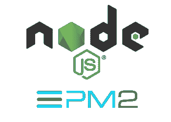

# 在生产中使用 Node.js(第一部分)

> 原文：<https://javascript.plainenglish.io/using-node-js-in-production-i-e747e4091934?source=collection_archive---------3----------------------->

## 如何将 Node.js 应用程序部署到生产环境中，并拥有从开发到部署的健壮管道

这是系列的第一部分，我们将看看 PM2 作为一个过程管理器帮助扩展我们的应用程序。

[](https://github.com/RyanDsilva/nodejs-in-production) [## RyanDsilva/生产中节点

### gear:在生产中部署 Node.js 应用程序的分步指南:gear:-RyanDsilva/nodejs-in-production

github.com](https://github.com/RyanDsilva/nodejs-in-production) 

我们许多人在构建后端服务器时选择 Node.js 作为我们的运行时，原因有很多——它速度快，使用 JavaScript，npm 生态系统无与伦比。但是我们大多数人让我们的应用程序只使用默认配置，运行—

```
node server.js
```

虽然这很容易，但由于 Node.js 的单线程性质，它是不可伸缩的。在大多数情况下，部署系统/虚拟机将有不止一个可用线程，运行默认命令将导致可用资源的次优使用，因为只有一个线程用于运行这个 Node.js 进程。理想情况下，您希望运行的 Node.js 进程的数量与您可用的内核/线程的数量一样多(对于 monolith 应用程序)。

这就是 PM2 出手相救的地方。PM2 是 Node.js 应用程序的生产流程经理。使用 PM2 有很多优点——运行多个 Node.js 实例、高级监控和日志记录、正常重启等。


PM2 — Production-grade process manager for Node.js

我们将使用一个虚拟的 Node.js 应用程序，它是我为了这个演示的目的而构建的。你可以找到任何 PM2 配置之前的初始状态，[这里](https://github.com/RyanDsilva/nodejs-in-production)。根据您阅读这篇文章的时间,`master`分支将始终保存项目的最新状态，因此要找到初始代码，请切换到`initial`分支。对于本教程，我们将在`pm2`分公司工作。

首先，我们需要将 PM2 设置为一个全球依赖项。为此:

```
npm i -g pm2@latest
```

*有些人可能不得不使用* `*sudo*` *来运行这个命令。*

另外，你可能想做的另一件事是让 PM2 在系统启动时加载，这取决于你使用的操作系统，情况可能会有所不同。但幸运的是，PM2 也为你提供了保障:

```
pm2 startup
```

这将打印出您需要运行的命令，该命令将使 PM2 在系统启动时加载。这个命令需要你使用`sudo`

现在，我们已经可以运行 Node.js 应用程序的多个实例，只需从命令行使用 PM2，在参数中指定配置

```
pm2 start server.js -i 0
```

该命令将启动与可用线程/内核数量一样多的 Node.js 进程。可选地，您可以通过用您喜欢的任何数字替换 0 来定制进程的数量。

您应该知道的有用的附加命令包括—

```
# List all processes
pm2 list# Monitoring
pm2 monit# Stop All Processes
pm2 stop all# Delete All Processes
pm2 delete all# Start All Processes
pm2 start all
```

虽然这样做效果很好，但我喜欢一种更加定制的方法，我们可以使用一个名为`ecosystem.config.js`的文件来实现，我们可以使用`pm2 ecosystem`
轻松地生成一个样板文件。在这个示例中，我们不会使用该文件的`deploy`部分，所以我们可以删除它。我们将把`ecosystem.config.js`修改成这样——

好吧，这有很多术语要解释，但我们会解决的。`apps`列表包含我们想要运行的所有 Node.js 应用程序的列表，在我们的例子中，这只是我们拥有的一个应用程序。让我们看看`apps`列表中对象的属性。

*   ***名称*** 是指 PM2 将引用的应用程序的名称。这将显示在进程列表中。
*   ***脚本*** 是应用的起点，对于我们来说就是`server.js`文件。
*   ***实例*** 是指 PM2 产生的 Node.js 进程的数量，可以是任意数量。将其设置为 *max* 会产生与线程/内核数量相等的进程。
*   ***exec_mode*** 是一个属性，它允许我们的 Node.js 应用程序通过将其设置为`cluster`模式来跨 CPU 内核扩展。通过这样做，我们基本上实现了“负载平衡”来提高应用程序的性能。
*   下一个对象是应用程序的环境变量，我们可以根据需要拥有任意多的环境变量，每个变量都以 ***env_**** 开头。在这种情况下，我们有两个端口*端口*和*节点 _ 环境*。

这是我们运行应用程序所需的所有配置。现在让我们修改`package.json`文件中的启动脚本来使用 PM2。

```
start: "pm2 start ecosystem.config.js --env production"
```

恭喜你！这样，Node.js 应用程序就可以扩展到使用所有可用的 CPU 内核以及额外的功能，如正常关机/重启、监控等。

非常感谢你能走到这一步，我希望这是有用的。请分享这一点，并感谢任何反馈。第 2 部分见。

[](https://medium.com/@ryan.dsilva/using-node-js-in-production-ii-c3906990e61e) [## 在生产中使用 node . js—II

### 这是如何将 Node.js 应用程序部署到生产环境中的系列文章的第 2 部分

medium.com](https://medium.com/@ryan.dsilva/using-node-js-in-production-ii-c3906990e61e)