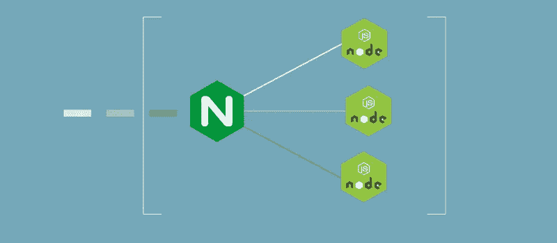

# 在生产中使用 Node.js(第二部分)

> 原文：<https://javascript.plainenglish.io/using-node-js-in-production-ii-c3906990e61e?source=collection_archive---------7----------------------->

## 如何将 Node.js 应用程序部署到生产环境中，并拥有从开发到部署的健壮管道

这是关于如何将 Node.js 应用程序部署到生产环境中的系列文章的第 2 部分，以便从开发到部署有一个健壮的管道。在这一部分，我们将把 NGINX 设置为反向代理，并做一些基本的负载平衡。

如果您还没有阅读第 1 部分，我强烈建议您这样做，以确保您对本文有一个相关的背景。你可以在这里阅读:

[](https://medium.com/@ryan.dsilva/using-node-js-in-production-i-e747e4091934) [## 在生产中使用 node . js—I

### 这将是一个关于如何将 Node.js 应用程序部署到生产环境中并拥有一个健壮的…

medium.com](https://medium.com/@ryan.dsilva/using-node-js-in-production-i-e747e4091934) 

首先，让我们清除我在这篇文章的描述中使用的术语。什么是反向代理？首先，什么是代理？

*代理服务器是一种中介服务器，它将来自多个客户端的内容请求通过互联网转发到不同的服务器。* ***反向代理服务器*** *是一种代理服务器，通常位于私有网络中的防火墙之后，并将客户端请求定向到适当的后端服务器。反向代理提供了额外的抽象和控制级别，以确保客户端和服务器之间的网络流量顺畅流动。*

简单地说，它位于客户机和主服务器之间，将客户机的请求转发给服务器，并将服务器的响应返回给客户机，还有一些额外的好处。

## 什么是负载平衡？

*负载平衡指的是将一组任务分配给一组资源的过程，目的是使它们的整体处理更加高效。*

好吧，那我们为什么需要这些东西？

嗯，主要有两个原因:

1.  每当我们运行任何服务器端应用程序时，端口 80(默认 HTTP 端口)是禁止使用的，除非您是 root 用户，而在部署应用程序时，您不应该是 root 用户。因此，您必须在另一个可用端口上运行您的应用程序— 3000、5000、8080 等。所以每当你的应用程序需要被访问时，用户必须使用`http://yourwebsite.com:PORT`，这不是特别好。为了避免这种情况，我们使用一个运行在默认端口 80 上的 web 服务器，它位于 Node.js 应用程序的前面。web 服务器只是在内部将端口 80 上的传入请求代理给运行在我们定义的任何端口上的 Node.js 应用程序，并以同样的方式返回响应。这允许我们通过访问`http://yourwebsite.com`在默认端口 80 上发送和接收数据
2.  Node.js 应用程序是单线程的，因此如果您的服务器上有多个线程(大多数情况下都是这样)，您就没有有效地利用服务器资源。为了克服这个问题，我们使用像 PM2 这样的进程管理器运行 Node.js 的多个实例(阅读第 1 部分以了解更多信息),来运行与您可用的线程/内核数量相等的 Node.js 进程。然后，web 服务器接收传入的请求，并将其分发到当前空闲的 Node.js 进程，这有助于为更多的请求提供服务，而不仅仅是运行一个实例。

因此，为了完成这两件事，我们将使用 [NGINX](https://www.nginx.com/) ，一个经过测试的网络服务器，可以充当反向代理和负载平衡器等许多其他功能。



Image Credit — radiostudio.io

但是首先，我们需要在我们的服务器上安装 NGINX。我在这个例子中使用的是 CentOS 8，但是对于任何基于 Linux 的操作系统来说，步骤都是相似的，只不过在依赖管理器中做了适当的修改。

```
sudo yum install -y epel-release
sudo yum install -y nginx
```

对于 Ubuntu:

```
sudo apt update
sudo apt install nginx
```

下一个合乎逻辑的步骤是注册 NGINX 以便在系统启动时加载，为此，我们将使用:

```
sudo systemctl start nginx
sudo systemctl enable nginx
```

您可以使用以下命令检查正在运行的 NGINX 服务的状态:

```
sudo systemctl status nginx
```

这样，NGINX 就可以使用 NGINX 附带的默认配置在您的服务器上安装和运行了。你可以通过点击你的服务器的 IP 地址来验证这一点，你会看到默认的 NGINX 登陆页面。

现在，是时候根据我们的需要配置 NGINX 了，但在此之前，我们需要知道配置文件存储在哪里。默认的 NGINX 配置位于`/etc/nginx/nginx.conf`中，有一个通配符匹配的 include 脚本，其中包含了来自— `/etc/nginx/conf.d/*.conf`的任何子配置

因此，我们将在该目录下创建一个新文件— `touch /etc/nginx/conf.d/nodejs.conf`,并将以下配置复制到这个新创建的文件中。

好的，同样，我将详细介绍和解释许多配置。

***上游名称*** —该块定义了我们想要代理的不同应用程序。在这种情况下，我们有两个应用程序正在运行，一个在端口 5000 上，另一个在端口 5001 上。

***服务器*** —该块定义了应用于我们代理的每个应用程序的设置。

*   *监听* —这定义了 NGINX 监听的端口。定义了 IPv4 和 IPv6 两种类型。因此有两个 listen 指令。
*   *服务器名称* —这是您的服务器的域名/IP 地址
*   *root* —这是存储应用程序的根文件夹

*接下来的三个指令是可选的，但是强烈推荐。因为 NGINX 在内部将请求路由到我们的 Node.js 应用程序，所以我们的 Node.js 应用程序看到所有来自* `*localhost*` *的请求。因此，为了传递关于请求资源的实际 IP 地址的信息，我们将****proxy _ headers****添加到请求中。*

*   *位置路线* —定义了所有需要代理的路线。`/`意味着所有的请求都将被代理。proxy_pass 属性定义了被代理的请求应该去哪里，注意我们在这里使用了上游名称。通过这样做，NGINX 会根据哪个上游服务器可用，自动为我们进行负载平衡。

现在，我们将首先检查我们的 NGINX 配置是否有任何错误，因为在生产部署中，该文件中的错误直接等于应用程序停机时间，也就是损失。所以我们使用—

```
sudo nginx -t
```

如果一切正常，那么我们使用 *systemctl:* 重启/重新加载 NGINX 来应用这些新的更改

```
sudo systemctl reload nginx
```

就这样，你做到了！您的 Node.js 应用程序现在已经正确地实现了负载平衡，并通过反向代理提供服务。

现在一切都好了，一切都将正常工作，直到你遇到一个用例，其中你必须利用 WebSockets，突然如果你使用这种配置，WebSockets 似乎不工作。嗯，很奇怪，不是吗？好吧，让我们看看我们是否能找出为什么它不起作用—

*WebSockets 依靠* ***逐跳 HTTP 头*** *尤其是(* ***连接*** *和* ***升级*** *)，而这些头* *是无法通过代理转发的。它们依赖于握手机制，该机制必须与服务器实例保持一致。*

阅读这篇令人惊叹的文章，了解更深入的解释:

[](https://blog.usejournal.com/how-to-proxy-websockets-with-nginx-e333a5f0c0bb) [## 如何用 Nginx 代理 web sockets？

### 必须配置的 web 套接字头是什么？

blog.usejournal.com](https://blog.usejournal.com/how-to-proxy-websockets-with-nginx-e333a5f0c0bb) 

因此，为了解决这个问题，我们必须稍微修改我们的 NGINX 配置，并引入一些额外的指令:

好吧，让我们看看发生了什么变化:

*   *ip_hash* —这确保了来自一个客户端的所有请求都根据客户端的 ip 地址发送到同一个服务器实例
*   *location /socket.io/* —该块定义了 WebSockets 正常工作所需的额外头文件— ***Connection*** 和 ***Upgrade*** ，并且还将 HTTP 版本设置为 1.1，该版本通过 HTTP 支持 WebSockets。

太好了！所以现在让我们测试并重新加载 NGINX 和 boom，一切正常！

恭喜你！这样，Node.js 应用程序就实现了负载平衡，并通过 NGINX 反向代理提供服务，Web 套接字得到正确处理。在下一篇文章中，我们将扩展这个 NGINX 配置，以包括 HTTPS 和 gzip 压缩。

要找到这种状态下的代码，请导航到 GitHub 库的`nginx-1`分支:

[](https://github.com/RyanDsilva/nodejs-in-production) [## RyanDsilva/生产中节点

### ⚙️在⚙️生产环境中部署 Node.js 应用程序的分步指南在生产环境中使用 Node.js(第一部分)

github.com](https://github.com/RyanDsilva/nodejs-in-production) 

非常感谢你能走到这一步，我希望这是有用的。请分享这一点，并感谢任何反馈。第 3 部分见。

[](https://medium.com/javascript-in-plain-english/using-node-js-in-production-part-iii-5a7a3f2fe942) [## 在生产中使用 Node.js(第三部分)

### 如何将 Node.js 应用程序部署到生产环境中，并拥有一个从开发到应用的健壮管道…

medium.com](https://medium.com/javascript-in-plain-english/using-node-js-in-production-part-iii-5a7a3f2fe942) 

[1]NGINX Glossary—[https://www . NGINX . com/resources/Glossary/reverse-Proxy-server/](https://www.nginx.com/resources/glossary/reverse-proxy-server/)
【2】负载平衡—维基百科—[https://en . Wikipedia . org/wiki/Load _ Balancing _(计算)](https://en.wikipedia.org/wiki/Load_balancing_(computing))
【3】代理 Web Sockets with NGINX—[https://blog . use journal . com/how-to-Proxy-Web Sockets-with-NGINX-e 333 a5 f 0 c 0 bb](https://blog.usejournal.com/how-to-proxy-websockets-with-nginx-e333a5f0c0bb)