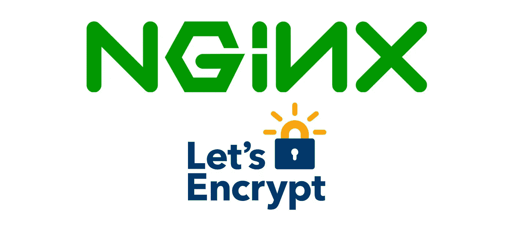
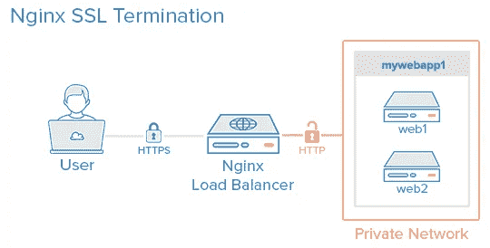

# 在生产中使用 Node.js(第三部分)

> 原文：<https://javascript.plainenglish.io/using-node-js-in-production-part-iii-5a7a3f2fe942?source=collection_archive---------6----------------------->

## 如何将 Node.js 应用程序部署到生产环境中，并拥有从开发到部署的强大管道

如果您还没有阅读第 2 部分，我强烈建议您这样做，以确保您有一个与本文相关的上下文。你可以在这里读到它——

[](https://medium.com/@ryan.dsilva/using-node-js-in-production-ii-c3906990e61e) [## 在生产中使用 node . js-II

### 这是关于如何将 Node.js 应用程序部署到生产环境中的系列文章的第 2 部分，以便拥有一个健壮的……

medium.com](https://medium.com/@ryan.dsilva/using-node-js-in-production-ii-c3906990e61e) 

好的，如果你已经跟随这个系列，我们现在有了我们的 Node.js 应用程序负载平衡和 NGINX 作为我们的反向代理。在这一部分，我们将通过使用 gzip 压缩来优化我们的服务器，并通过使用我们自己的来自“让我们加密”的 SSL 证书来强制实施 HTTPS 来保护所有端点。



Image Credit — Chris Sanity

那么，为什么要压缩呢？压缩使我们能够更有效地使用网络带宽，并减少客户端必须接收的有效负载大小。但是，为什么要在 NGINX 上使用压缩呢？因为 express 有一个非常方便的模块，可以作为一个中间件，您只需要使用——`npm install --save compression`安装它，然后像这样使用它

```
const compression = require('compression');
...

app.use(compression());

...
```

虽然这没问题，但不是最佳解决方案。这是因为 Node.js 是一个单线程任务，并且压缩是资源密集型的，因此会使 Node.js 应用程序长时间处于繁忙状态，这使得服务器对新的传入请求没有响应。这就是为什么将压缩卸载到 NGINX 是一种好的做法，因为 NGINX 更适合处理这类任务，同时保持 Node.js 实例可以自由接受和处理新的请求。

幸运的是，在 NGINX 中使用压缩非常容易。

在服务器块中—

*   *gzip****on****——这告诉 NGINX 使用 gzip 压缩*
*   **gzip _ TYPES****MIME _ TYPES***——这将告诉 NGINX 需要压缩哪些类型的数据*
*   **gzip _ comp _ level****N***——表示压缩级别，1 表示最小压缩，10 表示最大压缩*
*   **gzip _ min _ length****VALUE***——指定压缩开始后的最小数据大小(该值以字节为单位)*

*就这样！不需要其他配置。NGINX 现在将压缩响应数据，您可以通过查看响应头来验证这一点。*

*现在，如果您注意到我们的应用是通过`http`而不是`https`提供服务的，对于生产环境来说，保护数据流是至关重要的。本教程的这一部分将对 NGINX 指令进行概要介绍，因为深入研究这些指令需要计算机网络、网络安全和密码学领域的先验知识。*

*但是，如果你对细节感兴趣，这篇文章会给你一个很好的开始*

*[](https://robertheaton.com/2014/03/27/how-does-https-actually-work/) [## HTTPS 实际上是如何工作的？罗伯特·希顿

### HTTPS 只是你的标准 HTTP 协议，涂上一层美味的 SSL/TLS 加密善良…

robertheaton.com](https://robertheaton.com/2014/03/27/how-does-https-actually-work/) 

也就是说，我将一步一步地为我们的 Node.js 应用程序使用 NGINX 设置 HTTPS。

首先，我们将从[获取我们的 SSL 证书，让我们加密](https://letsencrypt.org/)。

> “Let's Encrypt”是一个由互联网安全研究小组运营的非营利性证书颁发机构，免费提供传输层安全加密的 X.509 证书。证书的有效期为 90 天，在此期间可以随时更新。

幸运的是，有一个名为 [CertBot](https://certbot.eff.org/) 的自动化解决方案，它可以为我们完成所有繁重的工作，并通过一个简单的命令生成证书。让我们先安装 CertBot

```
sudo yum install certbot
```

在那之后，我们可以跑—

```
certbot certonly --standalone -d DOMAIN_NAME
```

该命令将生成唯一标识我们的证书和私钥。它将存储在`/etc/letsencrypt/live/DOMAIN_NAME/`下，你会发现两个文件——`fullchain.pem`和`privkey.pem`

完成后，我们现在可以将以下配置指令添加到 NGINX 配置文件中。

几个要点—

*   在第一个服务器块中，来自`http`即端口 80 的请求将全部转发/重定向到`https`，状态码为 *301*
*   在第二个服务器模块中，使用的端口是 443，这是`https`的默认端口，之后，我们按照优先级、`ssl`和`http2`的顺序定义协议
*   要更改的两个指令是`ssl_certificate`和`ssl_certificate_key`，它们应该指向 certbot 为您的域生成的密钥和证书。

如果您是高级用户，其他指令可能会让您感兴趣，您可能希望根据应用程序的需要对它们进行调整。但是对于这一点，这已经超出了本教程的范围，默认配置应该就可以了。

我们最终的 NGINX 配置文件应该是这样的—

概略地说，我们的部署可以这样来看—



Image Credit — DigitalOcean

太好了！现在，重启 NGINX 就大功告成了。在访问您的应用程序时检查*“绿锁”*，并检查通过`http`的访问是否会将您重定向到`https`

恭喜你！这样，现在就有了 Node.js 应用程序，它通过 NGINX 服务器在 HTTPS 上提供服务，并对响应应用 gzip 压缩。

非常感谢你能走到这一步，我希望这是有用的。请分享这一点，并感谢任何反馈。

要找到这个状态下的代码，请导航到 GitHub 库的`nginx-2`分支——

[](https://github.com/RyanDsilva/nodejs-in-production) [## RyanDsilva/生产中节点

### gear:在生产中部署 Node.js 应用程序的分步指南:gear:-RyanDsilva/nodejs-in-production

github.com](https://github.com/RyanDsilva/nodejs-in-production) 

[1]让我们加密(维基百科)——[https://en.wikipedia.org/wiki/Let's_Encrypt](https://en.wikipedia.org/wiki/Let's_Encrypt)*