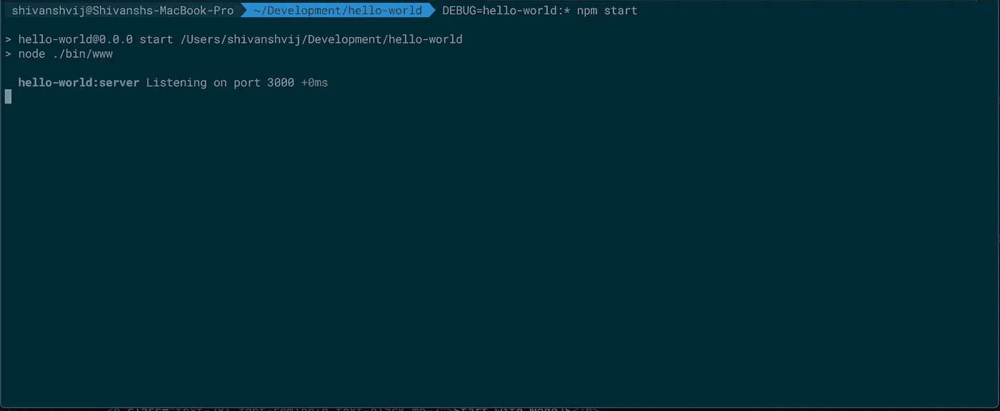
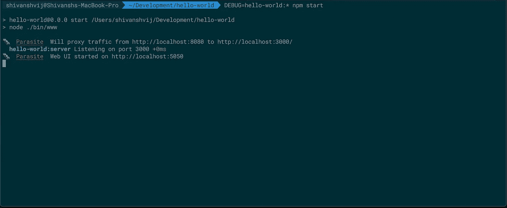
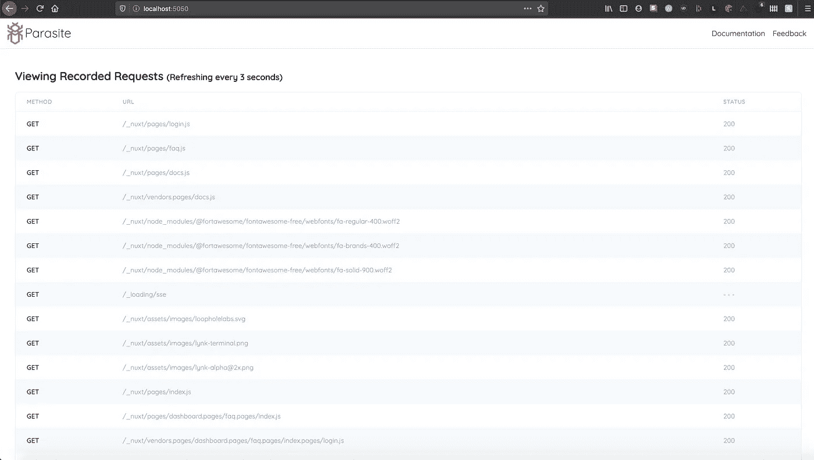

# 使用寄生虫调试 NodeJS 应用程序

> 原文：<https://javascript.plainenglish.io/using-parasite-to-debug-nodejs-applications-8c9445358708?source=collection_archive---------4----------------------->


我最近花了很多时间为 [Lynk](https://lynk.sh) 开发新功能，我们最需要的功能是请求捕获和回放。这意味着能够看到通过 Lynk 隧道的单个 HTTP 请求和响应(更多信息请见[此处](https://lynk.sh/docs))，而且能够在您更改代码时重放它们，而不必每次都通过 web 浏览器。

这个特性在开发 REST APIs 时特别有用，因为它允许您快速查看应用程序如何响应代码的各种迭代。 [Ngrok，](https://ngrok.com)Lynk[Lynk](https://lynk.sh)的现有替代品已经提供了这一功能(包括请求回放)，因此为即将到来的测试版开发这一功能是有意义的。

然而，我们不想让这个特性仅限于 Lynk。拥有通过后端 API 和前端 UI 捕获和重放请求的能力对于许多应用程序来说是有意义的——不管它们是否通过 Lynk 托管。

这就是为什么开发[寄生虫](https://parasite.sh)是有意义的——一个独立的代理服务器，允许您拦截、记录和重放传入的 HTTP 流量。它在我们的 Github 上也是完全开源的。

寄生虫也可以作为一个 [NPM 包](https://www.npmjs.com/package/@loophole-labs/parasite)获得，今天我将带你在 ExpressJS API 中嵌入它。

# **设置 ExpressJS 项目**

对于本教程，我们将建立一个快速 ExpressJS hello-world 项目，我们可以将寄生虫嵌入其中。为此，首先确保您拥有 NodeJS v12.0.0 或更高版本:

```
$ node --version
v12.0.0
```

和 NPM 版本 6.9.0 或更高版本:

```
$ npm --version
6.9.0
```

然后使用`npx express generator`启动 hello-world ExpressJS 项目:

```
$ mkdir hello-world
$ cd hello-world
$ npx express-generator
```

这将为您创建必要的样板文件。要启动服务器，只需运行:

```
$ npm install
$ DEBUG=hello-world:* npm run start
```

或者用纱线:

```
$ yarn install
$ DEBUG=hello-world:* yarn start
```

这将在 [http://localhost:3000](http://localhost:3000) 上启动一个本地开发服务器。



当你完成的时候关闭它，因为我们将会修改服务器来启动里面的寄生虫。

# **安装寄生**

虽然寄生虫是用 NodeJS 编写的，但我们决定[也将它作为打包的二进制文件](https://parasite.sh/?p=1)提供给无法安装 NodeJS 的环境。

然而，对于本教程，我们将在生成的 ExpressJS 项目中安装 NPM 包:

```
$ npm install @loophole-labs/parasite
```

或者，如果你喜欢纱线:

```
yarn add @loophole-labs/parasite
```

现在我们需要修改先前生成的`app.js`,在某处包含以下几行:

```
var Parasite = require('@loophole-labs/parasite');                 
var parasite = new Parasite();
```

您的最终`hello-world/app.js`应该如下所示:

```
// hello-world/app.js                 

var Parasite = require('@loophole-labs/parasite');                 
var parasite = new Parasite();                 

var createError = require('http-errors');                 
var express = require('express');
var path = require('path');                 
var cookieParser = require('cookie-parser');                 
var logger = require('morgan');                 
var indexRouter = require('./routes/index');                 
var usersRouter = require('./routes/users');                 
var app = express();                 
// view engine setup                 
app.set('views', path.join(__dirname, 'views'));                 
app.set('view engine', 'jade');                 
app.use(logger('dev'));                 
app.use(express.json());                 
app.use(express.urlencoded({ extended: false }));                 
app.use(cookieParser());                 
app.use(express.static(path.join(__dirname, 'public')));                 
app.use('/', indexRouter);                 
app.use('/users', usersRouter);                 
// catch 404 and forward to error handler                 
app.use(function(req, res, next) {                 
	next(createError(404));                 
});                 
// error handler                 
app.use(function(err, req, res, next) {                 
	// set locals, only providing error in development                 
	res.locals.message = err.message;                 
	res.locals.error = req.app.get('env') === 'development' ? err : {};                 
	// render the error page                 
	res.status(err.status || 500);                 
	res.render('error');                 
});                 
module.exports = app;
```

**就这样。寄生虫现在已经嵌入到你的 ExpressJS 应用中了。**

使用`DEBUG=hello-world:* npm run start`或`DEBUG=hello-world:* yarn start`启动应用程序备份，您将看到寄生虫在 [http://localhost:8080](http://localhost:8080) 创建一个代理，并将流量转发到您的 ExpressJS 应用程序(它仍然运行在端口 3000 上)。



您还会看到 Web UI 从 [http://localhost:5050](http://localhost:5050) 开始，所有捕获的流量都将在这里显示。您还可以从这里重放请求:



以及直接通过位于[http://localhost:5050/API](http://localhost:5050/api)的后端 API。

感谢阅读！请访问我们的[文档](https://parasite.sh)了解更多信息，或通过`shivanshvij@loopholelabs.io`联系我。如果你遇到任何问题，在 https://github.com/loophole-labs/parasite[提出问题。](https://github.com/loophole-labs/parasite)

你可以在`[https://shivanshvij.com](https://shivanshvij.com)`找到更多关于我的信息，在 [https://lynk.sh](https://lynk.sh) 找到更多关于 Lynk 的信息。

我们也将在接下来的几周内开始关闭 [https://pigeonpost.io](https://pigeonpost.io) ，请加入我们的邮件列表，随时了解最新消息！

## **用简单英语写的 JavaScript 笔记**

我们总是有兴趣帮助推广高质量的内容。如果你有一篇文章想用简单的英语提交给 JavaScript，用你的中级用户名发邮件到[**submissions@javascriptinplainenglish.com**](mailto:submissions@javascriptinplainenglish.com)给我们，我们会把你添加为作者。

我们还推出了三种新的出版物！请关注我们的新出版物:[**AI in Plain English**](https://medium.com/ai-in-plain-english)[**UX in Plain English**](https://medium.com/ux-in-plain-english)[**Python in Plain English**](https://medium.com/python-in-plain-english)**——谢谢，继续学习！**