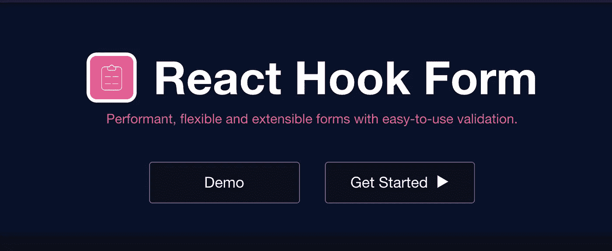
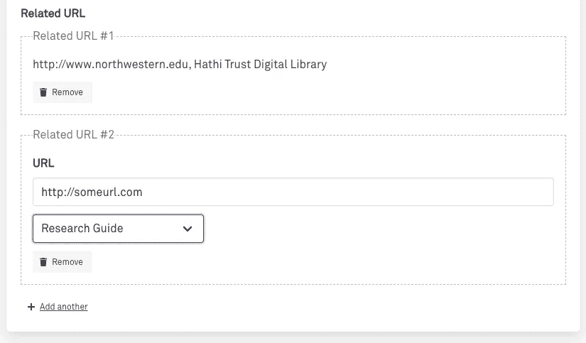

# 在组件测试中使用 React 钩子形式

> 原文：<https://javascript.plainenglish.io/using-react-hook-form-in-component-tests-497180abf3c0?source=collection_archive---------2----------------------->



React Hook Form 是一个非常有用的包，可以构建从简单到复杂的 web 表单。本文展示了我们团队组织和测试嵌套表单组件的方法，使用 React Hook 表单的`<FormProvider />`和`useFormContext()`钩子，然后用[测试库](https://testing-library.com/)测试表单组件。

# 标准反应挂钩形式设置

当我们的表单很小并且正在原型化时，按照 React Hook 表单的[文档](https://react-hook-form.com/get-started)以标准方式初始化它是合理的。

```
import React from "react"; 
import { useForm } from "react-hook-form";export default function App() { 
  const { register, handleSubmit, watch, errors } = useForm();
  const onSubmit = data => console.log(data); return (
    <form onSubmit={handleSubmit(onSubmit)}>
      <input name="firstName" defaultValue="Zoe" ref={register} />
      <input type="submit" />
    </form>
  );  

}
```

# 组织复杂的表单

随着数据收集应用程序的增长，每个表单中深度嵌套的子组件的数量也会增加。创建嵌套组件对于组织表单内容、重用代码、维护可访问性以及在整个应用程序中加强一致的样式非常有用。

这里有一个普通的例子来说明我们的一些表单是如何设置的。我们的存储库应用程序包含有 30-50 个元素的元数据表单，从简单的输入，到提前输入下拉列表，到字段数组(多值)输入，等等。

我们把复杂的、单一的形式分成几个部分。

```
// The form
<form onSubmit={handleSubmit(onSubmit)}> {/* Won't repeat, but initially we explicitly drilled React Hook Form props down to any and all child components which may need them.  Not good:) */}
  <CoreMetadata register={register} errors={errors} {...etc} />

  <ControlledTerms />
  <DescriptiveMetadata />
  ...
  <input type="submit" />
</form>
```

截面组件:

```
// CoreMetadata.js
...
return (
  <>
   <SubCategory1 register={register} errors={errors} {...etc} />
   <SubCategory2 />
   <SubCategory3 />
  </>
);
```

嵌套组件:

```
// SubCategory1.js
...
return(
  <>  
    <UIFormInput name="yo" required register={register} errors={errors} />
    <UIFormSelect name="bigList" options={listOfOptions} required />

    {/* Maybe some element goes here which dynamically renders depending on form values or state of the form? */}
  </>
);
```

最后是一个“叶级”子组件，我们将 React Hook Form 连接到 Form 元素。

```
// UIFormInput.js

function UIFormInput({name, type, register, errors}) {
  return (
    <>
      <input 
        name={name} 
        type={type} 
        ref={register && register({ required })} 
        className={`input ${errors[name] ? "is-danger" : ""}`
        {...passedInProps} 
      />{errors[name] && (
        <p data-testid="input-errors" className="help is-danger">
          {label || name} field is required
        </p>
      )}
    </>
  );
}
```

最初的向下钻取模式将钩子形式的方法作为`props`反应到组件堆栈中的每个子组件，这种模式被一遍又一遍地复制，我们复制了这种低效的模式，因为它工作得很好，但感觉不太好。

# 使用 FormContext 进行救援

最近，我们将 React Hook 表单实现和子组件转换为使用 [useFormContext](https://react-hook-form.com/api#useFormContext) 。由于我们倾向于使用自己的组件库并寻找一致的解决方案，现在我们用上下文来设置表单:

```
// Updated Form
import React from "react"; 
import { useForm, FormProvider } from "react-hook-form";export default function App() { 
  const methods = useForm();
  const onSubmit = data => console.log(data);return(
    <FormProvider {...methods}>
      <form onSubmit={handleSubmit(onSubmit)}>
        <CoreMetadata {...PASS_WHATEVER_PROPS_HERE} />
        <ControlledTerms />
        <DescriptiveMetadata />
      </form>
    </FormProvider>
  );  

}
```

这种方法遵循 React 上下文/提供者模式，如果需要，祖先树中的任何子组件都可以从上下文中获取 React 钩子。不在乎`register`或者`error`的中级组件被解放出来，从行李道具中解放出来。

```
import React from "react";
import { useFormContext } from "react-hook-form";const UIFormInput = ({ name, required, ...passedInProps}) => { 
  // All these values are from the component's parent <form />
  const { control, errors, register } = useFormContext(); return (
    <>
      <input 
        name={name} 
        ref={register({ required })} 
        className={`input ${errors[name] ? "is-danger" : ""}`
        {...passedInProps} 
      /> {errors[name] && (
        <p data-testid="input-errors" className="help is-danger">
          {label || name} field is required
        </p>
      )}
    </>
  );
}
```

那么，如果您的应用程序中有多个表单呢？使用 React Hook 表单上下文，无论组件位于哪个表单中，都是组件通过钩子接收的表单数据。这也通过将任何想要的上下文形式传递到每个测试中，设置了更容易测试的组件。

# 测试

好了，现在我们组件中的代码少多了。[看看这个 PR](https://github.com/nulib/meadow/pull/1239/files) 。哇，好多了。让我们继续用[测试库](https://testing-library.com/)测试 React Hook Form `useContext()`组件。

这个`renderWithReactHookForm`助手函数的行为与其他测试库方法的行为相同，通过返回测试库的`render()`函数将返回的内容。例如[这是测试库用 React 路由器包装的方法。](https://testing-library.com/docs/example-react-router)

使用`renderWithReactHookForm`的样本测试可能看起来像:

在上面的测试中，我们用 React Hook 表单的`<FormProvider />`包装了正在测试的组件，并且可以用一些默认值初始化表单。

为什么这会有帮助？

**使用默认值渲染**

假设您有一个收集值列表的表单，但是有起始值。(我们也有相当数量的复杂表单实现，它们利用了 React Hook 表单的 [useFieldArray 钩子](https://react-hook-form.com/api#useFieldArray))。

因此，表单数据可能如下所示:

```
// Super simplified example HTML
<input name="multiValueField[0].url" />
<select name="multiValueField[0].category>
  ...
</select> // How React Hook Form keeps track of the form data
multiValueField[0].url
multiValueField[0].category
multiValueField[1].url
multiValueField[1].category...and so forth
```



`<UIFormRelatedURL />`表单组件显示从 API 获取的现有值的列表，用户可以删除这些值。用户还可以随意添加任意多的附加值。在测试中，我们将默认值注入 React Hook 形式，与代码实际做的一样。因此我们可以测试我们的组件实际上显示了正确的起始值。

# 与其他供应商联合

假设您在应用程序中使用其他工具，如 GraphQL w/ Apollo Client 或 React Router，您的应用程序如下所示:

```
...export default class Root extends React.Component {
  render() {
    return (
      <ReactiveBase
        app={ELASTICSEARCH_INDEX_NAME}
        url={ELASTICSEARCH_PROXY_ENDPOINT}
      >
        <AuthProvider>
          <BatchProvider>
            <BrowserRouter>
              <Switch>
                <Route exact path="/login" component={Login} />    
                <PrivateRoute exact path="/project/list" component={ScreensProjectList}
                />
                ...
```

如果你正在测试一个被其他测试提供商包装的组件，比如 Apollo Client，React Router，ElasticSearch 等等。我们可以将`renderWithReactHookForm`模式重新定位为一个更高阶的组件，它返回一个常规的`Component`而不是 React 测试库的`render()`函数。

我们将如下使用它:

# 延伸`renderWithReactHookForm()`

既然我们可以在测试组件时设置单独的表单上下文，我们也可以扩展`renderWithReactHookForm`来测试组件如何响应特定的表单上下文值，而无需提交表单，这在测试不呈现`<form />`元素或`submit`按钮的深度嵌套组件时是不可能的。

注意:我不是 100%确定这是一个好主意或模式，但是它允许你至少测试嵌套组件表单验证以及 UI 应该如何响应错误的表单数据。也许你可以把这个想法提炼出来，用于你的用例，或者以某种方式让它变得更好…只是实验。

在第 18 行，你会注意到`toPassBack`，这是一个 React 钩子形式方法的数组，例如`setError`。

在第 24–26 行，我们将方法添加到我们的辅助对象`reactHookFormMethods`。

然后在第 32 行，我们包含了一个额外的对象，`reactHookFormMethods`，它被添加到测试库的`render()`函数返回的内容中(与`getByTestId`等方法一起)。

这里有一个大概的例子来说明如何使用它:

# 结论

也许您会发现这个帮助器包装函数在某种程度上很有帮助。 [React Hook Form](https://react-hook-form.com/) 和 [Testing Library](https://testing-library.com/) 是顶级 React 包，开发人员在其上构建了许多东西，因此很高兴看到如何使测试更容易。任何想法/评论/意见都非常欢迎。

如果您想在开源的 Elixir/React 应用程序环境中查看示例代码，这里有一个 Github repo 的链接:

[](https://github.com/nulib/meadow) [## 努里布/梅多

### 安装 Erlang 和 Elixir Install Node.js(可以使用 nvm (brew install nvm)或 asdf 安装 Node)安装 libffi…

github.com](https://github.com/nulib/meadow) 

[Subscribe to Decoded, our official YouTube channel!](https://www.youtube.com/channel/UCtipWUghju290NWcn8jhyAw)