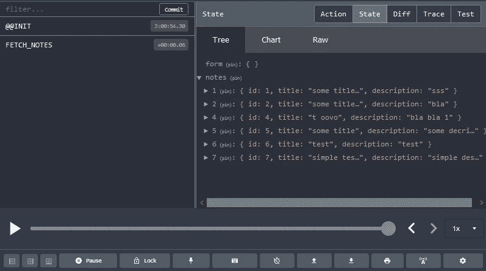

# 用 React、React Router、Redux 和 Redux 表单构建一个 Notes 应用程序

> 原文：<https://javascript.plainenglish.io/using-react-react-router-redux-redux-form-in-building-simple-notes-app-fd3114f5131a?source=collection_archive---------6----------------------->


在我们开始编码之前，让我们提醒自己什么是 React。React 是一个用于构建用户界面的 JavaScript 库。它允许我们非常容易地创建反应式界面，因为它可以监听状态变化，当状态变化发生时，它将更新 UI 布局。它是基于组件的，使用类似 XML 的语法，称为 JSX。

在本文中，我们将构建一个简单的 Notes 应用程序，它将使用 NestJS 后端。为了启动后端应用程序，请下载它的源代码并检查它的 *README.md* :

*   https://github.com/zsasko/nestjs-mysql-typeorm-sample [(别担心，你只需做几步就能让它工作😃)](https://github.com/zsasko/nestjs-mysql-typeorm-sample)

在本文的最后，您可以找到我们将在本文中构建的 React 应用程序的源代码。

## 开始吧！

首先，我们将通过调用下面的 *npm* 命令来初始化 React 项目:

```
npx create-react-app react_redux_form_sample
```

并从‘src’文件夹中删除所有文件。我们将把我们的类放在那里，所以我们不需要预生成的类。

在生成的*index.html*(位于‘public’文件夹内)中，请在‘head’标签内添加到 *bootstrap.css* 文件的链接:

在“body”标签的最底部放置以下 JavaScript 库，这将允许我们拥有引导式的应用程序:

我们现在可以在“package.json”的“dependencies”部分添加所有必需的库:

并通过调用以下命令来安装它们:

```
npm install
```

我们的应用程序类(在“src”文件夹内)将使用以下文件夹进行结构化:

*   **动作**:包含用户可以进行的所有动作
*   **api**:存储不同 API 配置的地方(在我们的例子中只有一个 API 配置)
*   **组件**:包含构建我们的应用程序时将使用的所有组件，如 Header、LoadingSpinner 等。
*   **异径管**:包含所有异径管

让我们从创建“history.js”文件开始，该文件将返回处理 React 浏览器历史的方法:

这种方法将用于不同的地方，在应用程序的不同类别，它将用于路由到不同的路线。

创建用户可以执行的操作我们可以从指定用户可以启动的操作类型开始。因此，让我们使用以下操作类型创建“actions/types.js”文件:

指定操作类型后，我们可以继续编写不同的操作方法(在“actions/index.js”文件中):

在每个动作方法中，我们通过“notes”API 做一些异步请求。Notes API 类基本上是预配置的 *axios* 对象，其基本 url 指向我们的后端。在我们发出一些请求之后，比如向我们的后端发送请求，我们通过调用“dispatch”命令将结果发送给 reducer，命令的类型为 action，响应数据为“payload”。在诸如“createNote”的一些方法中，在从后端调度响应之后，我们使用会话历史对象来将用户重定向到主屏幕(路由'/')。

在“apis/notes.js”文件中，我们正在导出 note api，它基本上是一个带有预配置基本 url 的 *axios* 对象:

我们之所以要创建单独的 note api 文件，是因为如果需要更改，可以简单地更新基本 url。

创建动作后的下一步是创建 reducers，它将通过动作获取的响应减少到一种状态，这种状态可以从我们的组件中读取。

让我们从编写“reducers/noteReducer.js”的代码开始:

在我们的 reducer 中，我们处理不同类型的动作及其负载。数据以“键:值”格式存储在状态中，其中“键”是注释的 ID，“值”是注释对象本身。我们正在使用 *lodash* 库来使映射(在‘FETCH _ NOTES’中)和移除(在‘DELETE _ NOTE’中)更容易。

在我们创建了 notes reducer 之后，让我们将 notes reducer 与 form reducer 结合起来创建(' reducer/index.js '):

Redux form 用于管理 Redux 中的表单状态。Redux Form Reducer 用于根据来自应用程序的更改来更新 Redux 存储。在文章的后面，我们将使用“reduxForm”和“Field”组件，这将使我们提到的功能无缝工作。

到目前为止，我们已经创建了 actions、reducers 和 api，现在我们可以继续创建组件了。首先，我们将创建“index.js ”,其中我们将创建 Redux store，并将我们的主要应用程序组件呈现到 DOM 中。

方法“createStore”创建一个 Redux 存储，用于保存应用程序的完整状态树。它需要返回下一个状态树的 reducers，还需要 Redux Thunk 中间件。Redux Thunk 中间件允许我们编写返回函数而不是动作的动作创建器。

“提供者”使 Redux store 对所有嵌套组件可用，因为它呈现在应用程序的顶层。

在上面的清单中，您可以看到我们还使用了 Redux DevTools 扩展，这将允许我们查看 Redux 状态。我们还可以看到当用户保存或更新注释时执行的有效负载操作。



我们要创建的第一个组件是 *App.js* (在文件夹“components”中):

不要怕一大堆导入语句，在这个类上面。我们将在本文的后面创建所有这些组件。

它还包含 React Router，该组件将允许我们导航到不同的“页面”，即它将负责呈现不同的组件(如“NoteCreate”组件，当用户导航到“/note/new”URL 时)。

正如我们在 *App* 组件中看到的，我们正在呈现“Header”组件，然后基于当前 url 呈现不同的组件。“开关”用于呈现与其位置属性匹配的第一条“路线”。一些“路由”组件具有“精确”属性，这是为了不调用具有非常相似的位置属性的相似“路由”。

在我们开始编写自己的组件之前，让我们提醒自己 React 应用程序中存在哪些类型的组件:

*   **Functional** —这只是一个接受道具并返回 React 元素的函数
*   **类**——一个需要你从 React 扩展的类。组件并创建一个“render”方法以返回 React 元素

功能组件和类组件的主要区别在于，不能在功能组件中使用状态和生命周期挂钩。

我们要创建的第二个组件是“Header”组件，这是一个功能组件(因为它不是类，也不是从“React”扩展而来的。组件)。

“Header”组件为我们的应用程序呈现简单的标题。

在我们的应用程序中，我们将使用简单的进度指示器，因此我们将创建适当的功能组件:

当应用程序加载时，用户将看到的第一页将显示注释列表。负责呈现笔记列表的组件是“notes/NoteLists.js”组件:

NotesList 是一个类组件，它通过在“componentDidMount”生命周期方法中调用的“this.props.fetchNotes”方法加载数据。生命周期方法“componentDidMount”在组件输出呈现到 DOM 后运行。

方法“render”是用于呈现内容的基于类的组件方法。在这个方法中，我们调用适当的方法来显示注释列表，如果有可用的注释(方法“renderList”)或适当的消息，如果注释列表为空(方法“renderEmptyListMessage”)。

方法“renderList”通过遍历所有笔记并使用笔记数据呈现适当的列表内容来显示消息列表。“链接”组件用于通过使用 React 路由器创建到适当端点的链接。

方法“renderEmptyListMessage”在没有可用注释的情况下显示一条消息。

在组件的底部，我们可以找到“connect”包装函数，它负责将 React 组件连接到 Redux 存储。通过“mapStoreToProps ”,我们订阅了 Redux 商店更新。这意味着任何时候存储被更新，将调用' mapStoreToProps'。普通对象“mapStateToProps”的结果将被合并到组件属性中。“连接”函数的第二个参数是动作创建者(在我们的例子中是“fetchNotes”动作)，它们可以通过组件的 props 对象调用。

很好，我们要创建的另一个组件是“notes/NoteShow.js”:

在这个组件中，当组件被挂载时，我们使用适当的注释 ID(取自 url)调用“fetchNote”方法。在方法“mapStateToProps”中，我们从 Redux 存储中获取注释，这些注释是通过注释 api 获取的。在“连接”包装器函数中，我们加载了两个动作创建器:“fetchNote”和“deleteNote”，它们将负责调用笔记提取或删除功能。

因为用于编辑和创建新注释的表单将包含相同的字段，所以我们将创建通用组件，该组件将用于编辑和创建注释的组件，并在提交时通知父组件:

在“render”方法中，我们使用适当的元素来呈现一个表单。这里我们可以看到“字段”组件，它是 Redux 表单组件，将输入组件与 Redux 表单逻辑连接起来。方法“renderInput”是一个返回呈现的输入字段的方法。它还包含将用于验证的带有元信息的属性。

方法“renderError”根据用户是否访问了字段并且没有指定任何值来检查是否应该显示错误消息。

在表单中，您可以看到“onSubmit”分配了“handleSubmit”处理程序，其中包含“Submit”处理程序。您可以将 redux-form 'handleSubmit '视为我们的提交处理程序的中间层，该处理程序可以在我们的父组件中访问。

方法“onSubmit”将表单值发送到父组件(我们接下来要创建的组件)。

Redux 表单使用 Validate 常量来检查某个字段是否验证失败，如果返回非空列表，则意味着表单验证失败。

在文件的底部，我们可以看到包装函数“reduxForm ”,它允许我们使用 redux 表单域和验证来工作。

最后，我们现在将创建一个负责创建新注释的组件:

因为我们正在使用“NoteForm”组件，所以我们将它的属性“onSubmit”分配给“NoteForm”内部的同一个命名函数，以处理带有表单值的操作创建者“createNote”的调用。

在底部，我们可以看到没有分配“mapStateToProps”但分配了“createNote”的“connect”包装函数，因为我们只在此组件的上下文中使用此操作创建器。这就是负责创建新便笺的组件的所有代码。整洁！😃

编辑注释组件将比创建新注释的组件稍大，因为它需要从 DB:

在“render”方法中，我们检查是否加载了音符数据，如果没有，我们显示适当的加载微调器(“loading spinner”组件)。如果从状态中加载注释数据，我们将通过' initialValues '属性将其数据分配给' NoteForm '组件。我们使用名为“pick”的 *lodash* 库方法，以便仅从表单中使用的 note 对象中获取少量属性(例如，一个 note 对象也将包含一个“ID”属性，但它不在“NoteForm”中使用，因此我们不选择它)。在属性“onSubmit”上，我们使用相同的名称分配方法，该方法使用适当的注释数据调用“editNote”操作。

在“componentDidMount”中，我们根据便笺 ID 提取便笺。

函数“mapStateToProps”用于从存储中提取笔记，然后完成笔记提取请求。

在文件的底部，我们有一个“连接”包装方法，除了将状态映射到道具之外，还包含一个用于动作创建者的映射器，如“fetchNote”和“editNote”。

非常好。恭喜，您已经完成了应用程序，您可以通过调用以下命令来启动它:

```
npm start
```

*顺便说一句，确保后端服务器也在运行。😃*

本文中构建的示例应用程序的源代码:

*   【https://github.com/zsasko/react-redux-form-sample 