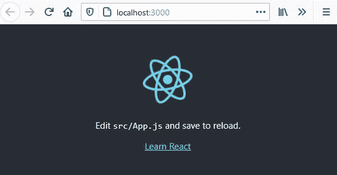
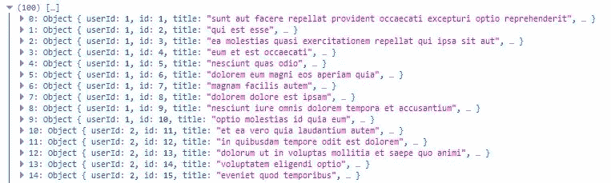
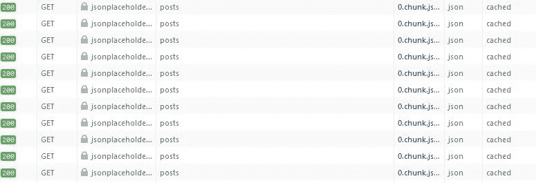
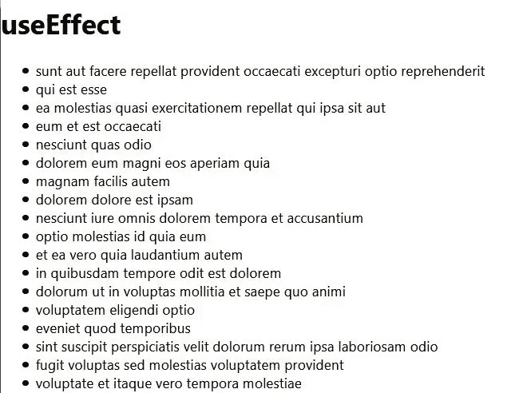
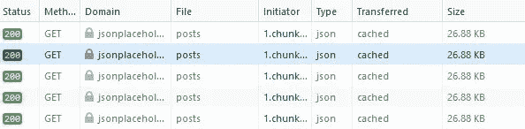

# 使用 React 的 useEffect 钩子获取数据并定期刷新数据

> 原文：<https://javascript.plainenglish.io/using-reacts-useeffect-hook-to-fetch-data-and-periodically-refresh-that-data-2a69b6d44081?source=collection_archive---------0----------------------->

## 反应提示

## 使用 useEffect 获取功能组件中的数据，并根据需要使用 setInterval 刷新数据。


Photo by [Damir Spanic](https://unsplash.com/@spanic?utm_source=medium&utm_medium=referral) on [Unsplash](https://unsplash.com?utm_source=medium&utm_medium=referral)

# 我们将学到什么

尽管 React 的 useEffect 钩子允许你做很多事情，但在本教程中，我们将详细介绍如何使用 useEffect 钩子**从 API 获取数据，**和**定期刷新数据**。

你可以使用任何你喜欢的 API，但我们将使用假的[API https://jsonplaceholder.typicode.com/](https://jsonplaceholder.typicode.com/)获取帖子。

```
https://jsonplaceholder.typicode.com/posts
```

# 使用效果

通过使用这个钩子，你告诉 React 你的组件需要在渲染后做一些事情。React 将记住您传递的函数(我们称之为“效果”)，并在执行 DOM 更新后调用它。

在上面的语句中需要注意的一点是，useEffect 钩子**在 DOM 更新**之后运行。因此，它不会阻止渲染过程。

其他重要的事情，尤其是从 API 获取数据，

*默认情况下，它在第一次渲染后和每次更新* *后都运行* ***。***

这意味着如果我们不小心，在我们获得数据和**设置状态**后，导致 DOM 更新，它将一次又一次地获取数据…

> 我们将讨论如何避免这种无限的获取循环，以及如何定期获取数据，以便在添加新数据时“刷新”我们的数据。

# 让我们开始吧

我将使用 Visual Studio 代码。您当然可以使用任何您想要的代码编辑器。

## 初始设置

1.  创建一个放置应用程序的目录。
2.  启动 VS 代码，打开刚刚创建的文件夹。
3.  打开一个终端窗口，输入这段代码来引导我们的 React 应用程序。

```
npx create-react-app fetch-with-useeffect
```

接下来，我们需要切换到这个目录并运行 npm start 来启动开发服务器，以验证它正在运行我们的 React 应用程序。默认情况下，这将在本地主机端口 3000 上。

4.应用程序启动后，在终端中键入以下内容。

```
cd fetch-with-useeffect
npm start
```

您应该会看到类似下图的内容。



Basic React Application

我们将使用 Axios 来获取数据。如果你愿意，你可以使用 fetch 或者任何你想要的东西。

5.使用 CTRL +C 停止开发服务器并关闭浏览器选项卡。

6.在终端窗口中键入以下内容来安装 Axios。

```
npm install axios
```

7.打开 App.js，用下面的代码替换默认代码。*注意 useEffect 钩子*的导入，以及 useState 和 axios 的导入。

```
import React,**{useEffect,useState}** from 'react'
**import axios from 'axios'**
import './App.css'const App=()=> {return (
    <div>
     <h1>useEffect</h1>
    </div>
  );
}export default App;
```

8.保存并重新启动开发服务器，

```
npm start
```

您应该在浏览器中只看到单词“ **useEffect** ”。

# 使用 UseEffect

现在我们准备使用 useEffect！

useEffect 挂钩的基本语法如下。

```
useEffect(()=>{// Effect goes here  
})
```

> useEffect 挂钩需要放在使用它的功能组件的主体中。

我们将在一个名为 **getPosts** 的 javascript 函数中获取我们的帖子。这个函数将从 useEffect 钩子中调用，它将驻留在功能性应用程序组件的主体中。

getPosts 的结果，即帖子本身，最初会显示在控制台中，但最终会使用 useState 钩子存储在 State 中。

让我们编写一个函数来获取帖子，并从 useEffect 钩子调用这个函数。

1.像这样修改你的 App.js。观察函数 getPosts 和对 useEffect 中函数的调用。

```
import React,{useEffect,useState} from 'react'
import axios from 'axios'
import './App.css'const App=()=> {**const getPosts = async () => {
  try {****const userPosts = await axios.get("**[**https://jsonplaceholder.typicode.com/posts**](https://jsonplaceholder.typicode.com/posts)**")

    console.log(userPosts.data);

  } catch (err) {
    console.error(err.message);
  }
};****useEffect(()=>{

    getPosts()****})**return (
    <div>
     <h1>useEffect</h1>
    </div>
  );
}export default App;
```

2.将您的开发工具保存并打开到控制台。您应该会看到一个帖子列表。



Posts obtained from [https://jsonplaceholder.typicode.com/posts](https://jsonplaceholder.typicode.com/posts)

**注意，每篇文章都有一个 id 和一个标题。**

我们希望将这些帖子存储在一个名为 posts 的数组中，并在屏幕上显示这些帖子。

我们将添加一个 useState 钩子，初始化为一个空数组。

const [posts，setPosts]=useState([])

数组 **posts** 将存储 GET 调用返回的帖子数组，而 **setPosts** 是设置帖子值的 setter 方法。

然后，我们将映射在屏幕上显示文章标题的文章，并使用文章 id 作为关键字。

***重要:*** *如前所述，useEffect 是在 DOM 更新后运行的。如果我们随后改变 getPosts 中的状态，这会导致 DOM 更新，那么会再次获取 posts。当这种情况发生时，状态被再次设置，无限地。当我们使用 console.log()时，这不是问题，因为状态没有改变。*

> 确保 useEffect 只运行一次的方法是使用一个空的依赖数组。

在本文中，我们不会关注依赖数组的所有用法，除非注意空数组会阻止 useEffect 在每次渲染后运行。更多关于依赖数组的信息可以在[这里](https://reactjs.org/docs/hooks-effect.html)找到。

useEffect 的新语法如下。请注意空数组。没有依赖关系，所以它只运行一次。

```
useEffect(() =>{// Effect goes here }, **[])**
```

如果没有使用空的依赖数组**,下面是开发工具的网络部分的结果。**从图像中无法明显看出 GET 正在连续执行。



Infinite loop of GET requests when not using an empty dependency array.

## 显示帖子

在接下来的代码中，我们添加了 useState，并将其传递给 getPosts 函数，这样它就可以将帖子的状态设置为 userPosts.data。

*请注意，您可以将 getPosts 函数包含在功能性应用程序组件主体中。这将使您不必向函数传递 setPosts。*

在 App.js 的 return 语句中，我们映射了 posts 数组。

1.  对 App.js 进行这些更改，注意粗体显示的项目。

```
import React,{useEffect,useState} from 'react'
import axios from 'axios'
import './App.css'const App=()=> {
 ** const [posts, setPosts]=useState([])**const getPosts = async () => {
  try {const userPosts = await axios.get("[https://jsonplaceholder.typicode.com/posts](https://jsonplaceholder.typicode.com/posts)")

    **setPosts(userPosts.data);  // set State**

  } catch (err) {
    console.error(err.message);
  }
};

  useEffect(()=>{

    getPosts()**},[])  // includes empty dependency array**return (
    <div>
     <h1>useEffect</h1>
     <ul>
      ** {posts.map(post=>(
         <li key={post.id}>{post.title}</li>
       ))}**
     </ul>
    </div>
  );
}export default App;
```

2.在浏览器中保存并观察您的应用程序。它应该查看以下内容:



Posts returned from our App component

## 刷新帖子

虽然我们的帖子列表不会因为没有添加任何帖子而改变，但是在实际应用程序中，其他用户可能会添加帖子，您可能希望根据自己的选择定期刷新帖子列表。

我们将使用 **setInterval** 每 10 秒更新一次我们的帖子列表。由于不会显示实际的新帖子( [typicode](https://jsonplaceholder.typicode.com) 是一个假 API)，我们将不得不使用我们的开发工具网络部分来观察每 10 秒的 GET 调用。

我们还将增加一个间隙。这在较大的应用程序中很重要，这样当用户导航到另一个页面时，间隔就会被清除。

要完成刷新，请按如下方式修改 useEffect，

```
useEffect(()=>{

   ** getPosts()** const interval=setInterval(()=>{
     ** getPosts()**
     },10000)

    ** return()=>clearInterval(interval)**},[])
```

我们最初获取帖子，然后每隔 10 秒钟再次调用 getPosts。

使用您的开发人员工具，检查网络，您将看到每 10 秒就有一个 GET。



Initial GET and one every 10 seconds

# 结论

总之，我们已经看到了 useEffect 的一种用法，获取数据。我们还了解到，如果没有空的依赖数组，我们将会不断地调用 GET 调用；显然导致了巨大的网络流量。

然而，我们可能希望定期刷新数据，我们使用 setInterval 来实现这一点。

*一如既往，我鼓励大家不仅要学习更多关于 useEffect 的知识，还要尝试这个应用程序，并对其进行扩展。*

**感谢您的阅读和编码！**

*尽情阅读，加入 Medium 帮我继续写*

[](https://bobtomlin-70659.medium.com/membership) [## 通过我的推荐链接加入灵媒——重力井(罗伯·汤姆林)

### 作为一个媒体会员，你的会员费的一部分会给你阅读的作家，你可以完全接触到每一个故事…

bobtomlin-70659.medium.com](https://bobtomlin-70659.medium.com/membership) 

*您还可以享受:*

[](https://medium.com/javascript-in-plain-english/creating-your-first-react-application-db9dfe93b4f5) [## 如何在你的第一个 React 应用中使用 Props

### 建立一个产品展示器，而不是简单的 Hello World！

medium.com](https://medium.com/javascript-in-plain-english/creating-your-first-react-application-db9dfe93b4f5) [](https://medium.com/javascript-in-plain-english/react-router-and-spas-made-easy-19fd1db0d6fc) [## 如何使用 React-Router 创建 SPA

### 使用客户端路由创建单页应用程序

medium.com](https://medium.com/javascript-in-plain-english/react-router-and-spas-made-easy-19fd1db0d6fc) [](https://medium.com/javascript-in-plain-english/creating-your-second-react-application-d6d50e3e1e91) [## 如何用 useState 钩子管理 React 中的状态

### 使用功能组件上的 useState 挂钩管理状态

medium.com](https://medium.com/javascript-in-plain-english/creating-your-second-react-application-d6d50e3e1e91) [](https://medium.com/javascript-in-plain-english/two-ways-of-managing-state-in-a-functional-react-form-ef0929eefe67) [## 在函数式反应表单中管理状态的两种方法

### 在注册表单中，对每个输入使用 useState 挂钩，而不是使用一个用户对象和一个 useState 挂钩。

medium.com](https://medium.com/javascript-in-plain-english/two-ways-of-managing-state-in-a-functional-react-form-ef0929eefe67) [](/what-is-next-js-and-server-side-rendering-9e24ea21c144) [## 什么是 Next.js 和服务器端渲染

### Next.js 是由 Vercel 创建的 React 框架。与使用客户端渲染的 React 不同，Next.js 使用服务器端…

javascript.plainenglish.io](/what-is-next-js-and-server-side-rendering-9e24ea21c144) 

## **简单英语的 JavaScript**

喜欢这篇文章吗？如果有，通过 [**订阅解码，我们的 YouTube 频道**](https://www.youtube.com/channel/UCtipWUghju290NWcn8jhyAw) **获取更多类似内容！**