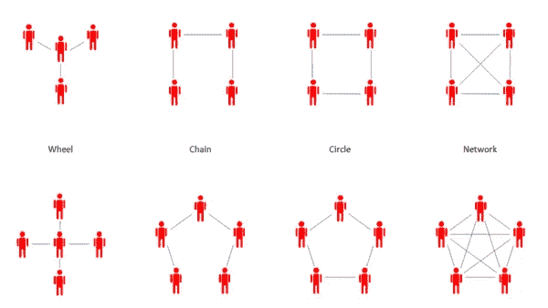
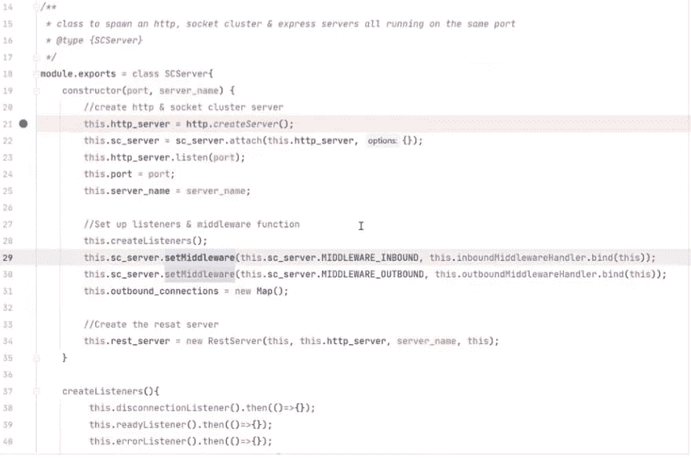
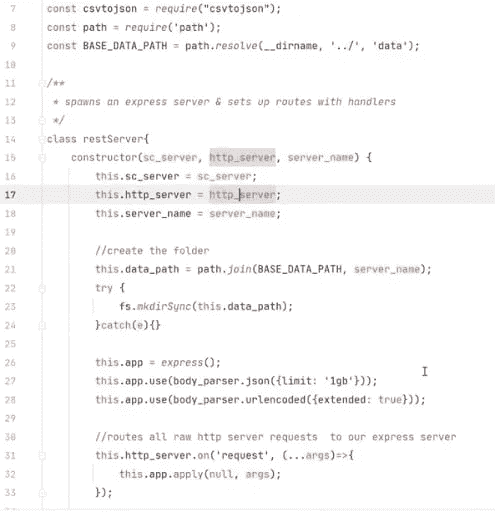
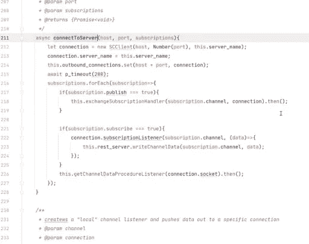
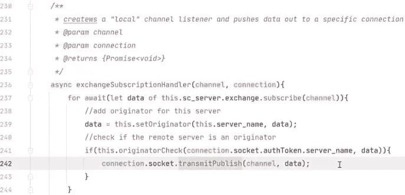
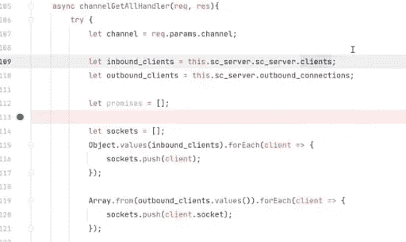
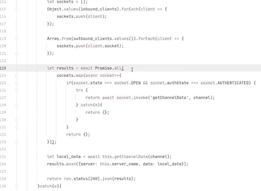

# 以独特的方式使用 SocketCluster 进行分布式计算

> 原文：<https://javascript.plainenglish.io/using-socketcluster-for-distributed-computing-in-node-js-apps-3c774b2e0d32?source=collection_archive---------11----------------------->

HarperDB 团队[构建了第一个也是唯一一个用 Node.js](https://www.harperdb.io/post/building-a-database-written-in-nodejs) 编写的数据库，以独特的方式实现了分布式计算的 SocketCluster。**凯尔·伯恩哈迪(Kyle Bernhardy)，HarperDB 首席技术官和联合创始人，** [**最近就 SocketCluster**](https://youtu.be/xOUBwBV-QRg?t=110) **的内部运作进行了一次演讲，其中包括一次** [**代码审查**](https://github.com/kylebernhardy/socketcluster-presentation) **以突出 SocketCluster 概念在一个数据库框架内的作用**。我强烈推荐点击链接查看他的演讲，这样你就可以看到完整的代码回顾，但是我也将在这里总结演讲的亮点。

HarperDB 是一个全新的数据库，本质上是一个具有 SQL 功能的结构化对象存储。我们的架构中有很多组件，我们的 WebSocket 接口是我们实现的一个通信协议，专门用于 HarperDB 的不同节点跨节点共享数据和模式元数据。展望未来，它还将扩展到像 SQL & NoSQL 这样的分布式操作中，扩展查询功能。不仅仅是分发和确定性地共享数据，它还能够跨集群执行查询。

# 分布式计算

*   每个节点都在本地独立于其他节点处理事务和存储
*   每个节点可以连接(或不连接)到任何其他节点&发送和/或接收任何表的事务
*   基于客户定义的拓扑，以确定的方式实时传输模式元数据和事务
*   所有节点都可以从网络/服务器故障中“恢复”,没有“当场死亡”的事务

[分布式计算](https://en.wikipedia.org/wiki/Distributed_computing)可能有超级复杂的拓扑结构，所以我们需要一些精简和灵活的东西来处理这种情况。我们的假设是，在任何时间点，一个节点都可以脱机，并且一旦节点重新联机，总是允许进行追赶。我们考虑了太重的选项，或者没有节点能够与消息代理对话的选项——但是我们希望能够适应我们的用户，并使他们易于使用该技术，而不是相反。

# 拓扑

这里是一些拓扑示例，左边的更简单，其他节点被推到中间，这是一个典型的边缘计算拓扑。也可以有链、线、圈等。我们希望确保我们容纳任何和所有拓扑选项。使用像 WebSockets 这样的双工连接真的有助于我们克服限制，因为如果我们需要双向通信，但服务器无法下推到防火墙后的那些节点，那么你就输了。

# 首次尝试

*   Socket.io
*   父进程中的嵌入式 Socket.io 逻辑
*   每个连接节点的数据复制
*   核心逻辑中紧密耦合的分布式逻辑

我们尝试在父进程中嵌入 Socket.io 使用集群库让并行进程“令人尴尬地并行”运行，以便我们可以向外扩展，但当时我们认为每个人都将与父进程通信，父进程将在集群中分发数据。我们存储数据的方式也有问题，分布式逻辑与我们的核心逻辑紧密耦合。

# 经验教训

*   Socket.io 难以扩展
*   需要更好的事务存储
*   需要发布/订阅
*   使第三方观察者能够接收实时数据流并发布到流中
*   保护节点之间的连接

我们了解到 Socket.io 很难扩展。为了扩大 Socket.io 的规模，我们必须插入 Redis 之类的东西，或者使用其他库来完成我们需要完成的事情，这是一个依赖性的噩梦。我们还在节点之间进行直接推送和发送，但意识到基于每个表的发布/订阅模型更有意义。我们还希望让第三方观察者能够接收实时数据流并发布到流中(类似于 Kafka)，并且我们希望获得更好的安全性。

# 什么是 SocketCluster

*   快速、轻量级、高度可伸缩的实时服务器引擎
*   柔性框架
*   JWT 本地身份验证
*   内置连接/代理/通道/消息处理

经过几次权衡之后，我们最终选择了 SocketCluster。我们的团队起初并不太熟悉，但经过研究，他们非常喜欢它的轻量级、可伸缩性和灵活性，以及在节点之间进行确定性连接的能力(系统管理员可以选择如何实现这一切)。它也有内置的处理，你不需要担心建设自己，它会为你做的。它还管理如果您产生了多个 SocketCluster 服务器的实例，有一个底层代理负责确保每个订户都收到他们期望的数据。

SocketCluster 用例:明显的一个是聊天，有趣的一个是区块链(他们实际上是由一家区块链公司资助的)，还有游戏，以及作为分布式数据库的我们。

# 为什么选择 SocketCluster

*   节点. js
*   速度、性能和可扩展性
*   内置 JWT 认证
*   代理/连接/通道/消息管理
*   消息按照发送的顺序传递
*   完全基于承诺
*   轻松添加自定义逻辑
*   轻松变更/附加消息数据

创建和管理 SocketCluster 的约翰·格罗-杜布瓦一直在更新和完善这个项目。去年，他在这项技术上取得了巨大的进步，从旧的回调方法开始，他使一切都基于承诺，最重要的是，他使所有的侦听器成为基于事件的异步迭代器，使您能够按照发送的顺序发送所有消息，这样您就拥有了事务完整性。

# 我们如何使用 SocketCluster

*   分布式数据复制
*   每个节点都是一个消息代理
*   HarperDB 使用简单的发布-订阅模型，因此我们通过将数据发布到不同的通道来复制数据，不同的节点订阅这些通道，并且这些通道能够水平分布
*   维护节点之间的安全性
*   将来，可以将它扩展到分布所有核心 HaperDB 操作

我们将它用作分布式数据复制框架。Socket.io 逻辑与我们的核心数据库逻辑紧密耦合，因此我们希望将它作为边盘运行，这对于 SocketCluster 来说非常容易。这允许我们让每个 HarperDB 节点成为自己的消息代理。SocketCluster 内置了 JWT 身份验证来提供可信的安全性，它还支持节点之间的 SSL，因此我们可以验证没有不属于网络的外部连接器进入。

# 代码审查

这个示例代码将帮助你理解我们想要达到的目标以及我们是如何实现的。我再次推荐查看 Kyle 的演讲中的[代码审查部分，但是我将包括几个亮点。**这个项目演示了如何创建一个集成了 REST API 的 SocketCluster 服务器，一个 SocketCluster 客户端连接到一个 SocketCluster 服务器的实例**。](https://youtu.be/xOUBwBV-QRg?t=1129)

我们有一个存放主要逻辑的类目录，还包括一个邮递员目录，等等。该项目的核心是创建一个 SocketCluster 服务器:导入库，连接到 SocketCluster 服务器，这是启动和运行的基础。当我们开始处理监听器和中间件时，这很有趣。这里您可以看到异步迭代器的功能:

然后我们创建一个连接监听器。我们可以监听远程过程调用，这就是我们在服务器和客户端之间调用认证的方式。连接将会建立，在连接时，我们可以调用这个登录侦听器。我们需要做的就是在 SocketCluster 客户端中，监听并调用承诺。在服务器上，它监听任何试图调用该登录的人。基本验证。如果我们进行身份验证，我们可以设置一个身份验证令牌，并将其标记为成功并继续——因为它是一个迭代器，所以我们必须告诉它继续，这样我们就不会被卡住。

服务器内部的另一件事是创建中间件——入站、出站、握手和入站原始数据。在这种情况下，我们有一个中间件流，每种类型都有自己的数据分配给动作。验证，添加自定义 if 语句。当数据跨集群发布时，我们调用一个函数将数据写入磁盘。我们阻止它撞击交换机，以确保数据在服务器上处理，并阻止订户接收双重消息。

我们有监听器、中间件，我们还在创建一个 REST 服务器。传入对服务器的引用，也是我们在这里重用的 HTTP 服务器，使用 REST 服务器中与 Websocket 服务器相同的端口。

现在我们运行它，我们连接和认证。

因此，我们可以写入数据库，并指定我们要读取的通道，我们将在客户端上看到它收到了该数据。我们可以添加另一台服务器，现在我们可以连接它们，进行完整的数据复制，并确定发布/订阅。因为我们在 REST 服务器和 SocketCluster 服务器之间有联系，所以我们也可以在两者中引用类函数，这很方便。我们还跟踪出站连接，迭代主体中定义的订阅数组。如果我们正在发布，我们需要做一些工作并观察本地交换，因为套接字客户端需要观察通道并将数据推送到另一个节点。

我们有了连接，在节点 1 和节点 2 之间进行完整的数据复制。确保我们有确定性的数据共享——决定什么数据要去哪里。这种用例对我们的客户来说很常见，尤其是在[边缘计算](https://harperdb.io/tag/edge-computing/)场景中:假设您在一个制造工厂中有设备收集温度数据，您只关心数据是否超出范围， 因此，command control 希望知道哪些设备超出范围，看起来像什么，然后将这些数据推送到一个单独的表中，并推送到 command control，但原始数据仅位于边缘节点，并随着生存时间而变化，这样我们就只共享对客户真正重要的数据。

我们可以增加一个服务器来展示更多有趣的东西。我们可以在连接到我们所在节点的所有节点之间创建一个过程调用。我们可以在 person 通道上执行 read all，这样，连接到节点 1 的每个人都可以向每个节点发出远程过程调用，查看数据目录中的每个文件。这种情况的一个用例可能是您已经离线了一段时间，并且您想在再次开始交易之前看看您错过了什么。

令人惊叹的是，我调用节点 1 来获取自己的数据，节点 2 和 3 并行执行，执行时间为 7 毫秒(而仅调用节点 3 也需要 7 毫秒)，因此您可以看到获取数据的并行化程度。您还可以看到，将数据分散到多个节点上可以帮助您使用商用硬件来提高性能，而不必使用这些庞大的整体式服务器。**使用 SocketCluster 可以做更多的事情，但这些是我们喜欢在产品中使用它进行分布式计算的一些主要原因**。

*如果您对 SocketCluster、其他 Node.js 库/插件、HarperDB 架构等有任何问题或反馈，我们很乐意讨论！*