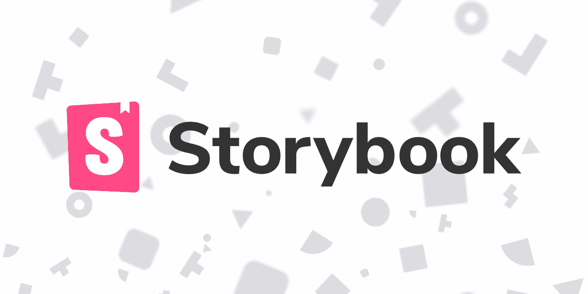

# 使用故事书培养共同理解

> 原文：<https://javascript.plainenglish.io/using-storybook-to-build-shared-understanding-e70dfe3208d2?source=collection_archive---------6----------------------->

最近，我在业余时间为 Pokemon Go 用户开发了一个类似 Instagram 的应用程序，让他们可以将游戏中的 AR 照片组织到 Pokedex 等收藏中，或者收藏最喜欢的照片。

在构建这个应用程序的时候，我一直在使用 Sketch 来构建模型，以便和其他对摄影感兴趣的玩家一起测试我的想法。Sketch 有一个非常好的基于符号的系统，可以非常轻松地在其他符号中交换符号，这极大地加快了实体模型的创建速度。

我发现这与诸如 React 之类的 Web 组件框架的运行方式非常相似。通过将我的设计分解成组件/符号，我能够用最少的努力创建一个高度可重用的 UI 并从 Sketch 移动到 React。

在开发过程中，我决定创建一个单独的组件库，我的想法是我可以在许多项目中使用它，但我很难找到一种方法来记录这些组件是如何工作的。

故事书是一个漂亮的小框架，我发现，这样做正是这个和更多。它不仅允许您展示您的组件并提供示例代码，而且还允许该库的潜在消费者与 UI 和为其供电的状态进行交互。

# 故事书是什么？

对于那些从未使用过它们的人来说，风格指南是展示 CSS 的一种手段，也是渲染不同 UI 组件的一种手段，通常是通过类似于 [KSS](https://www.npmjs.com/package/kss) 的工具为 LESS / SASS 编写的(我为 Open eObs 构建的[就是一个例子)。](https://neovahealth.github.io/openeobs/)

样式指南可以很好地帮助设计师、开发人员、测试人员和业务端人员建立理解，因为您有一个文档解释 UI 的外观，通常会显示不同的状态。

故事书采纳了这个想法，但是由于 Web 组件可以被传递属性(特别是如果您使用高阶组件模式)，因此不需要有五个单独的标记集，相反，您可以使用[旋钮插件](https://github.com/storybooks/storybook/tree/master/addons/knobs)通过故事书 UI 更改属性。

这个插件生态系统让我真正意识到了故事书的力量。通过`npm install`加载一个插件，并向设置中添加相关代码，您可以添加:

*   检查您的组件如何在不同的屏幕尺寸上工作
*   检查您的组件是否存在 WCAG 违规
*   添加 UI 切换以更改用于呈现组件的属性，以便您可以显示它们基于不同状态的呈现方式
*   将故事书页面链接在一起，创建可点击的模型
*   为组件添加支持文档

# 故事书如何帮助团队？

Storybook 不仅可以帮助团队建立对正在构建的产品及其将向用户交付的价值的共同理解，还可以帮助开发过程。

UX 和设计师可以使用 Storybook 进行有效的学习活动，因为他们可以在 Storybook 中非常容易地整合新界面，并使用 Knobs addon 等工具向客户介绍用户界面如何对变化做出反应。

测试人员可以尽早开始探索性测试，以捕捉任何简单的 UI 错误。他们也可以开始可用性和易访问性测试(WCAG 合规插件在此提供帮助)。还有一个插件允许 Jest 测试报告与故事一起显示，这可以帮助团队的报告需求。

自动化测试人员也可以使用 Storybook 来改变他们的页面对象模型，以更早地适应新的 UI 变化，也可以使用 Knobs addon 来强制 UI 进入用户与 UI 交互时所期望的状态。这意味着自动化测试包不容易与应用程序 UI 不同步。

将 Storybook 与 GraphQL addon 结合起来，前端开发团队就可以开始规划具有许多子组件的更复杂的组件如何在后端完全构建之前使用从高阶组件接收的数据来呈现页面。

使用 Notes addon 团队可以注释故事书，允许他们为支持人员添加有用的注释，他们可以在回答关于导航 UI 的支持查询时使用这些注释。

# 使用故事书的陷阱

没有一个工具是完美的，所以自然会有一些需要注意的问题，但在我看来没有什么大问题。

*   因为是 JS，如果故事中的一个组件(可能不适用于 HTML 组件)抛出异常，整个故事将不会被呈现
*   由于静态网站是使用 webpack 构建的，如果您使用 GitHub pages 之类的东西，请小心，因为您需要推送所有静态资产(不仅仅是更改的代码)以确保网站正常工作
*   除了分支策略，比如标签或者发布分支，没有其他方法来版本化故事书，所以你需要自己动手
*   这是 Javascript，所以请确保您固定了您的依赖项！如果你不这样做，你可能会发现自己毫无准备地打破了你的故事书

# 演示和资源

*   [故事书网站](https://storybook.js.org/)
*   [故事书插件列表](https://storybook.js.org/addons/addon-gallery/)