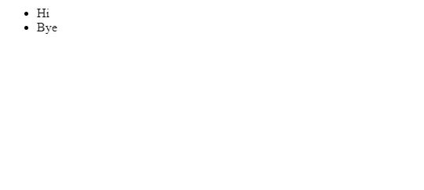

# 在 Express 中使用模板引擎

> 原文：<https://javascript.plainenglish.io/using-template-engines-with-express-704881d0f79c?source=collection_archive---------2----------------------->


Photo by [Tran Mau Tri Tam](https://unsplash.com/@tranmautritam?utm_source=medium&utm_medium=referral) on [Unsplash](https://unsplash.com?utm_source=medium&utm_medium=referral)

为了呈现带有快速路由的 HTML 响应，我们应该将它作为插入了变量的模板返回，而不是直接作为 HTML 字符串返回。

模板很方便，我们可以用比 HTML 字符串更灵活的方式使用它们。

在本文中，我们将看看如何设置我们的应用程序的模板引擎，并返回 HTML 响应。

# 选择模板引擎

我们可以在 Express 中使用流行的模板引擎，比如 Pug、Mustache 和 EJS。Express application generator 的缺省值是 Jade，但是我们也可以使用列出的其他值。

为了渲染模板文件，我们可以设置应用程序设置。要设置模板文件夹，我们可以通过编写以下代码来设置`views`属性:

```
app.set('views', './views')
```

它会将模板文件夹设置到我们应用程序的`views`目录。

同样，我们可以通过设置`view engine`属性来设置我们想要使用的视图引擎，如下所示:

```
app.set('view engine', 'pug')
```

要安装模板引擎库，我们可以运行如下代码:

```
npm install pug --save
```

上面的命令将安装`pug`视图引擎供我们使用。

# 使用模板引擎呈现项目

我们可以使用`res.render`方法将变量呈现到模板中。

首先，我们创建`views`文件夹来存储我们的模板，因为我们将`./views`文件夹设置为模板文件夹。

因为我们选择使用 Pug 作为我们的模板引擎，模板文件应该有`.pug`扩展名。

在`views`文件夹中，创建一个`index.pug`，然后将:

```
html
  head
    title= title
  body
    h1= message
```

`title=`和`h1=`是我们的标签，`title`和`message`是 Express 用来从对象中获取值的键，我们将把这些值传递给`res.render`。

然后，我们可以在与`views`文件夹相同的级别中创建`index.js`，并添加:

```
const express = require('express')
const app = express()
app.use(express.json())
app.use(express.urlencoded({ extended: true }))
app.set('views', './views');
app.set('view engine', 'pug');app.get('/', (req, res, next) => {
  res.render('index', { pageTitle: 'Hello', pageMessage: 'Hello there!' });
})app.listen(3000, () => console.log('server started'));
```

在上面的代码中，我们调用了`res.render`来呈现一个 HTML 响应。对象:

```
{ pageTitle: 'Hello', pageMessage: 'Hello there!' }
```

将被传递给我们的`index.pug`模板。

`title`将`title`换成:

```
html
  head
    title= pageTitle
  body
    h1= pageMessage
```

`message`将被`'Hello there!'`取代。标签和等号右边的任何内容都将被上面给出的键值替换。

换句话说，`pageTitle` 和`pageMessage`属性‘值’是分别位于`title`和`h1`标签之间的值。

所以我们得到了


我们页面的标题将是`'Hello'`。


Photo by [Bruce Galpin](https://unsplash.com/@star2dev?utm_source=medium&utm_medium=referral) on [Unsplash](https://unsplash.com?utm_source=medium&utm_medium=referral)

# Pug 语法

除了变量，我们还可以有动态表达式。循环和条件表达式是 Pug 的一部分。

## HTML 标签

Pug 可以使用其他 HTML 标签。

例如，链接可以写成如下形式:

```
a(href='http://medium.com') Medium
```

在上面的代码中，`Medium`位于`a`标记之间，`href=’http://medium.com'`分别是`href`属性和值。

## 环

我们也可以用 Pug 写循环。例如，如果我们有:

```
const express = require('express')
const app = express()
app.use(express.json())
app.use(express.urlencoded({ extended: true }))
app.set('views', './views');
app.set('view engine', 'pug');app.get('/', (req, res, next) => {
  res.render('index', { pageTitle: 'Hello', pageMessages: ['Hi', 'Bye'] });
})app.listen(3000, () => console.log('server started'));
```

在`index.js`和:

```
html
  head
    title= pageTitle
  body
    ul
      each pageMessage in pageMessages
        li= pageMessage
```

在`views/index.pug`中，我们会得到:



## 条件式

我们还可以在 Pug 模板中添加条件表达式。例如，如果我们有:

```
const express = require('express')
const app = express()
app.use(express.json())
app.use(express.urlencoded({ extended: true }))
app.set('views', './views');
app.set('view engine', 'pug');app.get('/', (req, res, next) => {
  res.render('index', { pageTitle: 'Hello', user: { type: 'member' }   });
})
app.listen(3000, () => console.log('server started'));
```

在`index.js`和:

```
html
  head
    title= pageTitle
  body
    if user.type === 'anonymous'
      p User type is anonyomous
    else if user.type === 'member'
      p User type is member
    else
      p User type is admin
```

在`views/index.pug`中，我们得到:

```
'User type is member'
```

因为`res.render`中的`user.type`被设置为`'member'`。

# 结论

如果我们使用模板引擎来呈现 HTML 响应，那就很容易了。我们可以在`res.render`的第二个参数中传递一个对象来传递我们想要在模板中显示的值。

使用模板引擎，我们可以包含循环、条件和变量，使显示动态内容变得轻而易举。