# 使用 JavaScript 控制台不仅仅是为了简单的日志记录

> 原文：<https://javascript.plainenglish.io/using-the-javascript-console-for-more-than-just-simple-logging-cf05972b451a?source=collection_archive---------3----------------------->

## 使用控制台可以做的 10 件有用的事情，有助于更好地调试和改进工作流程

Console in JavaScript ( Photo by author )

在 JavaScript 中，调试代码的方法是使用`console.log()`。我们使用`console.log()`将一些东西记录到控制台，然后检查数据是否正确以及功能是否按预期工作。除了`console.log()`之外，JavaScript 控制台还提供了许多其他方法供您使用。

在这里，您将详细看到 JavaScript 的控制台对象的十个方法。这些方法也将帮助您改进调试和开发工作流。

# 1.日志、信息、调试、warn️和错误

您可以使用这些方法**以不同的**日志级别**向控制台显示消息**。

## 日志( )

`log()`方法向控制台显示一条消息。

**`**log()**`**不同参数的例子:****

1.  ****多个对象作为参数****

**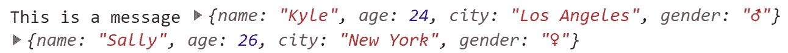**

**Output of log( ) with multiple objects as parameters**

****2。单个字符串对象作为参数****

****3。具有替代值的字符串消息****

**可用于替换的不同**指令**有:**

*   **`%d`或`%i`为整数值**
*   **`%f`为浮点值**
*   **`%s`为字符串值**
*   **`%O`或`%o`为对象值**

**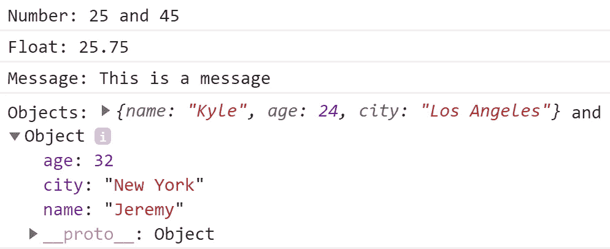**

**Output of log( ) with multiple substitutions**

> ****注:**所有其他的记录方法如`info(), debug(), warn()`和`error()` 遵循与`log()`相同的语法和参数。**

## **信息( )**

**`info()`向控制台显示的消息与日志()相同，但这些消息被归类为信息性消息。**

****示例** `**info()**` **用多个字符串对象作为参数****

**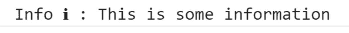**

**Output of info( ) with a string as a parameter**

## **调试( )**

**`debug()`用**日志级调试**向控制台显示消息。**

****示例** `**debug()**` **用多个字符串对象作为参数****

**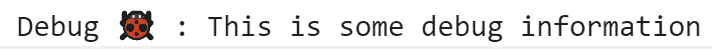**

**Output of debug( ) with a string as a parameter**

## **警告( )**

**`warn()`向控制台显示一条消息作为**警告**。**

****以多个字符串对象为参数的** `**warn()**` **的例子****

**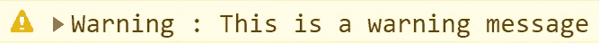**

**Output of warn( ) with a string as parameter**

## **错误( )**

**`error()`向控制台显示一条消息作为**错误**。**

****`**error()**`的例子**用多个字符串对象作为参数******

****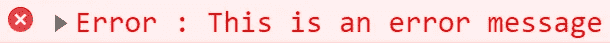****

****Output of error( ) with a string as parameters****

******提示:**您也可以通过切换开发工具中的过滤面板来过滤出**不同级别的日志**，如下图所示。****

****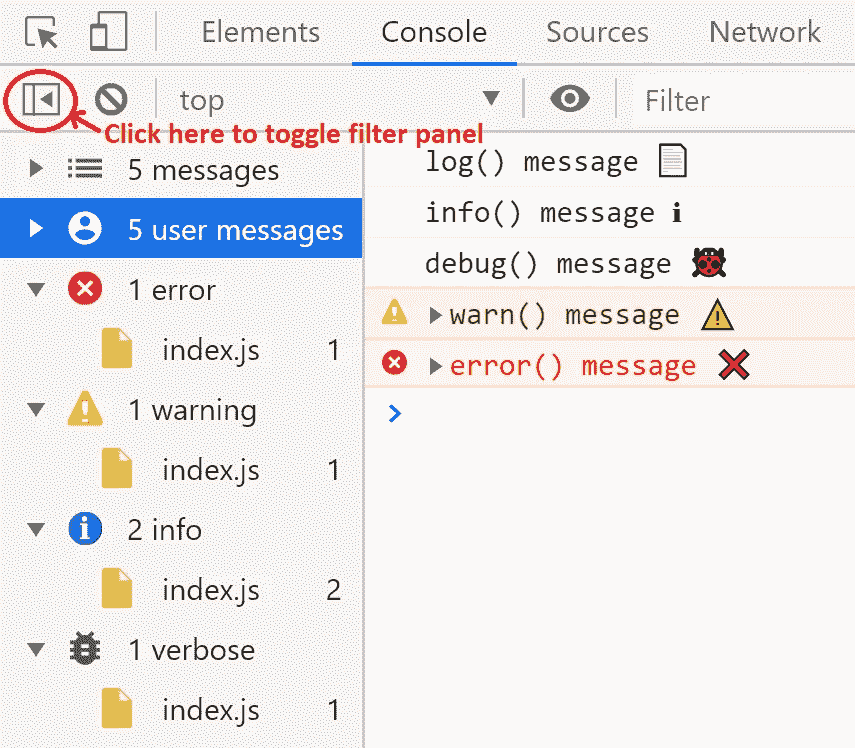****

****Filter panel for logs in Developer tools of the Browser****

****一旦你看到过滤器面板，你可以点击不同级别的日志来查看这些类别下的消息。请注意`log()`和`info()`的输出都属于**信息**类别(针对 Chrome 浏览器)。****

# ****2.向控制台输出添加样式****

****您可以在任何日志记录方法的字符串消息中使用`%c` **指令**来设计控制台上的输出。****

****样式将应用于`%c`指令之后的文本，而指令之前的文本不受影响。****

******使用具有多个** `**%c**` **指令和多个 CSS 声明作为参数**的 `**log()**` **对消息进行样式化的示例******

****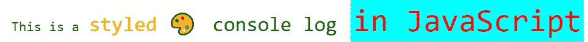****

****Output of log( ) with a styled message using %c directives****

> ******注意:**在这里，您已经看到了使用`log()`的示例，但是您也可以使用所有其他日志记录方法(如`info(), debug(), warn(),`和`error()`)对消息应用样式。****

****可以与`%c`指令一起使用的一些标准属性是:****

*   ****背景及其对应的手写字体。****
*   ****边框及其对应的手写字体****
*   ****边框半径****
*   ****颜色****
*   ****字体及其对应的手写字体****
*   ****行高****
*   ****边缘****
*   ****填料****

# ****3.使用 dir 和 dirxml 以交互格式显示对象和 HTML/XML 元素****

## ****目录( )****

****`dir()`以给定对象参数的 **JavaScript 对象**的形式显示属性的**交互列表**，您可以展开它查看该对象所有可用的子属性和方法。****

******以交互列表格式显示文档对象的位置属性的示例******

****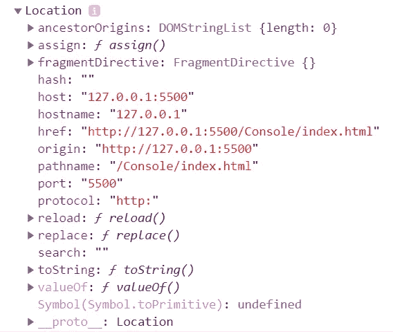****

****Output of dir( ) for displaying an object in an interactive list format****

## ****dirxml()****

****`dirxml()`显示给定 HTML/XML 元素的**交互树**作为参数。如果不能像**树**一样显示给定元素，它将显示为 **JavaScript 对象**。您可以展开树来查看给定元素的子节点的内容。****

******以交互树的形式显示文档对象的示例******

****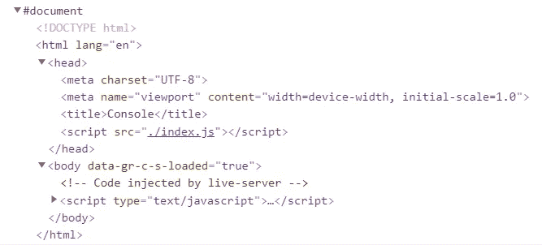****

****Output of dirxml( ) for displaying an element in an interactive tree format****

# ****4.使用表格以表格形式显示数据****

****`table()`带一个强制的**数据参数**，可以是一个数组**或一个对象**和一个列名数组**的可选参数。对象的数组/属性中的每个元素都将是控制台上显示的表中的一行。******

****如果给定参数是以**索引**为值的数组，则表的第一列将被标记为**索引**，如果是对象，则第一列中的值将是该对象的**属性名**。****

******`**table()**`**不同参数的例子:********

1.  ******用数组作为参数******

****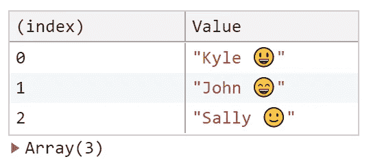****

****Output of table( ) with an array****

******2。显示复合类型******

******2.1。用数组的数组作为参数******

****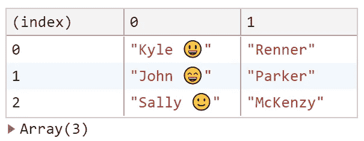****

****Output of table( ) with an array of arrays****

******2.2。用一个对象数组作为参数******

****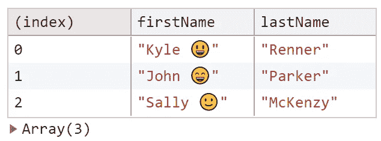****

****Output of table( ) with an array of objects****

******2.3。用属性为 objects 的对象作为参数******

****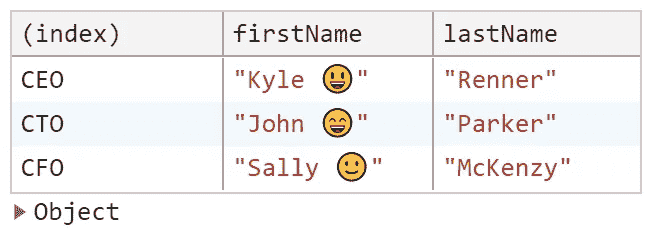****

****Output of table( ) with objects within object****

******3。其中使用第二参数**限制表格中的列数****

********

****Output of table( ) with an array of restricted columns****

******4。在这里，您可以通过单击某一列的标签来基于该列对表格进行排序(使用上面相同代码的输出)******

****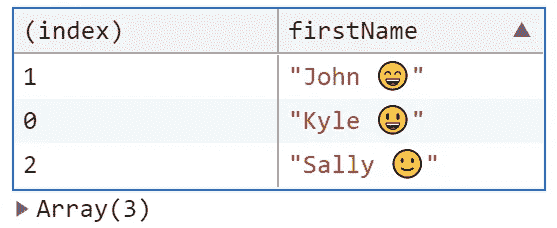****

****Output of table( ) with an array and, sorting it by firstName****

# ****5.使用 Count 和 countReset 计算一条消息被打印出来的次数****

## ****计数( )****

****`count()`显示使用相同标签/默认标签拨打`count()`的次数。****

## ****countReset()****

****`countReset()`将给定标签/默认标签的计数器值重置为 0。****

******参数不同的** `**count()**` **和** `**countReset()**` **的例子:******

1.  ******以标签为参数******

****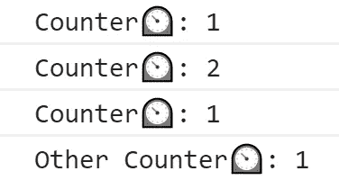****

****Output of counter values with labels****

****在本例中，您调用了两次**计数器函数**，它有一个带有标签的`count()`,在带有给定标签的控制台上显示两次计数。然后使用带有相同标签的`countReset()`将值重置为 0，并再次调用 counter 函数来显示带有给定标签的计数，该计数从 0 开始，因为我们之前使用了`countReset()`。****

******2。无任何参数(输出默认为标签)******

****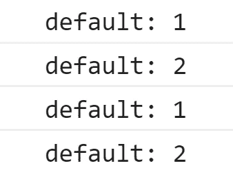****

****Output of counter values without labels****

# ****6.使用 Group、groupCollapsed 和 groupEnd 对不同的日志进行分组****

## ****群组( )****

****`group()`创建一个新的消息组，并在控制台中缩进这些分组的消息，直到`groupEnd()`被调用，在这两个函数调用之间记录的所有控制台消息都将是该标记/未标记组的一部分。****

## ****groupEnd()****

****`groupEnd()`停止由`group()`启动的信息分组。****

## ****组折叠( )****

****`groupCollapsed()`与`group()`相同，但在控制台中默认以**折叠模式**创建组，用户必须使用**显示按钮**将其展开，并查看折叠组中的分组日志。****

******参数不同的**`**group()**`**`**groupCollapsed()**`**`**groupEnd()**`**的例子**********

1.  ******用标签作为参数******

****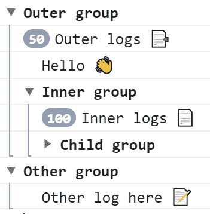****

****Output of groups with labels****

******2。不带任何参数******

****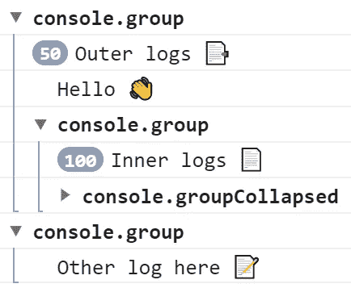****

****Output of groups without labels****

# ****7.基于使用 assert 对条件的评估，向控制台显示一条消息****

****如果**条件**评估为**假，则`assert()`向控制台显示消息，如果**条件满足**，则**不向控制台打印任何内容。****

> ****注:**你看到的**记录方法**的所有替换指令也适用于`*assert()*` *。***

****不同参数的** `**assert()**` **示例:****

1.  ****用一个条件和单个字符串对象作为参数****

**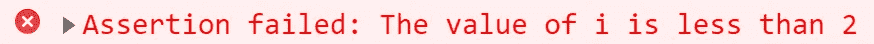**

**Output of assert( ) with single string as parameter**

****2。以一个条件和多个对象作为参数****

**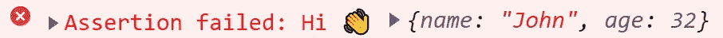**

**Output of assert( ) with multiple objects parameters**

****3。带条件和带替换的字符串，作为参数****

****

**Output of assert( ) with a string substitution**

# **8.使用 time、timeLog 和 timeEnd 计算完成操作所需的时间**

## **时间( )**

**`time()`启动计时器，跟踪完成一项操作所需的时间。**

## **时间日志( )**

**`timeLog()`记录由`time()`启动的定时器的**当前**值。**

## **时间结束( )**

**`timeEnd()`结束由`time()`启动的计时器，并显示计时器的**终值**。**

****参数不同的**`**time()**`**`**timeLog()**`**`**timeEnd()**`**的例子:********

1.  ******用标签作为参数******

****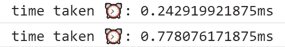****

****Output of timer methods with labels****

******2。无任何参数(输出默认为标签)******

****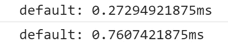****

****Output of timer methods without labels****

# ****9.显示代码的堆栈跟踪****

****`trace()`将堆栈跟踪输出到控制台。****

******`**trace()**`**不同参数的例子:********

*******1。*以多个对象为参数******

****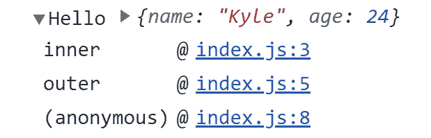****

****Output of trace( ) along with multiple objects as parameter****

******2。不带任何参数******

****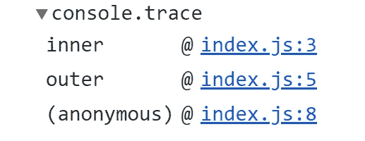****

****Output of trace( ) without any parameters****

# ****10.清空控制台****

****`clear()`清除来自控制台的所有消息。****

******`**clear()**`**的例子，用于清除控制台**上的所有消息******

********

****Output of clear( )****

# ****结论****

****让我们总结一下你在整篇文章中学到了什么:****

1.  ****使用不同的日志级别将消息记录到控制台。****
2.  ****设置控制台输出消息的样式。****
3.  ****使用`dir()`和`dirxml()`以交互格式显示对象。****
4.  ****使用`table()`以表格格式显示数据。****
5.  ****使用`count()`和`countReset()`计算同一日志打印的次数。****
6.  ****使用`group()`、`groupCollapsed()`和`groupEnd()`对日志进行分类和分组。****
7.  ****如果条件评估为假，使用`assert()`记录消息。****
8.  ****使用`time()`、`timeLog()`和`timeEnd()`计算不同操作之间的时间间隔。****
9.  ****使用`trace()`将堆栈跟踪记录到控制台。****
10.  ****使用`clear()`清除控制台中现有的所有日志。****

# ******资源******

*   ****[MDN web 文档](https://developer.mozilla.org/en-US/docs/Web/API/console)中的控制台对象****
*   ****[Chrome DevTools 文档](https://developers.google.com/web/tools/chrome-devtools/console/api)中的控制台 API****

****感谢阅读❤️和快乐学习😃****

## ****喜欢这篇文章吗？这里还有一些你可能会喜欢的文章****

**** [## 使用？性格；角色；字母

### 无效合并、可选链接和三元运算符

javascript.plainenglish.io](/3-ways-to-write-cleaner-javascript-code-using-the-character-ce034386dfbb)  [## JavaScript 中使用模板文字可以做的 5 件有用的事情

### javascript 中模板文字的不同用法

javascript.plainenglish.io](/5-useful-things-you-can-do-with-template-literals-in-javascript-cae8e6df836f)****