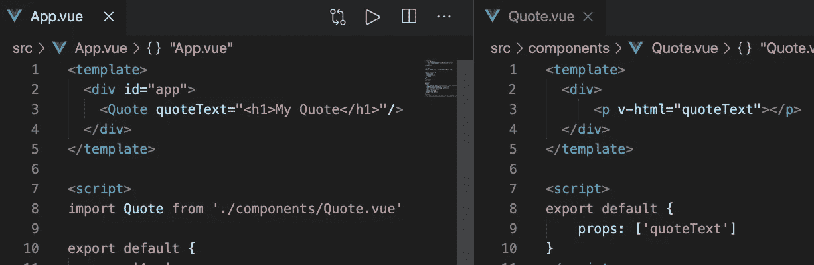
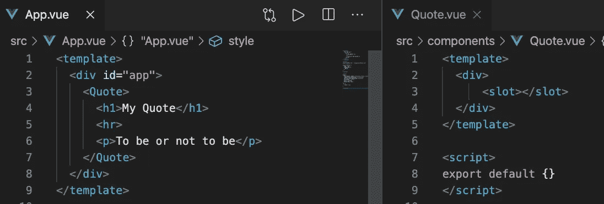
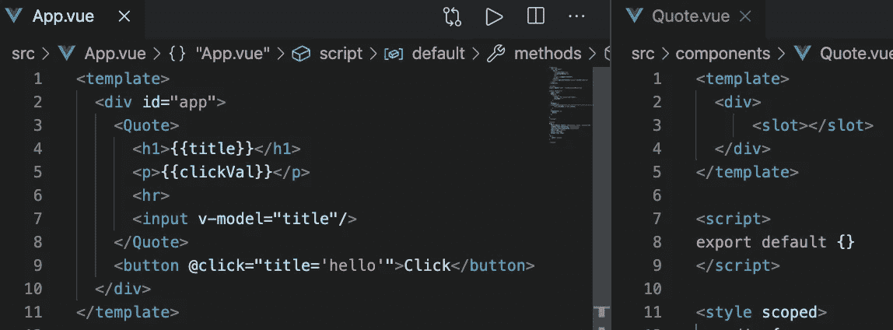
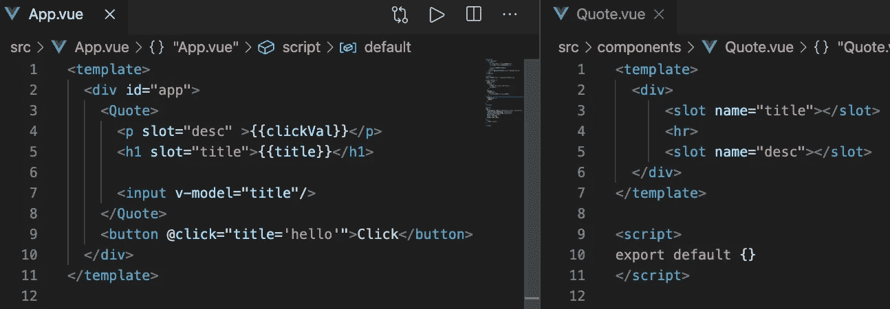
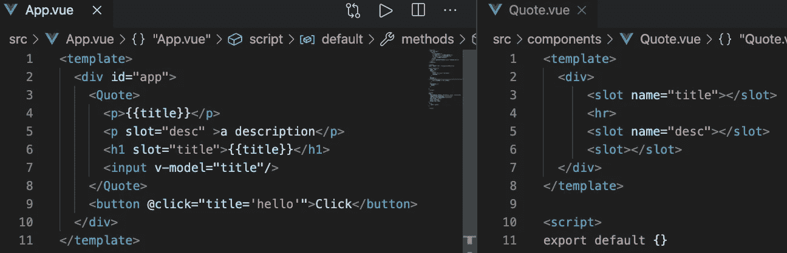
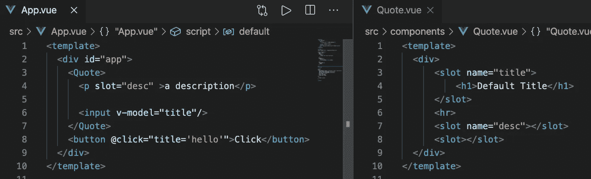
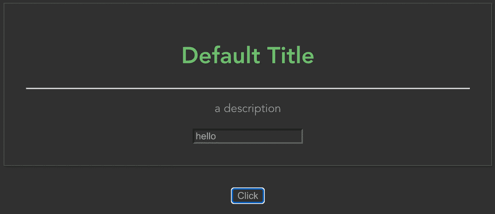

# 使用 Vue.js 插槽:第 1 部分

> 原文：<https://javascript.plainenglish.io/using-vue-js-slots-part-1-4813dc835ca9?source=collection_archive---------13----------------------->

## 学习所有你能用它们做的很酷的事情

Vue.js 是前端 web 框架开发世界的三大巨头之一。它是程序员的最爱，在 GitHub 上有超过 170，000 颗星，超过 155，000 颗星，超过 Angular 可怜的 65.9，000 颗星。

Vue.js 的明星数量超过 React 令人印象深刻，因为根据 NPM 的下载量，Vue.js 目前的使用率远远低于 React，Vue.js 的招聘信息也少得多。尽管如此，开发人员会喜欢使用 Vue.js，公司开始流行起来只是时间问题。

## 那么到底什么是老虎机？

插槽被认为是 Vue 组件的高级功能，但您将在任何生产级应用程序中使用它们。事实上，即使你使用了 [Bootstrap Vue](https://bootstrap-vue.org/) 库，你也需要理解插槽是如何工作的。

那么，为什么老虎机不同于从父母那里传递道具呢？如果我们想传递的不仅仅是文本，比如 HTML，我们需要做如下的事情，这不是一个最佳策略。

## 次优策略

假设我们想将更复杂的 HTML 传递给报价组件。像上面那样传递它会很快变得混乱，这肯定是次优的方式。

但下面是如何用老虎机实现同样的事情:

## 吃角子老虎机的更好策略

请注意，现在我们甚至可以向下传递一条水平线(hr)和一个段落标记(p)。

插槽帮助你在 Vue.js 中制作可重用的组件/部件。

## 但是老虎机可以处理更多的东西！

在大型 Vue.js 应用程序中，您可能会使用许多可重用的组件，其中一些会很大，并且涉及到它们的条件方面。又一次，老虎机开始发挥作用。

让我们以上面这个简单的例子为例，把它再修饰一下。

我们可以看到，我们可以将父组件( **App.vue** )中定义的数据向下传递给子组件( **Quote.vue** )。在上面的例子中，点击按钮将改变孩子内部的标题值。我们可以将任何东西传入插槽，比如事件绑定，甚至其他组件。

## 介绍命名插槽

假设我们想要控制如何将值插入到我们的可重用 Quote.vue 组件中。我们可以这样做:

现在，我们成功地控制了项目显示的位置，`“title”`槽在顶部，`“desc”`槽在`
`下面。在这种情况下，没有被赋予`slot=”desc”`或`slot=”title”`属性的任何东西都不会被传递给报价组件。我们需要添加一个未命名的槽，如果我们想捕捉所有其他传入的东西，如下所示。

## 设置默认插槽内容

当我们期望在我们的`“title”`槽中收到一些东西，但是我们没有得到任何东西时，会发生什么？这可能会导致组件看起来很奇怪或不能正常工作。幸运的是，我们可以为我们的插槽设置缺省值，当没有任何东西传递给插槽时将使用这些缺省值。

我们没有将内容传递给`"title”`槽，所以我们只剩下在报价组件中设置的默认 HTML。

你可以用老虎机做更多的事情，但这涵盖了基础知识，应该可以让你开始使用它们。请继续关注第二部分，在那里我将深入研究更复杂的插槽用例。

感谢阅读！**你可以在这里** 找到这个系列的第二部 [**。**](https://medium.com/@samotleriche/using-vue-js-slots-part-2-f4a91baa5b7d)

## 简单英语的 JavaScript

喜欢这篇文章吗？如果有，通过 [**订阅获取更多类似内容解码，我们的 YouTube 频道**](https://www.youtube.com/channel/UCtipWUghju290NWcn8jhyAw) **！**