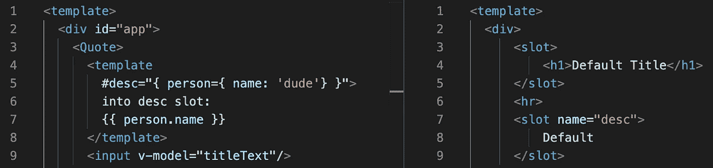

# 使用 Vue.js 插槽:第 2 部分

> 原文：<https://javascript.plainenglish.io/using-vue-js-slots-part-2-f4a91baa5b7d?source=collection_archive---------9----------------------->

## Vue.js 中插槽的更多高级功能

关于插槽，我忘记提到的一件事是，您也可以使用`<template>`标签将 HTML 的整个部分传递给子组件的插槽。否则，您需要将多个标签分配给同一个槽。

另一个需要指出的重要事情是 Vue 2.6 实现了一个新的插槽语法。我在上面展示的前一个语法在 Vue 2.x 中仍然有效，但是以后会被弃用。

用最新的语法重写上面的代码，我们得到了下面的代码。请注意， **v-slot 也只能与** `**<template>**` **标签**一起使用，这与不推荐使用的 slot 属性不同。在我看来，这是一个好的改变，因为它使代码更加清晰，而不是分散在各种 HTML 标签中的 slot 属性。

两种方式产生的输出相同，如下所示(按下按钮后)。

# 作用域插槽简介

如果您希望您的插槽内容能够访问您的子组件中的数据，您将需要使用作用域插槽。

在下面的例子中，我们可以在 Quote 组件的 slot 中访问 firstName 作为默认值。然而，我们不能传递`{{ age }}`并让它正确渲染，因为 Vue 在 **App.vue** 实例中寻找“年龄”。

为了做到这一点，我们需要将属性绑定到子组件中的插槽。在这种情况下，我们添加了`v-bind:age=”age”`。现在我们可以访问这个属性，也称为插槽道具。我们通过添加`=”slotProps”`来做到这一点，如下面 **App.vue** 的第 4 行所示。我们可以给这个包含所有老虎机道具的对象命名为任何我们喜欢的名字，在本例中，我们将其命名为`slotProps`。

我个人还没有在应用程序中见过这个。但是我确信有一些用例可以解释为什么你可能需要它。乍一看，它似乎给了你更多的控制，你可以在槽中显示什么，并允许我们把槽变成可重用的模板。

如果插槽是默认插槽，您可以使用`v-slot=”slotProps”`。

你可以用吃角子老虎机道具做的很酷的事情是使用**析构**。通过这样做，您甚至可以重命名属性并提供默认值，以便在属性未定义时使用。在下面的例子中，我们可以看到在`desc`槽上没有定义槽道具，所以使用默认名称`dude`。

下面我们看到上面的代码渲染。请记住，我们仍然将输入放入我们的默认插槽中。

需要注意的是，v-slot 可以简称为#如下所示。

我们也可以用`:person=”person”`将 person 对象绑定到 slot，而不是下面看到的更长的`v-bind:person=”person”`。

插槽是 Vue.js 非常有趣的一部分。在下一篇文章中，我将讨论一些使用这些作用域插槽的用例。

*这篇文章是一个系列的一部分，第一部分是* [*这里是*](https://medium.com/@samotleriche/using-vue-js-slots-part-1-4813dc835ca9) *。请继续关注下一篇文章，在那里我们将探讨作用域插槽的用例。感谢阅读。*

## 简单英语的 JavaScript

喜欢这篇文章吗？如果有，通过 [**订阅解码，我们的 YouTube 频道**](https://www.youtube.com/channel/UCtipWUghju290NWcn8jhyAw) **获取更多类似内容！**